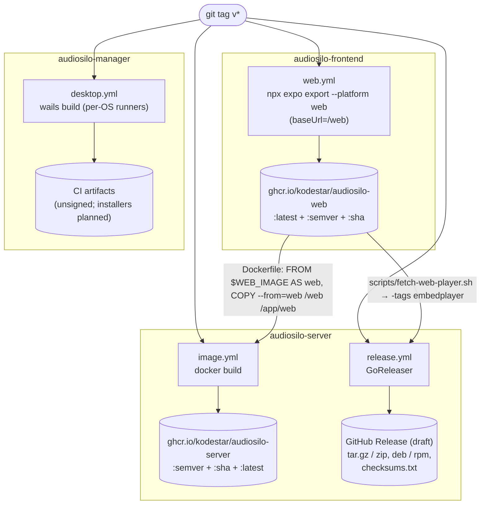

AudioSilo ships from three pipelines that hang off the same `v*` tag, plus the
manager's desktop builds. The structural rule that ties them together:

> **The web image publishes first.** Both the server Docker image and the native
> binaries consume a pinned `audiosilo-web` image; building them before the web
> image exists (or is current) bakes in the wrong player.

This page explains how the machinery fits together. The step-by-step operator
runbook is [Releasing](../contributing/releasing.md).

## The pipeline

## 1. Web image - `audiosilo-frontend/.github/workflows/web.yml`

Runs on pushes to `main` **and** on `v*` tags (plus manual dispatch). It exports
the player as a static site (`npx expo export --platform web --output-dir dist` -
`app.json` `experiments.baseUrl: "/web"` makes asset URLs resolve under the
server's `/web` mount) and packages the export into a tiny image via
`Dockerfile.web`, pushed as `ghcr.io/<owner>/audiosilo-web`.

Tagging: `:latest` only from the default branch, a semver tag on `v*` tags, and a
`:sha` tag always. GHCR references must be lowercase; `docker/metadata-action`
handles that here, so `web.yml` needs no explicit lowercase step (the server's
`image.yml`/`release.yml` lowercase the owner themselves).

## 2. Server Docker image - `audiosilo-server/.github/workflows/image.yml`

Runs on `v*` tags (plus manual dispatch with a `web_version` input, default
`latest`). The multi-stage `Dockerfile`:

- builds the CGO-free server binary (`CGO_ENABLED=0`, `-trimpath`), stamping the
  release version via
  `-ldflags "-X github.com/kodestar/audiosilo-server/internal/api.Version=${VERSION}"`
  (`image.yml` passes the tag as the `VERSION` build-arg; the default is `dev`);
- pins the player: `FROM ${WEB_IMAGE} AS web` … `COPY --from=web /web /app/web`,
  with `ARG WEB_IMAGE=ghcr.io/kodestar/audiosilo-web:latest`;
- final stage is `alpine:3.20` with **ffmpeg installed from apk** - the Docker
  image, unlike the native binaries, does bundle ffmpeg - plus a `PUID`/`PGID`
  entrypoint and `AUDIOSILO_WEB_DIR=/app/web` preset.

Because the image pins one specific web build, the server + bundled player always
ship as a **known-compatible pair**; native apps talking to any server version
negotiate via the `GET /api/v1/server` capability flags instead.

## 3. Native binaries - `release.yml` + `.goreleaser.yml`

The same `v*` tag triggers GoReleaser on a single Linux runner. The server is
CGO-free (modernc SQLite), so everything cross-compiles with no C toolchain:

- **Targets:** `linux`, `darwin`, `windows` × `amd64`, `arm64` (six binaries).
- **Archives:** `.tar.gz` (Linux/macOS) and `.zip` (Windows), named
  `audiosilo_<version>_<os>_<arch>`, containing the binary plus
  README/LICENSE/RELEASING.
- **Linux packages:** `.deb`/`.rpm` (nfpm) that depend on the **distro's** ffmpeg
  and install a systemd unit (`packaging/systemd/audiosilo.service`).
- **`checksums.txt`**, and the release is created as a **draft** for human review
  before publishing.
- **Version stamping:** the same ldflags as the Docker build -
  `-X …/internal/api.Version={{ .Version }}` overrides `var Version = "dev"` in
  `internal/api/api.go`, and `GET /server`, the admin console, and the web player
  all report it.

### Embedding the player: `-tags embedplayer`

Native binaries can't mount a baked-in `/app/web` directory, so the player is
compiled **into the binary**:

- A GoReleaser `before` hook runs `scripts/fetch-web-player.sh`, which
  `docker create` + `docker cp`s the static export out of the pinned
  `audiosilo-web` image (the `WEB_IMAGE` env var, set by `release.yml` from the
  lowercased owner + the `web_version` dispatch input, default `latest`) into
  `internal/web/player/` (gitignored), and fails if `index.html` is missing.
- Builds use `-tags=embedplayer`: `internal/web/player_embed.go` embeds that
  directory, while the default `player_disk.go` (`//go:build !embedplayer`) serves
  from `web_dir` at runtime. The embedded player takes precedence over `web_dir`,
  so `/web` works with zero configuration.
- Local snapshot builds skip the hook (`goreleaser build --snapshot --clean
  --skip=before --single-target`); a committed `internal/web/player/.gitkeep`
  keeps the embed compiling without a real player.

### ffmpeg/ffprobe are NOT bundled

They're large (~80 MB each) and usually already installed, so the archives stay
small. At startup `pkg/launcher` (`resolveTools` in `pkg/launcher/app.go`)
resolves each tool in order:

1. an explicit `--ffmpeg`/`--ffprobe` path,
2. a copy sitting **next to the binary**,
3. `$PATH`,
4. only if none is found: `internal/toolfetch` downloads a static build over
   HTTPS into `<data>/tools`, self-checks it by running `-version`, and caches it.

Offline or on an unsupported platform, the server simply runs without
transcoding/probing (both are optional by design) and retries on the next start.
The `.deb`/`.rpm` packages sidestep all of this by declaring a dependency on the
distro's `ffmpeg`.

## 4. Manager desktop builds - `audiosilo-manager/.github/workflows/desktop.yml`

The Wails UI can't cross-compile, so `desktop.yml` runs a per-OS matrix on `v*`
tags: `darwin/universal` on macOS, `windows/amd64` on Windows, `linux/amd64` on
Ubuntu. Each job checks out **both** repos as siblings (the manager depends on the
server module via a local `replace`, for `pkg/launcher` and `pkg/match`), runs
`wails build -platform <os>/<arch>` and stamps the version with
`-ldflags "-X main.version=<tag>"`.

:::caution Installers are planned, not shipped
Today the workflow uploads the build outputs as **unsigned CI artifacts** - it
does not publish a GitHub Release. The signed installers described in the
workspace `DISTRIBUTION.md` (macOS `.dmg` + notarization, Windows NSIS `.exe`,
Linux AppImage) are **planned**: the signing/notarization steps are stubbed in
`desktop.yml` pending an Apple Developer ID certificate and a Windows
Authenticode certificate. Until then, downloaded artifacts trigger
Gatekeeper/SmartScreen warnings.
:::

## Ordering and compatibility, in one place

- **Web image first.** Both `image.yml` (`COPY --from`) and `release.yml`
  (`fetch-web-player.sh`) pull `audiosilo-web` - publish it before either runs, or
  re-run them after. On a plain tag push all workflows fire together; the web
  image resolved is whatever `:latest` (or the dispatched `web_version`) points at,
  which is why the runbook publishes the web image first.
- **Docker vs. native:** same server code, same pinned player; the differences are
  ffmpeg (bundled in the image, resolved/fetched at runtime for binaries) and how
  the player is attached (`/app/web` + `AUDIOSILO_WEB_DIR` vs. `-tags embedplayer`).
- **Version stamping** is the same mechanism everywhere: ldflags →
  `api.Version` → reported by `GET /server` and surfaced in the UIs.
- **Native app ↔ server compatibility** is *not* pinned - it's negotiated at
  runtime via `GET /api/v1/server` capability flags
  ([cross-repo contract, seam 8](cross-repo-contract.md#8-capability-flags-get-apiv1server)).

For the human checklist (what to click, in what order, and how to smoke-test the
result), see [Releasing](../contributing/releasing.md).
