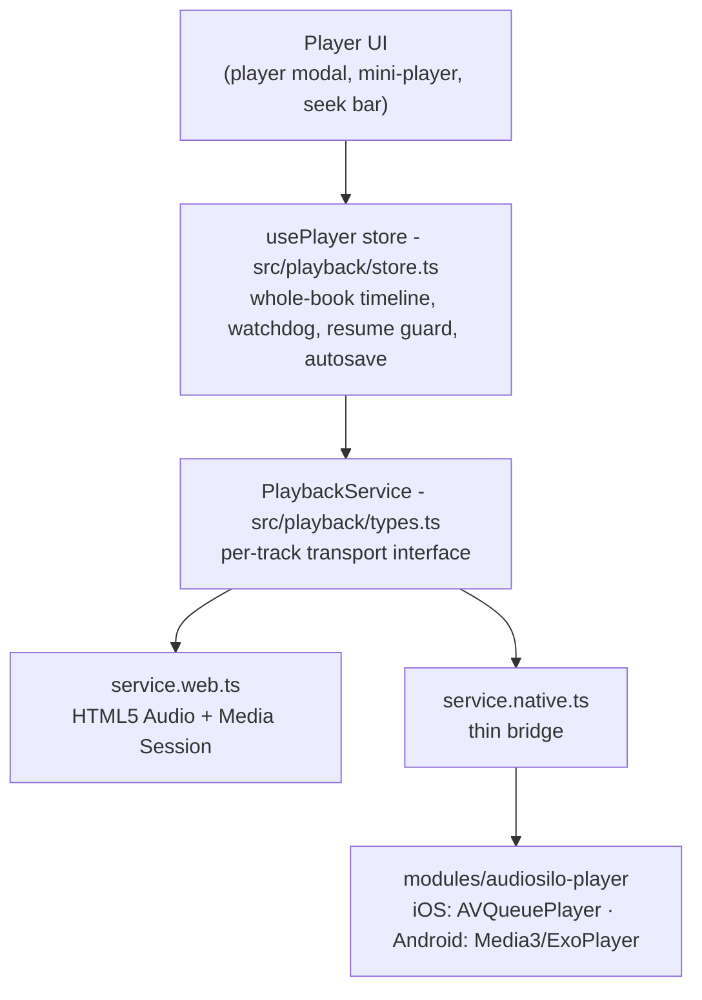
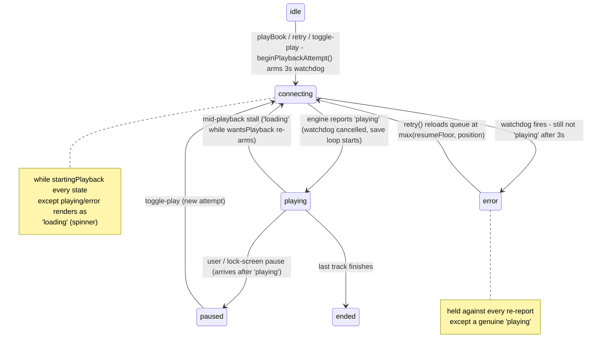

Playback is where this codebase earns its keep. The design splits into four
layers, each with a sharply-drawn contract:



The engines only know about **tracks** (individual audio files) and report raw
transport state. Everything book-shaped - the whole-book timeline, chapters,
resume, error policy - lives in shared JS so all three platforms behave
identically.

## The `PlaybackService` interface

`src/playback/types.ts` defines the engine contract:

- `load(tracks, startIndex, positionInTrack, chapters?)` - replace the queue.
  `tracks` are `PlaybackTrack`s (URL, optional auth `headers`, metadata,
  optional `duration`). The optional `chapters` argument is a list of
  `PlaybackChapter` clips - an **Android-only** lock-screen concern (below); iOS
  and web accept and ignore it.
- `play` / `pause` / `seekTo(positionInTrack)` / `skipToTrack(index, pos?)` /
  `setRate` / `reset`.
- `swapTo?(…)` - optional gapless queue swap, used to move a streaming book onto
  its just-finished download without an audible gap (returns `false` when
  refused; see [Offline](offline.md)).
- `configure(config)` - runtime tunables from the settings store: auto-rewind
  window, lock-screen skip intervals.
- `getSnapshot()` / `subscribe(listener)` - a single merged
  `PlaybackSnapshot { state, trackIndex, position, duration, rate }`,
  **per-track** positions only. States: `idle | loading | ready | playing |
  paused | ended | error`.

Metro resolves the implementation per platform: `service.web.ts` on web,
`service.native.ts` on iOS/Android. `service.ts` is a **throwing fallback that
exists only so `tsc` can resolve the import** - it is never executed.

### Web engine (`service.web.ts`)

A single `HTMLAudioElement`, advanced manually on `ended` (no native queue). Key
points:

- The session token is already in the stream URL (`?token=` - see
  [State & data](state-and-data.md)), so the browser's own Range requests
  (seek/scrub) authenticate without headers.
- The **Media Session API** wires lock-screen/notification transport: metadata
  per track plus `play`, `pause`, `seekbackward`, `seekforward` handlers using
  the configured jump intervals.
- Auto-rewind on resume: `play()` rewinds by up to `autoRewindMax` seconds
  scaled by how long the pause lasted.
- Every element listener is guarded by an `active()` check so a second element
  being buffered by `swapTo` can't drive the snapshot until the switch commits.
- `swapTo` buffers the new (local) source on a **separate** element while the
  current one keeps playing, and only switches once `isSwapReady` holds
  (`readyState >= HAVE_FUTURE_DATA` and the playhead is within ~1.5 s of the
  target - exported pure so it's unit-testable). It refuses outright when the
  target is a synthetic `…/_offline/…` URL and no service worker controls the
  page (the URL would 404 and kill playback), and treats an 8 s buffering
  timeout as a failed swap.

### Native bridge (`service.native.ts`)

Deliberately thin: it forwards calls to the `AudiosiloPlayer` module and merges
the module's three event streams (`onState`, `onProgress`, `onTrackChange`) into
**one snapshot that is re-emitted on every event**. The module's state strings
match `PlaybackState` 1:1. That merged-snapshot behavior is why the store must
not interpret individual engine events (see the watchdog section) - a stale
field rides along with every fresh one.

## The native module (`modules/audiosilo-player`)

A local Expo module - Swift (`ios/AudiosiloPlayerModule.swift`) and Kotlin
(`android/…/AudiosiloPlayerModule.kt` + `AudiosiloPlayerService.kt`). It owns
the audio session, background audio, lock-screen/remote commands, gapless
multi-file playback and pitch-corrected speed. It can only be validated by a
**device rebuild** (`npx expo run:ios` / `run:android`) - a JS reload does not
reload native code.

### iOS: AVQueuePlayer

`AudioEngine` in `AudiosiloPlayerModule.swift` drives an `AVQueuePlayer`
(`.playback` session, `.spokenAudio` mode, `.longFormAudio` policy;
`audioTimePitchAlgorithm = .timeDomain` for pitch-corrected speech speed). Auth
headers are injected per asset via the undocumented
`"AVURLAssetHTTPHeaderFieldsKey"` option - the only mechanism AVFoundation
offers, so if Apple changes it, native stream auth breaks.

The hard-won behaviors, each guarding against a specific OS quirk:

- **Deferred start seek (`pendingSeek` / `applyPendingSeek`).** Seeking a
  freshly-created `AVPlayerItem` before it reaches `.readyToPlay` is *silently
  dropped* (especially for streaming assets) - this made resume start from 0.
  `rebuildQueue` stores the target as `pendingSeek` and applies it via a status
  KVO once the item is ready.
- **`wantsPlay` gating.** If `play()` arrives while a `pendingSeek` is still in
  flight, the engine records the intent, reports `loading`, and starts the
  player **only in the seek's completion handler** - so audio never briefly
  plays from 0 before jumping. `skip(to:)` routes through `play()` for the same
  reason.
- **Progress suppression during (re)load.** The 1 Hz progress timer emits
  nothing while `pendingSeek != 0` or the current item isn't `.readyToPlay` - a
  fresh item reads `currentTime() == 0`, and emitting that would clobber the
  saved position in JS (this made a retry after a failed reload resume from the
  start).
- **One real-state toggle for remote commands.** A single earbud/headset press
  is a *toggle*, but iOS delivers it as a discrete Play **or** Pause chosen from
  iOS's own notion of the app's play state - which a third-party app cannot
  correct (`MPNowPlayingInfoCenter.playbackState` is entitlement-gated and
  silently ignored, so iOS infers the state itself and can get stuck on
  "paused"). When iOS guesses wrong it sends Play while already playing and the
  press no-ops - the "pause needs two presses" bug. Fix: `playCommand`,
  `pauseCommand` and `togglePlayPauseCommand` **all route through
  `togglePlayback()`**, which flips from the real `timeControlStatus` (a pending
  `wantsPlay` counts as playing).
- **Interruption auto-resume only when it should.** `wasPlayingBeforeInterruption`
  is captured *before* pausing on `.began`; `.ended` auto-resumes only if that
  flag is set **and** the interruption carries `.shouldResume`. Without the
  flag, the charging chime (a brief system interruption whose `.ended` carries
  `.shouldResume`) resumed books the user had paused.
- **Failures are reported as sustained `loading`, never `error`.** A failed
  item parks the player at `.paused` (which would read as a user pause), so the
  engine watches item `.failed` status, `failedToPlayToEndTime`, and
  `playbackStalled` and reports `loading` for all of them. The **shared JS
  watchdog** owns the promotion to `error` after a uniform grace - an instant
  native error caused a rapid-retry race.
- **Rate re-assertion (`reassertRateWhenReady`).** AVPlayer can silently drop a
  rate set on a not-yet-ready item back to 1.0 once it becomes ready (seen when
  a mid-playback download swap replaced the streaming item); the engine watches
  the fresh item and re-asserts the intended rate.
- Misc: headphones unplugged (`oldDeviceUnavailable`) pauses; queue rebuilds set
  a `rebuilding` flag that suppresses the transient state/track events
  `removeAllItems` fires; Now Playing metadata + artwork (fetched with the auth
  headers via `URLRequest`) are maintained manually.

### Android: Media3 / ExoPlayer

Playback lives in a `MediaSessionService` (`AudiosiloPlayerService`) so it
survives backgrounding; the Expo module talks to it through a `MediaController`
on the main thread. Media3 renders the notification/lock-screen UI itself.

**Chapters are clipped media items (Audible-parity lock screen).** When the JS
side passes chapter clips to `load`, each chapter becomes a `MediaItem` with a
`ClippingConfiguration` over its file's URL (`toClipItem`), titled with the
chapter. The system scrubber is therefore **chapter-relative**, and the standard
`COMMAND_SEEK_TO_{NEXT,PREVIOUS}_MEDIA_ITEM` buttons become **prev/next
chapter** for free.

- **`ChapterMap` keeps the bridge contract file-based.** The JS store and iOS
  think in `(fileIndex, positionInFile)`; the Android engine plays clip items.
  `ChapterMap.fileToItem` maps a file-relative position to `(clip index,
  clip-relative ms)` and `itemToFile` maps back. `load`, `seekTo`,
  `skipToTrack`, the progress loop and `onMediaItemTransition` all translate
  through it, so the reported positions (and durations - per-file durations are
  cached in `fileDurations`) are indistinguishable from file mode. The wire
  contract between JS and native never changed.
- **30 s skip buttons are custom session commands** (`audiosilo.SEEK_BACK` /
  `audiosilo.SEEK_FORWARD`), granted in `MediaSession.Callback.onConnect` and
  executed in `onCustomCommand` as `player.seekBack()/seekForward()`. They are
  **not** the standard `COMMAND_SEEK_BACK/FORWARD` - those map to the legacy
  `ACTION_REWIND`/`ACTION_FAST_FORWARD`, which the modern Android media UI
  silently ignores (`dumpsys media_session` showed `custom actions=[]` and no
  buttons). The buttons use Media3's **predefined** `CommandButton` icons
  (`ICON_SKIP_BACK_30` / `ICON_SKIP_FORWARD_30`, available since Media3 1.5.0),
  so no app-shipped drawable and no icon-less action for newer Android to drop.
- **Registered with `setCustomLayout`, not `setMediaButtonPreferences`.** The
  slot-based preferences API capped the Media3 1.5.1 notification at 3 actions
  (it drops the secondary slots - verified via `dumpsys notification`,
  `actions=3`). `setCustomLayout` makes the notification provider emit the
  standard `[prev, play/pause, next]` row automatically (from the player's
  available seek-to-prev/next commands) **plus** the custom skip buttons - all
  5 actions alongside the draggable chapter scrubber, device-verified on a
  Pixel (`actions=5`).
- **`AudiobookPlayer` (a `ForwardingPlayer`)** wraps the ExoPlayer so audiobook
  behavior applies regardless of where a command originates (lock screen,
  notification, headset, JS bridge): **auto-rewind on resume** lives in its
  `play()` (reading the live Settings value from `PlayerConfig`), `prepare()`
  resets the pause baseline so a fresh book never inherits the previous one's
  pause time, and **prev/next are hidden only when there is a single media
  item** (a chapterless single-file book, where "previous" could only restart
  the book).
- **`SimpleCache` keeps clipped streaming gapless.** Chapter clips of a
  single-file m4b re-open the *same URL* at each boundary; a process-lifetime
  64 MB LRU `SimpleCache` + `CacheDataSource` means those re-opens hit
  already-downloaded bytes and the parsed container header instead of the
  network - no audible gap (device-verified). Local `file://` sources bypass
  the cache. Auth headers are injected at request time from `AuthHolder` (one
  bearer token per book, set on every `load`).
- The app logo is the notification small icon
  (`DefaultMediaNotificationProvider.setSmallIcon` +
  `res/drawable/ic_notification.xml`).
- `onTaskRemoved` records a "swiped away from recents" flag in shared prefs;
  the JS layer reads it via `consumeTaskRemoved()` on foreground and resets to
  Home (matching iOS's cold-start behavior). iOS's implementation of
  `consumeTaskRemoved` always returns `false` - bridge parity only.

Android has **no deferred-seek problem**: Media3's
`setMediaItems(items, startIndex, startPositionMs)` honors the start position
natively.

## Building the queue: `book-queue.ts`

`buildBookQueue(api, libraryId, book, chapterData?, local?, virtualChapterInterval?)`
turns a book + its `/chapters` response into a `BookQueue { tracks, offsets,
total, chapters, chapterClips, syntheticChapters }`.

**Track building rules (`bookFileSpecs`)** - the single source of truth for a
book's playable files, shared with the download engine so download order ≡ play
order:

1. An explicit file list (`chapterData.files`, else `book.files`), sorted by
   `seq`;
2. else the **distinct `file_path`s referenced by the chapters**, in first-seen
   order (durations estimated from the largest chapter `end` per file);
3. else the book's own `rel_path` as a single file.

:::danger Stream the file, never the book
A track URL must be a real audio *file* (a chapter's `file_path` or a
`BookFile.rel_path`) - never a folder/book path. Streaming a folder path is what
produced the iOS MediaToolbox `-12864` failures. This is invariant
[#4 of the workspace golden rules](../architecture/invariants.md).
:::

When `local` is supplied (the book is downloaded), each file's track points at
its local URI instead of `api.streamUrl(...)`, and auth headers are dropped for
local tracks. On web, tracks carry no headers at all (the token is in the URL);
on native they carry `api.authHeaders()`.

Other queue math that lives here:

- **`chapterBookOffset`** recomputes every chapter's whole-book offset from the
  client's own file durations plus the in-file `start`, locating the file **by
  `file_path` first** with a bounds-checked `file_index` fallback. The server's
  `book_offset` is deliberately ignored - it comes back 0 for every chapter on
  some on-demand-indexed books, which made chapter detection resolve to the
  last chapter.
- **`buildChapterClips(specs, chapters)`** produces the Android clip list: one
  clip per chapter mapped to `(fileIndex, [startInFile, endInFile])`; the last
  chapter in each file clips "to end" (`endInFile = 0`) so an inaccurate final
  `end` can't cut off the file's tail. It returns `[]` for **0 or 1 chapters**
  (the engine then plays one item per file - plain file mode) and `[]` if *any*
  chapter can't be mapped to a file, so a partial clip queue can never strand
  playback. Returning `[]` for single-file books is also the documented safety
  fallback if a future device regresses on gapless clips.
- **`synthesizeChapters`** overlays evenly-spaced *virtual* chapters (default
  interval 30 min, a user setting) on a long, chapterless single-file book so
  prev/next-chapter and the chapter-relative seek bar have somewhere to go.
  Synthetic chapters are computed **after** `chapterClips` and never fed to it,
  so native playback is unchanged; `BookQueue.syntheticChapters` flags them.
- **`locate(offsets, bookPosition)`** and **`toBookPosition(offsets, index,
  positionInTrack)`** convert between the whole-book timeline and per-track
  coordinates; **`chapterAt`** finds the active chapter by `book_offset`;
  **`chapterCountdowns`** feeds the sleep timer's end-of-chapter picker
  (wall-clock times scaled by the playback rate via `rate.ts`
  `wallClockSeconds`).

`total` is the max of the book's reported duration, the summed file durations,
and the furthest chapter end - so `duration: 0` metadata degrades instead of
breaking the seek bar.

## The player store (`store.ts`)

`usePlayer` (Zustand) is the only consumer of the engine. Its snapshot is
per-track; the selectors map to the whole-book timeline:

- `selectBookPosition` = `toBookPosition(queue.offsets, snapshot.trackIndex,
  snapshot.position)`;
- `selectCurrentChapter` overlays `queue.chapters` on that position by
  `book_offset`. The full player's seek bar is **chapter-relative**.

Actions: `playBook`, `toggle`, `pause`, `retry`, `seekBook`, `seekInTrack`,
`goToTrack`, `skipSeconds`, `setRate`, `stop`. `seekInTrack`/`goToTrack` exist
for books whose file durations are unknown (no reliable whole-book timeline).
Speed is clamped to 0.5–2×.

One important gate lives in the *screens*, not the store: **playback starts
only after the chapters/files query has settled** (the player screen waits for
`useChapters`). Starting early made multi-file books stream the folder path and
lose chapter info.

### The stall → error watchdog

The single most battle-scarred piece of the store. Design rules, in order of
importance:

1. **It is armed by the play/retry *action*, not by interpreting engine
   events.** `beginPlaybackAttempt()` (called from `playBook`, `retry`, and the
   play half of `toggle`) sets two module-level flags - `wantsPlayback` (we
   intend to be playing) and `startingPlayback` (an attempt is in flight) - and
   starts a `STALL_GRACE_MS` (3 s) timer. When the timer fires, the test is
   simply *"are we `playing`?"* - so no transient state the bridge left behind
   can prevent it from firing. If not playing, the store synthesizes
   `state: 'error'`, clears intent, and persists progress.
2. **While `startingPlayback`, every incoming state except `playing`/`error`
   collapses to `loading`.** On a resume/retry, `service.native.ts` re-emits
   its merged snapshot for every event and iOS delivers
   `timeControlStatus`/status KVO asynchronously - the store sees a jumble of
   `ready`, frozen `onProgress` ticks carrying `loading`, and a spurious
   `paused` (an async `.paused` from the queue rebuild that escapes the native
   `rebuilding` guard). Interpreting those individually failed three separate
   ways (an error that flashed then reverted; a dead `ready` play button; a
   spinner whose watchdog never armed because the spurious `paused` cleared
   intent). Collapsing to `loading` shows a spinner and lets the action-armed
   watchdog guarantee resolution. A genuine user/lock-screen pause always
   arrives *after* `playing` (when `startingPlayback` is already false), so it
   still reads as `paused`.
3. **A surfaced `error` is held against everything except `playing`.** After
   the watchdog (or a real web/Android engine error) lands, the engine keeps
   re-reporting around the dead stream - iOS with frozen `loading` ticks,
   Android with `onPlayerError` → `STATE_IDLE` → `idle` plus progress ticks.
   `subscribe` drops **every** incoming state except `playing` while the
   previous state is `error` and no retry is in flight. This is
   suppress-all-but-`playing`, deliberately **not an allow-list** - enumerating
   the noisy states (`loading`, `ready`, `idle`, `paused`, …) bit the project
   repeatedly (the Android flash→spinner loop). The hold is released by a retry
   (`wantsPlayback` flips true) or a genuine `playing`.
4. **The engines never decide `error` on iOS.** iOS reports every failure shape
   (`.failed` item, failed-to-end, buffer stall) as sustained `loading`;
   web/Android may emit a real `error` directly, with the watchdog as the
   backstop for a buffer that never resolves. Recovery is `retry()`, which
   *reloads* the queue at the known-good position - a dead `AVPlayerItem`
   cannot be revived by `play()` alone.
5. One extra normalization: an engine `loading` arriving when we do **not**
   intend to play (no attempt in flight, so no watchdog armed) is read as
   `paused` - iOS reports a failed item as `loading` even while the user has
   the book paused, and leaving it would strand an endless spinner with no
   retry button.

Keep all of this in shared JS; do not re-add a per-engine native timer.



(`connecting` above is the store's `startingPlayback` window; the snapshot the
UI sees during it is `loading`.)

### Resume protection

"Never restart an in-progress book from 0" is enforced twice - once on the way
in, once on the way out:

**On the way in - `loadInitialProgress` (`progress-sync.ts`)** returns a
discriminated `ResumeLookup` reconciling three sources by `updated_at`
(newest wins): the server's record, a **durable local mirror**, and the offline
replay queue.

- `progress` - a saved position exists somewhere; `playBook` resumes from it
  (and restores the saved playback speed).
- `empty` - the server answered (HTTP 200) and there is no record anywhere: a
  genuinely new book, start at 0.
- `failed` - the server was unreachable **and** there is no local record. For a
  *streaming* book, `playBook` fails safe: it sets `state: 'error'` (with
  `resumeLookupFailed` recorded so `retry()` re-runs the lookup rather than
  reloading at a stale 0) instead of playing - starting at 0 here would both
  restart the book and let a later save overwrite the real position. For a
  *downloaded* book, `failed` means offline-first and never started: 0 is
  correct.

The mirror (`writeMirror`, key `audiosilo.progressMirror`) is written on **every
save and every successful server read**, keep-newest by `updated_at`, and -
unlike the replay queue - is **never pruned on sync**. It exists precisely so a
flaky resume fetch can't lose the position (the beta "book restarted from the
beginning" report).

**On the way out - the `resumeFloor` save guard (`store.ts`).** The whole-book
position we actually resumed from is kept as a running high-water mark;
`persist` refuses to save a position more than `SLIP_TOLERANCE` (60 s) *below*
the floor. Only a deliberate user seek/jump lowers the floor (`lowerFloorTo` in
`seekBook`/`seekInTrack`/`goToTrack`). Because the server is last-write-wins, a
slipped-through restart-at-0 with a fresh timestamp would otherwise permanently
overwrite real progress - the guard makes that write impossible. `retry()` also
reloads at `max(resumeFloor, currentPosition)` so a transient 0 in the snapshot
can't be re-loaded.

### Progress autosave and sync triggers

- A 15 s interval save loop (`SAVE_INTERVAL_MS`) runs **only while actually
  playing** - it is started by the engine's `playing` transition and stopped by
  `paused`/`ended`/`error` (via `haltAndPersist`), which covers lock-screen
  pauses and books that simply finish without a `stop()` call.
- Additional saves fire on every seek (`seekBook`/`seekInTrack`/`goToTrack`),
  on `setRate`, and on `stop`.
- Saves go through `saveProgress` (`progress-sync.ts`): mirror first, then the
  network if reachable, else the offline replay queue (latest save per book).
  `finished` is set within 5 s of the end; each save carries
  `version: 0`, a per-install `device_id` and a capture-time `updated_at` so
  the server's last-write-wins reconciliation (and offline replays) order
  correctly. Details in [State & data](state-and-data.md).
- Listening **history spans** are recorded around the same transitions:
  a span opens on `playing`, closes on leaving `playing` (or on a mid-playback
  track change, so each file logs as it finishes), ignores spans under 20 s,
  and is skipped entirely while the server is unreachable.
- When playback halts, the store invalidates the `['progress', 'all']` query so
  the Home/Browse "continue listening" and "finished" lists re-read from the
  server - without invalidating on every 15 s save.

One more store responsibility worth knowing about: when a download completes
for the book that is currently streaming, the store hot-swaps playback onto the
local files (`switchCurrentBookToLocal`, preferring the engine's gapless
`swapTo`) - covered in [Offline](offline.md).

:::note Not yet wired
`client.streamUrl` *can* request an on-the-fly MP3 transcode
(`?transcode=1&t=`), and the server advertises a `transcode` capability - but
the engines do **not** yet auto-negotiate it for non-`direct_playable` codecs on
web. That negotiation is a known open follow-up, not a shipped behavior.
:::

## Ending a book: end credits and up next

When the last track finishes the engine reports `ended`, and the store
**deliberately keeps `nowPlaying` populated** rather than tearing down - the
`ended` snapshot is a signal a UI-layer listener acts on. `selectIsEnded`
(`snapshot.state === 'ended'`) exposes it; the final `haltAndPersist` on that
transition records `finished: true`.

- **`finishBook()` (`store.ts`)** is the single "this book is done" action, used
  both by the natural end and the player's *Mark as Finished* menu item. It
  captures a `FinishedBook` identity (connection/library/path/title/author/cover),
  clears playback intent, stops the save loop, does one forced
  `persist({ forceFinished: true })` (the last write; the server is
  last-write-wins), invalidates the connection's `allProgress` query, then
  **nulls `nowPlaying`** (which hides the mini-player) and resets the snapshot.
  Best-effort and async, it tears the engine down and - **only if
  `autoDeleteFinished` is on and the book's download `status === 'downloaded'`** -
  removes the local files via the downloads store.
- **`BookEndedListener` (`src/components/player/book-ended-listener.tsx`)** is a
  headless component mounted once in `src/app/_layout.tsx`, so it covers the phone
  modal and the desktop docked player alike. It watches `selectIsEnded` with
  **transition-edge detection** (a `wasEnded` ref, fires once per ended book) and
  on the false→true edge calls `finishBook()` then navigates: `router.replace` to
  `/finished` when currently on `/player` (credits take the player's place), else
  `router.push`. If the app is backgrounded and `autoPlayNext` is on it skips the
  countdown UI and jumps straight to the player (on iOS the OS may suspend JS once
  audio stops, so a visible countdown can't be relied on).
- **`/finished` (`src/app/finished.tsx`)** is a root modal, a sibling of the
  player modal, that carries `connection`/`libraryId`/`path` params (it sits
  outside any route scope) and renders `EndCredits`. The screen derives its
  "still playing early vs. genuinely ended" state from the live player store, not
  a URL flag. `end-credits-logic.ts` is the pure decision function: with
  `autoPlayNext` on and a next book resolved, it counts down `GRACE_SECONDS` (15)
  after a real end, or the remaining audio time when opened early while the book
  still plays, and only reports `fireNext` after a genuine end.

### Sibling resolution (`next-book.ts`)

"Up next" is the next sibling of the current book's **folder**, resolved
client-side. `resolveNextBook` browses the parent folder via `client.browse`
(paging to exhaustion, `PAGE_LIMIT` 200); `findNextSibling` keeps entries that
are `is_book || is_dir` (an unindexed sibling book folder comes back
`is_dir: true, is_book: false` and must still count, while loose non-audio files
are ignored), sorts them with `naturalCompare`, and returns the first whose name
sorts strictly after the current leaf:

```ts
export function naturalCompare(a: string, b: string) {
  return a.localeCompare(b, undefined, { numeric: true, sensitivity: 'base' });
}
```

The sort is **client-side and numeric-aware** so `Book 2` precedes `Book 10`
(the server's `/fs` listing is a plain string order). It never throws - any
failure resolves to `null`, which the screen renders as "end of folder".

### Auto-download on play

`maybeAutoDownloadCurrent(connectionId, libraryId, book, chapterData?)` in
`store.ts` downloads **the book the user just started listening to**. It is
fired fire-and-forget at the end of `playBook`'s start path, after `svc.play()` -
never awaited, so it can neither delay nor break starting the book. Because the
store hot-swaps playback onto the local files the moment a download completes
(`switchCurrentBookToLocal` - see [Offline](offline.md)), downloading on start
also covers a series: the next book downloads as soon as *Play next* starts it.
(An earlier design prefetched the next sibling at 90% of the current book; that
is gone.)

Guards, in order: `autoDownloadNext === 'never'` skips; an existing download
entry whose `status` isn't `error` skips (already downloaded, queued, or
downloading - only an errored entry is retried, matching the downloads store's
own guard); then the network policy `canAutoDownload(mode)`; then it enqueues
via the downloads store's `download()`, which itself no-ops when the engine
can't store offline (e.g. web without a controlling service worker), so no
extra support guard is needed. `next-book.ts` now does sibling resolution only.

The policy gate is `canAutoDownload(mode)` in `src/lib/network.ts`, backed by
**`expo-network`**: `never` → false, `always` → true, and `wifi` allows web (the
browser can't report the connection type) plus native `WIFI`/`ETHERNET`, and
**fails open** on an `UNKNOWN`/undefined type or a probe error, so only a
positively-known metered connection is skipped. The three settings
(`autoPlayNext`, `autoDownloadNext`, `autoDeleteFinished`) live in
`src/stores/settings.ts` with defaults `false` / `'wifi'` / `true` - the
persisted `autoDownloadNext` key name predates the download-on-start behavior
and is kept for hydration compatibility.

## The player controls and title display

Two smaller UI concerns round out the player:

- **Speed and sleep-timer are bottom sheets.** `SpeedButton` / `SleepTimerButton`
  are only the footer readouts; the controls themselves (`SpeedSheet`,
  `SleepSheet`) are mounted at the player's *root* and use the shared `Sheet`
  primitive from `src/components/ui/` - a footer-nested sheet would be clipped to
  the footer's bounds. Speed drives a `Stepper` (0.5-2x, 0.05 steps); the sleep
  sheet offers duration presets, an end-of-chapter list (from `chapterCountdowns`
  at the live rate), and an end-of-book fallback.
- **`prettify-title.ts` cleans filename-shaped labels for display.** Audiobook
  "chapter" labels are often just the underlying audio *filename*
  (`01_the_hobbit_ch1.mp3`). `prettifyChapterTitle` strips a recognised audio
  extension, turns underscores into spaces, and drops a trailing encoder bitrate
  tag (`64kb`, `128 kbps`) - but only for labels that already look like filenames,
  leaving genuine titles ("Chapter 1", "The Shadow of the Past") untouched. It is
  **display-only**: it never changes the streamed path, the saved position, or the
  chapter model, and is applied wherever a chapter/track label surfaces - the full
  player title, the mini-player caption, the chapter list, and the sleep-timer
  chapter picker.
