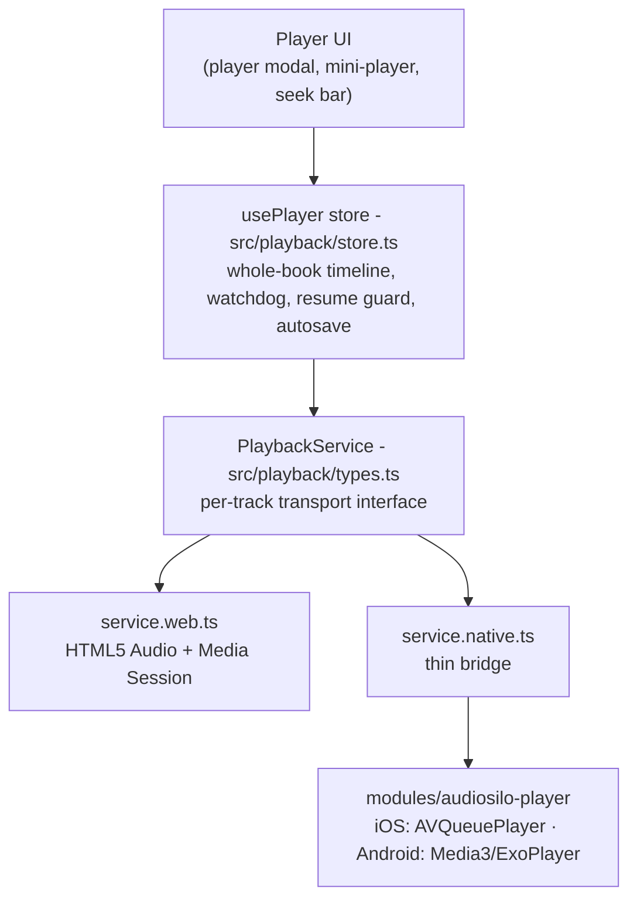
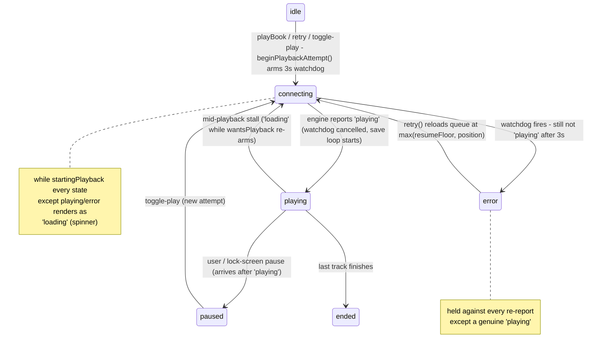
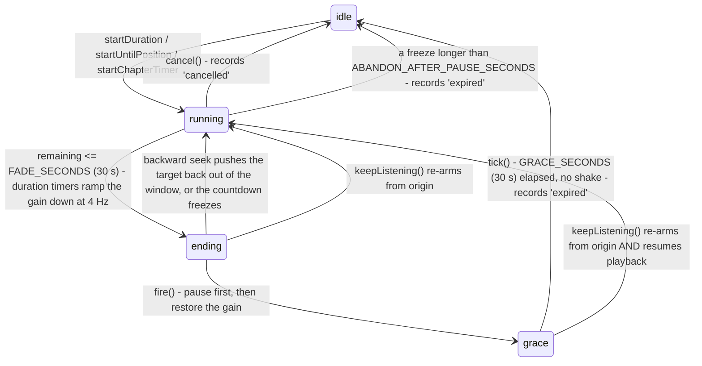

Playback is where this codebase earns its keep. The design splits into four
layers, each with a sharply-drawn contract:


```mermaid
flowchart TD
    ui["Player UI<br/>(player modal, mini-player, seek bar)"]
    store["usePlayer store - src/playback/store.ts<br/>whole-book timeline, watchdog, resume guard, autosave"]
    svc["PlaybackService - src/playback/types.ts<br/>per-track transport interface"]
    web["service.web.ts<br/>HTML5 Audio + Media Session"]
    native["service.native.ts<br/>thin bridge"]
    mod["modules/audiosilo-player<br/>iOS: AVQueuePlayer · Android: Media3/ExoPlayer"]
    ui --> store --> svc
    svc --> web
    svc --> native --> mod
```

The engines only know about **tracks** (individual audio files) and report raw
transport state. Everything book-shaped - the whole-book timeline, chapters,
resume, error policy - lives in shared JS so all three platforms behave
identically.

## The `PlaybackService` interface

`src/playback/types.ts` defines the engine contract:

- `load(tracks, startIndex, positionInTrack, chapters?)` - replace the queue.
  `tracks` are `PlaybackTrack`s (URL, optional auth `headers`, metadata,
  optional `duration`). The optional `chapters` argument is a list of
  `PlaybackChapter` clips - an **Android-only** lock-screen concern (below); iOS
  and web accept and ignore it.
- `play` / `pause` / `seekTo(positionInTrack)` / `skipToTrack(index, pos?)` /
  `setRate` / `reset`.
- `swapTo?(…)` - optional gapless queue swap, used to move a streaming book onto
  its just-finished download without an audible gap (returns `false` when
  refused; see [Offline](offline.md)).
- `setVolume(volume)` - **required** linear output gain (0-1) applied to the
  engine's own volume, **not** the device volume. It exists for the sleep
  timer's fade-out on **duration** timers (below). It is deliberately not
  optional: both engines implement it, and the one real "no volume here" case is
  each engine's own private business, which it degrades internally (below).
  Callers pass an already-clamped value - `usePlayer.setOutputVolume` is the only
  route in and clamps once.
- `configure(config)` - runtime tunables from the settings store: auto-rewind
  window, lock-screen skip intervals.
- `getSnapshot()` / `subscribe(listener)` - a single merged
  `PlaybackSnapshot { state, trackIndex, position, duration, rate }`,
  **per-track** positions only. States: `idle | loading | ready | playing |
  paused | ended | error`.

Metro resolves the implementation per platform: `service.web.ts` on web,
`service.native.ts` on iOS/Android. `service.ts` is a **throwing fallback that
exists only so `tsc` can resolve the import** - it is never executed.

### Web engine (`service.web.ts`)

A single `HTMLAudioElement`, advanced manually on `ended` (no native queue). Key
points:

- The session token is already in the stream URL (`?token=` - see
  [State & data](state-and-data.md)), so the browser's own Range requests
  (seek/scrub) authenticate without headers.
- The **Media Session API** wires lock-screen/notification transport: metadata
  per track plus `play`, `pause`, `seekbackward`, `seekforward` handlers using
  the configured jump intervals.
- Auto-rewind on resume: `play()` rewinds by up to `autoRewindMax` seconds
  scaled by how long the pause lasted.
- Every element listener is guarded by an `active()` check so a second element
  being buffered by `swapTo` can't drive the snapshot until the switch commits.
- `swapTo` buffers the new (local) source on a **separate** element while the
  current one keeps playing, and only switches once `isSwapReady` holds
  (`readyState >= HAVE_FUTURE_DATA` and the playhead is within ~1.5 s of the
  target - exported pure so it's unit-testable). It refuses outright when the
  target is a synthetic `…/_offline/…` URL and no service worker controls the
  page (the URL would 404 and kill playback), and treats an 8 s buffering
  timeout as a failed swap.

### Native bridge (`service.native.ts`)

Deliberately thin: it forwards calls to the `AudiosiloPlayer` module and merges
the module's three event streams (`onState`, `onProgress`, `onTrackChange`) into
**one snapshot that is re-emitted on every event**. The module's state strings
match `PlaybackState` 1:1. That merged-snapshot behavior is why the store must
not interpret individual engine events (see the watchdog section) - a stale
field rides along with every fresh one.

## The native module (`modules/audiosilo-player`)

A local Expo module - Swift (`ios/AudiosiloPlayerModule.swift`) and Kotlin
(`android/…/AudiosiloPlayerModule.kt` + `AudiosiloPlayerService.kt`). It owns
the audio session, background audio, lock-screen/remote commands, gapless
multi-file playback and pitch-corrected speed. It can only be validated by a
**device rebuild** (`npx expo run:ios` / `run:android`) - a JS reload does not
reload native code.

### iOS: AVQueuePlayer

`AudioEngine` in `AudiosiloPlayerModule.swift` drives an `AVQueuePlayer`
(`.playback` session, `.spokenAudio` mode, `.longFormAudio` policy;
`audioTimePitchAlgorithm = .timeDomain` for pitch-corrected speech speed). Auth
headers are injected per asset via the undocumented
`"AVURLAssetHTTPHeaderFieldsKey"` option - the only mechanism AVFoundation
offers, so if Apple changes it, native stream auth breaks.

The hard-won behaviors, each guarding against a specific OS quirk:

- **Deferred start seek (`pendingSeek` / `applyPendingSeek`).** Seeking a
  freshly-created `AVPlayerItem` before it reaches `.readyToPlay` is *silently
  dropped* (especially for streaming assets) - this made resume start from 0.
  `rebuildQueue` stores the target as `pendingSeek` and applies it via a status
  KVO once the item is ready.
- **`wantsPlay` gating.** If `play()` arrives while a `pendingSeek` is still in
  flight, the engine records the intent, reports `loading`, and starts the
  player **only in the seek's completion handler** - so audio never briefly
  plays from 0 before jumping. `skip(to:)` routes through `play()` for the same
  reason.
- **Progress suppression during (re)load.** The 1 Hz progress timer emits
  nothing while `pendingSeek != 0` or the current item isn't `.readyToPlay` - a
  fresh item reads `currentTime() == 0`, and emitting that would clobber the
  saved position in JS (this made a retry after a failed reload resume from the
  start).
- **One real-state toggle for remote commands.** A single earbud/headset press
  is a *toggle*, but iOS delivers it as a discrete Play **or** Pause chosen from
  iOS's own notion of the app's play state - which a third-party app cannot
  correct (`MPNowPlayingInfoCenter.playbackState` is entitlement-gated and
  silently ignored, so iOS infers the state itself and can get stuck on
  "paused"). When iOS guesses wrong it sends Play while already playing and the
  press no-ops - the "pause needs two presses" bug. Fix: `playCommand`,
  `pauseCommand` and `togglePlayPauseCommand` **all route through
  `togglePlayback()`**, which flips from the real `timeControlStatus` (a pending
  `wantsPlay` counts as playing).
- **Interruption auto-resume only when it should.** `wasPlayingBeforeInterruption`
  is captured *before* pausing on `.began`; `.ended` auto-resumes only if that
  flag is set **and** the interruption carries `.shouldResume`. Without the
  flag, the charging chime (a brief system interruption whose `.ended` carries
  `.shouldResume`) resumed books the user had paused.
- **Failures are reported as sustained `loading`, never `error`.** A failed
  item parks the player at `.paused` (which would read as a user pause), so the
  engine watches item `.failed` status, `failedToPlayToEndTime`, and
  `playbackStalled` and reports `loading` for all of them. The **shared JS
  watchdog** owns the promotion to `error` after a uniform grace - an instant
  native error caused a rapid-retry race.
- **Rate re-assertion (`reassertRateWhenReady`).** AVPlayer can silently drop a
  rate set on a not-yet-ready item back to 1.0 once it becomes ready (seen when
  a mid-playback download swap replaced the streaming item); the engine watches
  the fresh item and re-asserts the intended rate.
- Misc: headphones unplugged (`oldDeviceUnavailable`) pauses; queue rebuilds set
  a `rebuilding` flag that suppresses the transient state/track events
  `removeAllItems` fires; Now Playing metadata + artwork (fetched with the auth
  headers via `URLRequest`) are maintained manually.

### Android: Media3 / ExoPlayer

Playback lives in a `MediaSessionService` (`AudiosiloPlayerService`) so it
survives backgrounding; the Expo module talks to it through a `MediaController`
on the main thread. Media3 renders the notification/lock-screen UI itself.

**Chapters are clipped media items (Audible-parity lock screen).** When the JS
side passes chapter clips to `load`, each chapter becomes a `MediaItem` with a
`ClippingConfiguration` over its file's URL (`toClipItem`), titled with the
chapter. The system scrubber is therefore **chapter-relative**, and the standard
`COMMAND_SEEK_TO_{NEXT,PREVIOUS}_MEDIA_ITEM` buttons become **prev/next
chapter** for free.

- **`ChapterMap` keeps the bridge contract file-based.** The JS store and iOS
  think in `(fileIndex, positionInFile)`; the Android engine plays clip items.
  `ChapterMap.fileToItem` maps a file-relative position to `(clip index,
  clip-relative ms)` and `itemToFile` maps back. `load`, `seekTo`,
  `skipToTrack`, the progress loop and `onMediaItemTransition` all translate
  through it, so the reported positions (and durations - per-file durations are
  cached in `fileDurations`) are indistinguishable from file mode. The wire
  contract between JS and native never changed.
- **30 s skip buttons are custom session commands** (`audiosilo.SEEK_BACK` /
  `audiosilo.SEEK_FORWARD`), granted in `MediaSession.Callback.onConnect` and
  executed in `onCustomCommand` as `player.seekBack()/seekForward()`. They are
  **not** the standard `COMMAND_SEEK_BACK/FORWARD` - those map to the legacy
  `ACTION_REWIND`/`ACTION_FAST_FORWARD`, which the modern Android media UI
  silently ignores (`dumpsys media_session` showed `custom actions=[]` and no
  buttons). The buttons use Media3's **predefined** `CommandButton` icons
  (`ICON_SKIP_BACK_30` / `ICON_SKIP_FORWARD_30`, available since Media3 1.5.0),
  so no app-shipped drawable and no icon-less action for newer Android to drop.
- **Registered with `setCustomLayout`, not `setMediaButtonPreferences`.** The
  slot-based preferences API capped the Media3 1.5.1 notification at 3 actions
  (it drops the secondary slots - verified via `dumpsys notification`,
  `actions=3`). `setCustomLayout` makes the notification provider emit the
  standard `[prev, play/pause, next]` row automatically (from the player's
  available seek-to-prev/next commands) **plus** the custom skip buttons - all
  5 actions alongside the draggable chapter scrubber, device-verified on a
  Pixel (`actions=5`).
- **`AudiobookPlayer` (a `ForwardingPlayer`)** wraps the ExoPlayer so audiobook
  behavior applies regardless of where a command originates (lock screen,
  notification, headset, JS bridge): **auto-rewind on resume** lives in its
  `play()` (reading the live Settings value from `PlayerConfig`), `prepare()`
  resets the pause baseline so a fresh book never inherits the previous one's
  pause time, and **prev/next are hidden only when there is a single media
  item** (a chapterless single-file book, where "previous" could only restart
  the book).
- **`SimpleCache` keeps clipped streaming gapless.** Chapter clips of a
  single-file m4b re-open the *same URL* at each boundary; a process-lifetime
  64 MB LRU `SimpleCache` + `CacheDataSource` means those re-opens hit
  already-downloaded bytes and the parsed container header instead of the
  network - no audible gap (device-verified). Local `file://` sources bypass
  the cache. Auth headers are injected at request time from `AuthHolder` (one
  bearer token per book, set on every `load`).
- The app logo is the notification small icon
  (`DefaultMediaNotificationProvider.setSmallIcon` +
  `res/drawable/ic_notification.xml`).
- `onTaskRemoved` records a "swiped away from recents" flag in shared prefs;
  the JS layer reads it via `consumeTaskRemoved()` on foreground and resets to
  Home (matching iOS's cold-start behavior). iOS's implementation of
  `consumeTaskRemoved` always returns `false` - bridge parity only.

Android has **no deferred-seek problem**: Media3's
`setMediaItems(items, startIndex, startPositionMs)` honors the start position
natively.

## Building the queue: `book-queue.ts`

`buildBookQueue(api, libraryId, book, chapterData?, local?, virtualChapterInterval?)`
turns a book + its `/chapters` response into a `BookQueue { tracks, offsets,
total, chapters, chapterClips, syntheticChapters }`.

**Track building rules (`bookFileSpecs`)** - the single source of truth for a
book's playable files, shared with the download engine so download order ≡ play
order:

1. An explicit file list (`chapterData.files`, else `book.files`), sorted by
   `seq`;
2. else the **distinct `file_path`s referenced by the chapters**, in first-seen
   order (durations estimated from the largest chapter `end` per file);
3. else the book's own `rel_path` as a single file.

:::danger Stream the file, never the book
A track URL must be a real audio *file* (a chapter's `file_path` or a
`BookFile.rel_path`) - never a folder/book path. Streaming a folder path is what
produced the iOS MediaToolbox `-12864` failures. This is invariant
[#4 of the workspace golden rules](../architecture/invariants.md).
:::

When `local` is supplied (the book is downloaded), each file's track points at
its local URI instead of `api.streamUrl(...)`, and auth headers are dropped for
local tracks. On web, tracks carry no headers at all (the token is in the URL);
on native they carry `api.authHeaders()`.

Other queue math that lives here:

- **`chapterBookOffset`** recomputes every chapter's whole-book offset from the
  client's own file durations plus the in-file `start`, locating the file **by
  `file_path` first** with a bounds-checked `file_index` fallback. The server's
  `book_offset` is deliberately ignored - it comes back 0 for every chapter on
  some on-demand-indexed books, which made chapter detection resolve to the
  last chapter.
- **`buildChapterClips(specs, chapters)`** produces the Android clip list: one
  clip per chapter mapped to `(fileIndex, [startInFile, endInFile])`; the last
  chapter in each file clips "to end" (`endInFile = 0`) so an inaccurate final
  `end` can't cut off the file's tail. It returns `[]` for **0 or 1 chapters**
  (the engine then plays one item per file - plain file mode) and `[]` if *any*
  chapter can't be mapped to a file, so a partial clip queue can never strand
  playback. Returning `[]` for single-file books is also the documented safety
  fallback if a future device regresses on gapless clips.
- **`synthesizeChapters`** overlays evenly-spaced *virtual* chapters (default
  interval 30 min, a user setting) on a long, chapterless single-file book so
  prev/next-chapter and the chapter-relative seek bar have somewhere to go.
  Synthetic chapters are computed **after** `chapterClips` and never fed to it,
  so native playback is unchanged; `BookQueue.syntheticChapters` flags them.
- **`locate(offsets, bookPosition)`** and **`toBookPosition(offsets, index,
  positionInTrack)`** convert between the whole-book timeline and per-track
  coordinates; **`chapterAt`** finds the active chapter by `book_offset`;
  **`chapterCountdowns`** feeds the sleep timer's end-of-chapter picker
  (wall-clock times scaled by the playback rate via `rate.ts`
  `wallClockSeconds`), and **`nextChapterEnd`** answers the sleep timer's "where
  does the next worthwhile chapter end?" from the same `chapterEndPosition`, so
  the list the listener picks from and the boundary a shake retargets cannot
  disagree. Neither assumes the chapters ascend by position - `chapterBookOffset`'s
  out-of-range `file_index` fallback degrades to 0 preceding files, so stale or
  duplicated metadata yields non-monotonic ends; `chapterCountdowns` locates the
  current chapter with `chapterAt` and `nextChapterEnd` takes the **nearest**
  qualifying end rather than the first qualifying array element.

`total` is the max of the book's reported duration, the summed file durations,
and the furthest chapter end - so `duration: 0` metadata degrades instead of
breaking the seek bar.

## The player store (`store.ts`)

`usePlayer` (Zustand) is the only consumer of the engine. Its snapshot is
per-track; the selectors map to the whole-book timeline:

- `selectBookPosition` = `toBookPosition(queue.offsets, snapshot.trackIndex,
  snapshot.position)`;
- `selectCurrentChapter` overlays `queue.chapters` on that position by
  `book_offset`. The full player's seek bar is **chapter-relative**.

Actions: `playBook`, `toggle`, `pause`, `retry`, `seekBook`, `seekInTrack`,
`goToTrack`, `skipSeconds`, `setRate`, `stop`. `seekInTrack`/`goToTrack` exist
for books whose file durations are unknown (no reliable whole-book timeline).
Speed is clamped to 0.5–2×.

One important gate lives in the *screens*, not the store: **playback starts
only after the chapters/files query has settled** (the player screen waits for
`useChapters`). Starting early made multi-file books stream the folder path and
lose chapter info.

### The stall → error watchdog

The single most battle-scarred piece of the store. Design rules, in order of
importance:

1. **It is armed by the play/retry *action*, not by interpreting engine
   events.** `beginPlaybackAttempt()` (called from `playBook`, `retry`, and the
   play half of `toggle`) sets two module-level flags - `wantsPlayback` (we
   intend to be playing) and `startingPlayback` (an attempt is in flight) - and
   starts a `STALL_GRACE_MS` (3 s) timer. When the timer fires, the test is
   simply *"are we `playing`?"* - so no transient state the bridge left behind
   can prevent it from firing. If not playing, the store synthesizes
   `state: 'error'`, clears intent, and persists progress.
2. **While `startingPlayback`, every incoming state except `playing`/`error`
   collapses to `loading`.** On a resume/retry, `service.native.ts` re-emits
   its merged snapshot for every event and iOS delivers
   `timeControlStatus`/status KVO asynchronously - the store sees a jumble of
   `ready`, frozen `onProgress` ticks carrying `loading`, and a spurious
   `paused` (an async `.paused` from the queue rebuild that escapes the native
   `rebuilding` guard). Interpreting those individually failed three separate
   ways (an error that flashed then reverted; a dead `ready` play button; a
   spinner whose watchdog never armed because the spurious `paused` cleared
   intent). Collapsing to `loading` shows a spinner and lets the action-armed
   watchdog guarantee resolution. A genuine user/lock-screen pause always
   arrives *after* `playing` (when `startingPlayback` is already false), so it
   still reads as `paused`.
3. **A surfaced `error` is held against everything except `playing`.** After
   the watchdog (or a real web/Android engine error) lands, the engine keeps
   re-reporting around the dead stream - iOS with frozen `loading` ticks,
   Android with `onPlayerError` → `STATE_IDLE` → `idle` plus progress ticks.
   `subscribe` drops **every** incoming state except `playing` while the
   previous state is `error` and no retry is in flight. This is
   suppress-all-but-`playing`, deliberately **not an allow-list** - enumerating
   the noisy states (`loading`, `ready`, `idle`, `paused`, …) bit the project
   repeatedly (the Android flash→spinner loop). The hold is released by a retry
   (`wantsPlayback` flips true) or a genuine `playing`.
4. **The engines never decide `error` on iOS.** iOS reports every failure shape
   (`.failed` item, failed-to-end, buffer stall) as sustained `loading`;
   web/Android may emit a real `error` directly, with the watchdog as the
   backstop for a buffer that never resolves. Recovery is `retry()`, which
   *reloads* the queue at the known-good position - a dead `AVPlayerItem`
   cannot be revived by `play()` alone.
5. One extra normalization: an engine `loading` arriving when we do **not**
   intend to play (no attempt in flight, so no watchdog armed) is read as
   `paused` - iOS reports a failed item as `loading` even while the user has
   the book paused, and leaving it would strand an endless spinner with no
   retry button.

Keep all of this in shared JS; do not re-add a per-engine native timer.


```mermaid
stateDiagram-v2
    idle --> connecting: playBook / retry / toggle-play - beginPlaybackAttempt() arms 3s watchdog
    connecting --> playing: engine reports 'playing' (watchdog cancelled, save loop starts)
    connecting --> error: watchdog fires - still not 'playing' after 3s
    playing --> connecting: mid-playback stall ('loading' while wantsPlayback re-arms)
    playing --> paused: user / lock-screen pause (arrives after 'playing')
    playing --> ended: last track finishes
    error --> connecting: retry() reloads queue at max(resumeFloor, position)
    paused --> connecting: toggle-play (new attempt)
    note right of connecting
        while startingPlayback every state
        except playing/error renders as
        'loading' (spinner)
    end note
    note right of error
        held against every re-report
        except a genuine 'playing'
    end note
```

(`connecting` above is the store's `startingPlayback` window; the snapshot the
UI sees during it is `loading`.)

### Resume protection

"Never restart an in-progress book from 0" is enforced twice - once on the way
in, once on the way out:

**On the way in - `loadInitialProgress` (`progress-sync.ts`)** returns a
discriminated `ResumeLookup` reconciling three sources by `updated_at`
(newest wins): the server's record, a **durable local mirror**, and the offline
replay queue.

- `progress` - a saved position exists somewhere; `playBook` resumes from it
  (and restores the saved playback speed).
- `empty` - the server answered (HTTP 200) and there is no record anywhere: a
  genuinely new book, start at 0.
- `failed` - the server was unreachable **and** there is no local record. For a
  *streaming* book, `playBook` fails safe: it sets `state: 'error'` (with
  `resumeLookupFailed` recorded so `retry()` re-runs the lookup rather than
  reloading at a stale 0) instead of playing - starting at 0 here would both
  restart the book and let a later save overwrite the real position. For a
  *downloaded* book, `failed` means offline-first and never started: 0 is
  correct.

The mirror (`writeMirror`, key `audiosilo.progressMirror`) is written on **every
save and every successful server read**, keep-newest by `updated_at`, and -
unlike the replay queue - is **never pruned on sync**. It exists precisely so a
flaky resume fetch can't lose the position (the beta "book restarted from the
beginning" report).

**On the way out - the `resumeFloor` save guard (`store.ts`).** The whole-book
position we actually resumed from is kept as a running high-water mark;
`persist` refuses to save a position more than `SLIP_TOLERANCE` (60 s) *below*
the floor. Only a deliberate user seek/jump lowers the floor (`lowerFloorTo` in
`seekBook`/`seekInTrack`/`goToTrack`). Because the server is last-write-wins, a
slipped-through restart-at-0 with a fresh timestamp would otherwise permanently
overwrite real progress - the guard makes that write impossible. `retry()` also
reloads at `max(resumeFloor, currentPosition)` so a transient 0 in the snapshot
can't be re-loaded.

### Progress autosave and sync triggers

- A 15 s interval save loop (`SAVE_INTERVAL_MS`) runs **only while actually
  playing** - it is started by the engine's `playing` transition and stopped by
  `paused`/`ended`/`error` (via `haltAndPersist`), which covers lock-screen
  pauses and books that simply finish without a `stop()` call.
- Additional saves fire on every seek (`seekBook`/`seekInTrack`/`goToTrack`),
  on `setRate`, and on `stop`.
- Saves go through `saveProgress` (`progress-sync.ts`): mirror first, then the
  network if reachable, else the offline replay queue (latest save per book).
  `finished` is set within 5 s of the end; each save carries
  `version: 0`, a per-install `device_id` and a capture-time `updated_at` so
  the server's last-write-wins reconciliation (and offline replays) order
  correctly. Details in [State & data](state-and-data.md).
- Listening **history spans** are recorded around the same transitions:
  a span opens on `playing`, closes on leaving `playing` (or on a mid-playback
  track change, so each file logs as it finishes), ignores spans under 20 s,
  and is skipped entirely while the server is unreachable.
- When playback halts, the store invalidates the `['progress', 'all']` query so
  the Home/Browse "continue listening" and "finished" lists re-read from the
  server - without invalidating on every 15 s save.

One more store responsibility worth knowing about: when a download completes
for the book that is currently streaming, the store hot-swaps playback onto the
local files (`switchCurrentBookToLocal`, preferring the engine's gapless
`swapTo`) - covered in [Offline](offline.md).

:::note Not yet wired
`client.streamUrl` *can* request an on-the-fly MP3 transcode
(`?transcode=1&t=`), and the server advertises a `transcode` capability - but
the engines do **not** yet auto-negotiate it for non-`direct_playable` codecs on
web. That negotiation is a known open follow-up, not a shipped behavior.
:::

## Ending a book: end credits and up next

When the last track finishes the engine reports `ended`, and the store
**deliberately keeps `nowPlaying` populated** rather than tearing down - the
`ended` snapshot is a signal a UI-layer listener acts on. `selectIsEnded`
(`snapshot.state === 'ended'`) exposes it; the final `haltAndPersist` on that
transition records `finished: true`.

- **`finishBook()` (`store.ts`)** is the single "this book is done" action, used
  both by the natural end and the player's *Mark as Finished* menu item. It
  captures a `FinishedBook` identity (connection/library/path/title/author/cover),
  clears playback intent, stops the save loop, does one forced
  `persist({ forceFinished: true })` (the last write; the server is
  last-write-wins), invalidates the connection's `allProgress` query, then
  **nulls `nowPlaying`** (which hides the mini-player) and resets the snapshot.
  Best-effort and async, it tears the engine down and - **only if
  `autoDeleteFinished` is on and the book's download `status === 'downloaded'`** -
  removes the local files via the downloads store.
- **`BookEndedListener` (`src/components/player/book-ended-listener.tsx`)** is a
  headless component mounted once in `src/app/_layout.tsx`, so it covers the phone
  modal and the desktop docked player alike. It watches `selectIsEnded` with
  **transition-edge detection** (a `wasEnded` ref, fires once per ended book) and
  on the false→true edge calls `finishBook()` then navigates: `router.replace` to
  `/finished` when currently on `/player` (credits take the player's place), else
  `router.push`. If the app is backgrounded and `autoPlayNext` is on it skips the
  countdown UI and jumps straight to the player (on iOS the OS may suspend JS once
  audio stops, so a visible countdown can't be relied on).
- **`/finished` (`src/app/finished.tsx`)** is a root modal, a sibling of the
  player modal, that carries `connection`/`libraryId`/`path` params (it sits
  outside any route scope) and renders `EndCredits`. The screen derives its
  "still playing early vs. genuinely ended" state from the live player store, not
  a URL flag. `end-credits-logic.ts` is the pure decision function: with
  `autoPlayNext` on and a next book resolved, it counts down `GRACE_SECONDS` (15)
  after a real end, or the remaining audio time when opened early while the book
  still plays, and only reports `fireNext` after a genuine end.

### Sibling resolution (`next-book.ts`)

"Up next" is the next sibling of the current book's **folder**, resolved
client-side. `resolveNextBook` browses the parent folder via `client.browse`
(paging to exhaustion, `PAGE_LIMIT` 200); `findNextSibling` keeps entries that
are `is_book || is_dir` (an unindexed sibling book folder comes back
`is_dir: true, is_book: false` and must still count, while loose non-audio files
are ignored), sorts them with `naturalCompare`, and returns the first whose name
sorts strictly after the current leaf:

```ts
export function naturalCompare(a: string, b: string) {
  return a.localeCompare(b, undefined, { numeric: true, sensitivity: 'base' });
}
```

The sort is **client-side and numeric-aware** so `Book 2` precedes `Book 10`
(the server's `/fs` listing is a plain string order). It never throws - any
failure resolves to `null`, which the screen renders as "end of folder".

### Auto-download on play

`maybeAutoDownloadCurrent(connectionId, libraryId, book, chapterData?)` in
`store.ts` downloads **the book the user just started listening to**. It is
fired fire-and-forget at the end of `playBook`'s start path, after `svc.play()` -
never awaited, so it can neither delay nor break starting the book. Because the
store hot-swaps playback onto the local files the moment a download completes
(`switchCurrentBookToLocal` - see [Offline](offline.md)), downloading on start
also covers a series: the next book downloads as soon as *Play next* starts it.
(An earlier design prefetched the next sibling at 90% of the current book; that
is gone.)

Guards, in order: `autoDownloadNext === 'never'` skips; an existing download
entry whose `status` isn't `error` skips (already downloaded, queued, or
downloading - only an errored entry is retried, matching the downloads store's
own guard); then the network policy `canAutoDownload(mode)`; then it enqueues
via the downloads store's `download()`, which itself no-ops when the engine
can't store offline (e.g. web without a controlling service worker), so no
extra support guard is needed. `next-book.ts` now does sibling resolution only.

The policy gate is `canAutoDownload(mode)` in `src/lib/network.ts`, backed by
**`expo-network`**: `never` → false, `always` → true, and `wifi` allows web (the
browser can't report the connection type) plus native `WIFI`/`ETHERNET`, and
**fails open** on an `UNKNOWN`/undefined type or a probe error, so only a
positively-known metered connection is skipped. The three settings
(`autoPlayNext`, `autoDownloadNext`, `autoDeleteFinished`) live in
`src/stores/settings.ts` with defaults `false` / `'wifi'` / `true` - the
persisted `autoDownloadNext` key name predates the download-on-start behavior
and is kept for hydration compatibility.

## The sleep timer (`sleep-timer.ts`)

`useSleepTimer` is a second Zustand store, deliberately framework-free. It reads
`usePlayer` through `getState()` and subscribes to it for exactly one thing -
"is the transport running?", which freezes a duration countdown while playback is
paused (see below). It arms three ways - `startDuration(minutes)`,
`startUntilPosition(position, label)` and `startChapterTimer(opts?)` - which all
funnel through one private `arm()` that restores the volume, clears the
ending/grace flags and restarts the 1 s tick. The tick counts down, fires, and
expires the grace window; nothing else drives the machine.


```mermaid
stateDiagram-v2
    idle --> running: startDuration / startUntilPosition / startChapterTimer
    running --> ending: remaining <= FADE_SECONDS (30 s) - duration timers ramp the gain down at 4 Hz
    ending --> running: backward seek pushes the target back out of the window, or the countdown freezes
    ending --> grace: fire() - pause first, then restore the gain
    grace --> idle: tick() - GRACE_SECONDS (30 s) elapsed, no shake - records 'expired'
    ending --> running: keepListening() re-arms from origin
    grace --> running: keepListening() re-arms from origin AND resumes playback
    running --> idle: cancel() - records 'cancelled'
    running --> idle: a freeze longer than ABANDON_AFTER_PAUSE_SECONDS - records 'expired'
```

Every edge back to `idle` goes through `endTimer(reason)`, which notifies the
`onSleepTimerEnded(fn)` registry synchronously - once per ending, with the store
already back at `idle` - so the auto sleep controller below can tell a dismissal
from a timer that simply ran out. That is the only event this store emits; a
timer armed with nothing loaded (`bookKey === null`) notifies nothing.

The pieces worth knowing before touching it:

- **Two selectors are the whole public surface for UI.** The phase
  (`idle | running | ending | grace`) is **stored**, not derived - three booleans
  could spell out twice as many combinations as are legal, and the UI kept
  re-deriving the phase from them by hand - so `selectSleepPhase` simply reads it
  and `selectSleepExtendable` is `phase === 'ending' || phase === 'grace'`
  (nothing branches on `graceUntil`; it is only ever the answer to "until
  when?"). The second one answers "can a shake or a *Keep listening* tap do
  anything right now?" and also **gates the accelerometer listener**, so the
  sensor runs only in those two short windows rather than for the whole timer.
  That gate is why the phase must be *true*: a frozen countdown leaves `ending`
  (below), or a book paused with 20 seconds left would keep the sensor
  subscribed - and the badge solid pink, and the sheet saying "Fading out" about
  a paused book at full volume - indefinitely.
- **Only a duration timer fades.** The phase is called `ending`, not `fading`,
  because it means "about to stop, a shake still saves it" for **both** kinds of
  timer while only one of them touches the gain. `fadesAudio(origin)` is the
  single gate: `{kind:'duration'}` fades, because its stopping point is arbitrary
  and an abrupt cut mid-sentence is jarring; `{kind:'chapter'}` (which includes
  the end-of-book target and every `startUntilPosition` timer) plays its last 30
  seconds at **full volume**, because those are the words the listener stayed
  awake for and the chapter ending is its own signal. On the chapter path the
  fade ticker never starts, so there are **no gain writes at all** - a unit test
  asserts the gain is never below 1 for a whole chapter-timer run, including
  through its pause and grace.
- **The fade has its own faster ticker.** The 1 s countdown tick is far too
  coarse to ramp against, so `FADE_TICK_MS` (250 ms) drives `syncFade` - the one
  reconciler that owns both the fade ticker and the engine gain, holding the rule
  *the ramp runs iff `phase === 'ending'` and the origin fades and it is not
  frozen*, so every site that writes `phase` or `frozenAt` just calls it
  afterwards. It ramps only while a **duration** timer is `ending`.
  `fadeGain(remaining)` is the
  exported, unit-tested curve: `(remaining / FADE_SECONDS)²`, squared because
  perceived loudness is roughly the square root of linear gain, so a linear ramp
  stays loud and then drops off a cliff. The gain is **never written into the
  store** - it changes four times a second and nothing renders it, so storing it
  would re-render every subscriber at 4 Hz.
- **`syncEndingPhase` works in both directions.** It enters the `ending` phase
  when the remaining time drops into the window *and leaves it, restoring full
  volume, when the remaining time climbs back out* - which a backward seek on an
  end-of-chapter timer does; without the second half the rest of the chapter
  would be stranded at a fraction of its volume (back when that timer still
  faded). A **frozen** countdown is never in the phase either, by the same rule
  rather than a second one: `ending` means "about to stop", and a countdown that
  is not counting is not about to stop. Otherwise the phase change is
  unconditional; only the ramp is gated on `fadesAudio`.
- **`fire()` pauses first, then restores the gain**, chained in a `finally` so a
  rejected pause can't leave a manual resume silently muted. It does not go to
  `idle`: it opens the `GRACE_SECONDS` (30 s) window and keeps ticking.
- **`keepListening()` is a no-op outside the `ending` phase and the grace.**
  Inside them it re-arms from the recorded `origin` (`{kind:'duration', minutes}`
  or `{kind:'chapter'}`), so a duration timer restarts its full length and a
  chapter timer retargets. From the grace it additionally calls
  `resumePlayback()`, which checks the live snapshot before calling `toggle()` -
  `toggle` from a *playing* state would pause a book the listener had already
  resumed by hand.
- **One constant makes "one more chapter" work.**
  `nextChapterTarget(allowEndOfBook)` picks the **nearest** upcoming chapter end
  more than `MIN_CHAPTER_SECONDS` (30 s) away (`nextChapterEnd` in
  `book-queue.ts`, which scans for the nearest qualifying end rather than the
  first qualifying array element - chapter offsets are not guaranteed to ascend).
  In the `ending` phase the current chapter's end *is* the boundary being stopped
  at, so it fails that test and the re-arm naturally lands on the **next**
  chapter; for a timer armed at the start of playback the current chapter usually
  qualifies. It is deliberately its **own** constant and not an alias of
  `FADE_SECONDS`: they share a value but are unrelated, and while they were tied
  together retuning the fade silently changed what "one more chapter" retargets.
- **Who asked decides the fallback**, which is what `startChapterTimer`'s
  `{ allowEndOfBook }` option carries. The **listener's** reset (`keepListening`
  passes `{ allowEndOfBook: true }`) means "one more chapter", and where there is
  no next chapter the end of the book is the honest answer. The **automatic**
  nightly arm passes nothing (the default is `false`) and refuses both the
  end-of-book fallback *and* a chapter that ends exactly where the book does,
  degrading to a 15-minute duration timer instead. A folder of MP3s with no
  chapter metadata has `queue.chapters === []` (`buildBookQueue` synthesizes
  virtual chapters only for a single-file book), so the shared fallback armed a
  target ten hours out: it never fired, so the timer never returned to `idle`, so
  the controller's "a timer already stands" guard blocked every later arm and
  stopped its poll - no working sleep timer at all, all night. Whichever
  fallback applies, a chapter arm always ends up with a timer that fires.

### Freezing the countdown while paused (`syncPlaybackFreeze`)

A duration timer counts **listening** time, not wall-clock time: it must not
expire while the book is paused, which it used to do silently - pause with a
headphone button, never look at the screen, and come back to no timer armed.
Every open-source *audiobook* player does the same (Audiobookshelf, Absorb,
Voice; AntennaPod switched off wall clock in 2025). The subtleties are all in
*how* it freezes:

- **The freeze must survive the JS runtime being suspended.** iOS suspends the
  app once it stops producing audio and a hidden web tab is throttled, so **no
  ticks arrive at all** while paused - any scheme that decrements a balance per
  tick silently loses an untick'd hour. So the representation is a **stopped
  clock**, not a running total: a duration timer stays a `Date.now()` deadline
  (`endsAt`), pausing records **`frozenAt`** (the moment the clock stopped), and
  `preciseRemaining` reads the deadline against `frozenAt` instead of the live
  clock. That answer needs no ticks to stay correct. Resuming slides `endsAt`
  forward by `Date.now() - frozenAt` - two timestamps, so any length of gap
  reconciles exactly.
- **The same shape fixes the other direction.** Because the countdown is a
  deadline rather than a per-tick decrement, a *playing* context whose ticks are
  throttled to one a minute can't make the timer run long either.
- **The play state is a level, read from a subscription - not a transition.**
  `playbackWatch` subscribes to `usePlayer` while a countdown is running and
  **ignores the `(state, prev)` payload**, re-reading `isTransportLive()`
  (`playing || loading`) instead. The engine's resume stream is a jumble of
  `ready` / `loading` / spurious `paused` (see [the stall watchdog](#the-stall--error-watchdog)),
  and matching individual transitions is the approach that has failed repeatedly
  here. Subscribing (rather than waiting for the tick) is what makes the
  suspension case airtight: the store write happens while the app is still awake
  handling the pause, so `frozenAt` is always recorded. The 1 s tick and every
  `arm()` call the same reconcile as a backstop, so a missed notification costs
  at most one second.
- **A thaw has three outcomes, by how long the freeze lasted.** Freezing
  introduces the inverse failure - a timer frozen with 3 minutes left, forgotten,
  firing 3 minutes into tomorrow's session - and nothing ever cancels a frozen
  timer, so the length of the freeze is the only evidence there is. On the
  transition back to playing:
  - **under `RESET_AFTER_PAUSE_SECONDS` (20 min)**: the frozen countdown
    continues untouched. 20 minutes clears the longest ordinary in-session
    interruption while being far short of "later that day"; Audiobookshelf
    re-arms unconditionally above 3 seconds, which throws away a 25-minute
    countdown because someone answered the door.
  - **between that and `ABANDON_AFTER_PAUSE_SECONDS` (2 h)**: a new sitting, so
    the timer is re-armed at its **full original** `origin.minutes`.
  - **beyond 2 h**: the timer is **ended** (`endTimer('expired')`), not
    resurrected. Re-arming at any length there was the "armed at 22:30, paused at
    22:40, resumed at 08:00, book fades out at 08:30" bug - no user action, hours
    outside the auto sleep window, and no re-check of why the timer existed.
    `expired` rather than `cancelled`, so auto sleep is free to arm a fresh one on
    tonight's terms.

  There is deliberately **no setting** for any of it. The frozen span is also
  **clamped at zero**: it is two readings of a clock the device owns, so a
  backward jump (an NTP correction, a manual change) would otherwise slide
  `endsAt` *earlier* and fire the timer early once the clock came back.
- **Chapter timers and the grace window are exempt** (both have `endsAt ===
  null`). A position target does not advance while paused and stays valid however
  long the pause was, so it is frozen by construction and must not be re-armed.
  The post-pause grace is genuinely wall-clock - it exists to expire *while* the
  audio is stopped.
- **A pause mid-fade hands the volume back, and leaves the `ending` phase.**
  Freezing stops the fade ticker and writes gain 1 immediately: the listener may
  hit play on the next breath, and near-silent audio with no visible cause is the
  worst outcome this feature has. With the ramp suspended and the volume back,
  the phase is no longer true either, so the freeze drops to `running` (see
  `syncEndingPhase` above) - which is what takes the accelerometer back off, the
  badge back to a countdown, and a stray shake out of the picture (outside the
  `ending`/grace windows `keepListening()` is a no-op, and there it would have
  silently reset the timer without resuming). The ramp is not lost: the thaw
  re-enters the phase if the remaining time still warrants it and `syncFade()`
  picks up at the gain the frozen countdown implies, so it neither restarts nor
  jumps. A frozen timer also never `fire()`s (it would be pausing an
  already-paused book) and never writes a gain at all.

### Writing the gain: `setVolume` is required, degraded per engine

The fade reaches the engine through `usePlayer.setOutputVolume(gain)`, which
clamps once and calls `service.setVolume(…)`. The interface method is
**required** (`types.ts` says so, with the reasoning): an optional marker would
push a `?.` onto every caller to model something no caller can act on. Instead
each engine handles its own "no volume here" case internally and still resolves:

- **`service.native.ts` feature-detects the native function**
  (`typeof AudiosiloPlayer.setVolume !== 'function'`) and also wraps the call in
  a `try`. The JS bundle can be **newer than the native binary it runs on** - an
  installed dev build, or a shipped App Store / Play build from before
  `setVolume` existed - and calling a function the native module doesn't define
  *throws*, which would turn every sleep-timer fade into a playback-breaking
  rejection on those installs. Older binaries degrade to "no fade" and resolve.
- **`service.web.ts`** sets the element's `volume` and swallows the failure on
  **iOS Safari**, which refuses per-element volume outright (system volume is the
  only control there). The fade is inaudible on iPhone/iPad web; it must never
  become a thrown error.
- **`playBook` resets the gain to 1** (`svc.setVolume(1)`, with the store's
  cached `outputVolume` written alongside it) when starting a book. The timer
  restores the volume on every path it owns; this is the backstop for the one it
  doesn't, because near-silent audio with no visible cause is the worst outcome
  this feature can produce. It runs **immediately after `nowPlaying` is swapped**
  to the new book, at every site that swaps it - the fade ticker stands down by
  comparing the *playing* book against the timer's own, so a restore written
  while `nowPlaying` still held the old book was one the 4 Hz ticker could
  overwrite during the resume lookup's network round trip, and the new book could
  start attenuated.

### Shake to extend (`use-shake-to-extend.ts`)

A shake **extends** the timer; it does not cancel it. (The hook replaces an
earlier `use-shake-to-cancel.ts`, which is gone.) `useShakeToExtend` subscribes
the accelerometer only while `selectSleepExtendable` holds, so the sensor is off
for the other 29 minutes of a 30-minute timer.

It is mounted **exactly once, at the app root**: the headless
`ShakeToExtendListener` (`src/components/player/shake-to-extend-listener.tsx`)
rendered by `src/app/_layout.tsx`, alongside `startAutoSleep()`. Deliberately
**not** from `player-view.tsx` - the feature's main case is a nightly timer on a
locked phone with no player screen open, where a hook mounted in the player modal
would never be listening; mounting it in both places would double-fire a single
shake.

- It imports **`expo-sensors/build/Accelerometer` directly**, never the
  `expo-sensors` barrel: the barrel does `import * as Pedometer`, and
  `Pedometer.ts` resolves its native module at load time, throwing
  "Cannot find native module 'ExponentPedometer'" on builds that don't link it -
  crashing the player for a sensor we never use.
- Detection requires a **burst**, not a single sample: 100 ms sampling, total
  acceleration above **1.4 g**, **two** qualifying samples inside a 1 s window,
  then a 2 s debounce. A single-sample threshold both false-fires on a pocket
  bump and misses a genuine shake landing between samples. The bar is
  deliberately low: a false positive only grants more listening time, while a
  false negative stops the book on someone who was awake.
- Native only, and the whole subscription is wrapped in a `try` so a build
  without the sensor degrades to a no-op. The sheet's **Keep listening** button
  is the equivalent, mandatory on web (no accelerometer) and offered on native
  too.

### Auto sleep timer (`auto-sleep.ts` + `auto-sleep-controller.ts`)

The nightly auto-arm is split into a pure decision function and a framework-free
controller, so all the policy is unit-tested and none of it lives in a component.

- **`decideAutoSleep(input)`** takes the four `autoSleep*` settings, `now`, the
  `bookKey` and the per-book memory, and returns
  `{arm:'none'} | {arm:'chapter'} | {arm:'duration', minutes}`. It bails when the
  feature is off, when the memory says this book is blocked (`canAutoSleepArm`),
  and when the clock is outside the window. A persisted `autoSleepType` that isn't
  `chapter` or a positive number arms nothing rather than a nonsense timer.
  "A timer is already standing" is deliberately **not** an input: that is a live
  reading of the timer store, enforced by the controller (below), and restating it
  here would be a second, always-false copy of a rule enforced elsewhere.
  An `{arm:'chapter'}` decision arms through `startChapterTimer()` with **no**
  options - i.e. `allowEndOfBook: false`, the automatic fallback rules above - so
  a chapterless book gets a duration timer that fires rather than a target hours
  away that would block every later arm for the session.
- **The window test is `withinAutoSleepWindow` (`src/lib/hhmm.ts`, with
  `parseHhMm`/`formatHhMm`)**, half-open `[from, until)` over local wall-clock
  "HH:MM", wrapping past midnight (the 22:00-06:00 default). `from === until` reads
  as **never**, and a malformed bound is `false`, so a corrupt value can't arm a
  timer unexpectedly. It lives in `lib`, not in the settings store that persists the
  strings, so `@/lib/format` (imported by some twenty modules) doesn't drag zustand
  and the persisted settings into their graphs.
- **The timer says how it ended**, through `onSleepTimerEnded(fn)` - see the sleep
  timer above. `cancel()` reports `cancelled`; the grace closing, a fire against a
  book that was not playing, and `cancelIfBookChanged` all report `expired`. A book
  change is an expiry, not a cancellation: nobody dismissed that timer, and blocking
  the book for the night because the listener dipped into another one would recreate
  the failure this design fixes. Never infer the reason from the leftover fields -
  the version that read `graceUntil !== null` as "it fired" filed a cancellation made
  *during* the grace window as an expiry, which is precisely the case that must not
  re-arm.
- **The anti-nag memory** (`AutoSleepMemory`) is ONE bounded, insertion-ordered set
  of book keys: the books the listener has **cancelled** a timer on. It is folded by
  the pure `recordAutoSleepOutcome` (a `cancelled` outcome adds, an `expired` one
  changes nothing) and read by `canAutoSleepArm`, and it caps at
  `MAX_REMEMBERED_BOOKS` (50), evicting the oldest. A block is final for the session:
  never unblocked by anything later, including the listener's own manual timer
  running out on the same book.
  The other half - "a timer is standing for this book right now, so nothing may arm
  a second one" - is **not remembered at all**: the timer store answers it live as
  `phase !== 'idle'`, and answers it better. A remembered copy was only as good as the
  bookkeeping that maintained it, and could go stale in a way the live reading cannot.
- **Re-arming can't loop.** Firing pauses playback, so the only route back to an
  armed timer is a fresh transition into `playing` - the listener's own hand. The
  one case with no such edge is a listener who resumed by hand *during* the grace
  window; there the poll (60s) picks it up once the grace closes, which is also the
  floor on how often anything can be armed.
- **`startAutoSleep()` (`src/playback/auto-sleep-controller.ts`)** is started once
  from `src/app/_layout.tsx` (`useEffect(() => startAutoSleep(), [])`) and returns its
  teardown. It is a module with subscriptions rather than a component that renders
  `null` - it uses no context, router, props or rendering - and it holds the session
  memory in **module state**, so "never again for this book" lasts as long as the JS
  context rather than as long as a mounted component. It must run whether or not the
  player modal is open: the timer has to arm for a book started from the mini player,
  the library, or a lock-screen play.
  It listens to three things: the **setting** (which attaches and detaches everything
  else - `autoSleepTimer` defaults to off, and the player subscription would otherwise
  run on every progress write for a feature nobody switched on); the **player**, for
  the transition edge into `playing` (one look per resume, not one per progress tick);
  and **`onSleepTimerEnded`**, which is installed for the whole session because a
  cancellation counts even if auto sleep is enabled later. The 60s poll
  (`ticker` from `src/lib/ticker.ts`) runs only while a book plays with the feature
  on, no timer standing and the book unblocked - each gate being a "re-asking cannot
  change the answer" test.

## The player controls and title display

Two smaller UI concerns round out the player:

- **Speed and sleep-timer are bottom sheets.** `SpeedButton` / `SleepTimerButton`
  are only the footer readouts; the controls themselves (`SpeedSheet`,
  `SleepSheet`) are mounted at the player's *root* and use the shared `Sheet`
  primitive from `src/components/ui/` - a footer-nested sheet would be clipped to
  the footer's bounds. Speed drives a `Stepper` (0.5-2x, 0.05 steps); the sleep
  sheet offers duration presets, an end-of-chapter list (from `chapterCountdowns`
  at the live rate), and an end-of-book fallback. `SleepSheetBody` is a child of
  `Sheet` so the per-tick countdown scan mounts only while the sheet is open, and
  it swaps its header for a **Keep listening** call to action whenever
  `selectSleepPhase` is `ending` or `grace` (demoting *Cancel timer* to a neutral
  button so the two can't compete). That header reads the timer's `origin` so it
  can only promise what is happening: `player.sleepTimer.fading` ("Fading out")
  for a duration timer, `player.sleepTimer.ending` ("Ending soon") for a chapter
  one, and `player.sleepTimer.grace` once playback has paused. `SleepTimerButton`
  and the badge over the cover in `player-view.tsx` read only the phase - a
  countdown while `running`, solid pink plus a short "keep going" label once the
  timer is ending or has paused - so they are identical for both kinds.
- **`prettify-title.ts` cleans filename-shaped labels for display.** Audiobook
  "chapter" labels are often just the underlying audio *filename*
  (`01_the_hobbit_ch1.mp3`). `prettifyChapterTitle` strips a recognised audio
  extension, turns underscores into spaces, and drops a trailing encoder bitrate
  tag (`64kb`, `128 kbps`) - but only for labels that already look like filenames,
  leaving genuine titles ("Chapter 1", "The Shadow of the Past") untouched. It is
  **display-only**: it never changes the streamed path, the saved position, or the
  chapter model, and is applied wherever a chapter/track label surfaces - the full
  player title, the mini-player caption, the chapter list, and the sleep-timer
  chapter picker.
