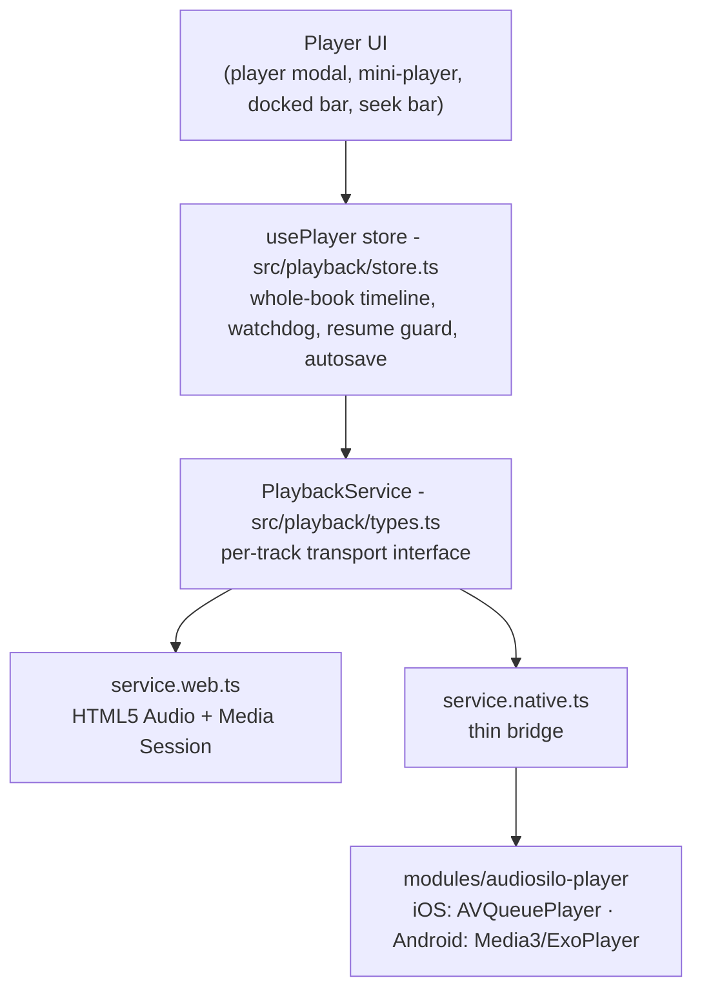
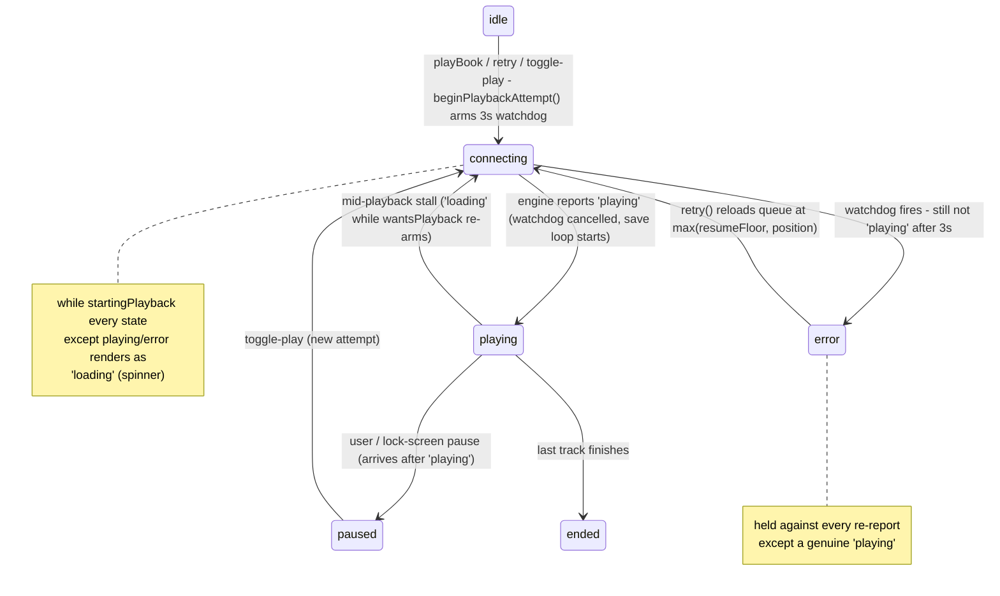

Playback is where this codebase earns its keep. The design splits into four
layers, each with a sharply-drawn contract:

```mermaid
flowchart TD
    ui["Player UI<br/>(player modal, mini-player, docked bar, seek bar)"]
    store["usePlayer store - src/playback/store.ts<br/>whole-book timeline, watchdog, resume guard, autosave"]
    svc["PlaybackService - src/playback/types.ts<br/>per-track transport interface"]
    web["service.web.ts<br/>HTML5 Audio + Media Session"]
    native["service.native.ts<br/>thin bridge"]
    mod["modules/audiosilo-player<br/>iOS: AVQueuePlayer · Android: Media3/ExoPlayer"]
    ui --> store --> svc
    svc --> web
    svc --> native --> mod
```

The engines only know about **tracks** (individual audio files) and report raw
transport state. Everything book-shaped - the whole-book timeline, chapters,
resume, error policy - lives in shared JS so all three platforms behave
identically.

## The `PlaybackService` interface

`src/playback/types.ts` defines the engine contract:

- `load(tracks, startIndex, positionInTrack, chapters?, book?)` - replace the queue.
  `tracks` are `PlaybackTrack`s (URL, optional auth `headers`, metadata,
  optional `duration`). The optional `chapters` argument is a list of
  `PlaybackChapter` clips - the native lock screens' chapter view (below, both
  platforms); the web accepts and ignores it. The optional `book` (`BookRef`:
  connection id, library id, path) names the book, so a native engine that outlives
  the JS (the Android service, played from the car) can say later which book its queue
  is; `swapTo` takes it too.
- `play` / `pause` / `seekTo(positionInTrack)` / `skipToTrack(index, pos?)` /
  `setRate` / `reset`.
- `swapTo?(…)` - optional gapless queue swap, used to move a streaming book onto
  its just-finished download without an audible gap (returns `false` when
  refused; see [Offline](offline.md)).
- `setVolume(volume)` - **required** linear output gain (0-1) applied to the
  engine's own volume, **not** the device volume. It exists for the sleep
  timer's fade-out on **duration** timers ([The sleep timer](sleep-timer.md#the-timer-sleep-timerts)).
  It is deliberately not
  optional: both engines implement it, and the one real "no volume here" case is
  each engine's own private business, which it degrades internally
  ([Writing the gain](sleep-timer.md#writing-the-gain-setvolume-is-required-degraded-per-engine)).
  Callers pass an already-clamped value - `usePlayer.setOutputVolume` is the only
  route in and clamps once.
- `configure(config)` - runtime tunables from the settings store: auto-rewind
  window, lock-screen skip intervals, and the `smartSpeed` / `voiceBoost` switches
  ([Smart speed and Voice boost](audio-effects.md)).
- Optional native hooks (the web has none of them): `onRemoteMove(handler)` - the
  engine **already** moved for something outside the JS API (see the
  [module's events](#the-native-module-modulesaudiosilo-player)) and landed at
  `(trackIndex, positionInTrack)`; `onRateChange(handler)` - the OS changed the speed and the engine
  already runs at it; `onSilenceSaved(handler)` - Smart speed's running total (not playback state, so not in
  the snapshot); `adoptPlace(snapshot)` - seed the merged snapshot without emitting, for
  [adopting](native-integrations.md#adopting-a-book-the-service-loaded) a book the
  Android service loaded. (A bookmark button outside the app is not an engine hook: the
  car controller listens for the module's `onRemoteBookmark` itself, see
  [Native integrations](native-integrations.md#the-car-snapshot-srccar).)
- `getSnapshot()` / `subscribe(listener)` - a single merged
  `PlaybackSnapshot { state, trackIndex, position, duration, rate }`,
  **per-track** positions only. States: `idle | loading | ready | playing |
  paused | ended | error`.

Metro resolves the implementation per platform: `service.web.ts` on web,
`service.native.ts` on iOS/Android. `service.ts` is a **throwing fallback that
exists only so `tsc` can resolve the import** - it is never executed.

### Web engine (`service.web.ts`)

A single `HTMLAudioElement`, advanced manually on `ended` (no native queue). Key
points:

- The session token is already in the stream URL (`?token=` - see
  [State & data](state-and-data.md)), so the browser's own Range requests
  (seek/scrub) authenticate without headers.
- The **Media Session API** wires lock-screen/notification transport: metadata
  per track plus `play`, `pause`, `seekbackward`, `seekforward` handlers using
  the configured jump intervals. Those seeks go back **through the store**
  (`onRemoteSeek`, which the store registers to `seekInTrack`), so a lock-screen
  seek lowers the resume floor and saves like any deliberate seek.
- **A browser autoplay refusal is a pause, not an error.** `play()` without a user
  gesture (a cold `/player` deep link) rejects with `NotAllowedError`; the engine
  settles its snapshot on `paused` and rethrows it as `AutoplayBlockedError`
  (`types.ts`), which the store's `startEngine` catches.
- **A file advance is not a pause.** The element fires `pause` just before `ended`
  at a file's natural end; when another file follows, the engine ignores it (the
  store keeps its intent through the next file's load), so a chapter sleep timer
  aimed at that boundary finds the book live and pauses it. A load plays on
  `loadedmetadata` only while `pendingAutoplay` is still set: a `pause()` inside the
  load clears it and settles the snapshot on `paused`.
- Auto-rewind on resume: `play()` rewinds by up to `autoRewindMax` seconds
  scaled by how long the pause lasted.
- **Voice boost** routes the element through one lazily-built Web Audio compressor
  where the browser allows it (never Safari, same-origin sources only) - see
  [Smart speed and Voice boost](audio-effects.md#web-one-web-audio-graph).
- Every element listener is guarded by an `active()` check so a second element
  being buffered by `swapTo` can't drive the snapshot until the switch commits.
- `swapTo` buffers the new (local) source on a **separate** element while the
  current one keeps playing, and only switches once `isSwapReady` holds
  (`readyState >= HAVE_FUTURE_DATA` and the playhead is within ~1.5 s of the
  target - exported pure so it's unit-testable). It refuses outright when the
  target is a synthetic `…/_offline/…` URL and no service worker controls the
  page (the URL would 404 and kill playback), and treats an 8 s buffering
  timeout as a failed swap.
- A **transcoded** track (`track.transcoded`, web only) is re-requested on every
  seek instead of seeking the element, and its position is reported
  track-absolute - see [Web transcode negotiation](#web-transcode-negotiation-transcodets).

### Native bridge (`service.native.ts`)

Deliberately thin: it forwards calls to the `AudiosiloPlayer` module and merges
the module's three event streams (`onState`, `onProgress`, `onTrackChange`) into
**one snapshot that is re-emitted on every event**. The module's state strings
match `PlaybackState` 1:1. That merged-snapshot behavior is why the store must
not interpret individual engine events (see the watchdog section) - a stale
field rides along with every fresh one.

It also listens for the module's newer events on **every** binary (an older one
simply never sends them): `onRemoteMove` updates the snapshot's `trackIndex` and
`position` **before** calling the store's handler, so a save inside it saves the landed
place; `onRateChange` is passed on; `onProgress`'s optional
`silenceSaved` feeds `onSilenceSaved`. New **functions** are feature-detected, because
the JS bundle can be newer than the installed binary (a shipped store build lags) and an
Expo function called with more arguments than it declares throws: `load`'s 5th `book`
argument is passed only when the binary also has `getLoadedBook` (`moduleTakesBook`; the
two ship together), the same way `setVolume` is detected.

## The native module (`modules/audiosilo-player`)

A local Expo module - Swift (`ios/AudiosiloPlayerModule.swift`, the thin module
definition, and `ios/AudioEngine.swift`, the engine, plus the files below) and Kotlin
(`android/…/AudiosiloPlayerModule.kt` + `AudiosiloPlayerService.kt` and their
helpers). It owns the audio session, background audio, lock-screen/remote commands,
gapless multi-file playback, pitch-corrected speed, the audio effects and the car. A JS
reload does not reload native code, so a change needs a **native rebuild** (`npx expo
run:ios` / `run:android`); only its pure parts (`TimelineMap`, the effects processors,
`VoiceBoostDSP`, `ChapterClips`) have checks that need neither a device nor the Simulator
([Native checks](testing.md#native-checks)). Its TypeScript surface is
`modules/audiosilo-player/src/AudiosiloPlayer.types.ts` and `AudiosiloPlayerModule.ts`.

The surface added for the native integrations (every function is optional on an older
binary, and JS detects it):

| | Name | What |
|---|---|---|
| Event | `onRemoteMove { trackIndex, position }` | The engine moved for something outside the JS API (lock screen or notification scrubber, its skip and chapter buttons, a headset, CarPlay, Android Auto, incl. their chapter lists), sent once the move landed, in file coordinates. Never for JS-asked moves (`seekTo`, `skipToTrack`, `load`), auto-rewind, Smart speed's skips, or a file running on into the next |
| Event | `onRateChange { rate }` | The OS changed the speed (iOS `changePlaybackRateCommand`, CarPlay's rate button, an Android controller); already applied |
| Event | `onRemoteBookmark { trackIndex, position, connectionId?, libraryId?, path? }` | A bookmark button outside the app (CarPlay Now Playing, Android Auto's custom action), with the engine's own book when it has one (listened for by the car controller, not the engine) |
| Event | `onCarConnection { connected }` | CarPlay or Android Auto connected or left |
| Event | `onCarPlayRequest { id }` | The car asked for a book native can't start alone |
| Field | `onProgress.silenceSaved` | Book seconds Smart speed removed since the app's process started (summed over every player the service builds), monotonic ([Android only](audio-effects.md#why-smart-speed-isnt-on-iphone-yet)) |
| Function | `setCarSnapshot(json)` | Both platforms: the [car snapshot](native-integrations.md#the-car-snapshot-srccar) |
| Function | `getLoadedBook()` | Android: the book the service has loaded (`LoadedBook`), else null; iOS: null |
| Function | `consumePendingBookmarks()` | Android: bookmarks pressed while no JS ran, oldest first, cleared by the read; iOS: `[]` |
| Argument | `load(..., chapters, book)` | The `BookRef`; iOS keeps it to name the loaded book for CarPlay, Android stores it in each item's extras |
| Config | `setConfig({ smartSpeed, voiceBoost })` | The effects switches |

Car and widget code is in [Native integrations](native-integrations.md); the effects in
[Smart speed and Voice boost](audio-effects.md).

### iOS: AVQueuePlayer

`AudioEngine` (`AudioEngine.swift`) drives an `AVQueuePlayer`
(`.playback` session, `.spokenAudio` mode, `.longFormAudio` policy;
`audioTimePitchAlgorithm = .timeDomain` for pitch-corrected speech speed). Auth
headers are injected per asset via the undocumented
`"AVURLAssetHTTPHeaderFieldsKey"` option - the only mechanism AVFoundation
offers, so if Apple changes it, native stream auth breaks.

The hard-won behaviors, each guarding against a specific OS quirk:

- **Deferred start seek (`pendingSeek` / `applyPendingSeek`).** Seeking a
  freshly-created `AVPlayerItem` before it reaches `.readyToPlay` is *silently
  dropped* (especially for streaming assets) - this made resume start from 0.
  `rebuildQueue` stores the target as `pendingSeek` and applies it via a status
  KVO once the item is ready.
- **`wantsPlay` gating.** If `play()` arrives while a `pendingSeek` is still in
  flight, the engine records the intent, reports `loading`, and starts the
  player **only in the seek's completion handler** - so audio never briefly
  plays from 0 before jumping. `skip(to:)` routes through `play()` for the same
  reason.
- **Progress suppression during (re)load.** The 1 Hz progress timer emits
  nothing while `pendingSeek != 0` or the current item isn't `.readyToPlay` - a
  fresh item reads `currentTime() == 0`, and emitting that would clobber the
  saved position in JS (this made a retry after a failed reload resume from the
  start).
- **One real-state toggle for remote commands.** A single earbud/headset press
  is a *toggle*, but iOS delivers it as a discrete Play **or** Pause chosen from
  iOS's own notion of the app's play state - which a third-party app cannot
  correct (a device ignores `MPNowPlayingInfoCenter.playbackState`, so iOS infers
  the state itself and can get stuck on "paused"; the engine sets it anyway for the
  Simulator, see below). When iOS guesses wrong it sends Play while already playing and the
  press no-ops - the "pause needs two presses" bug. Fix: `playCommand`,
  `pauseCommand` and `togglePlayPauseCommand` **all route through
  `togglePlayback()`**, which flips from the real `timeControlStatus` (a pending
  `wantsPlay` counts as playing).
- **Interruption auto-resume only when it should.** `wasPlayingBeforeInterruption`
  is captured *before* pausing on `.began`; `.ended` auto-resumes only if that
  flag is set **and** the interruption carries `.shouldResume`. Without the
  flag, the charging chime (a brief system interruption whose `.ended` carries
  `.shouldResume`) resumed books the user had paused.
- **Failures are reported as sustained `loading`, never `error`.** A failed
  item parks the player at `.paused` (which would read as a user pause), so the
  engine watches item `.failed` status, `failedToPlayToEndTime`, and
  `playbackStalled` and reports `loading` for all of them. The **shared JS
  watchdog** owns the promotion to `error` after a uniform grace - an instant
  native error caused a rapid-retry race.
- **Rate re-assertion (`reassertRateWhenReady`).** AVPlayer can silently drop a
  rate set on a not-yet-ready item back to 1.0 once it becomes ready (seen when
  a mid-playback download swap replaced the streaming item); the engine watches
  the fresh item and re-asserts the intended rate.
- Misc: headphones unplugged (`oldDeviceUnavailable`) pauses; queue rebuilds set
  a `rebuilding` flag that suppresses the transient state/track events
  `removeAllItems` fires; Now Playing metadata + artwork (fetched with the auth
  headers via `URLRequest`) are maintained manually.
- **Chapter lock screen (parity with Android).** `load` keeps the chapter clips
  (`ChapterClips.swift`, the same clips Android plays as items; any clip naming a file
  outside the tracks drops back to file mode, as `buildChapterClips` does). With 2+
  clips, Now Playing shows the **chapter**: title = the chapter's (else the track's),
  album = the book, artist = the author, duration = the clip's length, elapsed = the
  position in the file minus the clip start, plus
  `MPNowPlayingInfoPropertyChapterNumber`/`ChapterCount`. The 1 s tick updates only
  elapsed and rate unless the playhead has crossed into another clip; that crossing, and
  every seek, play, pause, rate change, rebuild or file advance, rewrites the whole info.
  `changePlaybackPositionCommand`'s time is chapter-relative (mapped into the shown
  clip and clamped inside it); `nextTrackCommand` goes to the next clip (across files
  through `skip(to:position:)`; nothing at the last), and `previousTrackCommand` restarts
  the clip when more than 3 s in (`ChapterClips.restartThreshold`, Media3's
  `seekToPrevious` rule), else goes to the previous one. 0 or 1 clips: whole-file info and
  next/previous file. Which of the skip or track buttons the lock screen draws
  is iOS's choice; headsets and CarPlay send the track commands.
- **Remote moves.** Every command handler above that moves the playhead passes
  `remote: true`, and `onRemoteMove` goes out only once the move has landed: after the
  seek's completion (and its `onProgress`); for a rebuild, after the deferred start seek
  (`remoteMovePending`), or at once for a 0 target (no deferred seek). Auto-rewind in
  `play()` sends nothing.
- **Rate command.** `changePlaybackRateCommand` with `supportedPlaybackRates` [0.75, 1,
  1.25, 1.5, 1.75, 2] (CarPlay's rate button needs it) applies the rate
  (`setRateFromRemote`) and sends `onRateChange` once. The engine's speed is `rate`;
  Now Playing shows it as `PlaybackRate` while playing and as `DefaultPlaybackRate`
  always, so CarPlay's button doesn't read 0× while paused.
- **`MPNowPlayingInfoCenter.playbackState`** is set from the real transport state
  (`syncPlaybackState`) on every `timeControlStatus` change, every whole-info rewrite and
  `reset`. A device ignores it, but the Simulator needs it: without it CarPlay's Simulator
  window reads the app as paused.

### Android: Media3 / ExoPlayer

Playback lives in a `MediaLibraryService` (`AudiosiloPlayerService`, which Android Auto
also browses: [Native integrations](native-integrations.md#a-medialibraryservice)) so it
survives backgrounding; the Expo module talks to it through a `MediaController` on the main
thread, connected with the `audiosilo.app` hint so the service can tell the app's own
commands from every other controller's (that is how it reports
[remote moves](native-integrations.md#who-moved-the-player)). Media3 renders the
notification/lock-screen UI itself.

**Chapters are clipped media items (Audible-parity lock screen).** When the JS
side passes chapter clips to `load`, each chapter becomes a `MediaItem` with a
`ClippingConfiguration` over its file's URL (`toClipItem`), titled with the
chapter. The system scrubber is therefore **chapter-relative**, and the standard
`COMMAND_SEEK_TO_{NEXT,PREVIOUS}_MEDIA_ITEM` buttons become **prev/next
chapter** for free.

- **`TimelineMap` keeps the bridge contract file-based.** The JS store and iOS
  think in `(fileIndex, positionInFile)`; the Android engine plays clip items.
  `TimelineMap.fileToItem` maps a file-relative position to `(clip index,
  clip-relative ms)` and `itemToFile` maps back. It is built from each item's own
  extras (`fileIndex`, `startInFile`, the file's duration; `MediaItems.entryOf`), so it
  is right for a queue the module loaded **and** for one the service loaded itself (the
  car). `load`, `seekTo`, `skipToTrack`, the progress loop and
  `onMediaItemTransition` all translate through it, so the reported positions and
  durations are indistinguishable from file mode, and the wire contract between JS and
  native stays file-based. Each item's extras also carry the `BookRef` (from `load`'s
  `book` or the car's play spec); items are built by one shared `MediaItems.buildQueue` /
  `toClipItem`.
- **The skip buttons are custom session commands** (`audiosilo.SEEK_BACK` /
  `audiosilo.SEEK_FORWARD`), granted in `MediaSession.Callback.onConnect` and
  executed in `onCustomCommand` as `player.seekBack()/seekForward()`. They are
  **not** the standard `COMMAND_SEEK_BACK/FORWARD` - those map to the legacy
  `ACTION_REWIND`/`ACTION_FAST_FORWARD`, which the modern Android media UI
  silently ignores (`dumpsys media_session` showed `custom actions=[]` and no
  buttons). They seek by the listener's skip lengths (`PlayerConfig`) and wear the
  nearest of Media3's **predefined** `CommandButton` icons (`ICON_SKIP_BACK_5/10/15/30`
  and `ICON_SKIP_FORWARD_*`, available since Media3 1.5.0), so no app-shipped drawable and
  no icon-less action for newer Android to drop.
- **Registered with `setCustomLayout`, not `setMediaButtonPreferences`.** The
  slot-based preferences API capped the Media3 1.5.1 notification at 3 actions
  (it drops the secondary slots - verified via `dumpsys notification`,
  `actions=3`). `setCustomLayout` makes the notification provider emit the
  standard `[prev, play/pause, next]` row automatically (from the player's
  available seek-to-prev/next commands) **plus** the custom skip buttons - all
  5 actions alongside the draggable chapter scrubber, device-verified on a
  Pixel (`actions=5`).
- **`AudiobookPlayer` (a `ForwardingPlayer`)** wraps the ExoPlayer so audiobook
  behavior applies regardless of where a command originates (lock screen,
  notification, headset, JS bridge): **auto-rewind on resume** lives in its
  `play()` (reading the live Settings value from `PlayerConfig`), `prepare()`
  resets the pause baseline so a fresh book never inherits the previous one's
  pause time, and **prev/next are hidden only when there is a single media
  item** (a chapterless single-file book, where "previous" could only restart
  the book).
- **`SimpleCache` keeps clipped streaming gapless.** Chapter clips of a
  single-file m4b re-open the *same URL* at each boundary; a process-lifetime
  64 MB LRU `SimpleCache` + `CacheDataSource` means those re-opens hit
  already-downloaded bytes and the parsed container header instead of the
  network - no audible gap (device-verified). Local `file://` sources bypass
  the cache. Auth headers are injected at request time from `AuthHolder` (one
  bearer token per book, set on every `load`), through a `ResolvingDataSource`, and
  **only for a request to the origin of the loaded book's tracks**: never to another
  host a media item or artwork URI names. The exported service also refuses playable
  items from any controller but the app's own (see
  [Native integrations](native-integrations.md#a-medialibraryservice)).
- The app logo is the notification small icon
  (`DefaultMediaNotificationProvider.setSmallIcon` +
  `res/drawable/ic_notification.xml`).
- `onTaskRemoved` records a "swiped away from recents" flag in shared prefs;
  the JS layer reads it via `consumeTaskRemoved()` on foreground and resets to
  Home (matching iOS's cold-start behavior). iOS's implementation of
  `consumeTaskRemoved` always returns `false` - bridge parity only.

Android has **no deferred-seek problem**: Media3's
`setMediaItems(items, startIndex, startPositionMs)` honors the start position
natively.

## Building the queue: `book-queue.ts`

`buildBookQueue(api, libraryId, book, chapterData?, local?, virtualChapterInterval?, transcode?)`
turns a book + its `/chapters` response into a `BookQueue { tracks, offsets,
total, chapters, chapterClips, syntheticChapters }`.

**Track building rules (`bookFileSpecs`)** - the single source of truth for a
book's playable files, shared with the download engine so download order ≡ play
order:

1. An explicit file list (`chapterData.files`, else `book.files`), sorted by
   `seq`;
2. else the **distinct `file_path`s referenced by the chapters**, in first-seen
   order (durations estimated from the largest chapter `end` per file);
3. else the book's own `rel_path` as a single file.

:::danger Stream the file, never the book
A track URL must be a real audio *file* (a chapter's `file_path` or a
`BookFile.rel_path`) - never a folder/book path. Streaming a folder path is what
produced the iOS MediaToolbox `-12864` failures. This is invariant
[#4 of the workspace golden rules](../architecture/invariants.md).
:::

When `local` is supplied (the book is downloaded), each file's track points at
its local URI instead of `api.streamUrl(...)`, and auth headers are dropped for
local tracks. On web, tracks carry no headers at all (the token is in the URL);
on native they carry `api.authHeaders()`. With `transcode` (decided by
`playBook`, web only - [below](#web-transcode-negotiation-transcodets)) every
non-local track's URL is `streamUrl(…, { transcode: true })` and the track is
flagged `transcoded: true`; the flag is only present when set, so a direct
stream's track is exactly what it always was, and a local file is never
transcoded.

Other queue math that lives here:

- **`chapterBookOffset`** recomputes every chapter's whole-book offset from the
  client's own file durations plus the in-file `start`, locating the file **by
  `file_path` first** with a bounds-checked `file_index` fallback. The server's
  `book_offset` is deliberately ignored - it comes back 0 for every chapter on
  some on-demand-indexed books, which made chapter detection resolve to the
  last chapter.
- **`buildChapterClips(specs, chapters)`** produces the native clip list (Android
  plays the clips as items; iOS uses them for its chapter lock screen): one
  clip per chapter mapped to `(fileIndex, [startInFile, endInFile])`; the last
  chapter in each file clips "to end" (`endInFile = 0`) so an inaccurate final
  `end` can't cut off the file's tail. It returns `[]` for **0 or 1 chapters**
  (the engine then plays one item per file - plain file mode) and `[]` if *any*
  chapter can't be mapped to a file, so a partial clip queue can never strand
  playback. Returning `[]` for single-file books is also the documented safety
  fallback if a future device regresses on gapless clips.
- **`synthesizeChapters`** overlays evenly-spaced *virtual* chapters (default
  interval 30 min, a user setting) on a long, chapterless single-file book so
  prev/next-chapter and the chapter-relative seek bar have somewhere to go.
  Synthetic chapters are computed **after** `chapterClips` and never fed to it,
  so native playback is unchanged; `BookQueue.syntheticChapters` flags them.
- **`locate(offsets, bookPosition)`** and **`toBookPosition(offsets, index,
  positionInTrack)`** convert between the whole-book timeline and per-track
  coordinates; **`chapterAt`** finds the active chapter by `book_offset`;
  **`chapterCountdowns`** feeds the sleep sheet's "Or stop after" rows
  (wall-clock times scaled by the playback rate via `rate.ts`
  `wallClockSeconds`), and **`nextChapterEnd`** answers the sleep timer's "where
  does the next worthwhile chapter end?" from the same `chapterEndPosition`, so
  the list the listener picks from and the boundary a shake retargets cannot
  disagree. Neither assumes the chapters ascend by position - `chapterBookOffset`'s
  out-of-range `file_index` fallback degrades to 0 preceding files, so stale or
  duplicated metadata yields non-monotonic ends; `chapterCountdowns` locates the
  current chapter with `chapterAt` and `nextChapterEnd` takes the **nearest**
  qualifying end rather than the first qualifying array element.

`total` is the max of the book's reported duration, the summed file durations,
and the furthest chapter end - so `duration: 0` metadata degrades instead of
breaking the seek bar.

## The player store (`store.ts`)

`usePlayer` (Zustand) is the only consumer of the engine. Its snapshot is
per-track; the selectors map to the whole-book timeline:

- `selectBookPosition` = `toBookPosition(queue.offsets, snapshot.trackIndex,
  snapshot.position)`;
- `selectCurrentChapter` overlays `queue.chapters` on that position by
  `book_offset`. The full player's seek bar is **chapter-relative**.

Actions: `playBook`, `toggle`, `pause`, `retry`, `seekBook`, `seekInTrack`,
`goToTrack`, `skipSeconds`, `setRate`, `stop`. `seekInTrack`/`goToTrack` exist
for books whose file durations are unknown (no reliable whole-book timeline).
Speed is clamped to 0.5–2×.

**Store behaviours the redesign added.** The player redesign keeps the store
(decision 7 in the workspace's `PLAYER-REDESIGN-PLAN.md`), so these are the only
behaviours it gained, each with its own regression tests:

- `playBook` decides the [web transcode flag](#web-transcode-negotiation-transcodets);
- `playBook` takes a **`startSpeed`**; without one a book plays at its saved speed
  (else the default) - **also when it starts at an explicit place** (a chapter
  tap, a bookmark, Previously on), where the resume lookup that normally supplies
  the speed is skipped, so `knownSpeed` reads the cached progress and the local
  mirror instead of letting the default be saved over the book's own speed;
- **`loadingBook`**: the `contentKey` of a book `playBook` just swapped in whose
  engine load hasn't landed. Until it lands the snapshot still holds the
  **previous** book's place, so mapping it through the new queue would place the
  listener somewhere they have never been. The spoiler gates wait it out through
  `selectPlacedBookKey` (`use-listening-position.ts`); without it, switching books
  could reveal the new book's characters by the old book's position;
- **`startEngine`** (the play step of `playBook`/`toggle`/`retry`) catches only
  `AutoplayBlockedError` - a browser refusing `play()` without a user gesture (a
  cold `/player` deep link) - clears the play intent so the watchdog can't turn
  it into `error`, and settles on `paused`;
- the store registers **`onRemoteSeek`** on the engine, so the OS media controls'
  seeks go through `seekInTrack` and lower the resume floor and save like any other
  seek (web);
- on native it registers **`onRemoteMove`**: the engine has already moved (the
  [module's event](#the-native-module-modulesaudiosilo-player)), so the store calls `userMoved` with the landed whole-book
  position - `lowerFloorTo` lowers the resume floor to it and `localMoves` counts it, so a
  [place reconcile](#picking-up-another-devices-place-place-reconcilets) in flight stands
  back - and persists. Without it a lock-screen scrub back by more than the slip
  tolerance would never save. **`onRateChange`** sets `rate` (clamped; only an
  out-of-range speed goes back to the engine) and persists; **`onSilenceSaved`** feeds [time saved](audio-effects.md#time-saved-srcplaybacktime-savedts),
  which is also flushed when playback halts;
- every `load` and `swapTo` passes the book (`bookRefOf(nowPlaying)`);
- **`adoptLoaded(book)`** (Android): [adopting a book the service loaded](native-integrations.md#adopting-a-book-the-service-loaded);
- `clampRate` lives in `rate.ts` (shared with the time-left helpers);
- `maybeAutoDownloadCurrent` asks `download()` with the `'auto'` origin
  ([The end of a book](end-of-book.md#auto-download-on-play)).

Everything else around playback - [what plays next](end-of-book.md#what-plays-next-up-next-resolverts),
[jump undo](player-ui.md#undo-a-jump-jump-undots),
[drift-offs](sleep-timer.md#fell-asleep-drift-controllerts),
[time left](player-ui.md#time-left-time-leftts) - sits **outside** the store and
reads it through selectors and `usePlayer.subscribe`.

One important gate lives in the *screens*, not the store: **playback starts
only after the chapters/files query has settled** (the player screen waits for
`useChapters`). Starting early made multi-file books stream the folder path and
lose chapter info.

### The stall → error watchdog

The single most battle-scarred piece of the store. Design rules, in order of
importance:

1. **It is armed by the play/retry *action*, not by interpreting engine
   events.** `beginPlaybackAttempt()` (called from `playBook`, `retry`, and the
   play half of `toggle`) sets two module-level flags - `wantsPlayback` (we
   intend to be playing) and `startingPlayback` (an attempt is in flight) - and
   starts a `STALL_GRACE_MS` (3 s) timer. When the timer fires, the test is
   simply *"are we `playing`?"* - so no transient state the bridge left behind
   can prevent it from firing. If not playing, the store synthesizes
   `state: 'error'`, clears intent, and persists progress.
2. **While `startingPlayback`, every incoming state except `playing`/`error`
   collapses to `loading`.** On a resume/retry, `service.native.ts` re-emits
   its merged snapshot for every event and iOS delivers
   `timeControlStatus`/status KVO asynchronously - the store sees a jumble of
   `ready`, frozen `onProgress` ticks carrying `loading`, and a spurious
   `paused` (an async `.paused` from the queue rebuild that escapes the native
   `rebuilding` guard). Interpreting those individually failed three separate
   ways (an error that flashed then reverted; a dead `ready` play button; a
   spinner whose watchdog never armed because the spurious `paused` cleared
   intent). Collapsing to `loading` shows a spinner and lets the action-armed
   watchdog guarantee resolution. A genuine user/lock-screen pause always
   arrives *after* `playing` (when `startingPlayback` is already false), so it
   still reads as `paused`.
3. **A surfaced `error` is held against everything except `playing`.** After
   the watchdog (or a real web/Android engine error) lands, the engine keeps
   re-reporting around the dead stream - iOS with frozen `loading` ticks,
   Android with `onPlayerError` → `STATE_IDLE` → `idle` plus progress ticks.
   `subscribe` drops **every** incoming state except `playing` while the
   previous state is `error` and no retry is in flight. This is
   suppress-all-but-`playing`, deliberately **not an allow-list** - enumerating
   the noisy states (`loading`, `ready`, `idle`, `paused`, …) bit the project
   repeatedly (the Android flash→spinner loop). The hold is released by a retry
   (`wantsPlayback` flips true) or a genuine `playing`.
4. **The engines never decide `error` on iOS.** iOS reports every failure shape
   (`.failed` item, failed-to-end, buffer stall) as sustained `loading`;
   web/Android may emit a real `error` directly, with the watchdog as the
   backstop for a buffer that never resolves. Recovery is `retry()`, which
   *reloads* the queue at the known-good position - a dead `AVPlayerItem`
   cannot be revived by `play()` alone.
5. One extra normalization: an engine `loading` arriving when we do **not**
   intend to play (no attempt in flight, so no watchdog armed) is read as
   `paused` - iOS reports a failed item as `loading` even while the user has
   the book paused, and leaving it would strand an endless spinner with no
   retry button.

Keep all of this in shared JS; do not re-add a per-engine native timer.

```mermaid
stateDiagram-v2
    idle --> connecting: playBook / retry / toggle-play - beginPlaybackAttempt() arms 3s watchdog
    connecting --> playing: engine reports 'playing' (watchdog cancelled, save loop starts)
    connecting --> error: watchdog fires - still not 'playing' after 3s
    playing --> connecting: mid-playback stall ('loading' while wantsPlayback re-arms)
    playing --> paused: user / lock-screen pause (arrives after 'playing')
    playing --> ended: last track finishes
    error --> connecting: retry() reloads queue at max(resumeFloor, position)
    paused --> connecting: toggle-play (new attempt)
    note right of connecting
        while startingPlayback every state
        except playing/error renders as
        'loading' (spinner)
    end note
    note right of error
        held against every re-report
        except a genuine 'playing'
    end note
```

(`connecting` above is the store's `startingPlayback` window; the snapshot the
UI sees during it is `loading`.)

### Resume protection

"Never restart an in-progress book from 0" is enforced twice - once on the way
in, once on the way out:

**On the way in - `loadInitialProgress` (`progress-sync.ts`)** returns a
discriminated `ResumeLookup` reconciling three sources by `updated_at`
(newest wins): the server's record, a **durable local mirror**, and the offline
replay queue.

- `progress` - a saved position exists somewhere; `playBook` resumes from it
  (and restores the saved playback speed), except that a finished book starts again
  at 0 (`resumeStart`). That rule, `bookSourceOf` (a book's item, chapters and local
  files: the download's copy, else through the query cache) and `localFromManifest` live
  in `src/playback/book-source.ts`, which `playBook`, `startBookInPlace`, `adoptLoaded`
  and the car share.
- `empty` - the server answered (HTTP 200) and there is no record anywhere: a
  genuinely new book, start at 0.
- `failed` - the server was unreachable **and** there is no local record. For a
  *streaming* book, `playBook` fails safe: it sets `state: 'error'` (with
  `resumeLookupFailed` recorded so `retry()` re-runs the lookup rather than
  reloading at a stale 0) instead of playing - starting at 0 here would both
  restart the book and let a later save overwrite the real position. For a
  *downloaded* book, `failed` means offline-first and never started: 0 is
  correct.

The mirror (`writeMirror`, key `audiosilo.progressMirror`) is written on **every
save and every successful server read**, keep-newest by `updated_at`, and -
unlike the replay queue - is **never pruned on sync**. It exists precisely so a
flaky resume fetch can't lose the position (the beta "book restarted from the
beginning" report).

**On the way out - the `resumeFloor` save guard (`store.ts`).** The whole-book
position we actually resumed from is kept as a running high-water mark;
`persist` refuses to save a position more than `SLIP_TOLERANCE` (60 s) *below*
the floor. Only a deliberate user seek/jump lowers the floor (`lowerFloorTo` in
`seekBook`/`seekInTrack`/`goToTrack`, and a native `onRemoteMove`, which is the
listener's own move made outside the app). Because the server is last-write-wins, a
slipped-through restart-at-0 with a fresh timestamp would otherwise permanently
overwrite real progress - the guard makes that write impossible. `retry()` also
reloads at `max(resumeFloor, currentPosition)` so a transient 0 in the snapshot
can't be re-loaded.

### Picking up another device's place (`place-reconcile.ts`)

A book this device holds loaded resumes from its engine's place on every play, without
asking the server, so a place another device saved meanwhile would be both skipped and
overwritten (the server is last-write-wins). `startPlaceReconcile`, started from the root
layout, asks the server for the loaded book's progress when it is picked up again: when
the app comes to the foreground or the book's server comes back while the book is loaded
and settled, and when the book plays again after `LONG_PAUSE_MS` (60 s) of pause from any
source (the store's `onPickedUpAgain`, called before that play's first save). While the
check is out the store holds its saves (`holdSaves`, 5 s at most), so the stale place is
never written.

It moves only when the server's record was written by another `device_id`, is newer than
anything this device's mirror knows for the book, is not finished, and is more than
`MOVE_THRESHOLD_S` (30 s) from the engine's place; a seek of the listener's own while the
check was out wins (`localMoveCount`). The move is `seekBook` (so the resume floor and the
undo chip see it), and a toast ("Picked up your place from another device") offers Undo.
This module is the only place that reconciles a loaded book: never make `toggle()` look
anything up.

### Progress autosave and sync triggers

- A 15 s interval save loop (`SAVE_INTERVAL_MS`) runs **only while actually
  playing** - it is started by the engine's `playing` transition and stopped by
  `paused`/`ended`/`error` (via `haltAndPersist`), which covers lock-screen
  pauses and books that simply finish without a `stop()` call.
- Additional saves fire on every seek (`seekBook`/`seekInTrack`/`goToTrack`),
  on `setRate`, and on `stop`.
- Saves go through `saveProgress` (`progress-sync.ts`): mirror first, then the
  network if reachable, else the offline replay queue (latest save per book).
  `finished` is set within 5 s of the end; each save carries
  `version: 0`, a per-install `device_id` and a capture-time `updated_at` so
  the server's last-write-wins reconciliation (and offline replays) order
  correctly. Details in [State & data](state-and-data.md).
- Listening **history spans** are recorded around the same transitions:
  a span opens on `playing`, closes on leaving `playing` (or on a mid-playback
  track change, so each file logs as it finishes), ignores spans under 20 s,
  and is skipped entirely while the server is unreachable.
- When playback halts, the store invalidates the `['progress', 'all']` query so
  the Home/Browse "continue listening" and "finished" lists re-read from the
  server - without invalidating on every 15 s save.

One more store responsibility worth knowing about: when a download completes
for the book that is currently streaming, the store hot-swaps playback onto the
local files (`switchCurrentBookToLocal`, preferring the engine's gapless
`swapTo`) - covered in [Offline](offline.md).

## Web transcode negotiation (`transcode.ts`)

Browsers can't decode some codecs a book may use (AC-3, E-AC-3, ALAC...). The
server marks those books `direct_playable: false` and, when it has ffmpeg
(capability `transcode`), streams them re-encoded to MP3 with
`?transcode=1&t=<seconds>` ([cross-repo contract §5](../architecture/cross-repo-contract.md#5-transcode-negotiation-direct_playable-and-transcode1)).
The web player negotiates that by itself; native engines never transcode (they rely
on the platform's own decoders: no FFmpeg extension on Android), and a downloaded
(local) file is never transcoded either.

**The rule** is pure and lives in `src/playback/transcode.ts`:

- `isBrowserUndecodable(book, chapterData?)` - only an **explicit**
  `direct_playable === false` counts (the chapters response is preferred, being
  fetched fresh for playback). An older server omits the field and an unprobed
  codec reads as playable; both stream exactly as before.
- `needsWebTranscode(book, chapterData, canTranscode)` - on web (`Platform.OS`, read
  inside through `mayNeedWebTranscode`), the capability is `true`, and the book is
  undecodable. An **unknown** capability
  (`/server` not loaded) reads as no: stream directly, and the error/retry path
  speaks if the browser can't play it.

**Reading the capability** is `src/playback/transcode-capability.ts`, kept apart so
the rule stays framework-free. `mayNeedWebTranscode` (in `transcode.ts`) is the cheap
synchronous pre-check (false off web and for every ordinary book, so they skip the
lookup and its await); `resolveWebTranscode` reads `capabilities.transcode` through
`fetchCapabilities` (`api/hooks.ts`: the shared `/server` entry via `fetchFailFast`,
normally a cache hit; a failed read falls back to the cached flags, else "no");
`webTranscodeFromCache` is the synchronous form for the download path and
`useNeedsWebTranscode` the UI's (the book page's note, the download controls, the
Downloads page's failed row).

**Where it's decided:** once, in `playBook`, before `buildBookQueue` - and only for
a streaming book (`!local && mayNeedWebTranscode(…) && await resolveWebTranscode(…)`).
The queue then carries `transcoded` tracks, so every later reload (`retry`, seeks)
reuses them without asking again.

**The web engine** (`service.web.ts`) is where the work is. Transcoded output has no
byte ranges and no length the `<audio>` element can know (`duration` reads
`Infinity`/`NaN`), so:

- `sourceFor(track, positionInTrack)` (pure, exported) returns the element's source
  and the **offset** its `currentTime` 0 stands for: a direct stream is its own URL
  at offset 0; a transcoded one is requested *at* the position
  (`transcodeUrlAt(url, t)` replaces any `t` and keeps every other param, the media
  token included) with that `t` as the offset.
- A transcoded stream is never requested inside its last second
  (`transcodeStartAt`): there is nothing left to encode there, and the element
  errors instead of ending.
- Every seek, auto-rewind, and resume after a pause longer than
  `TRANSCODE_STALE_PAUSE_MS` (30 s, a paused back-pressured transcode may have been
  dropped by the server or a proxy) goes through `reloadTranscodedAt`, which
  re-runs `loadTrack` at the target. `loadSeq` lets a stale `loadedmetadata` handler
  (a second seek before the first source loaded) no-op, and `pendingAutoplay` keeps
  play intent across the `loading` window that now recurs on every seek.
- The snapshot's `position` stays **track-absolute**: `transcodedTrackPosition`
  returns `currentTime + offset`, clamped to the queue's known file duration (the
  encoder can run a frame past it, which would read as the next file's first
  instant). The duration always comes from the queue (`track.duration`), never the
  element.
- The rate is applied as `defaultPlaybackRate` *and* `playbackRate`
  (`applyRate`): the media element load algorithm resets `playbackRate` on every
  `src` change, which a transcoded seek is.
- An `ended` well before the known end (`isEarlyTranscodeEnd`, more than
  `EARLY_END_SLACK_S` = 10 s short) is the connection dying, which an unsized
  stream reports as a normal end: the engine reloads at the position instead of
  skipping the rest of the file, and accepts a second early end without
  `EARLY_END_MIN_PROGRESS_S` (5 s) of progress as the real end (a file whose audio
  is shorter than its probed duration).
- The Media Session gets a `seekto` handler (only for transcoded tracks; direct
  streams keep the browser default) that goes through the store's seek, so the OS
  scrubber re-requests too, and an
  explicit `setPositionState` with the track-absolute position and known duration,
  cleared again once a direct track plays.

:::info Why the offset keeps positions track-absolute
Everything above the engine assumes `snapshot.position` is the position **in the
file**: `selectBookPosition` (`toBookPosition(offsets, trackIndex, position)`),
chapter detection, the `resumeFloor` save guard, progress saves, the sleep timer's
chapter targets and jump-undo's detector. If a transcoded seek let `currentTime`
restart at 0, every one of them would see the book jump backwards on each seek -
the save guard would refuse the saves, the chapter would read as the first, and a
jump chip would appear. Folding the offset in at the engine keeps the transcoder
invisible to the store.
:::

**Downloads:** a book that streams transcoded on web must not be downloaded raw (its
files would not play offline in that browser). `useDownloads.download()` refuses it
(`webTranscodeFromCache`), which covers every path - the book page, the automatic
download and keep-ahead - and `useDownloadControls` exposes `needsTranscode` so the
control says "Can't download in this browser" instead of the generic "Downloads
unavailable". A download already on disk stays removable; a failed one is blocked
like a new one (only the Downloads page can clear it, with no Retry - see
[Offline](offline.md#lifecycle)).

**The book page** shows `TranscodeNote` (`src/components/library/transcode-note.tsx`)
under the stats ("AC-3 audio is converted to MP3 for this browser"), under exactly
`needsWebTranscode` and never for a downloaded book; `codecLabel` maps ffprobe names
(`ac3` → AC-3, `wmav2` → WMA...) and falls back to upper case.

## Elsewhere

- [The end of a book](end-of-book.md): finishing a book, what plays next, the
  automatic download of the book you start.
- [The sleep timer](sleep-timer.md): the timer, drift-offs, the grace card.
- [Player UI](player-ui.md): jump undo, time left, the companion, the controls,
  sheets, and the compact and full players.
- [Smart speed and Voice boost](audio-effects.md): the audio effects on every engine,
  and time saved.
- [Native integrations](native-integrations.md): CarPlay, Android Auto, the widgets
  and the sleep timer Live Activity.
