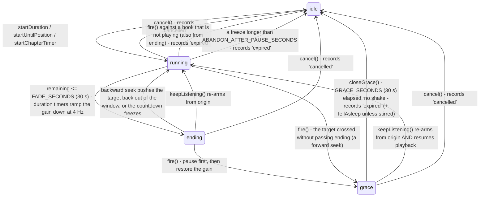

On iOS a running timer also drives a Live Activity (lock screen and Dynamic Island),
synced from this store by `src/widgets/widget-sync.ios.ts`; it is described with the widgets
in [Native integrations](native-integrations.md#widgets-and-the-live-activity-ios).

## The timer (`sleep-timer.ts`)

`useSleepTimer` is a second Zustand store, deliberately framework-free. It reads
`usePlayer` through `getState()` and, while a timer is armed, subscribes to it
(`playbackWatch`): every player write re-runs `syncPlaybackFreeze` (freeze or thaw a
duration countdown while playback is paused, see below) and `syncGrace` (close a
grace whose deadline has passed, note a listener stirring), and both end a timer
whose book changed. It arms three ways - `startDuration(minutes)`,
`startUntilPosition(position, label)` and `startChapterTimer(opts?)` - which all
funnel through one private `arm()` that restores the volume, clears the
ending/grace flags and restarts the 1 s tick. The tick counts down and fires;
between the listener's own actions, the tick, that subscription and the 250 ms fade
ticker are what move the machine. The sleep sheet's
"Or stop after N chapters" rows (`sleep-sheet-model.ts` `stopAfterRows`, real
chapters only, never the synthetic `virtualChapterInterval` ones) arm through
`startUntilPosition(endPosition, stopAfterLabel(row))` - the first row ("This
chapter") with the chapter's own label (`chapterSleepLabel`), the others with
`afterChapters` - and its
"End of chapter" tile shows the countdown of `chapterTimerTarget` - exported so
the tile and the timer it starts compute one target.

`cancelIfBookChanged` also ends a timer in any armed phase, as `expired`, once its
book is no longer the loaded one.

Every edge back to `idle` goes through `endTimer(reason)`, which notifies the
`onSleepTimerEnded(fn)` registry synchronously - once per ending, with the store
already back at `idle` - so the auto sleep controller below can tell a dismissal
from a timer that simply ran out. That is the only event this store emits; a
timer armed with nothing loaded (`bookKey === null`) notifies nothing. One
`expired` ending carries more: when the grace closes after a fire that paused a
playing book and the listener **didn't stir** in the window, the outcome carries
`fellAsleep` (see [Fell asleep](#fell-asleep-drift-controllerts) below).

The pieces worth knowing before touching it:

- **Two selectors answer the phase for UI** (the readouts also read `origin`,
  `label` and `remaining` for their words). The phase
  (`idle | running | ending | grace`) is **stored**, not derived - three booleans
  could spell out twice as many combinations as are legal, and the UI kept
  re-deriving the phase from them by hand - so `selectSleepPhase` simply reads it
  and `selectSleepExtendable` is `phase === 'ending' || phase === 'grace'`
  (nothing branches on `graceUntil`; it is only ever the answer to "until
  when?"). The second one answers "can a shake or a *Keep listening* tap do
  anything right now?" and also **gates the accelerometer listener**, so the
  sensor runs only in those two short windows rather than for the whole timer.
  That gate is why the phase must be *true*: a frozen countdown leaves `ending`
  (below), or a book paused with 20 seconds left would keep the sensor
  subscribed - and the grace card saying "Fading out in 20 s" about a paused book
  at full volume - indefinitely.
- **Only a duration timer fades.** The phase is called `ending`, not `fading`,
  because it means "about to stop, a shake still saves it" for **both** kinds of
  timer while only one of them touches the gain. `fadesAudio(origin)` is the
  single gate: `{kind:'duration'}` fades, because its stopping point is arbitrary
  and an abrupt cut mid-sentence is jarring; `{kind:'chapter'}` (which includes
  the end-of-book target and every `startUntilPosition` timer) plays its last 30
  seconds at **full volume**, because those are the words the listener stayed
  awake for and the chapter ending is its own signal. On the chapter path the
  fade ticker never starts, so there are **no gain writes at all** - a unit test
  asserts the gain is never below 1 for a whole chapter-timer run, including
  through its pause and grace.
- **The fade has its own faster ticker.** The 1 s countdown tick is far too
  coarse to ramp against, so `FADE_TICK_MS` (250 ms) drives `syncFade` - the one
  reconciler that owns both the fade ticker and the engine gain, holding the rule
  *the ramp runs iff `phase === 'ending'` and the origin fades and it is not
  frozen*, so every site that writes `phase` or `frozenAt` just calls it
  afterwards. It ramps only while a **duration** timer is `ending`.
  `fadeGain(remaining)` is the
  exported, unit-tested curve: `(remaining / FADE_SECONDS)²`, squared because
  perceived loudness is roughly the square root of linear gain, so a linear ramp
  stays loud and then drops off a cliff. The gain is **never written into the
  store** - it changes four times a second and nothing renders it, so storing it
  would re-render every subscriber at 4 Hz.
- **`syncEndingPhase` works in both directions.** It enters the `ending` phase
  when the remaining time drops into the window *and leaves it, restoring full
  volume, when the remaining time climbs back out* - which a backward seek on an
  end-of-chapter timer does; without the second half the rest of the chapter
  would be stranded at a fraction of its volume (back when that timer still
  faded). A **frozen** (paused duration) countdown is never in the phase either,
  by the same rule rather than a second one: `ending` means "about to stop", and a
  countdown that is not counting is not about to stop. Otherwise the phase change
  is unconditional; only the ramp is gated on `fadesAudio`. "Not counting" is
  `countdownHeld(state)`: a duration timer with `frozenAt` set, or a **chapter**
  timer while the transport isn't live (a chapter timer never sets `frozenAt`; its
  "countdown" is the book's position). `syncChapterHold()`, run from the play-state
  watch, moves a chapter timer paused by hand inside its last 30 seconds back to
  `running` (not extendable, no accelerometer, no grace card) and back into
  `ending` on resume if it is still inside the window; firing is unchanged.
- **`fire()` pauses first, then restores the gain**, chained in a `finally` so a
  rejected pause can't leave a manual resume silently muted. It does not go to
  `idle`: it opens the `GRACE_SECONDS` (30 s) window and keeps ticking. Before
  pausing it records `fired` - when, where it stopped the book, and the listener's
  last touch (`lastInteraction`), read *before* the pause because the pause is
  itself a transport edge the interaction watch would record.
- **`syncGrace` reconciles the grace window** from the play-state watch (every
  player write) and the tick. It closes the window once its deadline has passed -
  the tick alone isn't enough, because iOS suspends the app after the timer pauses
  the audio and the thing that wakes it can be the listener pressing play the next
  morning, which must still close as the drift-off it was - and it marks the fire
  `stirred` when the transport goes live again after `PAUSE_SETTLE_MS` (2 s; the
  engine reports `playing` for a moment after the pause is asked for) or the
  position moves more than `SCRUB_SECONDS` (5 s) from where the timer stopped it.
  `closeGrace` is the one way a fired timer runs its course: it ends it as
  `expired`, with `fellAsleep` unless it was stirred. (A `cancel()` in the grace
  ends it `cancelled`, and a book change `expired`; neither carries `fellAsleep`.)
- **`keepListening()` is a no-op outside the `ending` phase and the grace.**
  Inside them it re-arms from the recorded `origin` (`{kind:'duration', minutes}`
  or `{kind:'chapter'}`), so a duration timer restarts its full length and a
  chapter timer retargets - by **one** chapter, even for an "after 3 chapters"
  timer: a shake that late means "a little more", and another shake at the next
  boundary gives another. It also records a touch (`noteInteraction`, below).
  From the grace it additionally calls
  `resumePlayback()`, which checks the live snapshot before calling `toggle()` -
  `toggle` from a *playing* state would pause a book the listener had already
  resumed by hand.
- **One constant makes "one more chapter" work.**
  `nextChapterTarget(allowEndOfBook)` picks the **nearest** upcoming chapter end
  more than `MIN_CHAPTER_SECONDS` (30 s) away (`nextChapterEnd` in
  `book-queue.ts`, which scans for the nearest qualifying end rather than the
  first qualifying array element - chapter offsets are not guaranteed to ascend).
  In the `ending` phase the current chapter's end *is* the boundary being stopped
  at, so it fails that test and the re-arm naturally lands on the **next**
  chapter; for a timer armed at the start of playback the current chapter usually
  qualifies. It is deliberately its **own** constant and not an alias of
  `FADE_SECONDS`: they share a value but are unrelated, and while they were tied
  together retuning the fade silently changed what "one more chapter" retargets.
- **Who asked decides the fallback**, which is what `startChapterTimer`'s
  `{ allowEndOfBook }` option carries. The **listener's** reset (`keepListening`
  passes `{ allowEndOfBook: true }`) means "one more chapter", and where there is
  no next chapter the end of the book is the honest answer. The **automatic**
  nightly arm passes nothing (the default is `false`) and refuses both the
  end-of-book fallback *and* a chapter that ends exactly where the book does,
  degrading to a 15-minute duration timer instead. A folder of MP3s with no
  chapter metadata has `queue.chapters === []` (`buildBookQueue` synthesizes
  virtual chapters only for a single-file book), so the shared fallback armed a
  target ten hours out: it never fired, so the timer never returned to `idle`, so
  the controller's "a timer already stands" guard blocked every later arm and
  stopped its poll - no working sleep timer at all, all night. Whichever
  fallback applies, a chapter arm always ends up with a timer that fires.

### Freezing the countdown while paused (`syncPlaybackFreeze`)

A duration timer counts **listening** time, not wall-clock time: it must not
expire while the book is paused, which it used to do silently - pause with a
headphone button, never look at the screen, and come back to no timer armed.
Every open-source *audiobook* player does the same (Audiobookshelf, Absorb,
Voice; AntennaPod switched off wall clock in 2025). The subtleties are all in
*how* it freezes:

- **The freeze must survive the JS runtime being suspended.** iOS suspends the
  app once it stops producing audio and a hidden web tab is throttled, so **no
  ticks arrive at all** while paused - any scheme that decrements a balance per
  tick silently loses an untick'd hour. So the representation is a **stopped
  clock**, not a running total: a duration timer stays a `Date.now()` deadline
  (`endsAt`), pausing records **`frozenAt`** (the moment the clock stopped), and
  `preciseRemaining` reads the deadline against `frozenAt` instead of the live
  clock. That answer needs no ticks to stay correct. Resuming slides `endsAt`
  forward by `Date.now() - frozenAt` - two timestamps, so any length of gap
  reconciles exactly.
- **The same shape fixes the other direction.** Because the countdown is a
  deadline rather than a per-tick decrement, a *playing* context whose ticks are
  throttled to one a minute can't make the timer run long either.
- **The play state is a level, read from a subscription - not a transition.**
  `playbackWatch` subscribes to `usePlayer` while a countdown is running and
  **ignores the `(state, prev)` payload**, re-reading `selectIsTransportLive`
  (`playing || loading`) instead. The engine's resume stream is a jumble of
  `ready` / `loading` / spurious `paused` (see [the stall watchdog](playback.md#the-stall--error-watchdog)),
  and matching individual transitions is the approach that has failed repeatedly
  here. Subscribing (rather than waiting for the tick) is what makes the
  suspension case airtight: the store write happens while the app is still awake
  handling the pause, so `frozenAt` is always recorded. The 1 s tick and every
  `arm()` call the same reconcile as a backstop, so a missed notification costs
  at most one second.
- **A thaw has three outcomes, by how long the freeze lasted.** Freezing
  introduces the inverse failure - a timer frozen with 3 minutes left, forgotten,
  firing 3 minutes into tomorrow's session - and nothing ever cancels a frozen
  timer, so the length of the freeze is the only evidence there is. On the
  transition back to playing:
  - **under `RESET_AFTER_PAUSE_SECONDS` (20 min)**: the frozen countdown
    continues untouched. 20 minutes clears the longest ordinary in-session
    interruption while being far short of "later that day"; Audiobookshelf
    re-arms unconditionally above 3 seconds, which throws away a 25-minute
    countdown because someone answered the door.
  - **between that and `ABANDON_AFTER_PAUSE_SECONDS` (2 h)**: a new sitting, so
    the timer is re-armed at its **full original** `origin.minutes`.
  - **beyond 2 h**: the timer is **ended** (`endTimer('expired')`), not
    resurrected. Re-arming at any length there was the "armed at 22:30, paused at
    22:40, resumed at 08:00, book fades out at 08:30" bug - no user action, hours
    outside the auto sleep window, and no re-check of why the timer existed.
    `expired` rather than `cancelled`, so auto sleep is free to arm a fresh one on
    tonight's terms.

  There is deliberately **no setting** for any of it. The frozen span is also
  **clamped at zero**: it is two readings of a clock the device owns, so a
  backward jump (an NTP correction, a manual change) would otherwise slide
  `endsAt` *earlier* and fire the timer early once the clock came back.
- **Chapter timers and the grace window are exempt** (both have `endsAt ===
  null`). A position target does not advance while paused and stays valid however
  long the pause was, so it waits by construction (it never sets `frozenAt`) and
  must not be re-armed.
  The post-pause grace is genuinely wall-clock - it exists to expire *while* the
  audio is stopped.
- **A pause mid-fade hands the volume back, and leaves the `ending` phase.**
  Freezing stops the fade ticker and writes gain 1 immediately: the listener may
  hit play on the next breath, and near-silent audio with no visible cause is the
  worst outcome this feature has. With the ramp suspended and the volume back,
  the phase is no longer true either, so the freeze drops to `running` (see
  `syncEndingPhase` above) - which is what takes the accelerometer back off, the
  grace card off the screen (and the sleep pill's spoken label back from *Keep
  listening* to the running timer), and a stray shake out of the picture (outside the
  `ending`/grace windows `keepListening()` is a no-op, and there it would have
  silently reset the timer without resuming). The ramp is not lost: the thaw
  re-enters the phase if the remaining time still warrants it and `syncFade()`
  picks up at the gain the frozen countdown implies, so it neither restarts nor
  jumps. A frozen timer also never `fire()`s (it would be pausing an
  already-paused book) and never writes a gain at all.

### Writing the gain: `setVolume` is required, degraded per engine

The fade reaches the engine through `usePlayer.setOutputVolume(gain)`, which
clamps once and calls `service.setVolume(…)`. The interface method is
**required** (`types.ts` says so, with the reasoning): an optional marker would
push a `?.` onto every caller to model something no caller can act on. Instead
each engine handles its own "no volume here" case internally and still resolves:

- **`service.native.ts` feature-detects the native function**
  (`typeof AudiosiloPlayer.setVolume !== 'function'`) and also wraps the call in
  a `try`. The JS bundle can be **newer than the native binary it runs on** - an
  installed dev build, or a shipped App Store / Play build from before
  `setVolume` existed - and calling a function the native module doesn't define
  *throws*, which would turn every sleep-timer fade into a playback-breaking
  rejection on those installs. Older binaries degrade to "no fade" and resolve.
- **`service.web.ts`** sets the element's `volume` and swallows the failure on
  **iOS Safari**, which refuses per-element volume outright (system volume is the
  only control there). The fade is inaudible on iPhone/iPad web; it must never
  become a thrown error.
- **`playBook` resets the gain to 1** (`svc.setVolume(1)`, with the store's
  cached `outputVolume` written alongside it) when starting a book. The timer
  restores the volume on every path it owns; this is the backstop for the one it
  doesn't, because near-silent audio with no visible cause is the worst outcome
  this feature can produce. It runs **immediately after `nowPlaying` is swapped**
  to the new book, at every site that swaps it - the fade ticker stands down by
  comparing the *playing* book against the timer's own, so a restore written
  while `nowPlaying` still held the old book was one the 4 Hz ticker could
  overwrite during the resume lookup's network round trip, and the new book could
  start attenuated.

### Shake to extend (`use-shake-to-extend.ts`)

A shake **extends** the timer; it does not cancel it. (The hook replaces an
earlier `use-shake-to-cancel.ts`, which is gone.) `useShakeToExtend` subscribes
the accelerometer only while `selectSleepExtendable` holds **and** the
`shakeToExtend` setting is on (default on), so the sensor is off for the other 29
minutes of a 30-minute timer.

It is mounted **exactly once, at the app root**: the headless
`ShakeToExtendListener` (`src/components/player/shake-to-extend-listener.tsx`)
rendered by `src/app/_layout.tsx`, alongside `startAutoSleep()`. Deliberately
**not** from `player-view.tsx` - the feature's main case is a nightly timer on a
locked phone with no player screen open, where a hook mounted in the player modal
would never be listening; mounting it in both places would double-fire a single
shake.

- It imports **`expo-sensors/build/Accelerometer` directly**, never the
  `expo-sensors` barrel: the barrel does `import * as Pedometer`, and
  `Pedometer.ts` resolves its native module at load time, throwing
  "Cannot find native module 'ExponentPedometer'" on builds that don't link it -
  crashing the player for a sensor we never use.
- Detection requires a **burst**, not a single sample: 100 ms sampling, a number
  of samples whose total acceleration exceeds a threshold inside a 1 s window,
  then a 2 s debounce. A single-sample threshold both false-fires on a pocket
  bump and misses a genuine shake landing between samples. The burst detector is
  `createShakeDetector(tuning, onShake)`, apart from the sensor so it is tested
  with plain numbers, and the `shakeSensitivity` setting picks the tuning
  (`shakeTuning`: `medium` is the detector's original tuning, `high` a lower bar,
  `low` a harder shake held longer, which a mattress jolt doesn't make). The bar
  is deliberately low: a false positive only grants more
  listening time, while a false negative stops the book on someone who was awake.
- The two settings (`shakeToExtend`, `shakeSensitivity`) are hydrated defensively
  (`shakeToExtend !== false`, `toShakeSensitivity`), and shown both in the sleep
  sheet's settings card and in Settings > Sleep timer through one
  `ShakeSensitivityControl`. On web the row stays but says it is not available.
- Native only, and the whole subscription is wrapped in a `try` so a build
  without the sensor degrades to a no-op. **Keep listening** - on the grace card
  (`grace-card.tsx`) and in the sheet's notice - is the equivalent, mandatory on
  web (no accelerometer) and offered on native too.

### The grace card (`grace-card.tsx`)

`GraceCard` shows while the phase is `ending` or `grace`: a ring that empties
over the window, "Fading out in N s" (a duration timer), "Stopping in N s" (a
chapter timer, which doesn't fade) or "Paused by the sleep timer", how to keep
going (mentioning the shake only where it is on and the platform has a sensor), and
**Keep listening**. It is not a dialog - it never takes focus and blocks nothing
outside its box - and it is announced once per phase rather than every second (a
polite live region on Android and the web, `announceForAccessibility` on iOS,
which has no live regions). Where it sits: the full player gives it its status
line's slot (`inline`, in the flow, so it can never cover the transport or the
actions at any width; `useGraceCardOpen` tells the status line to make way);
everywhere else ONE floating card (`FloatingGraceCard`, mounted by
`ShellPlayerOverlays` while the full player isn't on top) sits just above the
measured bottom chrome - the tab bar and mini player on a phone, the docked bar on
tablet and desktop - and publishes its own top edge as the `grace` chrome piece, so
toasts lift above it instead of landing on it.

### Fell asleep (`drift-controller.ts`)

What happens after a sleep timer stopped a book nobody was awake for.
`startDriftWatch()` is started once from `src/app/_layout.tsx` (like
`startAutoSleep`) and is framework-free:

1. **The bookmark.** On an outcome with `fellAsleep`, a bookmark named
   `player.sleepTimer.fellAsleepNote` ("Fell asleep", translated when made: it is
   stored on the server as text) goes on the playing book's own server at the stop
   position, through `resolveClient`, labelled `fell_asleep` (`FELL_ASLEEP_LABEL`)
   where the server has `annotations` (`addBookmark` drops the label elsewhere). Best
   effort: offline, signed out or refused, it simply isn't made, and it never throws
   into the timer's ending path. How the app tells it apart:
   [The Fell asleep marker](annotations.md#the-fell-asleep-marker).
2. **The record.** The last touch before the fire and the stop position are kept
   on the device (`drift.ts`, AsyncStorage key `audiosilo.driftOffs`, keyed by
   `contentKey(connectionId, libraryId, path)`, `DRIFT_TTL_MS` 36 h, at most 20
   books, every read-modify-write serialised so a save and a take can't drop each
   other's change).
3. **The prompt.** On the play edge of that book (a `usePlayer.subscribe`
   transition into playing, or a different book playing - but not the instant a
   book is swapped in, when the snapshot still says `playing` for the OLD book;
   taking the record there would spend the offer on the old position), `takeDrift` reads and
   forgets the record and `driftOffer` decides: only for a gap of 1-60 content
   minutes between the touch and the stop, and only when the book starts within
   5 minutes of where it stopped. Then a toast: "You drifted off around 23:41.
   Jump back 4 minutes?" whose action `seekBook`s to the touch, only into the book
   it was offered for. If the listener pressing play is the very write that closes
   the grace (iOS slept through it), the play edge has already gone by, so the
   controller prompts on the spot instead of saving. A prompt that would land while
   the app is in the background (a headphone or CarPlay play) waits for the app to
   come to the front, once, and is judged then (same book loaded, still near where
   it stopped).
4. **The Journal.** The Diary reads the same records (`useDriftRecords`, read only)
   to put the offer under the session the timer ended, and spends the record with
   `takeDrift` when its Jump back is used (see
   [The Journal](journal.md#drift-offs-matchdrifts-and-driftstrip)).

**The last touch** is `last-interaction.ts`: memory-only, per book key (20 kept).
`startInteractionWatch` (started by the drift watch) records what the store shows -
the transport starting or stopping, and the position **jumping** rather than
flowing (`isJump`, the undo chip's rule, with a finer `JUMP_SECONDS` threshold of
4 s) - which covers the lock screen and CarPlay with no change to the store. Playing
on into the next file is not a touch (the engine's file advance is not a pause, and
not a jump). `noteInteraction()` records the touches the store can't see: arming a
timer in the sheet, a shake, Keep listening, a bookmark from any surface. The automatic nightly arm is not a touch. A
misread edge only makes the listener look awake somewhat later, which shortens the
jump back; it never invents one.

### Auto sleep timer (`auto-sleep.ts` + `auto-sleep-controller.ts`)

The nightly auto-arm is split into a pure decision function and a framework-free
controller, so all the policy is unit-tested and none of it lives in a component.

- **`decideAutoSleep(input)`** takes the four `autoSleep*` settings, `now`, the
  `bookKey` and the per-book memory, and returns
  `{arm:'none'} | {arm:'chapter'} | {arm:'duration', minutes}`. It bails when the
  feature is off, when the memory says this book is blocked (`canAutoSleepArm`),
  and when the clock is outside the window. A persisted `autoSleepType` that isn't
  `chapter` or a positive number arms nothing rather than a nonsense timer.
  "A timer is already standing" is deliberately **not** an input: that is a live
  reading of the timer store, enforced by the controller (below), and restating it
  here would be a second, always-false copy of a rule enforced elsewhere.
  An `{arm:'chapter'}` decision arms through `startChapterTimer()` with **no**
  options - i.e. `allowEndOfBook: false`, the automatic fallback rules above - so
  a chapterless book gets a duration timer that fires rather than a target hours
  away that would block every later arm for the session.
- **Never in a car.** The controller arms nothing while CarPlay or Android Auto is connected
  (`isCarConnected`, `src/car/car-connection.ts`, which the car sync keeps; see
  [Native integrations](native-integrations.md#the-car-snapshot-srccar)). Its poll goes on,
  so a book still playing inside the window once the car has gone is armed then.
- **The window test is `withinAutoSleepWindow` (`src/lib/hhmm.ts`, with
  `parseHhMm`/`formatHhMm`)**, half-open `[from, until)` over local wall-clock
  "HH:MM", wrapping past midnight (the 22:00-06:00 default). `from === until` reads
  as **never**, and a malformed bound is `false`, so a corrupt value can't arm a
  timer unexpectedly. It lives in `lib`, not in the settings store that persists the
  strings, so `@/lib/format` (imported by some twenty modules) doesn't drag zustand
  and the persisted settings into their graphs.
- **The timer says how it ended**, through `onSleepTimerEnded(fn)` - see the sleep
  timer above. `cancel()` reports `cancelled`; the grace closing, a fire against a
  book that was not playing, and `cancelIfBookChanged` all report `expired`. A book
  change is an expiry, not a cancellation: nobody dismissed that timer, and blocking
  the book for the night because the listener dipped into another one would recreate
  the failure this design fixes. Never infer the reason from the leftover fields -
  the version that read `graceUntil !== null` as "it fired" filed a cancellation made
  *during* the grace window as an expiry, which is precisely the case that must not
  re-arm.
- **The anti-nag memory** (`AutoSleepMemory`) is ONE bounded, insertion-ordered set
  of book keys: the books the listener has **cancelled** a timer on. It is folded by
  the pure `recordAutoSleepOutcome` (a `cancelled` outcome adds, an `expired` one
  changes nothing) and read by `canAutoSleepArm`, and it caps at
  `MAX_REMEMBERED_BOOKS` (50), evicting the oldest. A block is final for the session:
  never unblocked by anything later, including the listener's own manual timer
  running out on the same book.
  The other half - "a timer is standing for this book right now, so nothing may arm
  a second one" - is **not remembered at all**: the timer store answers it live as
  `phase !== 'idle'`, and answers it better. A remembered copy was only as good as the
  bookkeeping that maintained it, and could go stale in a way the live reading cannot.
- **Re-arming can't loop.** Firing pauses playback, so the only route back to an
  armed timer is a fresh transition into `playing` - the listener's own hand. The
  one case with no such edge is a listener who resumed by hand *during* the grace
  window; there the poll (60s) picks it up once the grace closes, which is also the
  floor on how often anything can be armed.
- **`startAutoSleep()` (`src/playback/auto-sleep-controller.ts`)** is started once
  from `src/app/_layout.tsx` (`useEffect(() => startAutoSleep(), [])`) and returns its
  teardown. It is a module with subscriptions rather than a component that renders
  `null` - it uses no context, router, props or rendering - and it holds the session
  memory in **module state**, so "never again for this book" lasts as long as the JS
  context rather than as long as a mounted component. It must run whether or not the
  player modal is open: the timer has to arm for a book started from the mini player,
  the library, or a lock-screen play.
  It listens to three things: the **setting** (which attaches and detaches everything
  else - `autoSleepTimer` defaults to off, and the player subscription would otherwise
  run on every progress write for a feature nobody switched on); the **player**, for
  the transition edge into `playing` (one look per resume, not one per progress tick);
  and **`onSleepTimerEnded`**, which is installed for the whole session because a
  cancellation counts even if auto sleep is enabled later. The 60s poll
  (`ticker` from `src/lib/ticker.ts`) runs only while a book plays with the feature
  on, no timer standing and the book unblocked - each gate being a "re-asking cannot
  change the answer" test.
