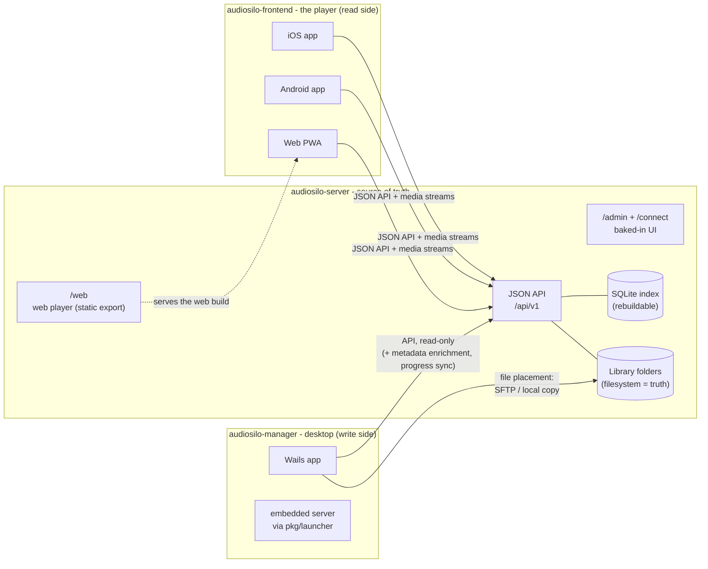

AudioSilo is a self-hosted audiobook platform built as **one product across three
repositories**. The server owns the data and the HTTP/JSON contract; the player is
a thin, fully-typed read side over that contract; the manager is the desktop
write/management side. Everything else in these docs hangs off that split.

| Repo | Role | Stack |
|---|---|---|
| `audiosilo-server` | The **server** - source of truth for content and the API. JSON API + baked-in admin/connect UI; serves the web player at `/web`. Safe to expose to the internet. | Go 1.25, SQLite (modernc, pure Go), FTS5 |
| `audiosilo-frontend` | The **player** - one codebase shipping to web PWA + iOS + Android. Read side of the product; its web export is served *by* the server at `/web`. | Expo SDK 56, React Native 0.85 (new architecture), React 19, Expo Router, NativeWind v4 |
| `audiosilo-manager` | The desktop **manager** - the write/management side: set up or connect to servers, organize and transfer books (SFTP or local copy), back up an owned Audible library. Consumes the server API read-only. | Wails v2 (Go 1.25 + React/Vite/TypeScript) |

The three code repos (plus this docs site) live side by side in a single
workspace folder (`~/dev/audiosilo`), whose root is itself the small
`audiosilo-workspace` meta repo holding the cross-repo glue (the integration
contract, code-health checklist, release runbooks); see
[the workspace guide](contributing/workspace.md) for how to check everything
out and work across the repos.

## Architecture

Three structural facts to internalize before reading anything else:

- **The server is the only writer of the API contract.** The frontend (and the
  manager's `internal/serverapi`) mirror its JSON shapes **by hand** - there is no
  codegen, so a wire change is always a multi-repo change. See
  [Cross-repo contract](architecture/cross-repo-contract.md).
- **The filesystem is the source of truth; the database is a rebuildable index.**
  Content is addressed by `(library_id, rel_path)`, never by a database id. See
  [Invariants](architecture/invariants.md).
- **The manager never writes content over the network.** All file writes happen
  client-side (SFTP or a local/mounted copy); the server stays read-only for
  content over the wire. For the local-server flow, the manager runs the server
  *in-process* via the server's public `pkg/launcher`.

## The data flows

**Streaming.** The player fetches a book's chapters
(`GET /libraries/{id}/chapters?path=` → `{chapters, files, duration}`), then
streams individual **audio files** - never a folder/book path - with HTTP Range
requests (`GET /libraries/{id}/stream?path=`). Media auth rides as a `?token=`
query param because browsers can't set headers on ``/`<audio>`. A transcode
fallback exists (`?transcode=1`, ffmpeg → MP3, gated by the `transcode`
capability); automatic transcode negotiation in the web player is **planned**, not
yet wired.

**Progress sync.** The player saves position every 15 seconds while playing (and
on pause/seek/rate/stop), path-keyed, via `PUT /libraries/{id}/progress?path=`.
The server reconciles last-write-wins by `updated_at` (`catalog.SaveProgress`);
the client keeps an offline replay queue (`src/playback/progress-sync.ts`).
Realtime WebSocket sync is **planned** (Phase C remainder) - the `websocket`
capability flag is already reserved for it.

**Pairing.** An admin mints an invite code; the code rides a URL **fragment**
(`/connect#code=…`) so it never reaches server logs. The connect page redeems it
(`POST /auth/redeem` → a pairing token that inherits the invite's uses/expiry)
and offers two carriers: an HTTPS `web_url` (QR / Universal Links) and an
`audiosilo://connect?...` custom-scheme deep link. The app or web player
exchanges the pairing token for a device-scoped session (`POST /auth/exchange`),
claiming one invite use per device - so each device being set up can scan the
same QR.

**File placement.** The manager places files itself - over SFTP or into a
local/mounted copy of the library - then asks the server for a non-destructive
reindex (`POST /admin/libraries/{id}/scan`). Its server-side writes are
path-keyed metadata enrichment (`PUT /admin/libraries/{id}/enrichment?path=`,
ASIN/ISBN) and, for the Audible listening-position sync, per-user progress
(`PUT /libraries/{id}/progress?path=`) - the same progress call the player
makes. Neither touches a file. A server-side `POST /uploads` endpoint is
**planned** (Phase B), not shipped.

## Design priorities

The server's priorities, in order - when they conflict, the earlier one wins:

1. **Safe to expose to the internet.** Secure defaults, no default passwords,
   hashed secrets, app-layer hardening, configurable TLS. Inexperienced users will
   port-forward this.
2. **Fast regardless of library size.** FTS5 search + keyset pagination; never
   OFFSET on large tables.
3. **No-wait first connection.** The filesystem view (`/fs`) needs no indexing -
   a fresh server is browsable and playable immediately, with the index catching
   up in the background.
4. **Portable.** The filesystem is the source of truth; the database is a
   rebuildable index/cache. Delete the DB and nothing of value is lost.

## How these docs are organized

- **[Architecture](architecture/invariants.md)** - start here. The
  [invariants](architecture/invariants.md) every change must preserve, the
  [cross-repo contract](architecture/cross-repo-contract.md) (every seam between
  the repos), and the [release pipeline](architecture/release-pipeline.md).
- **[Server](server/overview.md)** - package layout, [data model](server/data-model.md),
  [auth and security](server/auth-and-security.md), the [scanner](server/scanner.md),
  [media serving](server/media.md), the [baked-in web UI](server/web-ui.md),
  [configuration](server/configuration.md), and the [HTTP API](server/api/index.md).
- **[Player app](frontend/overview.md)** - the Expo codebase:
  [playback](frontend/playback.md) (the fiddly part),
  [offline downloads](frontend/offline.md), [state and data](frontend/state-and-data.md),
  [i18n](frontend/i18n.md), [testing](frontend/testing.md).
- **[Desktop manager](manager/overview.md)** - the Wails app:
  [server integration](manager/server-integration.md), the
  [Audible backup pipeline](manager/audible.md), and [transfers](manager/transfers.md).
- **[Contributing](contributing/workspace.md)** - the
  [workspace setup](contributing/workspace.md), [per-repo gates and CI](contributing/gates-and-ci.md),
  [how to land a cross-repo change](contributing/cross-repo-changes.md),
  [cutting a release](contributing/releasing.md), and
  [writing these docs](contributing/documentation.md).

If you just want to *run* AudioSilo rather than hack on it, the
[user guide](/users/getting-started/first-run) covers installation and everyday use.

:::info The normative contract lives in the workspace
`~/dev/audiosilo/CROSS-REPO.md` (checked into the workspace root, alongside
`CLAUDE.md` and `CODE-HEALTH.md`) is the **normative** integration contract
between the repos. These docs are a readable tour of the same material - when a
seam changes, CROSS-REPO.md is updated first and these pages follow.
:::

## Where to start

- "I want to add or change an API endpoint" →
  [Cross-repo contract](architecture/cross-repo-contract.md), then
  [cross-repo changes](contributing/cross-repo-changes.md).
- "I want to understand why the code is shaped this way" →
  [Invariants](architecture/invariants.md).
- "Something won't play / wrong Content-Type / scope leak / scanner issue" →
  the [server docs](server/overview.md).
- "UI looks wrong / navigation / timeline math / offline" →
  the [frontend docs](frontend/overview.md).
- "Pairing, media auth, a new wire field, transcode" → **both repos**; read the
  [contract](architecture/cross-repo-contract.md) before starting.
