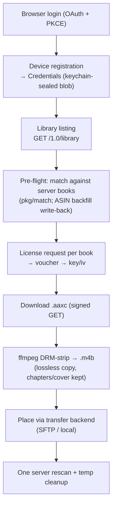

## What this is (and the ownership constraint)

`internal/audible` is a **native Go Audible client** — the same capability class
as Libation, OpenAudible, or `audible-cli` — that backs up audiobooks **the user's
own account owns**. Every step operates strictly within that account's access: the
user signs in through Amazon's own OAuth flow, the app registers as a device on
*their* account, and the per-book decryption key comes from Audible's own license
endpoint for that device. Nothing here bypasses access control; it converts books
the user already has the right to download into a DRM-free `.m4b` for their own
self-hosted server. Credentials (full Amazon account tokens plus the device RSA
key) are stored only via the OS keychain; **a book's decryption key is never
persisted**.

The package plugs into the shared import pipeline as a `source.Source` +
`source.Acquirer` (`audible.Source` in `source.go`), so placement, transfer,
skip-if-already-on-server, and rescan are identical to folder/drag-drop imports
(see [Transfers](transfers.md)).

Everything is scoped **per (server, library)** — different libraries can be backed
by different Audible accounts. Credentials key on
`registry.AudibleKey(serverID, libraryID)`; a one-time migration in
`AudibleService.scopedCreds` adopts a pre-scoping `audible:default` login into the
first library opened (mutex-guarded so two libraries can't both adopt it).

## Stage 1 — account auth and device registration

Login is a two-phase browser flow (`AudibleService.BeginLogin` /
`CompleteLogin`), because Amazon's sign-in (with captcha/2FA) can only happen in a
real browser:

1. **Authorize** (`login.go`): `BeginLogin` generates a fresh RFC 7636 PKCE pair
   (`NewPKCE`, S256) and a random device serial (`NewDeviceSerial`), then builds
   the Amazon OAuth URL (`BuildAuthorizeURL`) with
   `openid.oa2.client_id = device:<hex(serial#deviceType)>` and scope
   `device_auth_access` for the chosen marketplace (11 storefronts in
   `marketplace.go`; the user picks at login). The user signs in in their browser
   and lands on `…/ap/maplanding?...&openid.oa2.authorization_code=...` — they
   paste that redirect URL back into the app, and `ParseAuthCode` extracts the
   code.
2. **Register** (`register.go`): `Register` POSTs to
   `https://api.amazon.<tld>/auth/register` (the Amazon identity API, *not* the
   Audible domain), exchanging the code + PKCE verifier for durable device
   credentials. It registers as the Audible-for-iPhone device type
   (`A2CZJZGLK2JJVM`) — the same profile the reference clients
   (mkb79/audible, AudibleApi) use — with a `%DUPE_STRATEGY_1ST%` device-name
   macro so re-registration never collides server-side.

The result is a `Credentials` struct (`credentials.go`): `AccessToken` (~60 min)
and `RefreshToken` (durable), the durable `ADPToken`, the **device RSA private
key** (PEM; PKCS#1 or PKCS#8), device type/serial, customer id, and marketplace.
This is full account access, so it is stored via `registry.BlobStore` — an
AES-256-GCM-sealed 0600 file whose data key lives in the OS keychain (the blob is
too large for keychain item limits).

**Request signing** (`sign.go`): all Audible "unrestricted" endpoints (library,
license, annotations) are authenticated by an RSA-SHA256 (PKCS#1 v1.5) signature
over `METHOD\npath?query\ndate\nbody\nadp_token`, sent as `x-adp-token` /
`x-adp-signature` headers (`signRequest`, driven by `Client.doSigned`). A signed
request needs no bearer token — which is why no access-token refresh flow is
implemented: none of the endpoints the manager calls need one (the
`AccessToken`/`RefreshToken` fields are stored for completeness).

## Stage 2 — library listing

`Client.Library` (`library.go`) pages `GET /1.0/library` (signed) with
`response_groups=contributors,series,product_desc,product_attrs`, 1000 items per
page, and maps each item to a `source.Record`: first author and narrator, series
title + parsed sequence (only a clean single number counts — "1-3" leaves the book
unsequenced), release year, ASIN as the dedup `Key`, and a sanitized
`"<Title>.m4b"` destination filename. `SrcPath` stays empty — bytes are fetched
on demand at import time.

## Stage 3 — pre-flight and matching

Before anything downloads, `AudibleService.Preflight` cross-references the whole
Audible library against the destination server library:

- It fetches the server library's books **once in bulk**
  (`serverapi.Client.ListBooks`, up to 5000) and hands them to
  `importjob.Plan` with `SkipExistsCheck` + `Books` set, so both sibling
  detection and existence matching run **locally** — per-book server queries
  trip the server's rate limiter (HTTP 429) on a large library.
- Matching uses `importjob.BookMatcher` over the server's shared **`pkg/match`**
  (`Best`: ASIN first, then author + series + series-stripped title-token
  overlap; see [Server integration](server-integration.md#shared-matching-pkgmatch)),
  so the manager identifies books exactly the way the server would.
- Each book gets an `AudiblePreflightView`: `existsOnServer`, the matched server
  path, and the destination path an import would use — the UI splits "already on
  server" from "to import" and shows destinations up front.
- **ASIN enrichment write-back**: when a fuzzy match finds a server book that has
  no ASIN while the Audible record does, the pair is queued and
  `backfillASINs` writes them via `serverapi.Client.SetEnrichment`
  (`PUT /admin/libraries/{id}/enrichment?path=`) — best-effort, in the
  background, emitting `audible:backfill` when done. The server stores this as a
  durable path-keyed row and modifies no file, so the read-only model holds;
  the next pre-flight then matches those books by exact ASIN.
- **Manual override**: when the automatic match is wrong or missing, the
  `ServerMatchPicker` component lets the user browse the destination library's
  server-side folder tree (`LibrariesService.Browse` → `GET /libraries/{id}/fs`)
  and pick the corresponding book. Overrides are an ASIN → server-path map held
  in the Audible view and fed into the stats sync.

## Stage 4 — license, download, and DRM removal

At import time, `audible.Source.Acquire` fetches one book to a local temp `.m4b`:

1. **License + voucher** (`license.go`, `voucher.go`):
   `Client.License` POSTs a signed
   `/1.0/content/{asin}/licenserequest` (`supported_drm_types: [Mpeg, Adrm]`,
   quality High) and receives a presigned `offline_url` plus a base64
   `license_response` voucher. `DecryptVoucher` unwraps it with AES-128-CBC using
   a **derived** key/iv — `SHA256(deviceType + deviceSerial + customerID + asin)`,
   first 16 bytes key, next 16 iv — and extracts the JSON `{key, iv}`: the
   per-book ffmpeg decryption parameters. (The device RSA key signs the request;
   the voucher unwrap itself is derived, not RSA.)
2. **Download** (`download.go`): the content URL is fetched with a **signed** GET
   (Audible's CDS validates the same device signature; an unsigned request gets
   403), re-signing on each redirect, with the Audible iOS `User-Agent`. A
   dedicated client with no overall timeout streams the `.aaxc` into the temp dir
   (`<appdir>/audible-tmp/audible-*/<ASIN>.aaxc`), reporting throttled byte
   progress; cancellation is context-driven, and a failed download removes the
   partial file.
3. **DRM strip** (`decrypt.go`): ffmpeg decrypts the AAXC to a plain `.m4b` with
   `-audible_key <key> -audible_iv <iv>` **before** `-i` (input options;
   requires ffmpeg ≥ 4.4), then a **lossless remux**:
   `-map 0:a -map 0:v? -map_metadata 0 -c copy -movflags +faststart`. Audio is
   copied bit-for-bit; **chapters, global metadata, and the embedded cover are
   preserved**; data/timed-text streams are deliberately *not* mapped because the
   `ipod` (m4b) muxer can't write them and their presence failed the whole
   conversion. The encrypted `.aaxc` is deleted the moment decryption succeeds;
   the `.m4b` (and its temp dir) is removed by the cleanup callback once the
   transfer has copied it. `resolveFFmpeg` in `internal/services/audible.go`
   looks on `$PATH` and then common macOS install locations (a GUI-launched app
   inherits launchd's stripped `PATH`), and `ImportSelected` fails fast with an
   actionable message when ffmpeg is missing.

:::note Legacy AAX / activation bytes
`decrypt.go` also contains `aaxArgs` for legacy `.aax` files decrypted with the
account-wide 8-hex activation bytes (`-activation_bytes`), and `Credentials`
reserves an `ActivationBytes` field — but **nothing calls this path today**. The
implemented pipeline requests `Adrm` licenses and handles **AAXC with per-book
voucher keys only**; there is no activation-bytes extraction flow.
:::

## Stage 5 — import through the shared pipeline

`AudibleService.ImportSelected(serverID, libraryID, asins, templateMode, template)`
runs the same orchestrator as any other import:

- re-lists the library, filters to the selected ASINs, plans placements with the
  bulk-fetched server book list (naming via `match.CleanTitle` + the placement
  engine — see [Transfers](transfers.md#placement-where-the-destination-path-comes-from));
- opens the server's configured transfer backend (SFTP or local) against the
  library's transfer root;
- calls `importjob.Run` with `Acquirer: audible.NewSource(...)`, so each item is
  acquired (download → decrypt) **just-in-time**, placed, and its temp cleaned —
  one book's staging exists at a time;
- items already on the server are skipped; a single rescan runs at the end.

Progress streams to the UI as `import:progress` events with per-item statuses
`downloading` (with byte %), `decrypting` ("Removing DRM…" — ffmpeg reports no
byte progress), `transferring`, `placed`, `skipped`, `error`; the slow pre-item
phases emit coarse `import:status` lines so the UI never looks stalled.

## Errors and re-run behavior

- **Per-item isolation**: an item's failure (license, download, ffmpeg, or
  transfer) records an `error` result and the run continues with the next book.
- **No partial resume**: there is no byte-level download resume; a failed
  download's partial file is deleted and the book is simply retried on the next
  run.
- **Re-runs are cheap and safe**: the pre-flight re-match skips everything now on
  the server, and `transfer.Place` is idempotent (a destination already at the
  source's size is `AlreadyPresent`, no copy) — so re-running an interrupted
  backup only does the remaining work.
- `internal/state` (the CLI-era resumable outcome store) is **not** wired into
  this pipeline; the properties above replace it.

## Stats sync (listening positions)

Beyond files, the Audible view can reconcile **listening positions** between
Audible and the server (`PlanStatsSync` / `ApplyStatsSync`):

- Audible positions come from the signed annotations endpoint
  (`Client.LastPositions`, `GET /1.0/annotations/lastpositions`, tolerant of
  number-or-string `position_ms`); server positions from one
  `GET /me/progress` call. Books pair via the shared matcher plus any manual
  overrides.
- Direction is **furthest-wins** with a 5-second threshold (`syncDirection`):
  `to-server`, `to-audible`, `in-sync`, or `no-match`.
- **Audible → server** writes reuse the player's own progress endpoint
  (`PutProgress`), preserving the row's duration/finished/playback-speed and
  bumping the version so last-write-wins accepts it — and re-check the fresh
  server position so a user who listened between plan and apply isn't rewound.
- **Server → Audible** writes are opt-in (`allowAudibleWrite`, confirmed
  separately in the UI): each needs an ACR (`Client.ContentACR`, read from a
  license request — the only documented source) and then
  `Client.SetLastPosition` (`PUT /1.0/lastpositions/{asin}`), best-effort per
  book.
- The last sync time per library persists in `stats-sync.json`
  (`registry.SyncStatusStore`).

## What is verified how

The crypto, protocol-parsing, matching, and orchestration layers are unit-tested
(voucher vectors, signing, register/library/license parsing against `httptest`
servers, pre-flight/import against fakes). The **interactive login and live
download/decrypt cannot be tested in CI** — they need a real Audible account —
and are verified manually. The Audible catalog/annotations APIs are unofficial:
parsers stay defensive (missing fields tolerated; one bad product never fails a
sweep), and endpoint behavior can drift.

The same per-library Audible account also powers **series-gap detection and the
opt-in series watch** (`internal/seriesgap`, `SeriesService`,
`audible.SeriesMembers` over the catalog "same series" sims endpoint) — related
machinery, but outside the backup pipeline documented here.
