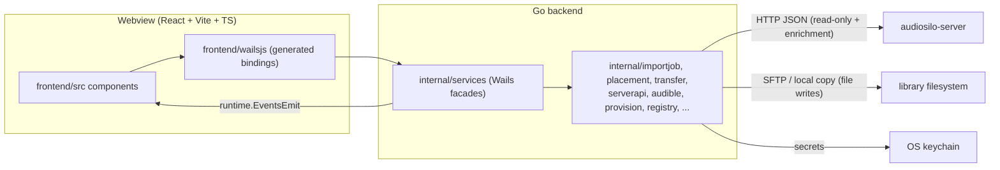

## What the manager is

`audiosilo-manager` is the **write/management side** of AudioSilo: a cross-platform
desktop app that sets up, connects to, and manages content for one or more
audiosilo-server instances. The load-bearing principle is that **the server stays
read-only over the network** - every file write happens client-side from this app,
over SFTP or a local/mounted copy (see [Transfers](transfers.md)), and the server's
HTTP API is consumed read-only for content, plus one non-destructive metadata write
(see [Server integration](server-integration.md)).

Architecturally it is a **Wails v2** app: a Go backend whose exported service
methods are *bound* into a native webview running a React frontend. Wails generates
TypeScript bindings for every bound Go method, so the frontend calls
`AddExistingServer(...)` or `StartImport(...)` as ordinary async functions, and the
backend streams progress back over the Wails event bus.



:::info Distribution status
Native installers are **planned, not shipped**. A release workflow
(`.github/workflows/desktop.yml`) builds per-OS artifacts via `wails build` on
tagged releases, but code-signing/notarization is stubbed pending Apple Developer
ID and Windows Authenticode certificates - until then builds are unsigned. See
[Releasing](../contributing/releasing.md).
:::

## Repository layout

The Go side follows the same rule as the server repo: the transport layer is
logic-free, and business logic lives in `internal/*` packages that are
unit-testable without Wails.

```
main.go, app.go          Wails entrypoint + App lifecycle shell; services bound here
wails.json               Wails project config (frontend install/build/dev commands)
build/{darwin,windows}   packaging assets (Info.plist, icons, NSIS)
frontend/                React + Vite + TypeScript webview app
internal/
  services/    transport-only Wails facades - marshal JSON-able DTOs, emit events
  serverapi/   hand-mirrored, read-only HTTP client for audiosilo-server
  registry/    persisted state: server registry, app settings, series-watch and
               sync-status stores, OS-keychain Secrets, encrypted BlobStore
  importjob/   orchestration: plan placements → transfer → single rescan; the
               shared BookMatcher over the server's pkg/match
  placement/   destination naming: Auto sibling-anchored mode + the path-template
               engine (template.go)
  transfer/    the Transfer interface + Local and SFTP backends + SafeJoin
  source/      import sources (Source/Acquirer interfaces): folder walk, drag-drop
               records, ffprobe tag probing; source/openaudible (books.json reader)
  audible/     native Audible client: OAuth+PKCE login, device registration,
               RSA-signed API, library, license/voucher, download, ffmpeg DRM-strip
  seriesgap/   missing-books-in-a-series detection (pure, injected enumeration)
  provision/   create-a-server: in-process local server (server pkg/launcher),
               Cloudflare quick tunnel, guided VPS (Hetzner) + SSH/Docker deploy,
               in-place container stack updates
  audio/       recognized audio extensions (mirrors the server's list)
  progress/    throttled byte-progress Reader/Writer wrappers
  state/       resumable per-book import state (JSON) - absorbed from the old CLI
  update/      GitHub-Releases update check (never self-applies)
```

Dependency direction (enforced by convention, mirrored from the server's
"api is transport-only" rule):
`services → importjob → {source, serverapi, placement, transfer, registry, audible}`
and `provision → {serverapi, registry, launcher(server)}`. Nothing under
`internal/services` contains business logic.

:::note Absorbed-but-unwired packages
`internal/state` (resumable import outcomes) and `internal/source/openaudible`
(OpenAudible `books.json` metadata recovery) were absorbed from the former
`audiosilo-audible` CLI and compile with tests, but are **not currently imported by
any Wails flow** - the desktop pipeline gets its re-run safety from idempotent
placement and the skip-if-on-server check instead (see
[Transfers](transfers.md)).
:::

## App lifecycle

`main.go` is the composition root:

1. Creates the shared `services.Emitter` (events are no-ops until it gets the
   runtime context).
2. Opens the server registry at `registry.DefaultPath()`
   (`<UserConfigDir>/audiosilo-manager/registry.json`).
3. Wires `services.Deps{Registry, Secrets: registry.Keyring{}, Events}` into the
   facades: `ConnectionsService`, `LibrariesService`, `ImportService`,
   `TransferService`, `ProvisionService`, `AudibleService`, `UpdateService`,
   `SettingsService`, `SeriesService`.
4. Calls `wails.Run` with the frontend embedded via `//go:embed all:frontend/dist`,
   `DragAndDrop.EnableFileDrop`, and the full `Bind:` list - binding is what
   generates the TypeScript API under `frontend/wailsjs/`.

The `App` struct in `app.go` owns only the lifecycle: `startup` captures the Wails
context, hands it to the emitter, forwards OS file drops to the frontend as
`files:dropped` (a list of absolute paths the import screen turns into records),
and starts the periodic series-watch loop; `shutdown` stops that loop. All
user-facing API lives on the bound services, not on `App`.

The build version is injected at release with
`-ldflags "-X main.version=v1.2.3"` (`"dev"` locally); `UpdateService.Check`
compares it against the latest GitHub release and the frontend shows a download
banner - the manager never self-updates.

## Bound services and events

| Service | Responsibility |
|---|---|
| `ConnectionsService` | add/pair/remove servers, probe capabilities, edit config, deployment spec, server update info |
| `LibrariesService` | refresh library list, browse a library's `/fs` tree, find series siblings, per-library config (transfer root, template) |
| `ImportService` | folder/drag-drop discovery, template preview, plan, run transfers |
| `TransferService` | transfer backend settings, SSH probe + host-key trust, remote folder picker |
| `ProvisionService` | create/start/stop in-process local servers, Cloudflare tunnel, VPS/SSH deploys, in-place stack updates |
| `AudibleService` | Audible login, library listing, pre-flight, backup import, stats sync |
| `SeriesService` | series-gap computation + the opt-in periodic watch |
| `SettingsService` | app-wide preferences (default SSH key path/user) |
| `UpdateService` | manager update check |

Long-running jobs return promptly and stream progress with `runtime.EventsEmit`
via the shared `Emitter`; the React side subscribes with `EventsOn`. Events in use:
`import:progress`, `import:status`, `files:dropped`, `series:update`,
`series:progress`, `deploy:log`, `audible:status`, `audible:backfill`.

## Where state persists

Non-secret state is plain JSON under the per-user config dir
(`os.UserConfigDir()/audiosilo-manager/`, e.g. `~/Library/Application Support/audiosilo-manager`
on macOS), always saved atomically (temp file + rename). **Secrets live only in
the OS keychain** - never in the JSON files, and tests assert it.

| Location | Contents |
|---|---|
| `registry.json` | known servers + libraries, transfer config (SSH host/port/user/key *path* only), trusted host-key fingerprint, deployment specs, local-server config (`internal/registry` `Store`) |
| `settings.json` | app-wide prefs: default SSH key path/user (`SettingsStore`) |
| `series-watch.json` | watched-series ASIN snapshots (`SeriesWatchStore`) |
| `stats-sync.json` | last Audible stats-sync time per library (`SyncStatusStore`) |
| `secrets/*.enc` | AES-256-GCM-sealed large secrets (Audible credentials), data key in the keychain (`BlobStore`) |
| `audible-tmp/` | per-book staging dirs during an Audible backup (removed after transfer) |
| `local-servers/<id>/` | data dir of each embedded local server |
| `tools/` | cached `cloudflared` download |

OS keychain (service `audiosilo-manager`, via `github.com/zalando/go-keyring` -
macOS Keychain / Windows Credential Manager / libsecret):

| Key | Secret |
|---|---|
| `token:<serverID>` | the server **session token** obtained by pairing |
| `sshpw:<serverID>` | SSH password |
| `sshpass:<serverID>` | SSH key passphrase |
| `blobkey:audible:<serverID>:<libraryID>` | data key for the Audible credential blob |

Audible credentials are the one secret too large for keychain item limits (an RSA
device key PEM plus tokens), hence the `BlobStore` envelope scheme: the bulk is a
0600 ciphertext file on disk, unreadable without the tiny keychain-held key. See
[Audible](audible.md) for what those credentials contain.

## Frontend stack

`frontend/` is a deliberately plain **React 18 + Vite 5 + TypeScript** app - no
router, no state library, no CSS framework:

- **Bindings**: `frontend/wailsjs/` is **generated** by Wails from the bound Go
  services (`go/services/*.d.ts`, `go/models.ts`, `runtime/`). Never edit it; it
  regenerates on `wails dev`/`wails build`. DTO field names are camelCase on the Go
  structs' JSON tags specifically for these bindings.
- **Structure**: `src/App.tsx` is the shell (server sidebar + detail pane, modals);
  `src/components/` holds one component per screen/modal (`AddServerForm`,
  `ServerDetail`, `ImportView`, `AudibleView`, `TransferSettings`,
  `LibraryBrowser`, `ServerMatchPicker`, deploy forms, …); `src/hooks/` and
  `src/lib/` hold the few pure helpers (`errors.ts`, `fspath.ts`,
  `series-badges.ts`) which carry co-located vitest tests.
- **Styling**: a single hand-written stylesheet, `src/style.css`, using CSS custom
  properties - dark-first, pink `--primary: #db2777`, Roboto - matching the design
  tokens of the server's admin console and the player. Components use plain
  `className`s (`btn`, `modal`, `grid`, …).
- **Testing**: vitest + Testing Library (jsdom), gated in CI alongside
  `tsc --noEmit`, ESLint (flat config) and `prettier --check`.

## Dev workflow

Requires **Go 1.25**, **Node 24**, and the Wails CLI
(`go install github.com/wailsapp/wails/v2/cmd/wails@latest`), plus a **sibling
checkout of `audiosilo-server`** - the manager compiles the server in via a
`replace ../audiosilo-server` directive (see
[Server integration](server-integration.md#the-gomod-replace-coupling)).

```sh
wails dev              # hot-reload dev (Go backend + Vite frontend)
wails build            # production .app/.exe/binary into build/bin/
```

The full gate before any change is done (both toolchains, matching CI):

```sh
go build ./... && go vet ./... && go test -race ./... && golangci-lint run
cd frontend && npx tsc --noEmit && npm run lint && npm run format && npm test
```

See [Gates and CI](../contributing/gates-and-ci.md) for the CI setup and
[Workspace](../contributing/workspace.md) for the multi-repo layout this depends
on.
