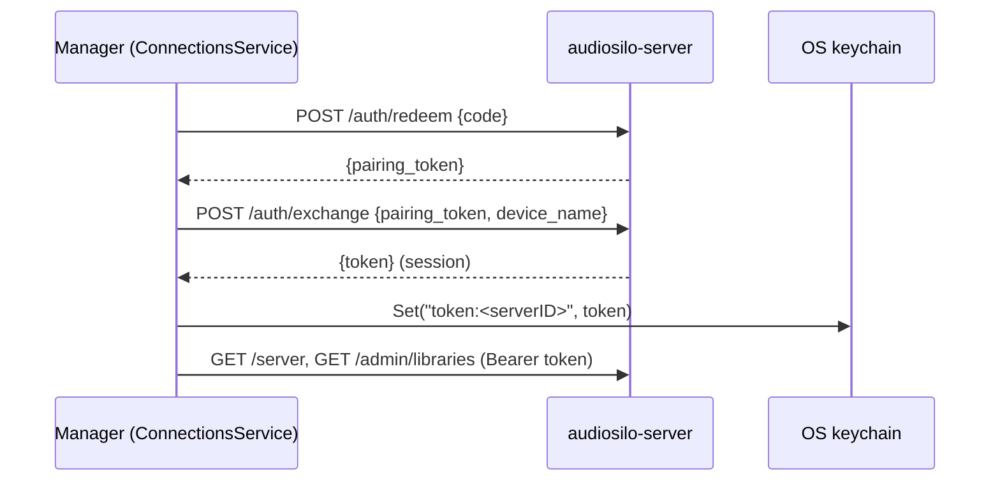

## The seam at a glance

The manager consumes the server's HTTP API **read-only for content**. All *file*
writes happen client-side — over SFTP or a local/mounted copy
([Transfers](transfers.md)) — so nothing destructive is ever exposed on the
server's internet-facing API. The manager makes exactly two kinds of server-side
writes, both non-destructive:

- **metadata enrichment** (`PUT .../enrichment` — a durable, path-keyed row;
  touches no file), and
- **per-user progress** (`PUT .../progress` — the same write the player makes,
  used by the Audible stats sync).

Plus a **rescan trigger** (`POST .../scan`), which only re-indexes what is already
on disk. Do not add server write endpoints for the manager; this is the
"read-only server, write-side client" invariant (see
[Invariants](../architecture/invariants.md)).

## `internal/serverapi`: the hand-mirrored client

There is **no codegen** anywhere in the workspace: like the player frontend, the
manager hand-mirrors the server's JSON envelopes. `internal/serverapi` is a thin
`http.Client` wrapper (`Client` in `client.go`) covering exactly what the manager
needs:

| Method | Endpoint | Used for |
|---|---|---|
| `ServerInfo` | `GET /api/v1/server` | reachability probe + capability/version flags (public, no auth) |
| `Authenticate` | `POST /api/v1/auth/redeem` → `POST /api/v1/auth/exchange` | pairing an auth code into a session token |
| `Libraries` | `GET /api/v1/admin/libraries` | library names + roots (the roots the importer writes into) |
| `BrowseFS` | `GET /api/v1/libraries/{id}/fs` | filesystem browse (audio + dirs, book annotations) — the library browser and the manual match picker |
| `ListBooks` | `GET /api/v1/libraries/{id}/books` | series-sibling detection + bulk matching (follows `next_cursor`) |
| `Search` | `GET /api/v1/search` | per-book existence check on the non-bulk path |
| `Item` | `GET /api/v1/libraries/{id}/item?path=` | look up one indexed book (404 → `found=false`, not an error) |
| `ListMyProgress` | `GET /api/v1/me/progress` | Audible stats sync (all rows in one call) |
| `PutProgress` | `PUT /api/v1/libraries/{id}/progress?path=` | Audible → server position write (per-user, last-write-wins) |
| `SetEnrichment` | `PUT /api/v1/admin/libraries/{id}/enrichment?path=` | ASIN/ISBN write-back (see below) |
| `Scan` / `ScanStatus` / `WaitForScan` | `POST`/`GET /api/v1/admin/libraries/{id}/scan` | post-placement reindex + polling |

Everything is addressed by `(library_id, rel_path)` via `?path=` — **path is the
identity**, never a DB book id, exactly as in the rest of the product (see
[Cross-repo contract](../architecture/cross-repo-contract.md)).

Client behaviors worth knowing before you touch it:

- **Cursor-following `ListBooks`.** The server's list endpoint is
  keyset-paginated and clamps a single-page `limit` above 200 down to 50, so
  `ListBooks` pages through `next_cursor` until it accumulates `limit` books —
  without this a large library silently returned only the first 50.
- **429 backoff.** A bulk pager can outrun the server's per-IP token bucket, so
  `doStatus` retries HTTP 429 with capped exponential backoff — but only for
  **GET and PUT** (`retriableMethod`); auth POSTs are lockout-gated on the server
  and are never replayed.
- **Self-signed TLS.** `New(baseURL, insecure)` accepts the server's self-signed
  cert when the registry entry says so (`tls.mode: selfsigned` LAN deployments).
- Errors surface the server's `{"error": "..."}` message with the status code.

### The one enrichment write

`Client.SetEnrichment` PUTs `{asin, isbn}` to
`/api/v1/admin/libraries/{id}/enrichment?path=`. This is deliberately
**non-destructive**: the server stores it as a durable, path-keyed
`book_enrichment` row — not foreign-keyed to the rebuildable index, re-applied on
every rescan — and **modifies no file on disk**, so the read-only-content model
holds. A blank field leaves the existing value untouched.

The manager writes it in one place: after an Audible pre-flight, when a fuzzy
match finds a server book that lacks an ASIN the Audible record has,
`AudibleService.backfillASINs` writes the ASINs back **best-effort in the
background** — future matches then hit the exact-ASIN path instead of the fuzzy
matcher. A failed write is simply retried by the next pre-flight. See
[Audible](audible.md#stage-3--pre-flight-and-matching).

### The wire-mirroring rule applies here too

Changing any server JSON shape the manager reads means changing the Go handler
**and** `internal/serverapi` (plus tests on both sides) in one logical change —
the same rule as the player's `types.ts`/`client.ts`. The manager introduces no
new server wire format. See
[Cross-repo changes](../contributing/cross-repo-changes.md).

## Pairing and auth

The manager authenticates like any other client — through the server's auth-code
pairing flow — but as an **admin** user, since it needs `/admin/*` (library roots,
scan, enrichment):



`ConnectionsService.AddExistingServer` runs `Authenticate`, stores the session
token in the keychain under `registry.TokenKey(serverID)` (never in
`registry.json`), reads `/server` capabilities, and best-effort fetches the
library list (a non-admin code still connects; libraries populate later).
`PairAdmin` re-runs the same exchange for an already-known server — the recovery
path when a token was revoked or the server was freshly set up.
`Deps.authedClient` is the one helper every facade uses to build a
`serverapi.Client` with the keychain token attached. `TestConnection` probes the
public `/server` endpoint so it works even with a revoked token, reporting
`Online: false` rather than an error.

## In-process embedding via the server's `pkg/launcher`

The "create a local server" flow runs a real audiosilo-server **inside the
manager process**, using the server's public `pkg/launcher` (`Run`/`Options`) —
promoted out of the server's internals precisely for this. Because it is the same
run loop the headless `audiosilo` binary uses, the embedded server behaves
identically to a standalone one.

`internal/provision.LocalServer.Start` calls `launcher.Run` with:

| `launcher.Options` field | What the manager sets |
|---|---|
| `DataDir` | `<appdir>/local-servers/<id>` (config/db/certs per local server) |
| `Setup` | `true` — first-run uses the browser **setup wizard** at `/setup` instead of the printed-credentials banner |
| `Bind` | `127.0.0.1:<free port>` (loopback only; `provision.FreePort`) |
| `TLSMode` | `"off"` — a Cloudflare quick tunnel terminates HTTPS in front when enabled |
| `PublicURL` | the tunnel URL (or the loopback URL), so pairing payloads carry a reachable base |
| `Libraries` | one library `{Name, Root}` pointing at the chosen books folder |
| `OnURL` | captures the URL the server reports at startup |

`OnURL` is the wizard hook: while first-run setup is pending the server reports
the token-carrying `/setup#token=…` URL (the token rides in the fragment, never
logged), and `ProvisionService.launch` waits briefly for it so the UI can open a
browser straight into the wizard. Stopping cancels the run-loop context and waits
for graceful shutdown; the registry entry (`kind: "local"`, `LocalConfig`)
persists so the server can be restarted later.

## The `go.mod` replace coupling

The manager depends on the server **module** — for `pkg/launcher` and `pkg/match`
— via a local directive in `go.mod`:

```go
require github.com/kodestar/audiosilo-server v0.0.0-00010101000000-000000000000

replace github.com/kodestar/audiosilo-server => ../audiosilo-server
```

Consequences:

- **A sibling checkout is mandatory.** `go build`/`wails build` fail without
  `../audiosilo-server` next to the manager checkout. CI does exactly this: the
  manager workflow checks out `KodeStar/audiosilo-server@main` into a sibling
  `audiosilo-server/` path before building (see `.github/workflows/ci.yml` and
  [Gates and CI](../contributing/gates-and-ci.md)).
- **Stale-checkout failure mode.** The build compiles against whatever the
  sibling checkout contains. If your local server checkout predates a symbol the
  manager uses (e.g. `pkg/launcher` `Options` fields or a `pkg/match` export), the
  manager fails to compile with confusing "undefined" errors — `git pull` the
  server repo first. Conversely, a server-side change to these public packages
  must keep the manager compiling; build both repos before calling it done.

## Shared matching: `pkg/match`

Identifying whether two records are the *same audiobook* — across the wildly
inconsistent ways titles are stored — lives in the server's public `pkg/match`,
so the manager and the server can never drift apart on identity. Where the
manager uses each entry point:

- **`match.Best`** — the scoring matcher (ASIN → author + series +
  series-stripped title-token overlap, sequence-boosted). Wrapped by
  `importjob.BookMatcher` (converts a fetched book list once, so matching a whole
  Audible library is O(library)), it drives: the plan-time *exists-on-server*
  check, the Audible pre-flight, the stats-sync book pairing, and the series-gap
  "already on the server" cross-check (`internal/seriesgap`).
- **`match.CleanTitle`** — strips the series name and "(Book N)"/"(Unabridged)"
  fluff. Used in `importjob.Plan` to name destination folders/files by the clean
  book title, and in `ImportService.PreviewTemplate` so the live template preview
  renders exactly what an import would write.
- **`match.Normalize` / `match.NormalizeSeries`** — tolerant normalization
  (spacing/punctuation, leading articles). Used by `importjob.FindSiblings` /
  `SiblingsFromBooks` (series-sibling detection: the server's series filter is
  exact, so the manager fetches the author and matches the series tolerantly) and
  by `importjob.AuthorFolders` (reuse the existing author-folder spelling instead
  of creating "L. A. McBride" beside "L.A. McBride").
- **`match.SeqFromTitle`** — extracts a sequence from titles like "… 3" or
  "(Book 5)". The manager doesn't call it directly; `Best` uses it internally to
  match books whose server `series_index` is 0 but whose title carries the number.

## The scan trigger after placement

After a transfer run, `importjob.Run` fires **one** rescan — not one per file:
if anything was actually placed, it calls `Client.Scan` (`POST
/admin/libraries/{id}/scan`, an async 202) and then `Client.WaitForScan`, which
polls the scan status. Because the server may not have flipped `running: true`
yet when polling starts, `WaitForScan` allows a short grace window before
treating "never seen running" as "already finished". The rescan is purely a
reindex of what is on disk — the non-destructive final step that makes the newly
placed books appear in every connected player.
