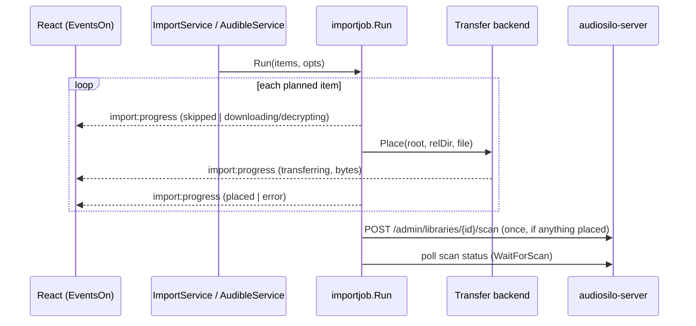

## Why transfers exist

The server is **read-only over the network** - it has no upload endpoint. Getting
a book *into* a library therefore means writing the file where the server's
library root lives: either a path this machine can reach directly (local disk or
a mounted SMB/NFS share) or the server's host over **SSH/SFTP**.
`internal/transfer` is the only component in the whole product that writes
content, and every write it makes is **atomic, size-verified, and idempotent**.

## The `Transfer` interface

Both backends implement one contract (`transfer.go`):

```go
type Transfer interface {
    EnsureRoot(ctx context.Context, root string) error
    Index(ctx context.Context, root string) (*Index, error)
    Place(ctx context.Context, req PlaceRequest) (PlaceResult, error)
    Close() error
}
```

- `EnsureRoot` fails fast when the destination root is missing or not a directory
  - this is what catches an **unmounted network share** before any copy would
  otherwise create a stub tree on the local mount point.
- `Place` copies `SrcPath` to `<Root>/<RelDir>/<Filename>` and returns
  `AlreadyPresent: true` (no copy) when the destination already holds a file of
  the source's exact size. A same-name file of a **different** size is refused
  unless `Overwrite` is set - never silently replaced.
- `Index` lists existing audio files under the root keyed by lowercased basename,
  with sizes stat'd lazily (`index.go`) - it recognizes an already-placed book
  even after its folder was renamed. It is part of the backend contract and
  tested, but the current import run relies on `Place`'s same-path size check
  rather than an up-front index sweep.
- Byte progress flows through the optional `Progress` callback, throttled to
  ~1 MiB granularity by `progress.Writer` so a multi-hundred-MB copy doesn't
  flood the event bus.

### Path safety: `SafeJoin`

The destination `RelDir` ultimately comes from a **user-editable template**, so it
is treated as untrusted. `transfer.SafeJoin` (local) and `safeRemoteJoin` (POSIX
remote) resolve the relative path under the root and reject anything that escapes
it (leading/embedded `..`). This is security-critical code: by convention it keeps
**both an allowed and a denied** regression test (same policy as the server's
`library.SafeJoin` - see [Invariants](../architecture/invariants.md)).

## The Local backend

`transfer.Local` writes to a directory on this machine - a local path or a
mounted share; it is the default backend. `copyVerified` streams the source into
a `.audiosilo-import-*.part` temp file **in the destination directory**, fsyncs,
closes, verifies the byte count, then renames onto the final name - so a reader
(or the server's scanner) never sees a half-written file, and a failed copy
leaves nothing but a removed temp. Cancellation is honored between read chunks.
Local does no ownership fixing: it runs as the local user, so new files are
already correctly owned (unlike SFTP, below).

## The SFTP backend

`transfer.SFTP` (`sftp.go`, via `github.com/pkg/sftp` + `golang.org/x/crypto/ssh`)
satisfies the same contract over SSH.

**Host keys are trust-on-first-use - never ignored.** `NewSFTP` refuses to dial
without a non-empty expected fingerprint; the `verifyHostKey` callback always
records the presented key's SHA256 fingerprint and rejects any mismatch. The TOFU
flow: `Probe` connects accepting any key and returns the fingerprint (even when
auth then fails, so the UI can show it alongside the error);
`TransferService.TestTransfer` reports `needsTrust` on first contact, an explicit
"host key changed - possible man-in-the-middle" error on a mismatch, and OK
otherwise; `TrustHostKey` pins the fingerprint into the registry
(`Server.HostKeySHA`). Changing the SSH host clears the pin, forcing re-trust.

**Auth methods** (`authMethods`): `agent` (with actionable errors when
`SSH_AUTH_SOCK` is unset - a GUI-launched app doesn't inherit the terminal's - or
the agent has no keys), `key` (path with `~` expansion, optional passphrase), and
`password`. The password and passphrase come from the **OS keychain**
(`registry.SSHPasswordKey`/`SSHPassphraseKey`); the registry JSON stores only the
key *path* and connection fields.

**Uploads** mirror Local's atomicity: a `<dst>.audiosilo-import.part` temp,
best-effort `fsync@openssh.com`, size verification via `Stat`, then
`PosixRename` (falling back to plain `Rename` where the extension is
unsupported).

**Ownership/mode matching**: content pushed over SSH would otherwise be owned by
the login user (often root) with the daemon's default mode. `makeDirs` creates
missing directories in a single downward walk (one round-trip per component)
while capturing the deepest pre-existing directory's owner/mode as a template,
and `matchTree` best-effort `Chown`/`Chmod`s the created dirs and the uploaded
file to match the existing library (files drop the execute bits). Errors are
ignored so a non-root login still succeeds.

The SFTP type also carries the primitives the guided deploy and the remote folder
picker build on: `ListDir` (canonicalized listing, dirs-first, dotfiles hidden -
so users browse to a destination instead of typing paths), `Run` (single remote
command), `WriteFile` and `MkdirAll` (dropping a `docker-compose.yml` during a
guided deploy).

## Choosing the backend and the destination root

Per server, `registry.TransferConfig` holds `Backend` (`"local"` | `"sftp"`) plus
the SSH fields; `Deps.openTransfer` builds the right backend (SFTP requires the
trusted host key). Per **library**, the registry stores a manager-side
`TransferRoot` - where the backend writes - separate from `ServerRoot` (the root
as the server reports it). They differ whenever the server is containerized or
the share is mounted at a different path: e.g. the server sees `/library` inside
Docker while the manager writes to `/mnt/user/audiobooks` over SFTP. The import
run uses `TransferRoot`, falling back to `ServerRoot`, and refuses to start with
neither configured.

### The Transfer-settings UI

`frontend/src/components/TransferSettings.tsx` (backed by `TransferService`)
exposes exactly these settings per server:

- **Backend**: *Local / mounted folder* or *SFTP (over SSH)*.
- **SFTP fields**: host, port (default 22), user; auth method **SSH agent** /
  **Key file** / **Password**; private-key path and optional passphrase (key
  auth); password (password auth - "saved, leave blank to keep": secrets are
  write-only, `GetTransferConfig` only reports `hasPassword`/`hasPassphrase`).
- **Trusted host key**: the pinned fingerprint, with *Test connection* →
  *Trust this host* driving the TOFU flow above.
- New connections seed the key path/user from the app-wide defaults
  (`SettingsService`), without overwriting an existing server's explicit config.
- Saving with a switched auth method deletes the now-inapplicable keychain
  secrets.

## Placement: where the destination path comes from

`importjob.Plan` computes each book's library-relative destination before
anything is copied. Titles are first cleaned with the shared `match.CleanTitle`
(series prefix and "(Book N)"/"(Unabridged)" fluff stripped - see
[Server integration](server-integration.md#shared-matching-pkgmatch)), then
`placement.SuggestWith` runs in one of two modes (per-library
`TemplateMode`/`Template` config):

**Auto mode** (`placement.Suggest`) replicates the dominant
`Author/Series/SHORTCODE## - Title` convention by **anchoring on what is already
in the library**:

- *Series with existing siblings*: `importjob.SiblingsFromBooks`/`FindSiblings`
  finds same-author, tolerantly-normalized same-series books
  (`match.NormalizeSeries`, so "The Primal Hunter" matches "Primal Hunter"); the
  highest-indexed sibling whose folder code parses becomes the template, giving
  the exact shortcode prefix, zero-padding width, and author/series folder names
  (`parseCode`/`leafCode`). Fractional novella positions render as `02.5`.
- *New series*: shortcode guessed from the series-name initials
  (`guessShortcode`), flagged for review in the suggestion's `Note`.
- *Standalone*: `Author/Title`.
- **Author-folder reuse**: `importjob.AuthorFolders` maps each normalized author
  to the folder spelling already on the server (most common spelling wins), so an
  Audible "L. A. McBride" lands inside the existing "L.A. McBride" folder instead
  of creating a near-duplicate beside it.
- `sanitize` makes each segment filesystem-safe without mangling real-library
  punctuation (apostrophes, commas, periods survive; `/`, `\`, `:` are rewritten).

**Template mode** (`placement/template.go`) renders a user-edited path template -
variables `{Author} {Series} {Title} {TitleShort} {Seq} {PaddedSeq} {SHORTCODE}
{ASIN} {Narrator} {Year} {OriginalFilename} {Ext}`, modifiers
(`width=N, upper, lower, trim`), and optional `{ … }` groups that collapse when a
variable inside is empty (so `{ {PaddedSeq} - }` vanishes for standalones).
Template mode still resolves `{SHORTCODE}` and the padding width from the series
siblings, so "match the existing convention" stays available. Every rendered
segment is sanitized, separators inside variable *values* (metadata like "AC/DC")
can't create path segments, and `ImportService.PreviewTemplate` renders a live
preview using the same `CleanTitle` path the import will actually use.

## The import run

`importjob.Run` executes a planned import **sequentially, one item at a time** -
there is no parallel transfer queue, which keeps disk/network contention and
progress reporting simple:



Per item: an `ExistsOnServer` plan flag short-circuits to `skipped`; an
`Acquirer` (the Audible source) fetches bytes just-in-time when `SrcPath` is
empty; `Place` copies with byte progress; the acquirer's temp is cleaned
immediately after. **Errors don't abort the run** - a failed item records its
error and the loop continues. There are **no automatic per-file retries**;
recovery is re-running the import, which is safe because skips and
`AlreadyPresent` make completed work a no-op. (The `serverapi` client's 429
backoff applies to API calls, not file writes.)

## Post-transfer

If anything was actually placed, the runner triggers **one** non-destructive
server rescan and waits for it (`Scan` + `WaitForScan` - see
[Server integration](server-integration.md#the-scan-trigger-after-placement)),
so the new books are indexed and visible to players immediately. Separately, the
Audible pre-flight's ASIN enrichment write-back
([Audible](audible.md#stage-3-pre-flight-and-matching)) is the only other
server-side effect in the pipeline.

## Safety properties (the checklist)

- **Nothing destructive server-side**: the server API is consumed read-only for
  content; the only writes are metadata enrichment, per-user progress, and the
  rescan trigger - no file on the server is modified or deleted via HTTP.
- **No deletes in the write path**: `Place` never removes existing content; the
  only overwrite is an explicit `Overwrite` of one same-named file, and
  differing-size collisions error out by default.
- **Atomic + verified**: temp file in the destination dir, fsync, size check,
  rename - on both backends.
- **Traversal-proof**: user-editable rel paths go through
  `SafeJoin`/`safeRemoteJoin` (allowed + denied tests required).
- **Host-key pinned**: SFTP never uses an insecure host-key callback; trust is
  explicit, and a changed key is a hard error.
- **Secrets in the keychain**: SSH passwords/passphrases (and session tokens)
  never touch `registry.json`.
