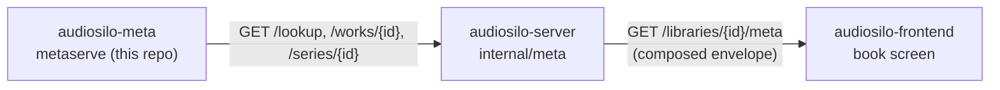

## What audiosilo-meta is

`audiosilo-meta` is the community audiobook metadata database behind
[meta.audiosilo.app](https://meta.audiosilo.app). Its defining idea: **the GitHub
repository is the database.** There is no application database and no server-side
accounts - metadata lives as plain JSON files under `data/`, one file per entity,
edited by pull request or issue form, validated by Go tooling in CI, and compiled
into a single SQLite artifact that consumers download and serve read-only.

The reason it exists is a gap no other open database fills: none is both
**audiobook-specific** and **community-editable**. Open Library, Wikidata, and
BookBrainz are open but carry essentially no narrator, recording, or chapter
structure; Audnexus is a read-only cache over Audible's own catalogue. So
narrators, specific recordings, and chapters are **first-class data** here - the
fields every other database lacks.

Module path: `github.com/kodestar/audiosilo-meta`. The code is **AGPL-3.0**; the
data is split across two licence layers (below).

```
  contributor
      │  pull request  /  issue form
      ▼
  data/*.json  ──►  CI validation  ──►  meta.sqlite  ──►  metaserve (API + site)
  (the database)    (metacheck +        (release          read-only, hot-swaps
                     metafmt, Go)        artifact)         new releases
```

## The two licence layers

Data lives in two layers, and the boundary is **enforced structurally by the JSON
Schema**, not by convention (see `LICENSING.md` in the repo): the `license` field
of a core record accepts only `CC0-1.0`, and a sidecar's only `CC-BY-SA-3.0`
(`common.schema.json` `$defs/license` vs `$defs/license_content`).

| Layer | Entities | Licence |
|---|---|---|
| **Factual core** | works, recordings, people, series | **CC0-1.0** public-domain dedication |
| **Expressive layer** | per-work characters + recaps sidecars | **CC BY-SA 3.0** |

Publisher blurbs and cover art are referenced, never copied: descriptions are
community-written and covers are URLs. Every entity also carries a `sources[]`
provenance array so any source can be audited or retracted wholesale. Full detail
is in [the data model](data-model.md).

## Package layout

The tooling follows the same discipline as the rest of the workspace: thin CLIs
under `cmd/`, all logic in reusable packages, and a clean split between the
public `pkg/*` (consumed by the sibling `audiosilo-sidecars` module as ordinary
dependencies) and the private `internal/*`.

```
data/          the database: works/, people/, series/ (sharded JSON) + per-work sidecars
schema/        JSON Schemas (one per entity) - the public contract, embedded via schema.go
cmd/           thin CLIs: metacheck, metafmt, metabuild, metaserve, metascan,
               metaimport, metaissue, metaextract (flag wiring only)
pkg/model      PUBLIC entity structs, slug/shard rules, location parsing
pkg/canonical  PUBLIC canonical JSON (sorted keys, 2-space indent, trailing LF)
pkg/check      PUBLIC schema validation + integrity/uniqueness/chapter/series rules
pkg/extract    PUBLIC epub split + the word-shingle near-verbatim check
pkg/scan       PUBLIC local folder scanner (tags + path/filename heuristics + ffprobe)
internal/importer   OpenAudible / Libation export -> canonical records (ASIN dedup)
internal/issueform  issue-form body -> canonical records + an ok/duplicate/needs-human/invalid verdict
internal/build      the deterministic SQLite builder (FTS5, ASIN/ISBN indexes, added_at)
internal/serve      the read-only HTTP API + ABS provider + GitHub-release poller/hot-swap
Dockerfile     image: site build + metaserve + baked data
.github/       issue forms + CI workflows (check, release, image, intake, ai-verify)
```

Dependency direction mirrors the server's "transport is logic-free" rule:
`cmd/metaserve` is flag wiring only, and all business logic lives in
`internal/serve`.

## The CLI tool set at a glance

Each command is a thin `cmd/*` wrapper over a package; run any of them with `go
run ./cmd/<name>`.

| Command | What it does |
|---|---|
| `metacheck` | Validates the whole `data/` tree - schema, id/shard agreement, referential integrity, uniqueness, chapter ordering, series positions. Prints one line per problem and exits 1 if any are found. |
| `metafmt` | Enforces canonical JSON for `data/**/*.json` (sorted keys, 2-space indent, single trailing LF). `--check` lists non-canonical files and exits 1; `--write` rewrites them. |
| `metabuild` | Compiles `data/` into the SQLite artifact (`-o meta.sqlite`). Runs the full validation first and refuses to build invalid data; `--added` dates each work from a git-history-derived list. |
| `metaserve` | Serves the compiled artifact read-only over HTTP (and optionally the static site at `/`), hot-swapping newer GitHub releases. See [the HTTP API](api.md). |
| `metascan` | Scans a local audiobook folder into an import JSON - see [contributing data](contributing-data.md#scanning-local-files-metascan). |
| `metaimport` | Ingests an OpenAudible/Libation library export into `data/` - see [contributing data](contributing-data.md#bulk-importers-metaimport). |
| `metaissue` | Issue-form body to canonical records + verdict, for the intake bot - see [contributing data](contributing-data.md#intake-automation-issue-form-to-bot-pull-request). |
| `metaextract` | Supports the source-to-sidecar extraction pipeline: `split` (epub -> chapter text + manifest) and `ngram` (near-verbatim overlap check against the source text). |

## Build, validate, and serve locally

Requires **Go 1.25+** (pure Go, no cgo, no external services). The full gate,
matching CI (`.github/workflows/check.yml`):

```sh
go build ./... && go vet ./... && go test -race ./... && golangci-lint run
go run ./cmd/metacheck            # validate the data tree
go run ./cmd/metafmt --check      # canonical formatting (--write to fix)
```

Build the artifact and serve it:

```sh
go run ./cmd/metabuild -o meta.sqlite
go run ./cmd/metaserve --db meta.sqlite --addr :8080
```

## Release artifacts

On merge to `main`, `.github/workflows/release.yml` publishes a **dated data
release** tagged `data-vYYYY.MM.DD-<shortsha>` when data or schema changes land.
The asset contract:

- `meta.sqlite.gz` + `meta.sqlite.gz.sha256` - the universal anchor every
  consumer verifies against.
- `meta.sqlite.sha256` - the raw-file digest, used to verify a patched artifact.
- `meta.sqlite.patch.from-<PREV_TAG>.zst` - a **best-effort** zstd `--patch-from`
  binary delta against the previous data release (`--long=31`; a stock zstd CLI
  consumer must also pass `--long=31` at decompression time).

The repo also cuts code/image `v*` releases with no data assets, so consumers
select the newest **data** release by asset presence: the non-draft,
non-prerelease release carrying `meta.sqlite.gz` with the maximum `published_at`
(GitHub's release list order is not publish-chronological, and its "latest" can be
either kind). The [`metaserve` refresh loop](api.md#serving-and-refresh) applies
the same rule.

## How it connects to the rest of AudioSilo

audiosilo-meta is the **upstream** of a three-repo metadata seam. `metaserve`
serves the community data; the AudioSilo server composes a book's enrichment from
it; the player renders that enrichment.



The seam of record is
[the cross-repo contract's community-metadata section](../architecture/cross-repo-contract.md#14-community-metadata-a-three-repo-seam) -
what couples, which files sit on each side, and what a `metaserve` response-shape
change ripples into. The consumer sides are documented on
[server configuration](../server/configuration.md), the server's
[HTTP API reference](../server/api/reference.md), and the frontend's
[state and data](../frontend/state-and-data.md).

`metaserve` additionally doubles as an **Audiobookshelf custom metadata
provider** (`GET /abs/search`) for that competitor's users - see
[the HTTP API](api.md#get-abssearch-audiobookshelf-provider).
