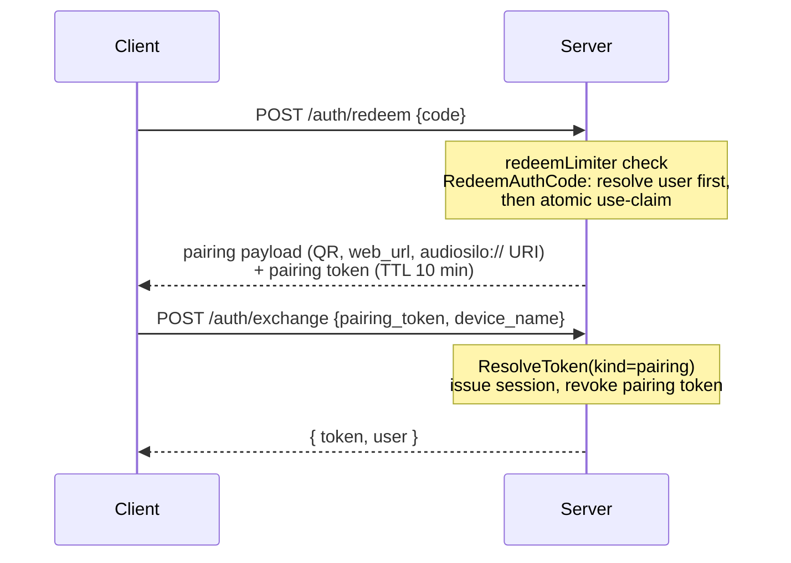

The server's first design priority is **safe to expose to the internet by
inexperienced users**. That shapes everything on this page: no default
passwords, no plaintext secrets at rest, brute-force lockouts, defense-in-depth
path checks, and a hard testing rule for anything security-critical.

## Secrets at rest

Two different hashing strategies, chosen by entropy:

- **Passwords** (low-entropy, user-chosen) use **argon2id** (`auth/hash.go`).
  Parameters: `time=2`, `memory=64 MiB` (`argonMemory = 64*1024` KiB),
  `threads=4`, 32-byte key, 16-byte random salt - tuned for interactive login
  on modest self-hosted hardware, with memory comfortably above the OWASP
  floor. Hashes are stored PHC-style
  (`$argon2id$v=19$m=65536,t=2,p=4$<salt>$<key>`); `VerifyPassword` compares
  with `subtle.ConstantTimeCompare`. Minimum length for a non-empty password is
  8 (`auth.MinPasswordLen`).
- **Tokens and auth codes** (full-entropy, machine-generated) are stored only
  as **SHA-256 hashes** (`hashSecret`). A fast hash is appropriate here because
  the secrets are 256-bit random values - argon2id is reserved for passwords.
  A database leak exposes no live credential of either kind.

Timing hygiene: `auth.Authenticate` runs a dummy argon2id verification (against
`dummyHash`, whose cost parameters mirror the real ones) for unknown usernames
and for password-less accounts, so response timing doesn't leak account
existence.

:::danger Never log or persist a plaintext secret
The first-run banner (and the setup wizard URL) is the **only** place a
plaintext credential ever appears, exactly once. Handlers return freshly-minted
codes/tokens in the response body and store only the hash.
:::

## Tokens: session, pairing, and API keys

`tokens.kind` distinguishes three kinds (`auth.KindSession`, `auth.KindPairing`,
`auth.KindAPI`):

- **Session tokens** are the durable bearer credential (`Authorization: Bearer
  …`). Issued by `POST /auth/login` and `POST /auth/exchange` with **no
  expiry**; revoked by `POST /auth/logout` or admin action.
- **Pairing tokens** are intermediaries minted by `POST /auth/redeem` (auth
  code → pairing) or `POST /auth/pair` (add another device from an existing
  session). `POST /auth/exchange` turns one into a device-named session token.
  A pairing token is **as redeemable as its origin** (`tokens.auth_code_id`
  links it to the code that minted it): invite-derived tokens inherit the
  invite's uses and expiry - exchange claims one use per device, so one QR can
  pair several devices - and die with the code (delete/supersede cascade,
  rotate revokes); recovery-derived tokens last `pairingTTL` = 10 minutes
  (multi-scan within it, since recovery codes are unlimited); `/auth/pair` and
  demo tokens are unlinked - single-use (revoked on exchange) with the same
  10-minute TTL.
- **API keys** (`auth.KindAPI`) are user-minted, **non-expiring** bearer
  credentials for headless integrations (dashboards, cron), created / listed /
  revoked via `POST` / `GET` / `DELETE /auth/tokens`
  (`IssueAPIToken` / `ListAPITokens` / `RevokeTokenByID`). A key authenticates
  exactly like a session token and **acts as its owner** - an admin's key also
  passes `requireAdmin` - but it is never valid for `/auth/exchange` (pairing),
  and its lifecycle is mint / list / revoke rather than sign-in / sign-out. Only
  the SHA-256 hash is stored (the secret is returned once at creation) and the
  user's label rides in `tokens.device_name`. All three routes go through
  `gateSelfService`, so they share the `accountLimiter` and are refused for demo
  accounts, exactly like the password/recovery routes.

`auth.ResolveToken` validates a presented secret for a specific kind: it hashes
the secret, looks up the row, and rejects revoked tokens, expired tokens, and
tokens whose user is disabled. On success it bumps `tokens.last_seen` - which
is how a user's "last activity" is derived (`MAX(tokens.last_seen)`); there is
deliberately no `last_login` column.

The middleware wrappers in `internal/api/middleware.go`:

- `requireAuth` - a **session token or an API key** from the `Authorization`
  header only (`ResolveTokenKinds(secret, KindSession, KindAPI)`); a pairing
  token is never accepted here, so a QR/pairing secret can't be used as a durable
  credential.
- `requireMediaAuth` - additionally accepts `?token=` as a query parameter,
  used **only** for the two media GETs (`/cover`, `/stream`) because browser
  ``/`<audio>` elements cannot set headers. `bearerToken(r, allowQuery)`
  confines the fallback deliberately: a token in a query string can leak into
  access logs and `Referer` headers, so no other route accepts it. An API key
  works here too, since it authenticates wherever a session does.
- `requireAdmin` - `requireAuth` plus a role check; every `/admin/*` route uses
  it. The baked-in admin HTML is unprivileged - the API enforces the role.

## Auth codes: invite vs recovery

Auth codes are human-typable secrets (`generateAuthCode`): 10 random bytes in
Crockford's base32 alphabet (no I/L/O/U), formatted in dash-separated groups of
four. `normalizeCode` strips spacing/case and maps look-alikes (`O→0`, `I/L→1`,
`U→V`) before hashing, so fat-fingered entry still verifies.

`auth_codes.kind` splits them into two lifecycles:

| | `invite` | `recovery` |
|---|---|---|
| Minted by | Admin (`POST /admin/users/{id}/authcode`) | The user themself (`POST /auth/recovery`) |
| Defaults | 5 uses / 1-day expiry (`defaultAuthCodeMaxUses`/`defaultAuthCodeTTLDays` in `handlers_admin.go`; explicit `0` means unlimited/never) | Unlimited uses, never expires |
| Cardinality | One *active* invite per user | At most one recovery code per user |
| Listable | Yes (`ListAuthCodes`, metadata only) | No - surfaces only as `User.HasRecovery` |
| Revocation | `DELETE /admin/authcodes/{id}` | `DELETE /auth/recovery` (self) or `DELETE /admin/users/{id}/recovery` (admin, the only lever for a leaked code) |

Both redeem through the same path. The full onboarding flow:

`auth.RedeemAuthCode` has two correctness properties worth knowing before you
touch it:

- **Atomic claim.** The under-the-cap check is folded into the increment
  (`UPDATE … SET uses = uses + 1 WHERE … AND (max_uses = 0 OR uses <
  max_uses)`), so concurrent redemptions can't push `uses` past `max_uses`. The
  first-redemption `redeemed_at` stamp rides in the same write
  (`COALESCE(redeemed_at, ?)` - an earlier stamp is preserved, since recovery
  codes redeem repeatedly).
- **No burn on a rejected user.** The bound user is resolved - and a
  disabled/deleted account rejected - *before* the claim, so a rejected attempt
  never consumes a use or flips an invite to "accepted".

**Invite hygiene.** `auth.CreateInvite` mints and, in the same transaction,
deletes the user's other *still-redeemable* invites
(`supersedeActiveInvites` - not used up, not expired), so there is exactly one
active invite per user; spent/expired invites remain as history. `POST
/admin/authcodes/{id}/rotate` (`RotateAuthCode`, the admin "Resend")
regenerates an invite's secret **in place**: `max_uses` is preserved, the use
counter and `redeemed_at` reset, and the expiry is renewed for the invite's
*original* window - never silently downgraded to defaults. Only invite-kind
codes rotate. (`CreateAuthCode`, without the supersede step, exists solely for
the first-run bootstrap, which has nothing to supersede.)

**Recovery** decouples re-authentication from invitation: a signed-out or
password-less user who saved a recovery code can re-pair on any device via the
normal connect screen, with no admin involved. `GenerateRecoveryCode`
atomically replaces any existing recovery code for the user.

## Demo-account restrictions

Public demo mode (`config.demo.*`) creates throwaway `is_demo` accounts.
Three fences keep a demo session from becoming a durable login:

- `POST /auth/password`, `POST /auth/recovery`, and the `/auth/tokens`
  (API-key) routes are **refused for demo accounts** (`User.IsDemo` checked in
  the handlers / `gateSelfService`).
- These endpoints, plus demo-session creation itself, are rate-limited (see
  [the limiter table](#rate-limiting)).
- A background reaper (`launcher.demoReaper`, every 15 minutes) deletes demo
  accounts idle past `demo.idle_ttl` - by the `is_demo` flag, never by username
  prefix. Deletion cascades all their state.

## Self-service password rules

`POST /auth/password` (handler `handleSetPassword`) lets a signed-in user set
or change their own password:

- Setting a **first** password requires no challenge (the primary case is a
  password-less, pairing-onboarded player user establishing a way back in).
- **Changing** an existing password requires `current_password`
  (`auth.CheckPassword`) - so a stolen session token can't plant a persistent
  credential.
- An **empty** password is rejected (clearing is admin-only via `PATCH
  /admin/users/{id}`), and the admin-must-keep-a-password guard still applies
  underneath (`SetPassword` refuses to clear an admin's password).

## Admin guards

Account-safety invariants live in `internal/auth`, not in handlers, so every
caller gets them:

- **`ErrLastAdmin`** - the last *enabled* admin cannot be demoted
  (`SetRole`), disabled (`SetDisabled`), or deleted (`DeleteUser`). The console
  can never be locked out.
- **`ErrAdminNeedsPassword`** - an account cannot become (or remain) an admin
  without a password: enforced on create, on promote (`SetRole`), and on
  password clear (`SetPassword`).
- **No self-delete** - enforced additionally in the delete *handler*: an admin
  may disable their own account (reversible) but never delete it
  (irreversible). `DeleteUser` cascades sessions, auth codes, progress,
  bookmarks, notes, history and share grants via `ON DELETE CASCADE`; files on
  disk are untouched.
- **Passwords are optional for non-admins** - stored as an empty hash, and
  `Authenticate` rejects empty-hash accounts outright, so a password-less user
  can only ever authenticate via code pairing.

## Authorization: shares → Scope

Access control is filesystem-based. A **share** is a named set of path rules
(`share_paths`: `(library_id, path)`, where `""` = the whole library); users
are granted shares, and a user's access is the union of their granted rules.
`catalog.GrantWholeLibrary` is sugar that ensures a `"Library: <name>"` share
with a `""` rule exists and grants it.

At request time the rules are compiled into a `catalog.Scope` per library -
`AllowAll` (admins always; or any `""` rule) or a list of granted `Paths`. The
scope is then enforced through **three functions, each matched to a different
query shape**:

| Function | Semantics | Enforced where |
|---|---|---|
| `Scope.Allows(p)` | `p` is equal to or under a granted rule (segment-boundary prefix match) | `authorizedPath` in `handlers_library.go` - **every** path-addressed endpoint (`item`, `chapters`, `cover`, `stream`, progress/bookmarks/notes/history/favourites writes) |
| `Scope.VisibleInBrowse(p)` | `Allows(p)` **or** `p` is an *ancestor* of a rule - so the user can navigate toward granted content | `handleBrowseFS` → passed as the `allow` filter to `library.BrowseFS` (applied before pagination so pages stay full) |
| `pathFilterSQL(col, scope)` | The same grant logic as a SQL `WHERE` fragment (`col = ?` OR `col LIKE ? ESCAPE '\'`), with LIKE metacharacters escaped so `Sci_Fi` can't over-match `SciXFi` | `ListBooks`, `Search`, `RecentBooks`; `scopesFilterSQL` extends it across libraries for the cross-library listings (`/me/progress`, `/me/history`, `/me/favourites`) |

The Go predicate (`pathAllowedBy`) is authoritative; `pathFilterSQL` must stay
behaviorally identical to it. A non-admin whose scope is empty gets 403 from
`libraryScope` before any content is touched.

## Path traversal: `library.SafeJoin`

Any filesystem access derived from user input goes through
`library.SafeJoin(root, relPath)`. It defends in two layers:

1. **Lexical containment** - the joined path must not escape the (symlink
   resolved) root via `..`; absolute injections are neutralized by
   `filepath.Join` semantics. This also covers not-yet-existing paths.
2. **Symlink-aware containment** - symlinks in the longest *existing* prefix of
   the target are resolved (`resolveExisting`) and containment is re-checked,
   so a symlink inside the root pointing outside it is rejected rather than
   followed.

Both `BrowseFS` and the stream/cover handlers call it; `Scanner.IndexPath` uses
it as the security gate too (while deriving the working path from the
unresolved join so `rel_path` keys stay consistent - see
[Scanner](scanner.md#on-demand-indexing-indexpath)).

## Rate limiting

Two mechanisms in `internal/api/ratelimit.go`, five buckets wired in `api.New`:

| Bucket | Mechanism | Limit | Applied to |
|---|---|---|---|
| `ipLimiter` | Token bucket per IP (`ipRateLimiter`) | ~20 req/s, burst 40 | Every request (global `rateLimit` middleware) |
| `loginLimiter` | Failure lockout per IP (`limiter`) | 10 failures / 15 min | `POST /auth/login` |
| `redeemLimiter` | Failure lockout per IP | 10 failures / 15 min | `POST /auth/redeem` |
| `demoLimiter` | **Attempt** cap per IP (`Acquire`) | 5 / 15 min | `POST /demo/session` |
| `accountLimiter` | **Attempt** cap per IP (`Acquire`) | 10 / 15 min | `POST /auth/password`, `POST /auth/recovery`, `/auth/tokens` (create/list/revoke) |

The failure-lockout `limiter` has two usage patterns: `Allowed`/`Fail`/`Reset`
counts only *failed* attempts (right for login/redeem, where success should not
lock anyone out), while `Acquire` atomically admits-and-counts every attempt -
used for account-creating/mutating endpoints where even successful requests
must be metered and a check-then-count pair could race. Both structures sweep
stale entries so a flood of distinct IPs can't grow memory without bound.

Client IPs come from `realIP` middleware: `X-Forwarded-For` is honored **only**
when the direct peer is inside a configured `trusted_proxies` CIDR, so clients
can't spoof their way out of a lockout.

## Transport hardening

`secureHeaders` sets `X-Content-Type-Options: nosniff`, `X-Frame-Options:
DENY`, `Referrer-Policy: no-referrer`, and `Cross-Origin-Resource-Policy:
same-site` on every response. **HSTS is set only in `autocert` TLS mode**:
pinning it with a self-signed cert would make the certificate warning
impossible to bypass, and behind a reverse proxy (`off`) the proxy owns HSTS.

CORS (`cors` middleware) is a strict allow-list from `cors_origins`; with no
configured origins, cross-origin browser requests simply get no CORS headers
(native apps and same-origin web are unaffected).

Non-streaming requests are bounded by a 30 s timeout (`requestTimeout`) that
cancels the request context and returns 503 - resilience against a stuck
writer connection, not latency policing. Streaming paths (`/stream`, `/cover`,
`/web/...`) are exempt because audio must run long.

### Content Security Policy (summary)

Two policies, both owned by `internal/web`:

- The **admin/connect/setup pages** get the strict site-wide
  `contentSecurityPolicy`: same-origin everything, no `unsafe-inline` at all
  (all styling/behaviour lives in external files by construction), `data:`
  images allowed for the QR PNG, `frame-ancestors 'none'`.
- The **web player** at `/web` gets a per-document `htmlCSP`: `script-src
  'self'` plus a sha256 hash of each inline `<script>` in that HTML document,
  and `style-src 'unsafe-inline'` (react-native-web injects runtime styles that
  cannot be hashed).

Details and the reasoning live in [Web UI](web-ui.md).

## The fragment-carried-secret convention

Secrets that must ride in a URL go in the **fragment**, which browsers never
send to the server - so they cannot appear in server or proxy logs:

- Invite links: `<base>/connect#code=…` (the connect page auto-redeems it).
- First-run setup: `<base>/setup#token=…` (the POST then verifies the token in
  constant time).

The **pairing token** in the QR payload's `web_url` (`/web/connect?token=…`)
is a query parameter by necessity (it must survive Universal/App Link routing).
An invite-derived token lives as long as the invite it came from (same trust
class as the invite link itself), which is acceptable because the server keeps
no access log, sends `Referrer-Policy: no-referrer`, and the token dies with
the invite (revoke, Resend/rotate, supersede, expiry, use cap) - the exposure
class matches the media `?token=` fallback. Recovery-derived and `/auth/pair`
tokens stay 10-minute-bounded. Follow the fragment convention for any new
durable secret.

## The allowed + denied test rule

**Security-critical code requires both an allowed and a denied regression
test.** A change that only proves the happy path can silently widen access.
The enumerated critical list:

- `library.SafeJoin`
- `Scope.Allows` / `Scope.VisibleInBrowse` / `pathFilterSQL`
- the rate limiters (`limiter`, `ipRateLimiter`)
- `auth.ResolveToken`
- `web.htmlCSP`

Anything touching these must land with a test showing the permitted case *and*
a test showing the rejected case (traversal rejected, out-of-scope path 403'd,
locked-out IP refused, expired/revoked token rejected, …). Handler-level tests
use the `newTestEnv` harness; pure logic tests sit next to the code - see
[Server overview](overview.md#test-landscape) and
[Gates & CI](../contributing/gates-and-ci.md).
