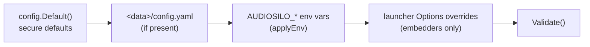

Configuration is loaded by `internal/config` and layered in a fixed order.
Later layers override earlier ones, and the result is validated before use:

## The config file

- **Location**: `<data-dir>/config.yaml` (`config.Path`). The data directory
  itself comes from the `--data` flag (or `Options.DataDir` for embedders) -
  there is **no environment variable for the data dir**.
- **First run**: when the file does not exist, `config.Load` returns secure
  defaults with `firstRun=true`, and `pkg/launcher` persists them (with any
  Options overrides applied) via `Config.Save`. The file is written `0600`,
  the data dir created `0700`.
- **Annotated template**: `config.example.yaml` in the repo root mirrors this
  reference.

:::note
First-run **admin bootstrap** is keyed off the database (does an admin
exist?), not off config-file existence - pre-supplying a `config.yaml` does
not suppress the credentials banner or the setup wizard.
:::

## CLI flags (`cmd/audiosilo`)

| Flag | Default | Meaning |
|---|---|---|
| `--data` | `./data` | Data directory: config, SQLite database, generated certs, downloaded tools |
| `--ffprobe` | `ffprobe` | Path to ffprobe (durations, chapters, codec detection). **`""` disables it** - the scanner degrades to path-derived metadata and `direct_playable` defaults to true |
| `--ffmpeg` | `ffmpeg` | Path to ffmpeg for on-the-fly transcoding. **`""` disables it** - `?transcode=1` returns 503 and the `transcode` capability reports false |
| `--setup` | `false` | First-run **web setup wizard**: instead of auto-creating the admin and printing credentials once, mint a one-time token and enable the guarded `/setup` page (see [Built-in web UI](web-ui.md)) |

A bare tool name (no path separator) is resolved **next to the server
executable first**, then on `$PATH`; an explicit path is used as-is. If a tool
is enabled but not found locally, the auto-download kicks in (below).

## YAML reference

### Server & network

| Key | Type / default | Meaning |
|---|---|---|
| `bind` | string, `"0.0.0.0:8080"` | `host:port` to listen on. Must parse with `net.SplitHostPort` |
| `public_url` | string, `""` | Externally reachable base URL, used in QR pairing payloads, invite links and the launcher's "open this URL" output. Empty → derived per-request from scheme + `Host` header |
| `trusted_proxies` | []string (CIDRs), `[]` | Networks whose `X-Forwarded-For` is trusted when deriving the client IP (which feeds the per-IP rate limiters). Set when running behind a reverse proxy. Each entry must be a valid CIDR |
| `cors_origins` | []string, `[]` | Browser origins granted CORS. Empty = no cross-origin headers at all (native apps and same-origin web still work); `"*"` disables the check entirely. Needed for a hot-reload frontend dev server, e.g. `http://localhost:8081` |
| `max_upload_bytes` | int64, `2147483648` (2 GiB) | Reserved for the planned `POST /uploads` (Phase B) - **not yet enforced**; JSON request bodies use a fixed 1 MiB cap regardless |

### TLS (`tls.*`)

| Key | Type / default | Meaning |
|---|---|---|
| `tls.mode` | `off` \| `selfsigned` \| `autocert`, default `selfsigned` | `off` = plain HTTP (use behind a TLS-terminating proxy); `selfsigned` = generate & persist a self-signed cert (LAN default); `autocert` = Let's Encrypt via ACME |
| `tls.hosts` | []string, `[]` | autocert: hostnames to obtain certificates for. **Required when mode is `autocert`** |
| `tls.cache_dir` | string, `<data>/certs` | autocert: certificate cache directory (re-defaulted to `<data>/certs` whenever empty) |
| `tls.cert_file` / `tls.key_file` | string, `""` | selfsigned: explicit paths for the persisted cert/key. Empty → `<data>/selfsigned-cert.pem` / `<data>/selfsigned-key.pem` |

Mode-related behaviors worth knowing: HSTS
(`Strict-Transport-Security`) is sent **only** in `autocert` mode - never for
`selfsigned` (pinning HSTS would make the certificate warning impossible to
bypass), and with `off` the proxy owns HSTS. In `autocert` mode the server
logs a warning when `bind` is not on port 443, since ACME validation will
fail otherwise.

### Web player & app links

| Key | Type / default | Meaning |
|---|---|---|
| `web_dir` | string, `""` | Directory of the prebuilt web player served at `/web`. Empty (and no embedded player) → `/web` unmounted and the `web_player` capability reports false. The Docker image bakes a pinned build at `/app/web` |
| `app_links.apple_app_ids` | []string, `[]` | `"<TEAMID>.<bundleId>"` entries for `/.well-known/apple-app-site-association` |
| `app_links.android_package` | string, `""` | Android package name for `/.well-known/assetlinks.json` |
| `app_links.android_sha256` | []string, `[]` | Signing-cert SHA-256 fingerprints (colon-separated uppercase hex) |

The well-known endpoints 404 until the relevant identifiers are set - see
[Built-in web UI](web-ui.md). `app_links` is **YAML-only** (no env override).

### Libraries

| Key | Type / default | Meaning |
|---|---|---|
| `libraries[].name` | string, required | Display name; must be unique across the list |
| `libraries[].root` | string, required | Local filesystem root of the library (mount network shares first - roots are always local paths) |

Config-declared libraries are **upserted by name** into the database at every
startup (`syncLibraries`, roots made absolute) and scanned in the background;
libraries can equally be created at runtime through the admin API, in which
case they live only in the database. There is deliberately **no layout key**
- folder shape is auto-detected per folder by the
[scanner](scanner.md), with per-folder admin overrides for corrections.

### Demo mode (`demo.*`)

| Key | Type / default | Meaning |
|---|---|---|
| `demo.enabled` | bool, `false` | Let unauthenticated visitors mint throwaway accounts via `POST /api/v1/demo/session`; the site root then redirects to `/web/demo` when a player is mounted |
| `demo.library` | string, `""` | Name of the library demo users are granted. **Required when demo is enabled** (a missing library is also warned about at boot) |
| `demo.max_users` | int (optional), unset | Cap on concurrent live demo accounts. **Unset → safe default 200** (`config.DefaultDemoMaxUsers`); **explicit `0` = unlimited** (opt-in risk: per-IP creation limits are bypassable by rotating IPs) |
| `demo.idle_ttl` | duration string, `"24h"` | Reap demo accounts idle longer than this (background reaper sweeps every 15 min). Must parse as a positive `time.Duration`; empty falls back to 24h |

### Community metadata (`metadata.*`)

The server can enrich a book with a description, production details and its
series by resolving the book's ASIN/ISBN against the community metadata API
([meta.audiosilo.app](https://meta.audiosilo.app)) and serving the result at
`GET /libraries/{id}/meta` (players draw it beneath the chapter list). The
lookup is server-side by design - one cached seam, and one config key that turns
off all outbound calls.

| Key | Type / default | Meaning |
|---|---|---|
| `metadata.enabled` | bool, `true` | Turn the metadata lookup on. When `false`, the server makes **no outbound metadata calls**, `GET /libraries/{id}/meta` returns 404, and the `metadata` capability reports false so players hide the enriched-book section entirely. Seeds the initial state only - an admin can flip this at runtime (see below) |
| `metadata.base_url` | string, `"https://meta.audiosilo.app"` | Base URL of the metadata service (the site is served at `/` and the API at `/api/v1`). **Must be an absolute `http`/`https` URL when metadata is enabled** |

`metadata.enabled` is **runtime-toggleable**: an admin can switch the lookup on
or off from the console's **Overview** section (or via
[`PATCH /admin/settings`](api/reference.md#patch-apiv1adminsettings)) with no
restart, and the change is **persisted back to `config.yaml`**. The YAML value
and `AUDIOSILO_METADATA_ENABLED` only **seed** the initial state at startup; the
admin toggle is the durable source of truth thereafter. `metadata.base_url`
stays config-only - it defines whether the feature is *available* at all (a valid
absolute `http(s)` URL), and the toggle can only enable the lookup when a valid
base URL is set.

Turning it off is the one-key privacy switch: with the lookup disabled the server
never contacts the metadata service, and every player connected to it stops
showing the section (they gate on the `metadata` capability). Enrichment is
strictly additive and cached - a slow or unreachable service degrades to no
section, never a broken page.

## Environment variables

`applyEnv` overrides a fixed set of keys from `AUDIOSILO_*` variables - this
is the complete list (anything not here, e.g. `app_links`, `libraries`,
`tls.cert_file`, has no env override):

| Variable | Overrides | Format |
|---|---|---|
| `AUDIOSILO_BIND` | `bind` | `host:port` |
| `AUDIOSILO_PUBLIC_URL` | `public_url` | URL |
| `AUDIOSILO_WEB_DIR` | `web_dir` | path |
| `AUDIOSILO_TLS_MODE` | `tls.mode` | `off` / `selfsigned` / `autocert` |
| `AUDIOSILO_TLS_HOSTS` | `tls.hosts` | comma-separated list |
| `AUDIOSILO_TRUSTED_PROXIES` | `trusted_proxies` | comma-separated CIDRs |
| `AUDIOSILO_CORS_ORIGINS` | `cors_origins` | comma-separated origins |
| `AUDIOSILO_MAX_UPLOAD_BYTES` | `max_upload_bytes` | integer |
| `AUDIOSILO_DEMO_ENABLED` | `demo.enabled` | `strconv.ParseBool` (`true`/`1`/…) |
| `AUDIOSILO_DEMO_LIBRARY` | `demo.library` | string |
| `AUDIOSILO_DEMO_MAX_USERS` | `demo.max_users` | integer (`0` = unlimited) |
| `AUDIOSILO_DEMO_IDLE_TTL` | `demo.idle_ttl` | Go duration, e.g. `24h` |
| `AUDIOSILO_METADATA_ENABLED` | `metadata.enabled` | `strconv.ParseBool` (`true`/`1`/…) |
| `AUDIOSILO_METADATA_BASE_URL` | `metadata.base_url` | URL |

List values are split on commas with whitespace trimmed and empties dropped
(`splitList`). Numeric/boolean variables that fail to parse are **silently
ignored** (the underlying key keeps its previous value) - only `Validate`
catches downstream inconsistencies.

## Validation & secure defaults

`Config.Validate` runs after all layers (and **again** after launcher
overrides). It rejects:

- an empty data dir; a `bind` that isn't `host:port`;
- an unknown `tls.mode`; `autocert` without `tls.hosts`;
- any `trusted_proxies` entry that isn't a valid CIDR;
- a library with an empty name or root, or a duplicate library name;
- demo mode without `demo.library`; a `demo.idle_ttl` that doesn't parse or
  isn't positive (rejected loudly rather than silently replaced by 24h);
- metadata enabled with an empty or non-absolute-`http(s)` `metadata.base_url`.

Secure-by-default choices baked into `Default()` and first-run: TLS on
(`selfsigned`) out of the box, no default passwords (credentials are minted
and printed once, or set via the guarded setup wizard), config written
`0600`, no trusted proxies and no CORS grants until configured. See
[Auth & security](auth-and-security.md) for the app-layer hardening these
feed into.

## Launcher `Options` (for embedders)

`pkg/launcher.Run(ctx, opts)` is the shared run loop used by both the
headless `audiosilo` command and the desktop manager, which runs the server
in-process (see
[Manager server integration](../manager/server-integration.md)). The full
`Options` surface:

| Field | Type | Meaning |
|---|---|---|
| `DataDir` | string | Config/database/certs directory (as `--data`) |
| `FFprobePath` / `FFmpegPath` | string | Tool paths; `""` disables the tool (as the flags) |
| `Log` | `*slog.Logger` | Logger; nil → default stderr text logger |
| `Setup` | bool | Select the first-run flow: `false` = auto-admin + printed banner; `true` = token-guarded `/setup` wizard |
| `OnURL` | `func(url string)` | Called once at startup with the URL to open: the token-carrying `/setup#token=…` while first-run setup is pending, else `<base>/web` when a player is available, else `<base>/admin`. A GUI launcher uses it to open a browser |
| `Bind` | string | Config override for `bind` (e.g. `"127.0.0.1:8080"`) |
| `TLSMode` | string | Config override for `tls.mode` (`"off"`/`"selfsigned"`/`"autocert"`) |
| `PublicURL` | string | Config override for `public_url` (e.g. a Cloudflare Tunnel URL) |
| `Libraries` | `[]launcher.Library` (`{Name, Root}`) | When **non-nil**, replaces the configured libraries wholesale (`launcher.Library` mirrors `config.Library` so external modules don't import an internal type) |

Override semantics (`applyOverrides`): empty/zero fields are ignored, so the
headless command - which sets none - gets the file's configuration verbatim.
Overrides are layered on top of the loaded `config.yaml`, then the config is
**re-validated** (a malformed override fails startup rather than baking an
unbootable file). On first run, the config **including overrides** is what
gets persisted to `config.yaml`; on later runs overrides apply in-memory
only.

The base URL that `OnURL` (and the startup banners) use is `public_url` when
set; otherwise it is derived from `tls.mode` (scheme) and `bind` - a wildcard
bind (`0.0.0.0`/`::`) becomes `localhost`, which is both reachable on the
host and a secure context for the admin PWA.

## ffmpeg/ffprobe resolution & auto-download

The binaries are **not bundled** (large, and usually already present).
`pkg/launcher.resolveTools` resolves each enabled tool in order:

1. an **explicit path** from the flag/Options;
2. a copy **next to the server executable** (bare names only; `.exe` appended
   on Windows) - so a tool dropped beside the binary is found without
   touching `PATH`;
3. **`$PATH`** (`exec.LookPath`).

Only when an enabled tool is found nowhere locally does the launcher fall
back to `internal/toolfetch.Ensure`, which downloads a static build into
**`<data>/tools/`** and reuses it forever (one archive download yields both
tools):

- **Sources are pinned and HTTPS-only**: BtbN's `FFmpeg-Builds` GitHub
  release assets for Linux/Windows (amd64 + arm64; `tar.xz`/`zip`), and
  evermeet.cx per-tool zips for macOS (x86_64 builds - they run under
  Rosetta 2 on Apple Silicon, which is fine to exec from an arm64 server).
- **Self-check**: every downloaded binary must successfully run `-version`
  (15 s timeout) before it is adopted; a failing binary is deleted.
- **Hardening**: extraction only takes files named `ffmpeg`/`ffprobe`
  (basename-only, so no zip-slip), capped at 300 MiB per binary
  (decompression-bomb guard). Pinning per-asset SHA-256 is noted in the
  package as a future hardening step.
- **Graceful degradation**: offline, an unsupported platform, or a failed
  check just means running without the tool - chapters/durations and codec
  detection off without ffprobe, transcoding off without ffmpeg - with a
  warning logged and a retry on the next start. Nothing is fatal.

## What ends up in the data directory

| Path | What it is |
|---|---|
| `<data>/config.yaml` | This configuration (written on first run) |
| `<data>/audiosilo.db` | The SQLite index - rebuildable; the filesystem is the source of truth (see [Data model](data-model.md)) |
| `<data>/certs/` | autocert certificate cache |
| `<data>/selfsigned-cert.pem`, `<data>/selfsigned-key.pem` | Persisted self-signed certificate (mode `selfsigned`, default paths) |
| `<data>/tools/` | Auto-downloaded ffmpeg/ffprobe, when no local copy was found |
