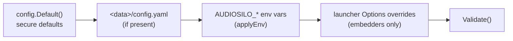

Configuration is loaded by `internal/config` and layered in a fixed order.
Later layers override earlier ones, and the result is validated before use:

```mermaid
flowchart LR
    A["config.Default()<br/>secure defaults"] --> B["&lt;data&gt;/config.yaml<br/>(if present)"]
    B --> C["AUDIOSILO_* env vars<br/>(applyEnv)"]
    C --> D["launcher Options overrides<br/>(embedders only)"]
    D --> E["Validate()"]
```

Most keys can also be changed while the server runs, from the admin console's
**Server > Settings** (`PATCH /admin/settings`), which writes them back to
`config.yaml`. A key set by an environment variable or a launcher override is
**locked** there instead. See
[Changing settings at runtime](#changing-settings-at-runtime).

## The config file

- **Location**: `<data-dir>/config.yaml` (`config.Path`). The data directory
  itself comes from the `--data` flag (or `Options.DataDir` for embedders) -
  there is **no environment variable for the data dir**.
- **First run**: when the file does not exist, `config.Load` returns secure
  defaults with `firstRun=true`, and `pkg/launcher` persists them (with any
  Options overrides applied) via `Config.Save`. The file is written `0600`,
  the data dir created `0700`.
- **Annotated template**: `config.example.yaml` in the repo root mirrors this
  reference.

:::note
First-run **admin bootstrap** is keyed off the database (does an admin
exist?), not off config-file existence - pre-supplying a `config.yaml` does
not suppress the credentials banner or the setup wizard.
:::

## CLI flags (`cmd/audiosilo`)

| Flag | Default | Meaning |
|---|---|---|
| `--data` | `./data` | Data directory: config, SQLite database, generated certs, downloaded tools |
| `--ffprobe` | `ffprobe` | Path to ffprobe (durations, chapters, codec detection). **`""` disables it** - the scanner degrades to path-derived metadata and `direct_playable` defaults to true |
| `--ffmpeg` | `ffmpeg` | Path to ffmpeg for on-the-fly transcoding. **`""` disables it** - `?transcode=1` returns 503 and the `transcode` capability reports false |
| `--setup` | `false` | First-run **web setup wizard**: instead of auto-creating the admin and printing credentials once, mint a one-time token and enable the guarded `/setup` page (see [Built-in web UI](web-ui.md)) |

A bare tool name (no path separator) is resolved **next to the server
executable first**, then on `$PATH`; an explicit path is used as-is. If a tool
is enabled but not found locally, the auto-download kicks in (below).

## YAML reference

### Name, update check and listening history

| Key | Type / default | Meaning |
|---|---|---|
| `name` | string, `""` | The server's display name (at most 64 characters, no control characters): `GET /server`'s `name`, the pairing payload's `server_name` (the player's sign-in screen shows it), and the admin console's top bar and System/About pages. Empty means `"AudioSilo"` (`Config.DisplayName`). No environment variable |
| `update_check` | bool, `true` | Let the server ask GitHub Releases once a day whether a newer version exists (`internal/updates`; see [Update check](#update-check)). `false` means no request is ever made |
| `activity.session_days` | int, `400` | How many days raw listening sessions (device, app, time of day, playback mode) are kept before the daily retention job (`pkg/launcher` `retention`, reading the live setting at each run) sums them into `listening_daily` and drops that detail. 30-3650. The default keeps a year of detail for Activity's longest range; Activity reads the daily totals for days past it |
| `server_id` | string, minted | The stable per-install identity (see [`GET /server`](api/reference.md#get-apiv1server)). Minted on first start and never changed; not a setting |

### Server & network

| Key | Type / default | Meaning |
|---|---|---|
| `bind` | string, `"0.0.0.0:8080"` | `host:port` to listen on. Must parse with `net.SplitHostPort` |
| `public_url` | string, `""` | Externally reachable base URL, used in QR pairing payloads, invite links and the launcher's "open this URL" output. Empty → derived per-request from scheme + `Host` header. Also the **away** address the apps use outside the home network (see [Home address](#home-address-lan_url)) |
| `lan_url` | string, `""` | The server's **home** address on the household network, e.g. `http://192.168.1.20:8080`: see [Home address](#home-address-lan_url). Empty → derived per request when the request's `Host` is a home-network host |
| `trusted_proxies` | []string (CIDRs), `[]` | Networks whose `X-Forwarded-For` is trusted when deriving the client IP (which feeds the per-IP rate limiters). Set when running behind a reverse proxy. Each entry must be a valid CIDR |
| `cors_origins` | []string, `[]` | Browser origins granted CORS (methods `GET, POST, PUT, PATCH, DELETE, OPTIONS`). Empty = no cross-origin headers at all (native apps and same-origin web still work); `"*"` disables the check entirely. Needed for a hot-reload frontend dev server, e.g. `http://localhost:8081` |
| `max_upload_bytes` | int64, `2147483648` (2 GiB) | Reserved for the planned `POST /uploads` (Phase B) - **not yet enforced**; JSON request bodies use a fixed 1 MiB cap regardless |

#### Home address (`lan_url`)

`lan_url` (`AUDIOSILO_LAN_URL`, console **Settings > General > Home address**,
`general.lan_url`; it applies without a restart) is the server's address on the home
network, an absolute `http(s)` address with no query or fragment. With `public_url` (the
**away** address) it makes the `addresses` capability: the apps learn both when they pair
(and from [`GET /addresses`](api/reference.md#get-apiv1addresses) afterwards) and switch
to the home address whenever they can reach it, using `public_url` when away. Wire shape
and where it appears: [Home and away addresses](api/reference.md#home-and-away-addresses).

`config.Addresses(scheme, host)` is the pure core, wrapped per request by `api.addresses(r)`:

- `away` is `public_url` without a trailing `/`.
- `home` is `lan_url`, or, when that is empty, `scheme://Host` of **this request** when
  `isHomeNetworkHost(Host)`: a private IP (RFC 1918, IPv6 ULA `fc00::/7`), a
  link-local one, or a name ending in `.local`, `.lan`, `.home.arpa` or `.internal`, or a
  single-label name. A bare IPv6 host is written in brackets in the address. Never loopback (`127.0.0.0/8`, `::1`, `localhost`): no other device can reach it.
  Never carrier-grade NAT space (`100.64.0.0/10`, which Go's `IsPrivate` leaves out): it
  is the ISP's network, not the household's. The scheme follows the same rule as the
  pairing `base_url` (`https` on a TLS connection, else `http`), and `X-Forwarded-*` is
  not trusted. A request that came through a reverse proxy (it carries `Forwarded` or
  any `X-Forwarded-*` header) never derives a home address: its `Host` is the proxy's
  upstream, not an address a device can use.
- A `home` equal to the `away` is dropped.

:::caution Reverse proxies and the derived home address
Behind a reverse proxy the server derives no home address at all, because the request's
`Host` is the proxy's upstream (a container name such as `audiosilo:8080`, a bridge IP,
plain `http` behind TLS). Set `lan_url` to give the apps a home address; a configured
`lan_url` applies to proxied requests as usual.
:::

### TLS (`tls.*`)

| Key | Type / default | Meaning |
|---|---|---|
| `tls.mode` | `off` \| `selfsigned` \| `autocert`, default `selfsigned` | `off` = plain HTTP (use behind a TLS-terminating proxy); `selfsigned` = generate & persist a self-signed cert (LAN default); `autocert` = Let's Encrypt via ACME |
| `tls.hosts` | []string, `[]` | autocert: hostnames to obtain certificates for. **Required when mode is `autocert`** |
| `tls.cache_dir` | string, `<data>/certs` | autocert: certificate cache directory (re-defaulted to `<data>/certs` whenever empty) |
| `tls.cert_file` / `tls.key_file` | string, `""` | selfsigned: explicit paths for the persisted cert/key. Empty → `<data>/selfsigned-cert.pem` / `<data>/selfsigned-key.pem` |

Mode-related behaviors worth knowing: HSTS
(`Strict-Transport-Security`) is sent **only** in `autocert` mode - never for
`selfsigned` (pinning HSTS would make the certificate warning impossible to
bypass), and with `off` the proxy owns HSTS. In `autocert` mode the server
logs a warning when `bind` is not on port 443, since ACME validation will
fail otherwise.

### Web player & app links

| Key | Type / default | Meaning |
|---|---|---|
| `web_dir` | string, `""` | Directory of the prebuilt web player served at `/web`. Empty (and no embedded player) → `/web` unmounted and the `web_player` capability reports false. The Docker image bakes a pinned build at `/app/web` |
| `app_links.apple_app_ids` | []string, `[]` | `"<TEAMID>.<bundleId>"` entries for `/.well-known/apple-app-site-association` |
| `app_links.android_package` | string, `""` | Android package name for `/.well-known/assetlinks.json` |
| `app_links.android_sha256` | []string, `[]` | Signing-cert SHA-256 fingerprints (colon-separated uppercase hex) |

The well-known endpoints 404 until the relevant identifiers are set - see
[Built-in web UI](web-ui.md). `app_links` is **YAML-only** (no env override).

### Libraries

| Key | Type / default | Meaning |
|---|---|---|
| `libraries[].name` | string, required | Display name; must be unique across the list |
| `libraries[].root` | string, required | Local filesystem root of the library (mount network shares first - roots are always local paths) |

Config-declared libraries are **upserted by name** into the database at every
startup (`syncLibraries`, roots made absolute) and scanned in the background;
libraries can equally be created at runtime through the admin API, in which
case they live only in the database. There is deliberately **no layout key**
- folder shape is auto-detected per folder by the
[scanner](scanner.md), with per-folder admin overrides for corrections.

A library's **scan schedule** and **ignore rules** have no config key either:
they are per-library settings stored in the database and edited in the admin
console (or `PATCH /admin/libraries/{id}`). The startup sync only updates a
config-declared library's `root` and default view, so those settings survive
restarts. See [Scheduled scans](scanner.md#scheduled-scans) and
[Ignore rules](scanner.md#ignore-rules).

### Demo mode (`demo.*`)

| Key | Type / default | Meaning |
|---|---|---|
| `demo.enabled` | bool, `false` | Let unauthenticated visitors mint throwaway accounts via `POST /api/v1/demo/session`; the site root then redirects to `/web/demo` when a player is mounted |
| `demo.library` | string, `""` | Name of the library demo users are granted. **Required when demo is enabled** (a missing library is also warned about at boot) |
| `demo.max_users` | int (optional), unset | Cap on concurrent live demo accounts. **Unset → safe default 200** (`config.DefaultDemoMaxUsers`); **explicit `0` = unlimited** (opt-in risk: per-IP creation limits are bypassable by rotating IPs) |
| `demo.idle_ttl` | duration string, `"24h"` | Reap demo accounts idle longer than this (background reaper sweeps every 15 min). Must parse as a positive `time.Duration`; empty falls back to 24h |

### Community metadata (`metadata.*`)

The server can enrich a book with a description, production details and its
series by resolving the book's ASIN/ISBN against the community metadata API
([meta.audiosilo.app](https://meta.audiosilo.app)) and serving the result at
`GET /libraries/{id}/meta` (players draw it as an "About this book" block plus
the recaps/characters/series tabs). The same config also gates
`GET /meta/work?id=…`, which passes a single work document through so a player
can catch a listener up on the earlier books of a series. The lookup is
server-side by design - one cached seam, and one config key that turns off all
outbound calls.

| Key | Type / default | Meaning |
|---|---|---|
| `metadata.enabled` | bool, `true` | Turn the metadata lookup on. When `false`, the server makes **no outbound metadata calls**, `GET /libraries/{id}/meta` and `GET /meta/work` both return 404, and the `metadata` capability reports false so players hide the enriched-book material entirely. Seeds the initial state only - an admin can flip this at runtime (see below) |
| `metadata.base_url` | string, `"https://meta.audiosilo.app"` | Base URL of the metadata service (the site is served at `/` and the API at `/api/v1`). **Must be an absolute `http`/`https` URL when metadata is enabled** |
| `metadata.region` | string, `""` | The Audible marketplace a community match prefers when a recording sells in several: one of `us`, `uk`, `ca`, `au`, `de`, `fr`, `es`, `it`, `jp`, `in`, `br` (the community metadata's region vocabulary; any case, stored lower case). `""` = no preference: the US store's ASIN first. Orders each match candidate's `asins` (preferred store's, then `us`, then the rest), breaks a runtime tie between recordings for the one selling there, and is what a [bulk match](api/reference.md#bulk-community-matching) repick looks for. Applies live |

`metadata.enabled` applies **live**: an admin can switch the lookup on or off
from the console's **Server > Settings > Community metadata** (or via
[`PATCH /admin/settings`](api/reference.md#patch-apiv1adminsettings)) with no
restart, and the change is written back to `config.yaml`. When
`AUDIOSILO_METADATA_ENABLED` is set it wins at every start and the console
shows the switch as locked. `metadata.base_url` is also editable there but is a
**restart** setting: the metadata service (`meta.Service`) is built once at
start from the boot value, and whether one was built (a valid absolute
`http(s)` URL) decides whether the feature is *available* at all. The switch can
only turn the lookup on when a service exists (else `400 invalid_setting`
with `field: "metadata.enabled"`).

Turning it off is the one-key privacy switch: with the lookup disabled the server
never contacts the metadata service, and every player connected to it stops
showing the section (they gate on the `metadata` capability). Enrichment is
strictly additive and cached - a slow or unreachable service degrades to no
section, never a broken page.

#### The persistent cache

Answers are cached twice: in memory (24 h for a match, 1 h for "no match", 2 min
for a service error; about 2,048 entries) and, behind that, in the server's own
database, in the `meta_cache` table (migration `0024`; see
[Data model](data-model.md#community-metadata-cache)). The second level is what
makes the cache survive a restart and an outage:

- **What it holds:** a book's enrichment (a match, a "no match", or an envelope
  missing a series rail, the last for 2 minutes only and never over a stored
  answer, which stays the outage fallback) keyed by its ASIN or ISBN, and works
  fetched by id (`/meta/work`, and the previous books `/meta` adds), matches only.
  Never a service error, and never a row for an unknown work id (an id is the
  caller's choice, so storing misses would let any user grow the table); a `404`
  for a work already stored replaces its row, so a dropped work isn't served again
  in a later outage.
- **How it is read:** after a memory miss. A row still within its TTL is served
  and warms memory for the rest of that TTL. A match past its TTL is not served
  while the service answers, but when the service fails it is served anyway
  (however old) and held in memory for 2 minutes, so the service is asked again
  soon.
- **Rows from elsewhere are ignored:** each row records the payload format and
  the `metadata.base_url` it came from, so pointing the server at another
  metadata service never serves the old service's answers.
- **Writes are bounded:** a row write waits at most 250 ms for the database's
  single writer (a scan can hold it); one cut short costs only the row, never the
  response.
- **Placement reads it too:** placing a caller's books on the rails reads each
  book's known work id from memory, else from its stored row, fresh or stale, so
  which entry a book lands on doesn't change with a restart.
- **Retention:** the daily retention job keeps the newest 20,000 rows (a few KiB
  of JSON each), of which works fetched by id keep at most their newest 2,000, so
  browsing many works never pushes the books' enrichments out.
- **No config key:** the cache is read and written only by the metadata service,
  so it follows `metadata.enabled`: with the lookup off, nothing is read from it
  or written to it. Rows already there are kept (retention only trims the table
  to its newest rows) and unused until the lookup is switched back on.
- **Privacy:** it holds community data only - the metadata service's public
  answers keyed by ASIN, ISBN or work id. No user, progress, path or library
  information is stored in it; which books a user owns is worked out per
  request and never cached. Like every table, it is part of a database backup.

### Backups (`backups.*`)

Copies of the database (`internal/backup`; see
[Backups, audit log and notifications](backups-and-notifications.md#backups-internalbackup)).

| Key | Type / default | Meaning |
|---|---|---|
| `backups.schedule` | string, `"daily:03:00"` | When scheduled backups run, in the server's local time zone: `""` (none), `daily:HH:MM` or `weekly:DAY:HH:MM` (`DAY` is `mon`, `tue`, `wed`, `thu`, `fri`, `sat` or `sun`; hour and minute two digits each) |
| `backups.keep` | int, `7` | How many **scheduled** backups to keep, 1-365; the oldest past it is deleted after each scheduled backup. Manual and before-restore backups are never deleted by it |
| `backups.dir` | path, `""` | The backups folder; empty means `<data>/backups`. Must be an absolute path. Read at start, and never set from the console: a backup holds every account's password hash, and retention deletes files in it |

Point `backups.dir` at another disk (a NAS mount, a second drive) so a backup
outlives the disk the server runs from. The folder is created `0700` and each
backup is written `0600`.

## Environment variables

`applyEnv` overrides a fixed set of keys from `AUDIOSILO_*` variables, driven
by the settings table in `internal/config/settings.go` (`fields`: each entry's
`env`). This is the complete list (anything not here, e.g. `name`,
`app_links`, `libraries`, `tls.cert_file`, has no env override):

| Variable | Overrides | Format |
|---|---|---|
| `AUDIOSILO_BIND` | `bind` | `host:port` |
| `AUDIOSILO_PUBLIC_URL` | `public_url` | URL |
| `AUDIOSILO_LAN_URL` | `lan_url` | URL |
| `AUDIOSILO_WEB_DIR` | `web_dir` | path |
| `AUDIOSILO_TLS_MODE` | `tls.mode` | `off` / `selfsigned` / `autocert` |
| `AUDIOSILO_TLS_HOSTS` | `tls.hosts` | comma-separated list |
| `AUDIOSILO_TRUSTED_PROXIES` | `trusted_proxies` | comma-separated CIDRs |
| `AUDIOSILO_CORS_ORIGINS` | `cors_origins` | comma-separated origins |
| `AUDIOSILO_MAX_UPLOAD_BYTES` | `max_upload_bytes` | integer |
| `AUDIOSILO_DEMO_ENABLED` | `demo.enabled` | `strconv.ParseBool` (`true`/`1`/…) |
| `AUDIOSILO_DEMO_LIBRARY` | `demo.library` | string |
| `AUDIOSILO_DEMO_MAX_USERS` | `demo.max_users` | integer (`0` = unlimited) |
| `AUDIOSILO_DEMO_IDLE_TTL` | `demo.idle_ttl` | Go duration, e.g. `24h` |
| `AUDIOSILO_METADATA_ENABLED` | `metadata.enabled` | `strconv.ParseBool` (`true`/`1`/…) |
| `AUDIOSILO_METADATA_BASE_URL` | `metadata.base_url` | URL |
| `AUDIOSILO_METADATA_REGION` | `metadata.region` | marketplace code (`uk`) |
| `AUDIOSILO_UPDATE_CHECK` | `update_check` | `strconv.ParseBool` (`false`/`0`/… turns it off) |
| `AUDIOSILO_SESSION_DAYS` | `activity.session_days` | integer, 30-3650 |
| `AUDIOSILO_BACKUP_SCHEDULE` | `backups.schedule` | `""`, `daily:HH:MM` or `weekly:DAY:HH:MM` |
| `AUDIOSILO_BACKUP_KEEP` | `backups.keep` | integer, 1-365 |
| `AUDIOSILO_BACKUP_DIR` | `backups.dir` | absolute path |

List values are split on commas with whitespace trimmed and empties dropped
(`splitList`). Numeric/boolean variables that fail to parse are **silently
ignored** (the underlying key keeps its previous value) - only `Validate`
catches downstream inconsistencies.

**The environment wins, and stays out of the file.** `Load` remembers which
keys a variable set (`Config.fromEnv`) and the file's own values before the
environment was applied (`Config.file`). Two things follow:

- The admin console shows such a setting as locked ("Set by
  `AUDIOSILO_TLS_MODE`"), and `PATCH /admin/settings` refuses to change it
  (`409 setting_locked`).
- `Config.Save` writes `config.yaml`'s own value for those keys, never the
  environment's. A value supplied by a variable therefore never ends up in the
  file, and removing the variable later brings the file's value back.

## Changing settings at runtime

The admin console's **Server > Settings** (over
[`GET`/`PATCH /admin/settings`](api/reference.md#admin-settings)) edits most of
the keys above. The settings table in `internal/config/settings.go` is the one
place that says, for each key, its console id (`<section>.<name>`, which is
also where it sits in the envelope), its variable, whether a change waits for a
restart, and whether the console may change it at all:

| Setting id | Key | Variable | Takes effect |
|---|---|---|---|
| `general.name` | `name` | - | at once |
| `general.public_url` | `public_url` | `AUDIOSILO_PUBLIC_URL` | at once |
| `general.lan_url` | `lan_url` | `AUDIOSILO_LAN_URL` | at once |
| `general.update_check` | `update_check` | `AUDIOSILO_UPDATE_CHECK` | at once |
| `general.session_days` | `activity.session_days` | `AUDIOSILO_SESSION_DAYS` | at the next daily retention run |
| `network.bind` | `bind` | `AUDIOSILO_BIND` | restart |
| `network.tls_mode` | `tls.mode` | `AUDIOSILO_TLS_MODE` | restart |
| `network.tls_hosts` | `tls.hosts` | `AUDIOSILO_TLS_HOSTS` | restart |
| `network.trusted_proxies` | `trusted_proxies` | `AUDIOSILO_TRUSTED_PROXIES` | at once |
| `network.cors_origins` | `cors_origins` | `AUDIOSILO_CORS_ORIGINS` | at once |
| `players.web_dir` | `web_dir` | `AUDIOSILO_WEB_DIR` | restart; **read-only** in the console |
| `players.apple_app_ids` | `app_links.apple_app_ids` | - | at once |
| `players.android_package` | `app_links.android_package` | - | at once |
| `players.android_sha256` | `app_links.android_sha256` | - | at once |
| `metadata.enabled` | `metadata.enabled` | `AUDIOSILO_METADATA_ENABLED` | at once |
| `metadata.base_url` | `metadata.base_url` | `AUDIOSILO_METADATA_BASE_URL` | restart |
| `demo.enabled` | `demo.enabled` | `AUDIOSILO_DEMO_ENABLED` | restart |
| `demo.library` | `demo.library` | `AUDIOSILO_DEMO_LIBRARY` | at once |
| `demo.max_users` | `demo.max_users` | `AUDIOSILO_DEMO_MAX_USERS` | at once |
| `demo.idle_ttl` | `demo.idle_ttl` | `AUDIOSILO_DEMO_IDLE_TTL` | restart |
| `backups.schedule` | `backups.schedule` | `AUDIOSILO_BACKUP_SCHEDULE` | at once |
| `backups.keep` | `backups.keep` | `AUDIOSILO_BACKUP_KEEP` | at once (pruning at the next scheduled backup) |
| `backups.dir` | `backups.dir` | `AUDIOSILO_BACKUP_DIR` | restart; **read-only** in the console |

Not in the console: `max_upload_bytes` (it has a variable but no setting),
`tls.cache_dir`, `tls.cert_file`/`tls.key_file`, `server_id`, and `libraries`
(libraries are managed on the console's Libraries page and live in the
database). The ffmpeg/ffprobe paths are CLI flags; the console's Transcoding
topic only shows what was found.

**Locked settings.** A setting is locked when an `AUDIOSILO_*` variable set it
(see [Environment variables](#environment-variables)) or a launcher override
pinned it (`Config.Pin`, called by `applyOverrides` for `bind`, `tls.mode` and
`public_url` - the desktop manager's). `Config.Locked` maps each locked setting
id to the variable's name or `"launcher"`; the console says "Set by
`AUDIOSILO_…`" or "Managed by the desktop app" and disables the field.

**Live versus restart.** `api.API` keeps `boot`, the config the server
started with (never changed), and `live`, an `atomic.Pointer[liveConfig]` that
a settings save replaces whole. A `liveConfig` holds two configs: `saved`, what
`config.yaml` now holds (the envelope shows it), and the embedded working
config, `saved.Effective(boot)`: the saved settings with **every restart
setting copied back from `boot`**. Handlers read the working config through
`a.config()`, so a saved restart setting has no effect until the next start,
while everything else applies to the next request: CORS and the trusted-proxy
check (`liveConfig` parses both once per save, not per request), `public_url`
in pairing and invite links, `lan_url` in the home and away addresses, the display name, the well-known app-link files,
the metadata switch (`metadataOn`), the demo library and cap, the backup
schedule and retention (the handler calls `backup.Service.SetSettings`). Things set up
once at start (the listener and TLS in `internal/server`, the `/web` mount and
the site-root demo redirect in `Handler()`, the metadata service built in
`api.New`, the demo reaper's TTL) are only built then, from the config the
server started with. Turning `update_check` on or
off also calls `updates.Checker.SetEnabled`. A saved restart setting whose
value differs from `boot` is listed in the envelope's `restart_pending`
(`Config.RestartPending`) until the server starts with it.

**A save.** `Config.WithSettings(patch, checks)` clones the saved config,
refuses a setting that is unknown, read-only or locked, refuses JSON `null`
for a setting that can't be unset (only a pointer field, `demo.max_users`,
takes it: "enter a value" otherwise), decodes each value into its field, runs that field's normalizer, then `Validate`s the whole config.
It also `Validate`s the config **as `config.yaml` will hold it** (`Config.asSaved`,
what `Save` writes: the file's own values for keys an `AUDIOSILO_*` variable sets),
and refuses a change that turns a valid file invalid, naming the variable. Without
it, a change could save a file that only works while the variable stays set
(`demo.enabled` on from the console, with the library only in
`AUDIOSILO_DEMO_LIBRARY`), and the server would stop starting once the variable
is removed. A file that already leans on the environment doesn't block unrelated
changes.
`config.Checks` carries what the config can't tell by itself: whether a
metadata service exists (metadata can't be switched on without one) and
whether a library has the `demo.library` name (the handler looks it up in the
catalog). A refusal is a `*config.SettingError` naming the setting and the
reason, and nothing is applied (all or nothing). The handler then writes
`config.yaml` with `Config.Save` and swaps `live`, all under `settingsMu`. The normalizers, per setting:

| Setting | Accepted, and how it is stored |
|---|---|
| `name` | trimmed; at most 64 characters, no control characters |
| `public_url`, `lan_url`, `metadata.base_url` | an absolute `http`/`https` address with no query, fragment or user info; trailing `/` dropped; `""` allowed (but `Validate` refuses an empty `base_url` while metadata is on) |
| `bind` | `host:port`, port 1-65535 |
| `tls.hosts` | lowercased host names, no scheme, port or path; `Validate` requires at least one for `autocert` |
| `trusted_proxies` | CIDR ranges; a bare address becomes its one-address range (`10.0.0.2` → `10.0.0.2/32`, IPv6 `/128`) |
| `cors_origins` | `*`, or `scheme://host[:port]` with nothing after it, lowercased |
| `app_links.apple_app_ids` | `TEAMID.bundle.id` (a 10-character uppercase team ID) |
| `app_links.android_package` | a Java-style package name (`com.example.app`) or `""` |
| `app_links.android_sha256` | 32 colon-joined hex pairs, uppercased |
| `demo.library` | trimmed; must be the name of an existing library |
| `demo.max_users` | `null` (the default, 200) or 0 (no limit) to 100000 |
| `demo.idle_ttl` | `""` (24h) or a positive Go duration |
| `backups.schedule` | `""`, `daily:HH:MM` or `weekly:DAY:HH:MM` (`backup.ParseSchedule`), stored in canonical form |
| `backups.keep` | an integer from 1 to 365 (checked by `Validate`) |

Every list is trimmed, with empty entries and repeats dropped, and holds at
most 50 entries.

`Config.Save` writes the saved config, but keeps `config.yaml`'s own value for
every key the environment set (as above) and every key a launcher pinned
(`bind`, `tls.mode`, `public_url` and the launcher's library list). The one
exception is the save that creates `config.yaml` (first run), which records the
pinned values; later saves leave them as the file has them. So a console save
never writes an environment variable's or the desktop app's override into the
file.

## Update check

`internal/updates` asks GitHub Releases whether a newer server exists, for the
console's Server > About and Health > System. `pkg/launcher` starts one
`updates.Checker` (`Run`) with the configured `update_check`:

- While on, it checks a minute after the server starts, then whenever the last
  request is a day old (it wakes hourly to see). Turning the setting on wakes
  it, so it checks at once if the last request is more than a day old.
- Each request is a plain `GET` of
  `https://api.github.com/repos/KodeStar/audiosilo-server/releases/latest` with
  `Accept: application/vnd.github+json` and `User-Agent: AudioSilo/<version>`,
  conditional on the last answer's `ETag` (`If-None-Match`; a `304` doesn't
  count against GitHub's unauthenticated limit of 60 an hour per IP). Nothing
  else is sent: no server id, no library or user data.
- A manual check (`POST /admin/update/check`) within a minute of the last
  request answers with that request's result instead of asking again.
- Drafts, prereleases and a release whose page isn't on `github.com` are
  ignored (`bad_response`). A local build (`version` `"dev"`) isn't comparable,
  so it never reports an update.
- While off, no request is made at all, and a manual check is refused
  (`409 update_check_off`).

## Validation & secure defaults

`Config.Validate` runs after all layers (and **again** after launcher
overrides). It rejects:

- an empty data dir; a `bind` that isn't `host:port`;
- an unknown `tls.mode`; `autocert` without `tls.hosts`;
- any `trusted_proxies` entry that isn't a valid CIDR;
- a library with an empty name or root, or a duplicate library name;
- demo mode without `demo.library`; a `demo.idle_ttl` that doesn't parse or
  isn't positive (rejected loudly rather than silently replaced by 24h);
- metadata enabled with an empty or non-absolute-`http(s)` `metadata.base_url`;
- a `backups.schedule` that isn't one of the forms above, a `backups.keep`
  outside 1-365, or a `backups.dir` that isn't an absolute path.

Secure-by-default choices baked into `Default()` and first-run: TLS on
(`selfsigned`) out of the box, no default passwords (credentials are minted
and printed once, or set via the guarded setup wizard), config written
`0600`, no trusted proxies and no CORS grants until configured. See
[Auth & security](auth-and-security.md) for the app-layer hardening these
feed into.

## Launcher `Options` (for embedders)

`pkg/launcher.Run(ctx, opts)` is the shared run loop used by both the
headless `audiosilo` command and the desktop manager, which runs the server
in-process (see
[Manager server integration](../manager/server-integration.md)). The full
`Options` surface:

| Field | Type | Meaning |
|---|---|---|
| `DataDir` | string | Config/database/certs directory (as `--data`) |
| `FFprobePath` / `FFmpegPath` | string | Tool paths; `""` disables the tool (as the flags) |
| `Log` | `*slog.Logger` | Logger; nil → default stderr text logger |
| `Setup` | bool | Select the first-run flow: `false` = auto-admin + printed banner; `true` = token-guarded `/setup` wizard |
| `OnURL` | `func(url string)` | Called once at startup with the URL to open: the token-carrying `/setup#token=…` while first-run setup is pending, else `<base>/web` when a player is available, else `<base>/admin`. A GUI launcher uses it to open a browser |
| `Bind` | string | Config override for `bind` (e.g. `"127.0.0.1:8080"`) |
| `TLSMode` | string | Config override for `tls.mode` (`"off"`/`"selfsigned"`/`"autocert"`) |
| `PublicURL` | string | Config override for `public_url` (e.g. a Cloudflare Tunnel URL) |
| `Libraries` | `[]launcher.Library` (`{Name, Root}`) | When **non-nil**, replaces the configured libraries wholesale (`launcher.Library` mirrors `config.Library` so external modules don't import an internal type) |

Override semantics (`applyOverrides`): empty/zero fields are ignored, so the
headless command - which sets none - gets the file's configuration verbatim.
Overrides are layered on top of the loaded `config.yaml`, then the config is
**re-validated** (a malformed override fails startup rather than baking an
unbootable file). Each override is also pinned (`Config.Pin`, `libraries`
included), so the console shows `bind`, `tls.mode` and `public_url` as "Managed
by the desktop app" rather than offering a change the next start would undo.
On first run, the config **including overrides** is what gets persisted to
`config.yaml`; on later runs overrides apply in memory only, and a settings save
from the admin console keeps the file's own values for the pinned keys (see
[Changing settings at runtime](#changing-settings-at-runtime)).

The base URL that `OnURL` (and the startup banners) use is `public_url` when
set; otherwise it is derived from `tls.mode` (scheme) and `bind` - a wildcard
bind (`0.0.0.0`/`::`) becomes `localhost`, which is both reachable on the
host and a secure context for the admin PWA.

## ffmpeg/ffprobe resolution & auto-download

The binaries are **not bundled** (large, and usually already present).
`pkg/launcher.resolveTools` resolves each enabled tool in order:

1. an **explicit path** from the flag/Options;
2. a copy **next to the server executable** (bare names only; `.exe` appended
   on Windows) - so a tool dropped beside the binary is found without
   touching `PATH`;
3. **`$PATH`** (`exec.LookPath`).

Only when an enabled tool is found nowhere locally does the launcher fall
back to `internal/toolfetch.Ensure`, which downloads a static build into
**`<data>/tools/`** and reuses it forever (one archive download yields both
tools):

- **Sources are pinned and HTTPS-only**: BtbN's `FFmpeg-Builds` GitHub
  release assets for Linux/Windows (amd64 + arm64; `tar.xz`/`zip`), and
  evermeet.cx per-tool zips for macOS (x86_64 builds - they run under
  Rosetta 2 on Apple Silicon, which is fine to exec from an arm64 server).
- **Self-check**: every downloaded binary must successfully run `-version`
  (15 s timeout) before it is adopted; a failing binary is deleted.
- **Hardening**: extraction only takes files named `ffmpeg`/`ffprobe`
  (basename-only, so no zip-slip), capped at 300 MiB per binary
  (decompression-bomb guard). Pinning per-asset SHA-256 is noted in the
  package as a future hardening step.
- **Graceful degradation**: offline, an unsupported platform, or a failed
  check just means running without the tool - chapters/durations and codec
  detection off without ffprobe, transcoding off without ffmpeg - with a
  warning logged and a retry on the next start. Nothing is fatal.

## What ends up in the data directory

| Path | What it is |
|---|---|
| `<data>/config.yaml` | This configuration (written on first run) |
| `<data>/audiosilo.db` | The SQLite index - rebuildable; the filesystem is the source of truth (see [Data model](data-model.md)) |
| `<data>/certs/` | autocert certificate cache |
| `<data>/selfsigned-cert.pem`, `<data>/selfsigned-key.pem` | Persisted self-signed certificate (mode `selfsigned`, default paths) |
| `<data>/tools/` | Auto-downloaded ffmpeg/ffprobe, when no local copy was found |
| `<data>/backups/` | Database backups (`audiosilo-<UTC time>-<kind>.db`), unless `backups.dir` puts them elsewhere |
| `<data>/restore.json` | A restore waiting for the next start (removed when it is applied or refused) |
| `<data>/restore-result.json` | How the last restore went |
| `<data>/audiosilo.db.before-restore-<time>` | Only when a restore couldn't copy the database it replaced: that database's files, renamed aside |
