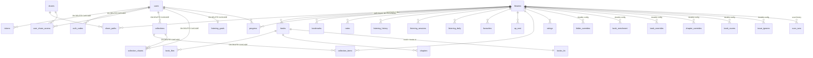

The schema lives in `internal/store/migrations/` as numbered SQL files
(`0001_init.sql` … `0031_annotation_lists.sql`), embedded into the binary and
applied by `store.Open` at startup. This page documents the **resulting current
schema**, noting which migration added what.

## The two halves: rebuildable index vs durable state

The schema is deliberately split in two, and the split is the most important
thing to understand before touching it:

- The **rebuildable index** - `books`, `book_files`, `chapters`, `books_fts` -
  is a cache of what the scanner found on disk. It can be dropped and rebuilt
  from a rescan at any time. `books.id` is an internal artifact of this half:
  it must **never** appear in the API contract or in durable user state.
- **Durable state** - `progress`, `bookmarks`, `notes`, `listening_history`,
  `listening_sessions`, `listening_daily`, `favourites`, `up_next`,
  `collection_items` and `ratings` (per-user), plus `folder_overrides`, `book_enrichment`,
  `issue_ignores`, `book_overrides`, `chapter_overrides` and `book_covers`
  (per-library config) - is keyed by **`(library_id, rel_path)`**, with **no
  foreign key to `books`**. The rest of a listener's own state hangs off the
  account rather than a path: `collections`, `collection_shares` and
  `listening_goals` (see [Lists, ratings and goals](#lists-ratings-and-goals)).

A third, small group sits beside the index: **`scan_runs`**, the history of
the scans that built it. It is a record of the index, not durable user state,
so it goes with its library and is trimmed to the newest runs.

The server's own records - the admin audit log, the notification destinations
and the event feed (`0019`) - belong to neither half: they hang off no library
or book, and are trimmed by age (see
[Audit and notifications](#audit-and-notifications)). Nor does the community
metadata cache (`meta_cache`, `0024`): answers from the metadata service, keyed
by identifier and rebuildable by asking again (see
[Community metadata cache](#community-metadata-cache)).

Why no FK across the seam? Three reasons, all load-bearing:

1. **Rebuild survival.** If durable state referenced `books.id`, deleting and
   re-indexing a library (or the prune step of a normal scan) would cascade
   away every user's progress. Path keys survive because the scanner re-creates
   the same `rel_path`s.
2. **Re-tagging survival.** Fixing a book's tags changes its indexed metadata
   but not its path, so state keyed by path is untouched. The same holds for an
   admin's metadata edits: they are path-keyed rows, not columns of the index.
3. **Pre-index writes.** A client can start playing a book the background scan
   hasn't reached yet (the filesystem view needs no index); progress saved at
   that moment has no `books` row to reference.

The remaining gap - a file that *moves* on disk - is covered by move-tracking:
the scanner fingerprints files (`books.content_hash`) and calls
`catalog.MoveDurableState` to carry all fifteen path-keyed book tables (everything
above except `folder_overrides`, which is keyed by folder, not book) from the
old path to the new one (see [Scanner](scanner.md#move-detection)). A folder
whose disc folders an admin joins into one book hands the disc books' state to
the joined book the same way (`catalog.JoinDurableState`; see
[Joined books](scanner.md#joined-books-disc-sets)).

```mermaid
erDiagram
    users ||--o{ tokens : "ON DELETE CASCADE"
    users ||--o{ auth_codes : "ON DELETE CASCADE"
    users ||--o{ user_share_access : ""
    shares ||--o{ share_paths : ""
    shares ||--o{ user_share_access : ""
    libraries ||--o{ share_paths : ""
    libraries ||--o{ books : "rebuildable index"
    books ||--o{ book_files : ""
    books ||--o{ chapters : ""
    books ||--|| books_fts : "rowid = books.id"
    libraries ||--o{ progress : "path-keyed, NO FK to books"
    libraries ||--o{ bookmarks : ""
    libraries ||--o{ notes : ""
    libraries ||--o{ listening_history : ""
    libraries ||--o{ listening_sessions : ""
    libraries ||--o{ listening_daily : ""
    libraries ||--o{ favourites : ""
    libraries ||--o{ up_next : ""
    libraries ||--o{ collection_items : ""
    libraries ||--o{ ratings : ""
    users ||--o{ collections : "ON DELETE CASCADE"
    collections ||--o{ collection_items : "ON DELETE CASCADE"
    collections ||--o{ collection_shares : "ON DELETE CASCADE"
    users ||--o{ collection_shares : "ON DELETE CASCADE"
    users ||--o| listening_goals : "ON DELETE CASCADE"
    libraries ||--o{ folder_overrides : "durable config"
    libraries ||--o{ book_enrichment : "durable config"
    libraries ||--o{ book_overrides : "durable config"
    libraries ||--o{ chapter_overrides : "durable config"
    libraries ||--o{ book_covers : "durable config"
    libraries ||--o{ issue_ignores : "durable config"
    libraries ||--o{ scan_runs : "scan history"
    users ||--o{ progress : ""
```

:::warning
When adding a new per-user or per-library-config table, follow the pattern: key
it on `(user_id, library_id, rel_path)` or `(library_id, path)`, FK only to
`users`/`libraries` (with `ON DELETE CASCADE`), never to `books` - and add a
line where moves carry it along: a per-user table to `carryListeningState`
(`catalog/listening.go`, the one list, shared by moves and joins), a book's own
config to `moveBookState` (and to `joinBookState` in `catalog/join.go` if a
joined book should inherit it from its discs).
:::

## Tables

### Accounts & credentials

**`users`** *(0001; `is_demo` added in 0005)* - `id`, `username` (UNIQUE),
`password_hash` (argon2id PHC string; **empty string = password-less account**,
never a hash of `""`), `role` (`'admin'`/`'user'`), `disabled`, `is_demo`,
`created_at`, `updated_at`. `is_demo` flags throwaway demo-mode accounts so the
background reaper deletes by flag, not by username prefix (which could catch a
real account named `demo_*`). There is deliberately **no `last_login` column** -
last activity is derived from `MAX(tokens.last_seen)`.

**`tokens`** *(0001; `auth_code_id` added in 0014; `client_app`,
`client_version`, `client_platform` and `last_ip` in 0018)* - opaque bearer tokens:
`user_id` (FK CASCADE), `token_hash` (UNIQUE - only the SHA-256 hash is
stored), `kind` (`'session'`/`'pairing'`/`'api'`, the last being a user-minted personal
API key whose label rides in `device_name`), `device_name`, `created_at`,
`last_seen` (bumped by authenticated requests, at most once a minute unless the
request's address or `X-AudioSilo-Client` changed: `auth.touchInterval`, so a
progress save isn't also a token write), `expires_at` (NULL = no
expiry), `revoked`, and `auth_code_id` (FK CASCADE to `auth_codes`, NULL for
sessions and unlinked pairing tokens) - a pairing token minted by redeeming a
code is linked to it, inherits its uses/expiry at exchange, and dies with it.
`client_app` / `client_version` / `client_platform` are the newest valid
[`X-AudioSilo-Client`](api/index.md#client-identification-x-audiosilo-client)
header the token sent (`''` until one does - how a client released before the
header reads as an unknown app; a request without the header leaves them
alone), and `last_ip` the address of its newest request. Both are overwritten by
`auth.ResolveRequest` on every authenticated request, never kept as a history,
and the daily retention job blanks `last_ip` on revoked tokens
(`auth.ForgetRevokedAddresses`), so an address is kept only while the device is
signed in.
The admin console lists live session and API-key tokens as **devices**
(`auth.ListDevices`) and can revoke one (`auth.RevokeDevice`).

**`auth_codes`** *(0001; `kind` + `redeemed_at` added in 0010)* - redeemable
codes: `code_hash` (UNIQUE, SHA-256 of the normalized code), `user_id` (FK
CASCADE), `label`, `max_uses` (0 = unlimited), `uses` (counts devices that
completed exchange - redeeming alone consumes nothing), `expires_at`,
`redeemed_at` (first-exchange stamp, informational), `created_at`, and
`kind`:

- `'invite'` - admin-minted onboarding secret, bounded (default 5 uses / 1 day).
- `'recovery'` - user-owned durable credential (unlimited uses, never expires).

Both redeem through the same path; see
[Auth & security](auth-and-security.md#auth-codes-invite-vs-recovery) for the
lifecycle (supersede-on-mint, rotate, atomic claim).

### Libraries & shares

**`libraries`** *(0001; `layout` **dropped** in 0007; `sort_order` added in
0011; `scan_schedule` and `ignore_patterns` in 0017; `metadata_source` in
0032)* - `id`, `name` (UNIQUE), `root` (an absolute local path),
`default_view`, `sort_order`, `scan_schedule`, `ignore_patterns`,
`metadata_source`, `created_at`. `scan_schedule` is `""` (no
scheduled scans), `every:<N>h` or `daily:HH:MM` (see
[Scheduled scans](scanner.md#scheduled-scans)); `ignore_patterns` holds the
library's [ignore rules](scanner.md#ignore-rules), one pattern per line (`""` =
none); `metadata_source` is `'tags'` (the default, `catalog.MetadataFromTags`)
or `'path'` (`catalog.MetadataFromPath`), how the library's books resolve
their scanned values (see
[Metadata overrides and effective values](#metadata-overrides-and-effective-values)).
All three are admin settings: they are on `GET /admin/libraries` but not on
the player's library JSON (`catalog.Library` tags them `json:"-"`). They live
in the database rather than in the library folder, which the server never
writes to. There is no layout column: library
shape is auto-detected per folder by the scanner, with `folder_overrides` as
the correction mechanism. `sort_order` drives library listing order **and** is
the tiebreaker when de-duplicating copies of the same book that appear in more
than one library (search / recently-added): all else equal, the copy in the
earlier-ordered library wins.

**`shares`** / **`share_paths`** / **`user_share_access`** *(0003, replacing
the dropped `user_library_access`)* - filesystem-based access control. A share
is a named set of path rules; `share_paths(share_id, library_id, path)` grants
a subtree per rule, with `path = ""` meaning the whole library;
`user_share_access` grants shares to users. `shares.read_only` is persisted and
editable but **not yet enforced** (all share access is already read-only -
it gates a future write/upload path). How rules become an enforced `Scope` is
covered in [Auth & security](auth-and-security.md#authorization-shares--scope).

### The rebuildable index

**`books`** *(0001; `added_at` in 0004; `codec` in 0008; `published`,
`description`, `has_cover` and `scanned` in 0016; `scan_error`,
`scan_error_file`, `scan_error_detail` and `suspect_parts` in 0017; `split_parent` in
0022; `cover_art` and `cover_color` in 0023; `released` and `released_checked` in
0037)* - one row per book,
`UNIQUE (library_id, rel_path)`. Columns: `is_folder` (folder book vs
single-file book), identity metadata (`title`, `author`, `series`,
`series_index`, `narrator`), `duration`, `asin`/`isbn` (optional external ids -
present so enrichment/metadata services can attach data without reshaping the
schema), `published` (`YYYY[-MM[-DD]]`) and `description` (only an admin edit or
an accepted community match supplies these today; the scanner reads neither),
`released` (the date the file's tags give, `YYYY[-MM[-DD]]` via
`metadata.ReleaseDate`: usually the recording's, so it is a separate scanned
column, never `published`, read only by the admin list's release-date sort as
the fallback for a book with no `published`) and `released_checked` (`1` once a
scan has read it; a book indexed before 0037 starts at `0` and the next scan
fills `released` with one read of its first file, without re-indexing it),
`cover_path` (a library-relative sidecar image, `""` = fall back to embedded
art), `has_cover` (whether the book has a sidecar image or embedded art; `NULL`
until a scan has checked, and always true when `cover_path` is set -
`UpsertBook` enforces that), `format`, `codec` (ffprobe `codec_name`, `""` when
unknown - drives the `direct_playable` API flag), `size`, `mtime`,
`content_hash`, `indexed_at`, `added_at`, `scanned` (see below), and what the
console's Health page reads:

- `scan_error` - the first problem reading the book's files on its last
  indexing: `unreadable`, `empty_file`, `probe_failed`, or `""` for none;
  `scan_error_file` is the library-relative file and `scan_error_detail` the
  OS's or ffprobe's message (see [Read problems](scanner.md#read-problems)).
- `suspect_parts` - how many separate books a folder book's parts look like:
  `0` = one book, `>= 2` = the folder may hold several, `NULL` = not checked
  yet (see [Folders that may hold several books](scanner.md#folders-that-may-hold-several-books)).
- `split_parent` - for one disc of a book split across disc folders (a CD rip
  read as one book per disc), the folder holding the discs; `''` otherwise. The
  `split_discs` Health issue, the duplicate groups (which leave such discs out)
  and the admin's `split_discs` mark on `GET /fs` read it. Index
  `idx_books_split_parent` on `(library_id, split_parent, rel_path)` (partial,
  `WHERE split_parent <> ''`) finds a folder's discs in order. An unchanged
  book whose value is out of date gets it without a re-index (see
  [Joined books](scanner.md#joined-books-disc-sets)).

Like the rest of the row they are rewritten by every re-index.

Two more columns describe the cover art for the player, both derived and never
user state:

- `cover_art` - the cover's art identity, from index data alone: `c` plus the
  custom cover's `updated_at`, else `f` plus the book's `mtime`, `size` and
  `cover_path` (`catalog.coverArtSQL`; the migration backfills every row with the
  same expression). Every writer of those inputs recomputes it (`UpsertBook`,
  `SetCover`, `DeleteCover`, a move or join carrying a custom cover), and a book's
  first thumbnail of file art replaces it with the image's own version (its
  file's size and mtime), so it follows a sidecar overwritten in place. Never sent;
  the API sends its 10-character hash as the book's `cover_version`
  (`catalog.CoverVersion`).
- `cover_color` - the palette read from a thumbnail, tagged with the
  `cover_version` it was read for: `version bg` or `version bg accent on_accent`
  (lowercase `#rrggbb`, space-separated), `''` for none. It is decoded onto the
  book only while the tag is the current `cover_version`, so new art needs nothing
  cleared. It is written compare-and-set on `cover_art` by
  `catalog.RecordCoverColors` (`GET /libraries/{id}/cover?size=` or the console's
  `POST /admin/covers`).

A rebuilt index starts with `cover_art` from index data and no colours.

Two columns deserve emphasis:

- `content_hash` is a **cheap move-detection fingerprint** - SHA-256 of
  (size, first 64 KiB, last 64 KiB) - not an identity and not a full hash.
- `added_at` records when the book *first appeared on disk* (file birth time,
  falling back to mtime; earliest file for folder books). Unlike the
  auto-increment `id` - which a full re-index reshuffles - it is a stable
  chronological key, and `UpsertBook` deliberately never updates it on
  re-index. Index `idx_books_added` supports the "recently added" sort.

The metadata columns (`title` … `isbn`, `published`, `description`) hold the
**effective** values - what readers should show - not necessarily what the scan
found. What the scan found is kept beside them in **`scanned`**, a flat JSON
object of field → value (blank fields left out) plus an `@indexed_at` stamp
(`catalog.scannedStampKey`) holding the `indexed_at` of the upsert that wrote
it; it is the revert target, what the admin console shows next to an edited
value, and - compared with the path - where a value came from.

The stamp guards against a **rollback**: a server older than migration 0016,
run against this database, re-indexes rows with their scanned values in the
columns and leaves `scanned` blank or stale. When the snapshot is blank or its
stamp isn't the row's `indexed_at`, `loadLayers` reads the scanned values off the
row itself (as migration 0016 did) instead of blanking the fields, and
`refreshEffective` records that snapshot, stamped, and backfills the chapters'
`scanned_title` from their titles. See
[Metadata overrides and effective values](#metadata-overrides-and-effective-values).

**`book_files`** *(0001; `codec` in 0016)* - the ordered parts of a folder
book: `book_id` (FK CASCADE), `rel_path`, `seq`, `duration`, `format`, `codec`
(each part's own codec, so a mixed-codec folder shows honestly; admin-only, the
player reads the book-level codec), `size`.

**`chapters`** *(0001; `file_index` + `book_offset` in 0002; `file_path` in
0003; `scanned_title` in 0016)* - normalized playable units, identical in shape
for a chaptered single-file m4b and a folder of mp3 parts: `book_id` (FK
CASCADE), `idx`, `title` (effective - an admin's rename when there is one),
`scanned_title` (what the scan found), `file_index` (ordinal of the containing
file), **`file_path`** (the
library-relative audio file to stream - playback is purely path-based),
`start`/`end` (offsets *within that file*), and **`book_offset`** (the
chapter's start on the whole-book timeline). See
[Scanner](scanner.md#chapter-normalization) for how these are built.

**`books_fts`** *(0001)* - see [FTS design](#fts-design-books_fts) below.

### Durable per-user state (path-keyed, no FK to books)

All re-created in **0003** when identity moved to the path (pre-1.0, so the
tables were rebuilt rather than migrated in place):

- **`progress`** - PK `(user_id, library_id, rel_path)`; `position`,
  `duration`, `finished`, `playback_speed`, `device_id`, `updated_at`, and
  `version` (monotonic, breaks `updated_at` ties), and *(0018)* `started_at`
  (stamped by the first save, then kept) and `finished_at` (stamped when
  `finished` turns on, cleared when it turns off - a restart). Both take the
  save's own `updated_at` (after the plausibility check that substitutes server
  time for a missing, unparseable or future one), so a finish replayed from an
  offline queue is dated when it happened; an edit (`catalog.EditProgress`,
  an admin's or the listener's own) uses server time. Both are normalized to RFC 3339 UTC
  to the second; migration 0018 backfilled `finished_at`
  on finished rows with their `updated_at`, and older rows have no
  `started_at`. The admin reads them (`catalog.ListUserProgress`), the player's
  progress JSON carries them on a server with `progress_edit`, and both edit
  them through `catalog.EditProgress`. Reconciliation is last-write-wins in
  `catalog.SaveProgress`, whose comparison and write are one writer
  transaction (an older save can't overwrite a newer one that landed in
  between); any future realtime layer must reuse that merge. Index `idx_progress_path` *(0016)* on
  `(library_id, rel_path)` serves the per-path lookups the primary key (which
  leads with `user_id`) can't: the admin book page's listeners and
  `MoveDurableState`.
- **`bookmarks`**, **`notes`** - id-PK rows keyed by
  `(user_id, library_id, rel_path)` plus `position` and text (a bookmark's
  `note`, at most `catalog.MaxBookmarkNote` characters; a note's `body`, at most
  `catalog.MaxNoteBody`, and its `updated_at`), checked by `catalog` on every write
  rather than by the schema
  (an edit checks only the fields it sets). `created_at` and `updated_at` are
  server time in a fixed-width UTC millisecond form
  (`2026-10-07T09:00:00.000Z`, `c.stamp`), because the lists across books order
  by them as text.
  `bookmarks.label` *(0030)* is a machine key the player maps to its own text,
  `''` for none: `catalog.checkBookmark` checks only its
  [shape](api/reference.md#get-apiv1librariesidbookmarks--post-apiv1librariesidbookmarks),
  never the player's set of keys. It lives on the row,
  so a move, a backup and a user delete take it along. Indexes
  `idx_bookmarks_user_path` / `idx_notes_user_path` *(0003)* on
  `(user_id, library_id, rel_path)` serve one book's lists, and
  `idx_bookmarks_user_created` / `idx_notes_user_created` *(0031)* on
  `(user_id, created_at)` the caller's lists across books (`GET /me/bookmarks`,
  `/me/notes`, newest first, keyset-paged on `(created_at, id)`; the `id`
  tiebreaker is the rowid every index entry already ends with).
- **`listening_history`** - listening spans (`from_pos`, `to_pos`,
  `started_at`, `ended_at`) that players post when playback stops; the player's
  own History list. The client's times are stored in the same fixed-width UTC
  millisecond form (`historySpan`: one side that doesn't parse takes the other's
  time, neither is the server's now), so a span is never refused. Index `idx_history_user_path` *(0003)* on
  `(user_id, library_id, rel_path, started_at)` serves one book's history, and
  `idx_history_user_ended` *(0031)* on `(user_id, ended_at)` the paged
  `GET /me/history` across books.
- **`listening_sessions`** *(0018)* - one row per listening session, derived
  on the server from progress saves (see
  [Listening sessions](#listening-sessions-how-they-are-derived)): `user_id`
  and `library_id` (FK CASCADE), `rel_path`, `token_id` (the device - **no FK**,
  a session outlives its token's sign-out, so `device_name` and `client_app` /
  `client_version` / `client_platform` are copied onto the row), `started_at` /
  `last_at` (first and newest save; UTC, fixed-width RFC 3339 with milliseconds,
  `catalog.sessionTime`, so they compare as strings), `start_pos` / `end_pos`,
  `duration`, `speed`, `listened` (wall-clock seconds), `codec` (the book's at
  the session's start), `transcoded`, `finished`, `backfilled` *(0021: made from
  `listening_history` spans at the upgrade; also set on imported sessions)*,
  `import_id` *(0034)*. Indexes on `last_at`, `(user_id, id)`,
  `(library_id, rel_path)` and `(token_id, library_id, rel_path, last_at)`,
  `(user_id, last_at)` *(0029)*, and `started_at` and `(user_id, started_at)`
  *(0034)* for the session lists, which order by start (an imported session is
  old but has a new id; see [Listening imports](#listening-imports)).
- **`listening_daily`** *(0018)* - raw sessions past the retention, summed per
  server-local `day` (`YYYY-MM-DD`), `user_id`, `library_id` and `rel_path`:
  `listened` and `sessions`, `estimated` *(0021)* and `import_id` *(0034)*. Device, app, time of day
  and playback mode are dropped. No primary key - a book moving onto a path that already has rows just
  adds rows, and every reader sums.
- **`favourites`** *(0009)* - PK `(user_id, library_id, rel_path)`. A
  favourite may address **any** path: a navigation folder (author/series), a
  book folder, or a single-file book.

### Lists, ratings and goals

The listener's own state behind the player redesign's Phase 1b API (see
[the reference](api/reference.md#up-next-collections-and-ratings)). Each path
column holds a **book's** own `rel_path` (an add resolves a part or disc path
to its book first), with no FK to `books`. Every table hangs off `users`
(directly, or through `collections`) and, where it holds a path, off
`libraries`, all `ON DELETE CASCADE`, so deleting an account or a library purges
its rows. A row whose path is outside its user's
current access is kept and only left out of the responses, as with favourites.

- **`up_next`** *(0025)* - the listener's queue: PK `(user_id, library_id,
  rel_path)`, `position` (its order) and `added_at`. At most 500 rows per user
  (enforced by the API: an add counts the rows its user can see, and evicts the
  oldest hidden rows when only they would overflow it).
- **`collections`** *(0026)* - `id` (`INTEGER PRIMARY KEY AUTOINCREMENT`, so an
  id is never reused), `user_id` (the owner), `name`, `description` (`''`
  default), `created_at`, `updated_at` (moved by a rename, a new description or
  any change to the items). At most 100 per owner.
- **`collection_items`** *(0026)* - PK `(collection_id, library_id, rel_path)`,
  `position` and `added_at`; FK to `collections` (and `libraries`) with
  `ON DELETE CASCADE`. At most 1,000 per collection (counted, and made room for,
  as `up_next`). Indexed on
  `(collection_id, position)` for reading a collection in order.
- **`collection_shares`** *(0026)* - PK `(collection_id, user_id)` and
  `created_at`: who the owner shares a collection with, read-only. FKs to
  `collections` and `users`, both `ON DELETE CASCADE`, so deleting the viewer's
  account removes the share and deleting the owner's removes the collection with
  its items and shares. At most 50 per collection.
- **`ratings`** *(0027)* - PK `(user_id, library_id, rel_path)`; `rating`
  (`INTEGER CHECK (rating BETWEEN 1 AND 5)`), `note` (`''` default, up to 500
  characters), `created_at`, `updated_at`.
- **`listening_goals`** *(0028)* - `user_id` (`INTEGER PRIMARY KEY`, one goal per
  account), `books_per_year` and `updated_at`.

The timestamps of `up_next`, `collections`, `collection_items`, `ratings` and
`listening_goals` (`added_at`, `created_at`, `updated_at`) are fixed-width UTC with
milliseconds (`2026-10-01T09:01:00.000Z`), so they compare as strings. The
`position` column of `up_next` and `collection_items` orders the rows but need not be
dense: a remove leaves a gap, and an add shifts only the rows from its place on, so a
one-book change never rewrites the whole list.

Moves and joins carry the three path-keyed tables through `carryListeningState`
(the one list). Where the destination path is already there (a book moving
onto a path a removed book left rows on, or several discs joining into one
book), `up_next` and `collection_items` keep the destination's row and its
position and drop the moved one, and of two `ratings` the newer `updated_at`
wins the whole row (a tie keeps the destination's).
`collections`, `collection_shares` and `listening_goals` hold no path, so
nothing moves them. All six are part of a database backup (`VACUUM INTO`), like
every table.

### Listening from before sessions

Sessions start at migration 0018, but players have posted
`listening_history` spans (one per stretch of playback, with real wall-clock
times) since June 2026, and `progress` holds where each book was left. Migration
0021 turns that into Activity history, once, at the upgrade:

- **Spans to sessions.** Each person's spans that ended before their first
  recorded session become `listening_sessions` rows with `backfilled = 1`,
  joined into sittings like live sessions (a gap of more than 10 minutes,
  `SessionGap`, starts a new one, using SQLite window functions). A span's
  listening is its wall-clock length, at most twice the position it moved (a
  player left "playing" without moving adds nothing). Device, app and playback
  mode were never recorded: Activity counts these sessions in time, books, people,
  days and hours, but not in `clients` or `playback`, and the console shows them
  as "Listening history". The existing sessions are renumbered above them
  (session ids page the lists newest first; nothing refers to one).
- **The rest, estimated.** For each book a person first saved before 0018
  (`progress.started_at` is only stamped on a row's first save, so it is `NULL`
  for exactly those), the saved position at their speed, less every session
  recorded for it, becomes one `listening_daily` row with `estimated = 1` when it
  is 5 minutes or more. It is dated by the book's first session, or else its last
  save (UTC). Only the position counts, never the whole book for one marked
  finished, which may have been marked, not played. Demo accounts get none.
  Estimates count in a period's totals and top lists, never in a day or an hour,
  and `Activity.estimated` says how much of the period they are.

Listening older than the spans and books played offline only exist as
estimates; nothing can recover which day or device they were.

### Listening sessions: how they are derived

Players already save progress every 15 s while playing, plus on pause, seek
and stop (`PUT /libraries/{id}/progress`). `handlePutProgress` passes each save
to `catalog.RecordHeartbeat` with the token that made it, so a session knows its
device and app and works for every client already shipped. The client-posted
`listening_history` spans can't serve: they arrive only when playback stops,
are dropped while the player is offline, and carry no device.

- **Server time only.** Every time here is when the server received the save;
  the save's own `updated_at` is not used (a device clock can be wrong).
- **Grouping.** A save extends the session the same token last saved on the
  same book when it comes within 10 minutes (`catalog.SessionGap`). After a
  longer gap it still continues the session if the position advanced by about
  the time that passed, at the playback speed (at least 90% of it and at most
  110% plus a minute, so a jump such as "mark finished" hours later is not read
  as listening; `continuousPlayback`), as long as the last save is within 12 hours
  (`resumeWindow`): Android pauses the player's JS timers while the screen is
  off, so the player keeps playing without saving and its next save arrives
  late. Otherwise the save starts a new session.
- **Listened time.** Between two saves, the position advance divided by the
  playback speed, capped by the server time that passed (`listenedBetween`). A
  seek forward is not listening, and a seek back adds nothing. The same cap
  applies to any save, a replay from an offline queue included.
- **Only sessions with listening count.** The first save of a session only
  opens it, so the time before it (about 15 s) isn't counted, and a session with
  no listening recorded (`listened = 0`: a single save, such as a "mark
  finished" or the manager's Audible sync) is left out of the live list, the
  history and every total (`listenedSQL`). A session therefore appears from its
  second save.
- **State.** `playing` with a save in the last 60 s, `paused` until 10 minutes,
  then `ended` (and off the live list). A session continued after a long gap
  reads as `ended` during the gap and comes back with the late save.
- **Transcoded.** `catalog.StreamMarks` remembers in memory which files each
  token streamed with `?transcode=1` in the last 10 minutes; a save on a book
  whose file (or a file inside its folder) is marked flags the session. It
  starts empty after a restart.
- **Best effort.** Recording runs beside the progress write, whether or not
  the save won last-write-wins; a failure is logged and the save still
  succeeds.

**Retention.** Raw sessions are kept for 400 days (`catalog.SessionRetention`,
just over a year so the Activity stats' longest range always reads raw rows).
`launcher.sessionRetention` runs `catalog.PruneSessions` at startup and every
24 hours: sessions whose last save is older are summed into `listening_daily`
(each session counts on the day it started; its listened time is shared
evenly over the hours it spans) and deleted, in batches of 2000, one transaction each.
Sessions with no listening are simply deleted once their last save is older
than `resumeWindow` (they can no longer be continued). The same job blanks the
address of signed-out tokens (`auth.ForgetRevokedAddresses`).

Both tables are path-keyed durable state: they move with the book
(`MoveDurableState`) and are deleted with their user or library by the FK
cascade. The admin API over them is in the
[reference](api/reference.md#admin-activity).

### Listening imports

Migration **0034** lets an admin copy another server's listening history
(v1: Audiobookshelf) into a person's own (`internal/importer`,
`catalog/imports.go`; the routes are in the
[reference](api/reference.md#admin-listening-imports)). What an import writes
is ordinary listening state, marked with the import's id so it can be taken
back out (undo) or replaced (re-import) without touching anything else:

- **`imports`** - one row per (source user, AudioSilo user) import: `user_id`
  (FK CASCADE), `source` (`abs`), `source_url` (the normalised address, never a
  credential), `source_user` / `source_id` (the ABS username and user id),
  `status` (`fetching` | `review` | `applying` | `applied` | `failed` |
  `undone`), `cutoff` (RFC 3339 UTC, `NULL` = none), `created_at`,
  `applied_at`, `summary` and `unmatched` (the review's JSON) and `error` /
  `error_code`. The ABS token is never stored anywhere. Index
  `idx_imports_user` on `(user_id, id)`.
- **`import_payloads`** - PK `import_id` (FK CASCADE): the fetched history,
  gzipped JSON (the user's book items, sessions, progress and bookmarks;
  nothing secret), so a cutoff change and the apply never fetch again. A table
  of its own so reading `imports` never walks a large blob's overflow pages;
  deleted once the import is applied, undone or deleted.
- **`import_id`** on `listening_sessions`, `listening_daily`,
  `listening_history` and `bookmarks` (`INTEGER NOT NULL DEFAULT 0`): `0` is
  everything recorded here, anything else the import that wrote the row.
  Partial indexes (`idx_sessions_import`, `idx_daily_import`,
  `idx_history_import`, `idx_bookmarks_import`, `WHERE import_id <> 0`) serve
  the undo's deletes; live rows are never looked up by it. Each imported
  session also writes one `listening_history` span (its positions, from its
  start to its clamped end), so the players' History and Journal show it.
- **`bookmarks.import_note`** - the note an import wrote on the bookmark, so
  undo can tell an imported bookmark the person has edited or labelled since
  (kept and handed to them: `import_id` 0) from one they haven't (deleted).
- **`import_progress_prior`** - PK `(import_id, library_id, rel_path)`, FKs
  CASCADE to `imports`, `users` and `libraries`: for each progress row an
  import changed, `prior` (the row before, JSON; `NULL` = there was none) and
  `wrote` (the row it left). Path-keyed, so `carryListeningState` moves it
  with a book (a move or a disc join). Index `idx_import_prior_path` on
  `(library_id, rel_path)`.

What an apply writes (one transaction, after undoing the person's previous
applied import from the same source):

- **Sessions** - one `listening_sessions` row per ABS session on a matched book
  that has listening and **started before the cutoff**, with `backfilled = 1`
  (like 0021's: no playback mode, so they stay out of the `clients` and
  `playback` breakdowns), `client_app` `Audiobookshelf`, the ABS device name,
  client version and platform, `token_id` `0`, `speed` `1`. A session's
  listening is capped at 24 hours, and one whose span is under its listening or
  over 3 times it (left open overnight) ends at its start plus its listening.
  Their ids are ordinary, so newer than every live session's although the
  sessions are old: the session lists order by `started_at` (then id), newest
  first, and their `before` cursor is the previous page's last session id,
  continued after that session's `(started_at, id)`. On the wire a session's
  `imported` flag says it came from an import. A session whose (clamped) last
  save is already older than the session retention (`activity.session_days`,
  read when the apply runs, as the daily prune reads it) is written instead as
  the `listening_daily` rows `PruneSessions` would make of it
  (`catalog.daySums`: the same per server-local day, user, book and
  `import_id` grouping, listening spread over the hours its span covers), so a
  mostly-old ABS history doesn't land as sessions only to be rolled up within
  a day. The review summary's `sessions` / `listened` still count every
  imported ABS session.
- **Estimates** - one `listening_daily` row (`estimated = 1`, `sessions = 0`)
  per matched book with ABS progress where ABS's position, at the speed its sessions show (book
  time per second listened, clamped to 0.5-4, else 1), is 5 minutes or more
  beyond all its sessions' listening (0021's rules), dated by ABS's start of
  the book (else its first session) in server time, and kept only when that
  date is before the cutoff. None for a book ABS has as finished with no
  session that recorded listening (before or after the cutoff): ABS sets a
  finished book's position to its end, so a book only marked finished would
  otherwise count as the whole book listened on one day.
- **Bookmarks** - each ABS bookmark on a matched book, unless the person has
  one there with the same text within 2 seconds; the text is cut to
  `catalog.MaxBookmarkNote`.
- **Progress** - fill-only (`importer.mergeProgress`). With no row here, ABS's
  becomes it (unless ABS has nothing), with ABS's last update as `updated_at`.
  With a row, the position and finish move on only when ABS's last update is
  newer than the row's (`SaveProgress`'s last-write-wins rule), never back, and
  the moved row takes ABS's last update; `started_at` becomes the earlier of
  the two, and a finished row with no finish date takes ABS's. A changed row's
  `version` goes up by one, and its before and after go in
  `import_progress_prior`.

The cutoff gates sessions and estimates only. Its default (`"auto"`) is the
person's first listening recorded here (`catalog.ListeningStart`: their
earliest `import_id = 0` session with listening, or the start of their
earliest non-estimated rolled-up day), so a period both servers recorded is
counted once.

**Undo** (and the apply's replacing of the previous import) deletes the
import's sessions, daily rows, history spans and untouched bookmarks by
`import_id`, and restores each `import_progress_prior` row whose progress is
still exactly as the import wrote it (`sameProgress`: path, version,
`updated_at`, position, finish and dates). A restored row gets a version above
the import's. A standalone undo also stamps the server's now as `updated_at`
when the import had moved the row on, so a device that synced the imported row
takes the restored one. A replace restores the row exactly (its own
`updated_at`), so the new import's merge treats it as the review predicted, and
then stamps now only on rows the new import leaves behind. A row someone
changed since keeps theirs.

**Retention** treats imported sessions like any other: `PruneSessions` rolls
sessions past the retention into `listening_daily`, grouping imported ones
apart and keeping their `import_id`, so an undo still finds them. The ones
already past it when the import is applied are written as those daily rows
straight away (above); the rest follow at the daily run once they age out.
Every imported session keeps its `listening_history` span either way (history
is never pruned).

**Restarts.** `catalog.InterruptImports` runs at startup: a `fetching` import
becomes `failed` (`error_code` `interrupted`; its token died with the process),
an `applying` one goes back to `review`.

### Scan history

**`scan_runs`** *(0017)* - one row per library scan the job queue ran:
`id`, `library_id` (FK CASCADE), `trigger` (`manual` | `schedule` | `startup` |
`change`), `started_by` (FK to `users`, `ON DELETE SET NULL`; `NULL` for a
schedule or startup scan), `started_at`, `finished_at` (`NULL` while the scan
runs), `status` (`running` | `ok` | `partial` | `unavailable` | `failed` |
`cancelled` | `interrupted`), the counts `books`, `added`, `updated`, `moved`,
`removed`, `errors`, and `log` (a JSON array of events, at most 300). Index
`idx_scan_runs_library` on `(library_id, id)`. `catalog.FinishScanRun` keeps
only the newest **100** runs of each library, and a row still open when the
server starts is marked `interrupted`. What each field means is in
[Scan history](scanner.md#scan-history-scan_runs).

### Audit and notifications

Added by `0019` for admin console Phase 5b (what writes and reads them is in
[Backups, audit log and notifications](backups-and-notifications.md)). None has
a foreign key, so deleting an account or a library leaves them as they were.

- **`audit_events`** - one row per admin change: `id`, `at`, `actor_id` (no
  FK; `NULL` for the server itself), `actor_name` (the username when it
  happened), `via` (`session` | `api` | `system`), `action`
  (`<area>.<verb>`), `target` (a short human label) and `details` (a JSON
  object; never a secret). No IP address. Indexes `idx_audit_at` on `at` and
  `idx_audit_actor` on `(actor_id, id)`. Kept 365 days and at most the newest
  100,000 (`catalog.PruneAudit`, daily).
- **`notification_targets`** - where notifications go: `id`, `kind`
  (`webhook` | `ntfy` | `discord`), `name`, `url` and `secret` (credentials:
  never returned by the API), `enabled`, `events` (a JSON array of event kinds),
  `created_at`, `updated_at`, and the newest delivery's `last_at`, `last_ok`,
  `last_error` (a short reason). At most 20 rows.
- **`server_events`** - the event feed behind the console's bell and the
  record deliveries are sent from: `id`, `at`, `kind`, `data` (JSON facts; never
  a secret or an IP) and `dedup_key` (an update is announced once per version).
  Indexes `idx_server_events_at` and `idx_server_events_dedup` on
  `(kind, dedup_key)`. Kept 90 days.

Backups need no table: they are files in the backups folder.

### Community metadata cache

**`meta_cache`** *(0024)* - the persistent second level of the community
metadata cache (`internal/meta.Store`, `catalog/metacache.go`): the answers the
in-memory cache holds, so a restart serves them warm and a known book keeps its
enrichment through a metadata-service outage. Columns: `key` (primary key: a
book's enrichment as `a:<asin>` or `i:<isbn>`, a work fetched by id as
`w:<id>`), `version` (the payload's format; a row of another version is
ignored), `source` (the metadata service's base URL the answer came from; a row
from another URL is ignored), `payload` (the answer's JSON, `''` for a cached
"no match"), `expires_at` and `stored_at` (unix milliseconds). Index
`idx_meta_cache_stored` on `stored_at`.

It holds community data only, keyed by identifier, never by a book or a user,
so nothing moves it with a book or purges it with an account, and dropping it
costs one upstream lookup per book. The launcher's daily retention keeps the
newest **20,000** rows by `stored_at` (`catalog.MetaCacheRows`), of which works
fetched by id (`w:` keys, a caller-chosen id) are first trimmed to their own newest
**2,000** (`catalog.MetaCacheWorkRows`), so a walk through the metadata site's
works can't push the books' enrichments out (`catalog.PruneMetaCache`). What is written and when a row is served is in
[Configuration](configuration.md#community-metadata-metadata).

### Durable per-library config (path-keyed, no FK to books)

- **`folder_overrides`** *(0006)* - PK `(library_id, path)`, `mode ∈ {'book',
  'collection'}` (allow-list enforced in `catalog.SetFolderOverride`). Pins a
  folder's detection when the scanner's heuristic gets it wrong: `book` forces
  folder-is-one-book, `collection` forces one book per file.
- **`book_enrichment`** *(0012)* - PK `(library_id, path)`, `asin`, `isbn`,
  `updated_at`. Attached by the manager when it matches an external source
  (e.g. an Audible library) to an indexed book. Writing it never blanks a
  stored field (a blank `asin` or `isbn` keeps the existing one). It survives
  rebuilds because it is layered onto the book row on every re-index (see
  below); an admin's own `asin`/`isbn` edit wins over it.
- **`book_overrides`** *(0016)* - PK `(library_id, path, field)`, `value`,
  `source` (`'edited'` = typed by an admin, `'community'` = accepted from a
  community-metadata match), `updated_by` (FK to `users`, `ON DELETE SET NULL`,
  so an edit outlives its author's account), `updated_at`. One row per edited
  field; `field` is one of `catalog.OverrideFields` (`title`, `author`,
  `narrator`, `series`, `series_index`, `published`, `description`, `asin`,
  `isbn`). Values are validated and normalized by `catalog.normalizeOverride`.
- **`chapter_overrides`** *(0016)* - PK `(library_id, path, file, start_ms)`,
  `title`, `updated_by`, `updated_at`. A chapter-title edit, keyed by the
  chapter's identity rather than its position: `file` is the chapter's audio file
  relative to the book (`""` for a single-file book, so a moved book keeps its
  renames) and `start_ms` its start in that file in milliseconds. A rescan that
  adds or drops chapters elsewhere (a missing intro part turning up) leaves each
  rename on its own chapter. A rename whose chapter no longer exists (the file
  re-encoded with new marks) stays dormant: it never lands on another chapter,
  doesn't count as an edit, and applies again if the chapter comes back. The API
  still addresses chapters by index; the server resolves the index to this
  identity when the edit is made.
- **`book_covers`** *(0016)* - PK `(library_id, path)`, `mime`, `updated_by`,
  `updated_at`, `data` (BLOB, so a revalidation that reads only
  `mime`/`updated_at` never reads past it), then `source` *(0036)*: `edited` for an
  upload, `community` for a cover kept from a community match (the match dialog or a
  bulk run), which [clearing the community matches](api/reference.md#delete-apiv1admincommunity-matches)
  removes; the partial index `idx_book_covers_community` lists those without reading
  an image. A custom cover uploaded in the admin console
  (JPEG, PNG or WebP, at most 5 MiB - `catalog.MaxCoverBytes`). It lives in the
  database rather than the library folder (files stay untouched) or a loose
  data-dir file, so it is path-keyed durable state that moves with
  `MoveDurableState` and is part of any database backup.

- **`issue_ignores`** *(0017)* - PK `(library_id, path, kind)`, `created_by`
  (FK to `users`, `ON DELETE SET NULL`), `created_at`. An admin's "ignore this"
  on a Health issue; `kind` is one of `catalog.IssueKinds` (`scan_error`,
  `suspect`, `split_discs`, `duplicate`, `no_cover`, `unmatched`,
  `no_chapters`, `transcode`). Path-keyed like the rest of this group, so an ignore survives a
  rebuild, moves with the book (`MoveDurableState`) and needn't point at an
  indexed book.

All of these FK to `libraries` with `ON DELETE CASCADE` only, so deleting a
library removes its config, and nothing else does - pruning a vanished book
keeps its edits and cover for the day the path comes back (a custom cover is
only served while a book is indexed at its path).

### Metadata overrides and effective values

A `books` row always holds the **effective** metadata, built in layers:

1. what the scan found (`books.scanned`, `chapters.scanned_title`);
2. then any `book_enrichment` (`asin`/`isbn`, non-blank fields only);
3. then any `book_overrides` / `chapter_overrides`.

`bookLayers.resolve` (in `internal/catalog/overrides.go`) is the single
statement of that precedence, and of each field's source. `refreshEffective`
writes its values into the book's metadata columns and chapter titles and
refreshes the book's `books_fts` row from the result; the admin book page shows
the same resolution as provenance, so the two can't disagree. Every write path calls
it inside its own transaction - `UpsertBook` (each scan or on-demand index),
`SetEnrichment`, and `EditBook`/`EditBooks` (the admin edits, the bulk form
all-or-nothing). Two consequences:

- **No read-time join.** Players, search, the `/fs` annotations, `/meta`
  lookups and the export read edited values straight off the row; the player
  wire format did not change.
- **An edit is a lock.** A rescan writes the newly scanned values and then
  re-applies the overrides in the same transaction, so an edited field is never
  visible with its scanned value, even for a moment. Reverting deletes the
  override and re-layers from the stored `scanned` value - no rescan and no disk
  access.

Per field, `resolve` yields the effective value, its source, the scanned
value, whether it is locked, and who last edited it. Sources are not stored: a
scanned value is `path` when it equals what `metadata.DeriveFromPath` yields for
the book's path (or, in a path-first library, what `metadata.FromPathLayout`
yields), otherwise `tag`; an ASIN/ISBN from enrichment is `community`;
an override carries its own (`edited` or `community`); `""` means no value. The
rule is the same for every row, so the rows migration 0016 backfilled `scanned`
for (from their current values) need no special case.

**A library's metadata source** (`libraries.metadata_source`) changes only the
first layer. In a `'path'` library, `bookLayers.scannedFields` reads the
book's path with `metadata.FromPathLayout` (the folder LAYOUT from
`metadata.ReadPathLayout`: the top folder is the author, the folder holding the
book the series when there is an author folder above it, the leaf the title
with its leading number split off as the position; disc and track folders are
parts) and puts its title, author and series over the scanned ones wherever it
says anything. Where it says nothing it still replaces a scanned value that is
only the scan's own path reading (`DeriveFromPath` takes the one folder above a
book for its series, so `George Orwell/Animal Farm` would get series "George
Orwell"); a real tag value stays. The title always keeps a value. The position
goes with the series: the layout's own, else the scanned one only while the
series it numbers stays (the same series, by any case). A tag title that IS the
leaf's name, number and all (`13 Reasons Why`), is kept whole with no position
read from it. It is a resolve rule, not a scan rule: `books.scanned` is the
same in either mode, so `UpdateLibrary` re-resolves every book of the library
(`refreshLibrary`, `refreshEffective` per book) in the edit's own transaction
when the stored source changes - no rescan, no disk access (about 1 s per
5,000 books).

### `schema_migrations`

Created by `store.migrate` itself (not a migration file): `name` (PK),
`applied_at`. Records which migration files have run.

## Migration policy: append-only

Migrations are **append-only**. To change the schema, add a new
`internal/store/migrations/000N_*.sql` - never edit an applied file. The
filename must match `NNNN_*.sql` (`store.go` rejects misnamed files, because
application order is lexical). Each migration runs in its own transaction and
is recorded in `schema_migrations`; already-recorded names are skipped.

The migration history so far:

| # | File | What it did |
|---|---|---|
| 0001 | `init` | Initial schema (users, tokens, auth_codes, libraries, books, book_files, chapters, books_fts, book-id-keyed listening state) |
| 0002 | `chapter_parts` | `chapters.file_index` + `book_offset` (multi-file normalization) |
| 0003 | `paths_and_shares` | Re-keyed all durable state to `(user, library, rel_path)`; `chapters.file_path`; replaced `user_library_access` with shares |
| 0004 | `book_added_at` | `books.added_at` (stable "recently added" key) |
| 0005 | `user_is_demo` | `users.is_demo` flag for the demo reaper |
| 0006 | `folder_overrides` | Per-folder detection overrides |
| 0007 | `drop_library_layout` | Dropped `libraries.layout` (detection is per-folder now) |
| 0008 | `book_codec` | `books.codec` (drives `direct_playable`) |
| 0009 | `favourites` | Per-user path-keyed favourites |
| 0010 | `authcode_kind` | `auth_codes.kind` (invite/recovery) + `redeemed_at` |
| 0011 | `library_sort_order` | `libraries.sort_order` (display order + dedup tiebreak) |
| 0012 | `book_enrichment` | Path-keyed ASIN/ISBN enrichment |
| 0013 | `book_list_indexes` | Composite indexes so `ListBooks` keyset pages serve `sort=title`/`sort=recent` from an index |
| 0014 | `token_auth_code` | `tokens.auth_code_id` (FK CASCADE) - pairing tokens live and die with the code that minted them |
| 0015 | `share_whole_library` | `shares.whole_library_id` - marks the shares a whole-library grant creates (backfilled for existing `Library: <name>` shares) |
| 0016 | `book_overrides` | Metadata overrides: `book_overrides`, `chapter_overrides`, `book_covers`; `books.published`/`description`/`has_cover`/`scanned` (backfilled and stamped from each row's current values), `chapters.scanned_title`, `book_files.codec`; index `idx_progress_path` on `progress(library_id, rel_path)`. Also resets infinite `series_index` values (an `inf` tag) to 0, and reconciles `books.asin`/`isbn` from `book_enrichment` once (a non-blank enrichment field wins), since the scanner no longer re-applies enrichment at the end of every scan |
| 0017 | `health_jobs` | Admin console Phase 3: `scan_runs` (scan history) and `issue_ignores`; `libraries.scan_schedule` and `ignore_patterns`; `books.scan_error`, `scan_error_file`, `scan_error_detail` and `suspect_parts`. Sets `suspect_parts = 0` on every existing row that can't hold several books (single-file books, folders with fewer than two parts or any part under an hour), leaving the rest `NULL` for the next scan to check |
| 0018 | `sessions` | Admin console Phase 4a: `listening_sessions` and `listening_daily`; `tokens.client_app`, `client_version`, `client_platform` and `last_ip`; `progress.started_at` and `finished_at` (finished rows backfilled with their `updated_at`) |
| 0019 | `audit_notifications` | Admin console Phase 5b: `audit_events`, `notification_targets` and `server_events` |
| 0020 | `sign_in_keys` | `tokens.sign_in_key`: the SHA-256 of the browser id a password sign-in sent (`device_id`), so `new_device` is announced once per browser |
| 0021 | `listening_backfill` | `listening_sessions.backfilled` and `listening_daily.estimated`, then fills them: see [Listening from before sessions](#listening-from-before-sessions) |
| 0022 | `split_discs` | `books.split_parent` (`''` on every existing row; the next scan records the real value without re-indexing) and the partial index `idx_books_split_parent` |
| 0023 | `cover_color` | `books.cover_art` (backfilled from each row's custom cover, else its mtime, size and sidecar path) and `books.cover_color` (`''`; the next thumbnail of each cover fills it) |
| 0024 | `meta_cache` | `meta_cache`, the community metadata cache's persistent level, and its index `idx_meta_cache_stored` |
| 0025 | `up_next` | `up_next`, each listener's queue |
| 0026 | `collections` | `collections`, `collection_items` and `collection_shares` |
| 0027 | `ratings` | `ratings`, a listener's 1 to 5 rating and note per book |
| 0028 | `listening_goals` | `listening_goals`, a listener's books-per-year goal |
| 0029 | `user_listening_index` | `idx_sessions_user_last` on `listening_sessions(user_id, last_at)`, so one listener's stats read only their own sessions |
| 0030 | `bookmark_labels` | `bookmarks.label` (`''` on every existing row), a bookmark's machine-key label |
| 0031 | `annotation_lists` | `idx_bookmarks_user_created`, `idx_notes_user_created` on `(user_id, created_at)` and `idx_history_user_ended` on `listening_history(user_id, ended_at)`, so the all-books lists seek one user and walk their order; rewrites the existing rows' `bookmarks.created_at`, `notes.created_at` and `listening_history.started_at` / `ended_at` into the fixed-width UTC millisecond form (`strftime('%Y-%m-%dT%H:%M:%fZ', …)`, only for a value that reads as a date; the old `RFC3339Nano` trimmed trailing zeros, and a span's times were the client's text verbatim, so neither sorted as text) |
| 0032 | `library_metadata_source` | `libraries.metadata_source` (`TEXT NOT NULL DEFAULT 'tags'`, so every existing library reads as before) |
| 0033 | `match_runs` | `match_runs` and `match_run_items`, the bulk community matching runs (Health > Not matched) and each book's best candidate, with their indexes |
| 0034 | `listening_import` | `imports`, `import_payloads` and `import_progress_prior`; `import_id` on `listening_sessions`, `listening_daily`, `listening_history` and `bookmarks` (`0` on every existing row) with partial indexes; `bookmarks.import_note`; `idx_sessions_started` and `idx_sessions_user_started`, since the session lists now order by start: see [Listening imports](#listening-imports) |
| 0036 | `cover_source` | `book_covers.source` (`TEXT NOT NULL DEFAULT 'edited'`) and the partial index `idx_book_covers_community`; backfills `community` conservatively from the audit log (the match dialog's `book.cover_set` saves) and applied match runs (see the migration). A cover it can't place stays `edited`, which a clear keeps |
| 0037 | `released` | `books.released` (`TEXT NOT NULL DEFAULT ''`) and `books.released_checked` (`0` on every existing row, so the next scan reads each unchanged book's date tags once) |

## SQLite choices

**Pure-Go driver.** The server uses `modernc.org/sqlite` (no CGO), so the
binary cross-compiles for every release target without a C toolchain - a hard
requirement of the native-distribution pipeline (see
[Release pipeline](../architecture/release-pipeline.md)).

**Pragmas.** Every connection gets `journal_mode(WAL)`, `busy_timeout(5000)`,
and `foreign_keys(ON)` appended to its DSN (`store.dsnPragmas`).
`foreign_keys` defaults **off** per SQLite connection, and the schema relies on
`ON DELETE CASCADE` rules throughout (deleting a user removes their sessions,
codes, progress, bookmarks, notes, history, listening sessions, and grants) - so the pragmas are appended
unconditionally, with the correct `?`/`&` separator, rather than skipped when a
DSN already carries query params.

**Writer/reader pool split.** `store.DB` owns two pools over the same file:

- a **writer** pool capped at **one connection** (`SetMaxOpenConns(1)`) -
  SQLite serializes writers anyway, and a single connection avoids
  "database is locked" churn;
- a **read-only reader** pool (`query_only(ON)`, `max(NumCPU, 4)`
  connections) - WAL allows concurrent readers, and routing reads separately
  means a slow or stuck write (e.g. stalled on a network volume) never blocks
  browsing. `/healthz` probes the reader pool for the same reason.

An in-memory DSN (tests) stays single-pool: an in-memory database is
per-connection, so a second pool would silently be a distinct, empty database.
Supporting telemetry: `WithTx` logs any transaction over 2 s, and a background
sampler warns when callers queue for the writer connection.

## Keyset pagination

`catalog.ListBooks` paginates with an **opaque keyset cursor**, not OFFSET:
the cursor encodes `(sort value, id)` (base64 of `value \x00 id`), and the next
page is fetched with an index-friendly row-value comparison
(`(col, id) > (?, ?)` - `id` breaks ties). This keeps paging O(page) however
deep into a 50,000-book library the caller is, where `OFFSET n` degrades
linearly with `n`. Default page size 50, cap 200; one extra row is fetched to
detect whether a next page exists.

A listener's own lists across books (`catalog.ListMyBookmarks`,
`ListMyNotes`, `ListAllHistory`, through the generic `userPage`) use the same
cursor encoding newest first: `(created_at, id) < (?, ?)` (`ended_at` for
history), with the scope filter (`scopesFilterSQL`) in the `WHERE` before the
`LIMIT`, so a revoked share's rows never shorten a page; `clampPageLimit` sets the
page size ([the rules](api/reference.md#get-apiv1mebookmarks)). The cursor is split at its **last** NUL
(`decodeCursor`), the exact inverse of `encodeCursor`, so a sort value holding
one still round-trips.

The admin console's book list (`catalog.ListAdminBooks`) uses the same
technique over multi-column orderings (`adminSorts`: e.g. author, then series,
series position and title, then `id`; an unknown name is
`catalog.ErrUnknownSort`). It sorts and pages on book ids alone in a subquery,
then computes the per-row columns (several are subqueries: chapter and file
counts, edited, custom cover) for that page only. Its cursor is base64 JSON
carrying the ordering's name, its direction, one value per sort column and the
last `id`, so a cursor replayed against a different ordering is refused rather
than misread. The facet counts (`catalog.BookFacets`) take the total and every
yes/no dimension that isn't itself filtered in one pass.

:::note
Don't switch any list endpoint over a potentially-large table to OFFSET
pagination - it is design priority #2.
:::

## FTS design (`books_fts`)

`books_fts` is a **standalone** FTS5 virtual table over
`(title, author, series, narrator)` - it owns its own storage rather than using
FTS5's external-content mode. The trade-off is deliberate: standalone storage
keeps the sync code to a trivial delete-then-insert, at the cost of duplicating
four small text columns.

It is kept in sync **by the application**, not by triggers, keyed by
`rowid = books.id`:

- `catalog.refreshEffective` deletes then re-inserts the FTS row from the
  book's **effective** values, inside the same transaction as the write that
  called it (`UpsertBook`, `SetEnrichment`, a metadata edit), so index and FTS
  can't diverge and search finds edited titles.
- `catalog.DeleteBooksNotIn` (the scanner's prune step) deletes the FTS row
  alongside each stale book.

`catalog.Search` joins `books_fts` to `books` on `rowid`, ranked by FTS
relevance (`ORDER BY rank`). User input never reaches FTS5 syntax directly:
`buildMatchQuery` reduces it to quoted, AND-ed prefix terms (`"foo"* AND
"bar"*`), giving type-ahead behavior without exposing FTS operators. Results
are scoped per-library by the caller's share rules and de-duplicated across
libraries (see [Data model → libraries](#libraries--shares) for the
`sort_order` tiebreak).

If you add a searchable column, update **both** sides of the sync
(`refreshEffective`, `DeleteBooksNotIn`) and the FTS table definition via a new
migration.
