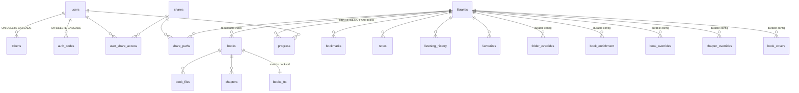

The schema lives in `internal/store/migrations/` as numbered SQL files
(`0001_init.sql` … `0016_book_overrides.sql`), embedded into the binary and
applied by `store.Open` at startup. This page documents the **resulting current
schema**, noting which migration added what.

## The two halves: rebuildable index vs durable state

The schema is deliberately split in two, and the split is the most important
thing to understand before touching it:

- The **rebuildable index** - `books`, `book_files`, `chapters`, `books_fts` -
  is a cache of what the scanner found on disk. It can be dropped and rebuilt
  from a rescan at any time. `books.id` is an internal artifact of this half:
  it must **never** appear in the API contract or in durable user state.
- **Durable state** - `progress`, `bookmarks`, `notes`, `listening_history`,
  `favourites` (per-user), plus `folder_overrides`, `book_enrichment`,
  `book_overrides`, `chapter_overrides` and `book_covers` (per-library config) -
  is keyed by **`(library_id, rel_path)`**, with **no foreign key to `books`**.

Why no FK across the seam? Three reasons, all load-bearing:

1. **Rebuild survival.** If durable state referenced `books.id`, deleting and
   re-indexing a library (or the prune step of a normal scan) would cascade
   away every user's progress. Path keys survive because the scanner re-creates
   the same `rel_path`s.
2. **Re-tagging survival.** Fixing a book's tags changes its indexed metadata
   but not its path, so state keyed by path is untouched. The same holds for an
   admin's metadata edits: they are path-keyed rows, not columns of the index.
3. **Pre-index writes.** A client can start playing a book the background scan
   hasn't reached yet (the filesystem view needs no index); progress saved at
   that moment has no `books` row to reference.

The remaining gap - a file that *moves* on disk - is covered by move-tracking:
the scanner fingerprints files (`books.content_hash`) and calls
`catalog.MoveDurableState` to carry all nine path-keyed book tables (everything
above except `folder_overrides`, which is keyed by folder, not book) from the
old path to the new one (see [Scanner](scanner.md#move-detection)).

```mermaid
erDiagram
    users ||--o{ tokens : "ON DELETE CASCADE"
    users ||--o{ auth_codes : "ON DELETE CASCADE"
    users ||--o{ user_share_access : ""
    shares ||--o{ share_paths : ""
    shares ||--o{ user_share_access : ""
    libraries ||--o{ share_paths : ""
    libraries ||--o{ books : "rebuildable index"
    books ||--o{ book_files : ""
    books ||--o{ chapters : ""
    books ||--|| books_fts : "rowid = books.id"
    libraries ||--o{ progress : "path-keyed, NO FK to books"
    libraries ||--o{ bookmarks : ""
    libraries ||--o{ notes : ""
    libraries ||--o{ listening_history : ""
    libraries ||--o{ favourites : ""
    libraries ||--o{ folder_overrides : "durable config"
    libraries ||--o{ book_enrichment : "durable config"
    libraries ||--o{ book_overrides : "durable config"
    libraries ||--o{ chapter_overrides : "durable config"
    libraries ||--o{ book_covers : "durable config"
    users ||--o{ progress : ""
```

:::warning
When adding a new per-user or per-library-config table, follow the pattern: key
it on `(user_id, library_id, rel_path)` or `(library_id, path)`, FK only to
`users`/`libraries` (with `ON DELETE CASCADE`), never to `books` - and add a
line to `catalog.MoveDurableState` so moves carry it along.
:::

## Tables

### Accounts & credentials

**`users`** *(0001; `is_demo` added in 0005)* - `id`, `username` (UNIQUE),
`password_hash` (argon2id PHC string; **empty string = password-less account**,
never a hash of `""`), `role` (`'admin'`/`'user'`), `disabled`, `is_demo`,
`created_at`, `updated_at`. `is_demo` flags throwaway demo-mode accounts so the
background reaper deletes by flag, not by username prefix (which could catch a
real account named `demo_*`). There is deliberately **no `last_login` column** -
last activity is derived from `MAX(tokens.last_seen)`.

**`tokens`** *(0001; `auth_code_id` added in 0014)* - opaque bearer tokens:
`user_id` (FK CASCADE), `token_hash` (UNIQUE - only the SHA-256 hash is
stored), `kind` (`'session'`/`'pairing'`/`'api'`, the last being a user-minted personal
API key whose label rides in `device_name`), `device_name`, `created_at`,
`last_seen` (bumped on every authenticated request), `expires_at` (NULL = no
expiry), `revoked`, and `auth_code_id` (FK CASCADE to `auth_codes`, NULL for
sessions and unlinked pairing tokens) - a pairing token minted by redeeming a
code is linked to it, inherits its uses/expiry at exchange, and dies with it.

**`auth_codes`** *(0001; `kind` + `redeemed_at` added in 0010)* - redeemable
codes: `code_hash` (UNIQUE, SHA-256 of the normalized code), `user_id` (FK
CASCADE), `label`, `max_uses` (0 = unlimited), `uses` (counts devices that
completed exchange - redeeming alone consumes nothing), `expires_at`,
`redeemed_at` (first-exchange stamp, informational), `created_at`, and
`kind`:

- `'invite'` - admin-minted onboarding secret, bounded (default 5 uses / 1 day).
- `'recovery'` - user-owned durable credential (unlimited uses, never expires).

Both redeem through the same path; see
[Auth & security](auth-and-security.md#auth-codes-invite-vs-recovery) for the
lifecycle (supersede-on-mint, rotate, atomic claim).

### Libraries & shares

**`libraries`** *(0001; `layout` **dropped** in 0007; `sort_order` added in
0011)* - `id`, `name` (UNIQUE), `root` (an absolute local path),
`default_view`, `sort_order`, `created_at`. There is no layout column: library
shape is auto-detected per folder by the scanner, with `folder_overrides` as
the correction mechanism. `sort_order` drives library listing order **and** is
the tiebreaker when de-duplicating copies of the same book that appear in more
than one library (search / recently-added): all else equal, the copy in the
earlier-ordered library wins.

**`shares`** / **`share_paths`** / **`user_share_access`** *(0003, replacing
the dropped `user_library_access`)* - filesystem-based access control. A share
is a named set of path rules; `share_paths(share_id, library_id, path)` grants
a subtree per rule, with `path = ""` meaning the whole library;
`user_share_access` grants shares to users. `shares.read_only` is persisted and
editable but **not yet enforced** (all share access is already read-only -
it gates a future write/upload path). How rules become an enforced `Scope` is
covered in [Auth & security](auth-and-security.md#authorization-shares--scope).

### The rebuildable index

**`books`** *(0001; `added_at` in 0004; `codec` in 0008; `published`,
`description`, `has_cover` and `scanned` in 0016)* - one row per book,
`UNIQUE (library_id, rel_path)`. Columns: `is_folder` (folder book vs
single-file book), identity metadata (`title`, `author`, `series`,
`series_index`, `narrator`), `duration`, `asin`/`isbn` (optional external ids -
present so enrichment/metadata services can attach data without reshaping the
schema), `published` (`YYYY[-MM[-DD]]`) and `description` (only an admin edit or
an accepted community match supplies these today; the scanner reads neither),
`cover_path` (a library-relative sidecar image, `""` = fall back to embedded
art), `has_cover` (whether the book has a sidecar image or embedded art; `NULL`
until a scan has checked, and always true when `cover_path` is set -
`UpsertBook` enforces that), `format`, `codec` (ffprobe `codec_name`, `""` when
unknown - drives the `direct_playable` API flag), `size`, `mtime`,
`content_hash`, `indexed_at`, `added_at`, and `scanned` (see below).

Two columns deserve emphasis:

- `content_hash` is a **cheap move-detection fingerprint** - SHA-256 of
  (size, first 64 KiB, last 64 KiB) - not an identity and not a full hash.
- `added_at` records when the book *first appeared on disk* (file birth time,
  falling back to mtime; earliest file for folder books). Unlike the
  auto-increment `id` - which a full re-index reshuffles - it is a stable
  chronological key, and `UpsertBook` deliberately never updates it on
  re-index. Index `idx_books_added` supports the "recently added" sort.

The metadata columns (`title` … `isbn`, `published`, `description`) hold the
**effective** values - what readers should show - not necessarily what the scan
found. What the scan found is kept beside them in **`scanned`**, a flat JSON
object of field → value (blank fields left out) plus an `@indexed_at` stamp
(`catalog.scannedStampKey`) holding the `indexed_at` of the upsert that wrote
it; it is the revert target, what the admin console shows next to an edited
value, and - compared with the path - where a value came from.

The stamp guards against a **rollback**: a server older than migration 0016,
run against this database, re-indexes rows with their scanned values in the
columns and leaves `scanned` blank or stale. When the snapshot is blank or its
stamp isn't the row's `indexed_at`, `loadLayers` reads the scanned values off the
row itself (as migration 0016 did) instead of blanking the fields, and
`refreshEffective` records that snapshot, stamped, and backfills the chapters'
`scanned_title` from their titles. See
[Metadata overrides and effective values](#metadata-overrides-and-effective-values).

**`book_files`** *(0001; `codec` in 0016)* - the ordered parts of a folder
book: `book_id` (FK CASCADE), `rel_path`, `seq`, `duration`, `format`, `codec`
(each part's own codec, so a mixed-codec folder shows honestly; admin-only, the
player reads the book-level codec), `size`.

**`chapters`** *(0001; `file_index` + `book_offset` in 0002; `file_path` in
0003; `scanned_title` in 0016)* - normalized playable units, identical in shape
for a chaptered single-file m4b and a folder of mp3 parts: `book_id` (FK
CASCADE), `idx`, `title` (effective - an admin's rename when there is one),
`scanned_title` (what the scan found), `file_index` (ordinal of the containing
file), **`file_path`** (the
library-relative audio file to stream - playback is purely path-based),
`start`/`end` (offsets *within that file*), and **`book_offset`** (the
chapter's start on the whole-book timeline). See
[Scanner](scanner.md#chapter-normalization) for how these are built.

**`books_fts`** *(0001)* - see [FTS design](#fts-design-books_fts) below.

### Durable per-user state (path-keyed, no FK to books)

All re-created in **0003** when identity moved to the path (pre-1.0, so the
tables were rebuilt rather than migrated in place):

- **`progress`** - PK `(user_id, library_id, rel_path)`; `position`,
  `duration`, `finished`, `playback_speed`, `device_id`, `updated_at`, and
  `version` (monotonic, breaks `updated_at` ties). Reconciliation is
  last-write-wins in `catalog.SaveProgress`; any future realtime layer must
  reuse that merge. Index `idx_progress_path` *(0016)* on
  `(library_id, rel_path)` serves the per-path lookups the primary key (which
  leads with `user_id`) can't: the admin book page's listeners and
  `MoveDurableState`.
- **`bookmarks`**, **`notes`** - id-PK rows keyed by
  `(user_id, library_id, rel_path)` plus `position` and text.
- **`listening_history`** - listening spans (`from_pos`, `to_pos`,
  `started_at`, `ended_at`).
- **`favourites`** *(0009)* - PK `(user_id, library_id, rel_path)`. A
  favourite may address **any** path: a navigation folder (author/series), a
  book folder, or a single-file book.

### Durable per-library config (path-keyed, no FK to books)

- **`folder_overrides`** *(0006)* - PK `(library_id, path)`, `mode ∈ {'book',
  'collection'}` (allow-list enforced in `catalog.SetFolderOverride`). Pins a
  folder's detection when the scanner's heuristic gets it wrong: `book` forces
  folder-is-one-book, `collection` forces one book per file.
- **`book_enrichment`** *(0012)* - PK `(library_id, path)`, `asin`, `isbn`,
  `updated_at`. Attached by the manager when it matches an external source
  (e.g. an Audible library) to an indexed book. Writing it never blanks a
  stored field (a blank `asin` or `isbn` keeps the existing one). It survives
  rebuilds because it is layered onto the book row on every re-index (see
  below); an admin's own `asin`/`isbn` edit wins over it.
- **`book_overrides`** *(0016)* - PK `(library_id, path, field)`, `value`,
  `source` (`'edited'` = typed by an admin, `'community'` = accepted from a
  community-metadata match), `updated_by` (FK to `users`, `ON DELETE SET NULL`,
  so an edit outlives its author's account), `updated_at`. One row per edited
  field; `field` is one of `catalog.OverrideFields` (`title`, `author`,
  `narrator`, `series`, `series_index`, `published`, `description`, `asin`,
  `isbn`). Values are validated and normalized by `catalog.normalizeOverride`.
- **`chapter_overrides`** *(0016)* - PK `(library_id, path, idx)`, `title`,
  `updated_by`, `updated_at`. A chapter-title edit by chapter index. An index
  the book no longer has after a rescan is kept, and applies again if that
  chapter comes back.
- **`book_covers`** *(0016)* - PK `(library_id, path)`, `mime`, `data` (BLOB),
  `updated_by`, `updated_at`. A custom cover uploaded in the admin console
  (JPEG, PNG or WebP, at most 5 MiB - `catalog.MaxCoverBytes`). It lives in the
  database rather than the library folder (files stay untouched) or a loose
  data-dir file, so it is path-keyed durable state that moves with
  `MoveDurableState` and is part of any database backup.

All of these FK to `libraries` with `ON DELETE CASCADE` only, so deleting a
library removes its config, and nothing else does - pruning a vanished book
keeps its edits and cover for the day the path comes back (a custom cover is
only served while a book is indexed at its path).

### Metadata overrides and effective values

A `books` row always holds the **effective** metadata, built in layers:

1. what the scan found (`books.scanned`, `chapters.scanned_title`);
2. then any `book_enrichment` (`asin`/`isbn`, non-blank fields only);
3. then any `book_overrides` / `chapter_overrides`.

`bookLayers.resolve` (in `internal/catalog/overrides.go`) is the single
statement of that precedence, and of each field's source. `refreshEffective`
writes its values into the book's metadata columns and chapter titles and
refreshes the book's `books_fts` row from the result; the admin book page shows
the same resolution as provenance, so the two can't disagree. Every write path calls
it inside its own transaction - `UpsertBook` (each scan or on-demand index),
`SetEnrichment`, and `EditBook`/`EditBooks` (the admin edits, the bulk form
all-or-nothing). Two consequences:

- **No read-time join.** Players, search, the `/fs` annotations, `/meta`
  lookups and the export read edited values straight off the row; the player
  wire format did not change.
- **An edit is a lock.** A rescan writes the newly scanned values and then
  re-applies the overrides in the same transaction, so an edited field is never
  visible with its scanned value, even for a moment. Reverting deletes the
  override and re-layers from the stored `scanned` value - no rescan and no disk
  access.

Per field, `resolve` yields the effective value, its source, the scanned
value, whether it is locked, and who last edited it. Sources are not stored: a
scanned value is `path` when it equals what `metadata.DeriveFromPath` yields for
the book's path, otherwise `tag`; an ASIN/ISBN from enrichment is `community`;
an override carries its own (`edited` or `community`); `""` means no value. The
rule is the same for every row, so the rows migration 0016 backfilled `scanned`
for (from their current values) need no special case.

### `schema_migrations`

Created by `store.migrate` itself (not a migration file): `name` (PK),
`applied_at`. Records which migration files have run.

## Migration policy: append-only

Migrations are **append-only**. To change the schema, add a new
`internal/store/migrations/000N_*.sql` - never edit an applied file. The
filename must match `NNNN_*.sql` (`store.go` rejects misnamed files, because
application order is lexical). Each migration runs in its own transaction and
is recorded in `schema_migrations`; already-recorded names are skipped.

The migration history so far:

| # | File | What it did |
|---|---|---|
| 0001 | `init` | Initial schema (users, tokens, auth_codes, libraries, books, book_files, chapters, books_fts, book-id-keyed listening state) |
| 0002 | `chapter_parts` | `chapters.file_index` + `book_offset` (multi-file normalization) |
| 0003 | `paths_and_shares` | Re-keyed all durable state to `(user, library, rel_path)`; `chapters.file_path`; replaced `user_library_access` with shares |
| 0004 | `book_added_at` | `books.added_at` (stable "recently added" key) |
| 0005 | `user_is_demo` | `users.is_demo` flag for the demo reaper |
| 0006 | `folder_overrides` | Per-folder detection overrides |
| 0007 | `drop_library_layout` | Dropped `libraries.layout` (detection is per-folder now) |
| 0008 | `book_codec` | `books.codec` (drives `direct_playable`) |
| 0009 | `favourites` | Per-user path-keyed favourites |
| 0010 | `authcode_kind` | `auth_codes.kind` (invite/recovery) + `redeemed_at` |
| 0011 | `library_sort_order` | `libraries.sort_order` (display order + dedup tiebreak) |
| 0012 | `book_enrichment` | Path-keyed ASIN/ISBN enrichment |
| 0013 | `book_list_indexes` | Composite indexes so `ListBooks` keyset pages serve `sort=title`/`sort=recent` from an index |
| 0014 | `token_auth_code` | `tokens.auth_code_id` (FK CASCADE) - pairing tokens live and die with the code that minted them |
| 0015 | `share_whole_library` | `shares.whole_library_id` - marks the shares a whole-library grant creates (backfilled for existing `Library: <name>` shares) |
| 0016 | `book_overrides` | Metadata overrides: `book_overrides`, `chapter_overrides`, `book_covers`; `books.published`/`description`/`has_cover`/`scanned` (backfilled and stamped from each row's current values), `chapters.scanned_title`, `book_files.codec`; index `idx_progress_path` on `progress(library_id, rel_path)`. Also resets infinite `series_index` values (an `inf` tag) to 0, and reconciles `books.asin`/`isbn` from `book_enrichment` once (a non-blank enrichment field wins), since the scanner no longer re-applies enrichment at the end of every scan |

## SQLite choices

**Pure-Go driver.** The server uses `modernc.org/sqlite` (no CGO), so the
binary cross-compiles for every release target without a C toolchain - a hard
requirement of the native-distribution pipeline (see
[Release pipeline](../architecture/release-pipeline.md)).

**Pragmas.** Every connection gets `journal_mode(WAL)`, `busy_timeout(5000)`,
and `foreign_keys(ON)` appended to its DSN (`store.dsnPragmas`).
`foreign_keys` defaults **off** per SQLite connection, and the schema relies on
`ON DELETE CASCADE` rules throughout (deleting a user removes their sessions,
codes, progress, bookmarks, notes, history, and grants) - so the pragmas are appended
unconditionally, with the correct `?`/`&` separator, rather than skipped when a
DSN already carries query params.

**Writer/reader pool split.** `store.DB` owns two pools over the same file:

- a **writer** pool capped at **one connection** (`SetMaxOpenConns(1)`) -
  SQLite serializes writers anyway, and a single connection avoids
  "database is locked" churn;
- a **read-only reader** pool (`query_only(ON)`, `max(NumCPU, 4)`
  connections) - WAL allows concurrent readers, and routing reads separately
  means a slow or stuck write (e.g. stalled on a network volume) never blocks
  browsing. `/healthz` probes the reader pool for the same reason.

An in-memory DSN (tests) stays single-pool: an in-memory database is
per-connection, so a second pool would silently be a distinct, empty database.
Supporting telemetry: `WithTx` logs any transaction over 2 s, and a background
sampler warns when callers queue for the writer connection.

## Keyset pagination

`catalog.ListBooks` paginates with an **opaque keyset cursor**, not OFFSET:
the cursor encodes `(sort value, id)` (base64 of `value \x00 id`), and the next
page is fetched with an index-friendly row-value comparison
(`(col, id) > (?, ?)` - `id` breaks ties). This keeps paging O(page) however
deep into a 50,000-book library the caller is, where `OFFSET n` degrades
linearly with `n`. Default page size 50, cap 200; one extra row is fetched to
detect whether a next page exists.

The admin console's book list (`catalog.ListAdminBooks`) uses the same
technique over multi-column orderings (`adminSorts`: e.g. author, then series,
series position and title, then `id`; an unknown name is
`catalog.ErrUnknownSort`). It sorts and pages on book ids alone in a subquery,
then computes the per-row columns (several are subqueries: chapter and file
counts, edited, custom cover) for that page only. Its cursor is base64 JSON
carrying the ordering's name, its direction, one value per sort column and the
last `id`, so a cursor replayed against a different ordering is refused rather
than misread. The facet counts (`catalog.BookFacets`) take the total and every
yes/no dimension that isn't itself filtered in one pass.

:::note
Don't switch any list endpoint over a potentially-large table to OFFSET
pagination - it is design priority #2.
:::

## FTS design (`books_fts`)

`books_fts` is a **standalone** FTS5 virtual table over
`(title, author, series, narrator)` - it owns its own storage rather than using
FTS5's external-content mode. The trade-off is deliberate: standalone storage
keeps the sync code to a trivial delete-then-insert, at the cost of duplicating
four small text columns.

It is kept in sync **by the application**, not by triggers, keyed by
`rowid = books.id`:

- `catalog.refreshEffective` deletes then re-inserts the FTS row from the
  book's **effective** values, inside the same transaction as the write that
  called it (`UpsertBook`, `SetEnrichment`, a metadata edit), so index and FTS
  can't diverge and search finds edited titles.
- `catalog.DeleteBooksNotIn` (the scanner's prune step) deletes the FTS row
  alongside each stale book.

`catalog.Search` joins `books_fts` to `books` on `rowid`, ranked by FTS
relevance (`ORDER BY rank`). User input never reaches FTS5 syntax directly:
`buildMatchQuery` reduces it to quoted, AND-ed prefix terms (`"foo"* AND
"bar"*`), giving type-ahead behavior without exposing FTS operators. Results
are scoped per-library by the caller's share rules and de-duplicated across
libraries (see [Data model → libraries](#libraries--shares) for the
`sort_order` tiebreak).

If you add a searchable column, update **both** sides of the sync
(`refreshEffective`, `DeleteBooksNotIn`) and the FTS table definition via a new
migration.
