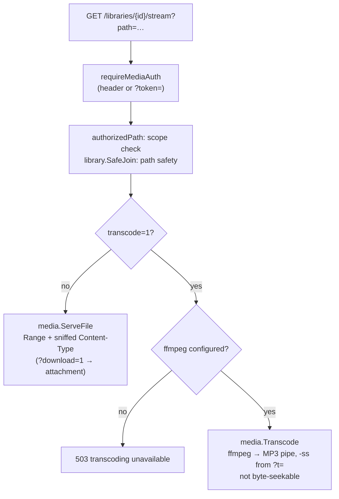

Everything that turns a `(library_id, rel_path)` into bytes a player can render
lives in `internal/media` (pure logic, no HTTP routing) and the two media
handlers in `internal/api/handlers_library.go` (`handleStream`, `handleCover`).
This page follows a request end-to-end and explains the design decisions that
are easy to break by accident - most of them exist because of one strict
client: iOS `AVPlayer`.

For the invariants behind this page ("path is the identity", "stream the file,
not the book") see [Architecture invariants](../architecture/invariants.md);
for the request/response shapes see the [API reference](api/reference.md).

## The endpoints

| Route | Handler | Purpose |
|---|---|---|
| `GET /api/v1/libraries/{id}/stream?path=` | `handleStream` | Serve one audio **file** (Range streaming), force a download with `?download=1`, or transcode with `?transcode=1&t=` |
| `GET /api/v1/libraries/{id}/cover?path=` | `handleCover` | Serve a book's cover (sidecar image, else embedded art) |
| `GET /api/v1/libraries/{id}/chapters?path=` | `handleChapters` | The normalized playable-units envelope `{chapters, files, duration, …}` |
| `GET /api/v1/libraries/{id}/item?path=` | `handleItem` | Book detail; carries `direct_playable` |

There is **no separate download endpoint** - downloading is `?download=1` on
`/stream`, which makes `media.ServeFile` add a
`Content-Disposition: attachment` header (with the quoted base filename) so
browsers save the file instead of playing it.

Two things happen before any bytes are read, on every media request:

1. **Authorization**: `authorizedPath` resolves `{id}` + `?path=` and checks
   the caller's share scope (`Scope.Allows`). `cover` and `stream` are wired
   through `requireMediaAuth`, the only middleware that also accepts the
   session token as a `?token=` query parameter - browser ``/`<audio>`
   elements cannot set an `Authorization` header. Every other route rejects
   query tokens (see [Auth & security](auth-and-security.md)).
2. **Path safety**: the relative path is joined to the library root with
   `library.SafeJoin`, which rejects any traversal outside the root.

## Direct streaming: `media.ServeFile`

`ServeFile` opens the file and hands it to Go's `http.ServeContent`, which
gives us HTTP **Range** support for free - seek/scrub in browsers, native
players' byte-range fetches, and resumable downloads all work without custom
code. `Accept-Ranges: bytes` is set explicitly.

The one thing `ServeContent` gets wrong for audiobooks is the `Content-Type`,
so `ServeFile` sets it explicitly first.

### Why Content-Type is byte-sniffed (the iOS `-12847` story)

Go's mime table and `http.DetectContentType` do not recognize `.m4b`/`.aax`,
so `ServeContent` would fall back to `application/octet-stream`. The server
also sends `X-Content-Type-Options: nosniff` globally (see the `secureHeaders`
middleware), which forbids the client from second-guessing that type. Strict
players - iOS `AVPlayer` in particular - then refuse the stream outright
(MediaToolbox error `-12847`). The fix has two layers:

1. **`sniffAudioType`** reads the first 16 bytes of the actual file, then
   rewinds, so the type is correct even for **mislabeled files**:

   | Leading bytes | Result | Notes |
   |---|---|---|
   | `fLaC` | `audio/flac` | |
   | `OggS` | `audio/ogg` | Ogg container (Vorbis/Opus) |
   | `RIFF` + `WAVE` at offset 8 | `audio/wav` | |
   | `ID3` | `audio/mpeg` | ID3-tagged MP3 |
   | `0xFF` with `b[1] & 0xF6 == 0xF0` | `audio/aac` | Raw ADTS AAC (e.g. per-chapter `.aac` files). Checked **before** the MP3 case because the ADTS sync word also matches the MPEG mask |
   | `0xFF` with `b[1] & 0xE0 == 0xE0` | `audio/mpeg` | Bare MPEG audio frame sync (untagged MP3) |
   | `ftyp` at offset 4 | `audio/mp4` | ISO base media: `.m4a`/`.m4b`/`.mp4`, AAC or ALAC inside |

2. **`audioContentType`** falls back to the extension when the sniff comes up
   empty: `.m4b`/`.m4a`/`.aax`/`.mp4` → `audio/mp4`, `.mp3` → `audio/mpeg`,
   `.aac` → `audio/aac`, `.flac` → `audio/flac`, `.ogg`/`.oga` → `audio/ogg`,
   `.opus` → `audio/opus`, `.wav`/`.wave` → `audio/wav`. Anything else lets
   `ServeContent` decide.

:::warning
If you add a new audio format, extend **both** `sniffAudioType`/`audioContentType`
and the recognized-extension set below - a format that streams with the wrong
`Content-Type` will look fine in Chrome and silently fail on iOS.
:::

## Recognized audio: `metadata.AudioExtensions`

The scanner and the `/fs` browse view treat a file as an audiobook when its
extension is in `metadata.AudioExtensions` (checked via `metadata.IsAudio`):

```
.m4b  .m4a  .mp4  .mp3  .flac  .ogg  .opus
```

`.mp4` is included because audiobooks are sometimes delivered as AAC-in-MP4;
`media` serves it as `audio/mp4`. Audible's DRM formats (`.aax`/`.aaxc`) are
**deliberately excluded**: the server can never stream them (they need
per-account decryption), and indexing an `.aax` sitting next to its converted
`.m4b` would lump both into one book with duplicated chapters and an
unplayable track. The [manager](../manager/audible.md) converts `.aax`/`.aaxc`
to `.m4b` **before** content enters a library.

(`audioContentType` knows a slightly broader set - e.g. `.aax`, `.wav` - so a
correct type is served even for files the scanner would not index.)

## Covers: `handleCover`

Cover resolution is two-tier - a **sidecar image found by the scanner** wins,
and **embedded art** is the fallback:

1. **Sidecar** (`books.cover_path`, set at scan time by `findCover` in
   `internal/library/scanner.go`): a conventionally named file - `cover.jpg`,
   `cover.jpeg`, `cover.png`, `folder.jpg`, `folder.png` - in the book's own
   folder (folder books) or next to the file (loose single-file books). Inside
   a folder book, where a stray image is almost certainly the cover, any image
   (`.jpg .jpeg .png .webp .gif`) is accepted as a fallback, preferring a
   filename containing "cover", else the first image alphabetically. Multi-CD
   subfolders (`CD1`, `Disc 2`, …) look one level up for the parent book's
   art. A sidecar cover is served through `ServeFile` (so it gets Range and
   correct headers).
2. **Embedded** (`media.EmbeddedCover`): the book's primary audio file (the
   first `files` entry for folder books, the file itself otherwise) is read
   with `dhowden/tag` and its embedded picture returned, defaulting to
   `image/jpeg` when the tag has no MIME type. Served with
   `Cache-Control: private, max-age=86400`.

No cover from either tier → `404 {"error":"no cover"}`.

## `DirectPlayable`: when a client should transcode

The scanner records each book's audio codec (ffprobe `codec_name`, verbatim)
in `books.codec`. `media.DirectPlayable(codec)` reports whether mainstream
browsers can decode it natively, against this allow-list (`browserCodecs`):

```
aac  mp3  mp2  flac  opus  vorbis  pcm_s16le
```

Note these are **codec** names, not containers: AAC-in-MP4 probes as `aac`
(not `mp4a`), WAV as `pcm_s16le`. An **empty codec** (ffprobe unavailable, or
the book not yet probed) is treated as **playable** - the client streams
directly and can fall back to `?transcode=1` if that fails. The flag is
surfaced as `direct_playable` on the `item` and `chapters` responses, so a
web client knows up front that e.g. an AC-3 or WMA book needs the transcoder.

:::note Planned
The server side is fully shipped; **automatic** transcode negotiation in the
web player (reading `direct_playable` and switching the stream URL by itself)
is a known follow-up in the frontend - see the
[cross-repo contract](../architecture/cross-repo-contract.md).
:::

## Transcoding: `media.Transcode`

`GET /libraries/{id}/stream?path=…&transcode=1[&t=<seconds>]` pipes the file
through ffmpeg to MP3. The handler returns `503` when no ffmpeg is configured
(`--ffmpeg ""`, or the binary was never found - the `transcode` capability
flag in `GET /server` reflects this, see
[Configuration](configuration.md)). The exact invocation:

```
ffmpeg -nostdin -loglevel error [-ss <t>] -i <abs path> \
       -vn -c:a libmp3lame -b:a 128k -f mp3 pipe:1
```

Design points worth knowing before touching it:

- **`-ss` is input-side** (before `-i`): ffmpeg seeks near the start position
  before decoding, which is fast even deep into a long m4b.
- **`-vn`** drops any embedded cover-art/video stream so the output is pure
  audio.
- The response is `Content-Type: audio/mpeg`, `Accept-Ranges: none`,
  `Cache-Control: no-store`, and **no `Content-Length`** - the output is
  produced on the fly.
- **Why it isn't byte-seekable**: the total encoded size is unknown while
  encoding, and a byte offset into the MP3 output has no computable mapping
  back to a source timestamp. So Range requests are refused and a client
  seeks by **re-requesting** with a new `t=` value. This is exactly the
  `?transcode=1&t=` contract the frontend's stream URLs implement.
- The ffmpeg process is created with `exec.CommandContext(r.Context(), …)`,
  so a client disconnect (pause, seek, navigate away) kills it - a broken
  pipe is logged at debug level; only a genuine ffmpeg failure (non-nil exit
  with the request context still live) warns, with ffmpeg's stderr attached.

Direct serving + Range stays the default; transcoding is strictly the
fallback for codecs `DirectPlayable` rejects.



## The chapters envelope: `{chapters, files, duration}`

`GET /libraries/{id}/chapters?path=` is what makes a single chaptered m4b and
a folder of fifty mp3 parts render identically in a player. The response:

```json
{
  "library_id": 1,
  "path": "Brandon Sanderson/Mistborn/01 - The Final Empire",
  "duration": 88453.2,
  "is_folder": true,
  "codec": "mp3",
  "direct_playable": true,
  "files": [
    { "rel_path": ".../Part 01.mp3", "seq": 0, "duration": 3520.1, "format": "mp3", "size": 84480000 },
    { "rel_path": ".../Part 02.mp3", "seq": 1, "duration": 3498.7, "format": "mp3", "size": 83968000 }
  ],
  "chapters": [
    { "index": 0, "title": "Chapter 1", "file_index": 0,
      "file_path": ".../Part 01.mp3", "start": 0,      "end": 3520.1, "book_offset": 0 },
    { "index": 1, "title": "Chapter 2", "file_index": 1,
      "file_path": ".../Part 02.mp3", "start": 0,      "end": 3498.7, "book_offset": 3520.1 }
  ]
}
```

Each chapter (`metadata.Chapter`) is one **playable unit**, normalized across
book shapes:

| Field | Meaning |
|---|---|
| `file_path` | Library-relative path of the **audio file** to stream - this is what goes into `/stream?path=`. Never a folder/book path |
| `file_index` | 0-based ordinal of the containing file (matches `BookFile.seq`; `0` for single-file books) - ordering only |
| `start` / `end` | Offsets in seconds **within that file**: seek to `start` after loading `file_path` |
| `book_offset` | The chapter's start on the **whole-book timeline** (the sum of earlier files' durations), so progress is one continuous position |

The relationships that must hold: `book_offset` of a chapter equals the sum of
the durations of all files before `file_index` plus its own `start`; the last
chapter's `book_offset + (end − start)` reaches `duration`. For folder books
the scanner probes each part - a part with its own embedded chapters (a
chaptered m4b inside a book folder) is **expanded** into those chapters;
otherwise the whole part becomes one chapter (see [Scanner](scanner.md)).

The `files` array is the track list a client actually queues (rule: **stream
the file, not the book** - a folder path handed to `/stream` cannot work, and
in the frontend this once surfaced as MediaToolbox `-12864`). How the player
maps `(trackIndex, position)` ↔ whole-book position from this envelope is
covered in [Frontend playback](../frontend/playback.md).
