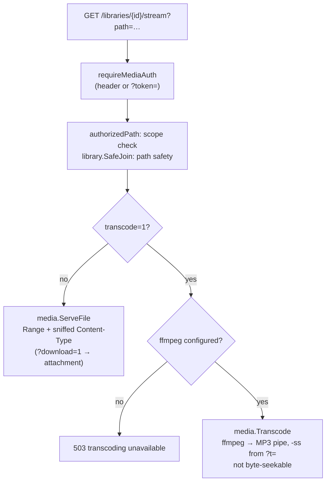

Everything that turns a `(library_id, rel_path)` into bytes a player can render
lives in `internal/media` (pure logic, no HTTP routing) and the two media
handlers in `internal/api/handlers_library.go` (`handleStream`, `handleCover`).
This page follows a request end-to-end and explains the design decisions that
are easy to break by accident - most of them exist because of one strict
client: iOS `AVPlayer`.

For the invariants behind this page ("path is the identity", "stream the file,
not the book") see [Architecture invariants](../architecture/invariants.md);
for the request/response shapes see the [API reference](api/reference.md).

## The endpoints

| Route | Handler | Purpose |
|---|---|---|
| `GET /api/v1/libraries/{id}/stream?path=` | `handleStream` | Serve one audio **file** (Range streaming), force a download with `?download=1`, or transcode with `?transcode=1&t=` |
| `GET /api/v1/libraries/{id}/cover?path=` | `handleCover` | Serve a book's cover (custom cover, else sidecar image, else embedded art); with `?size=160\|320\|640` a JPEG thumbnail of it (`handleCoverThumbnail`) |
| `POST /api/v1/admin/covers` | `handleAdminCovers` | Admin only: JPEG thumbnails of many books' covers as `data:` URLs, for the admin console |
| `GET /api/v1/libraries/{id}/chapters?path=` | `handleChapters` | The normalized playable-units envelope `{chapters, files, duration, …}` |
| `GET /api/v1/libraries/{id}/item?path=` | `handleItem` | Book detail; carries `direct_playable` |

There is **no separate download endpoint** - downloading is `?download=1` on
`/stream`, which makes `media.ServeFile` add a
`Content-Disposition: attachment` header (with the quoted base filename) so
browsers save the file instead of playing it.

Two things happen before any bytes are read, on every media request:

1. **Authorization**: `authorizedPath` resolves `{id}` + `?path=` and checks
   the caller's share scope (`Scope.Allows`). `cover` and `stream` are wired
   through `requireMediaAuth`, the only middleware that also accepts the
   session token as a `?token=` query parameter - browser ``/`<audio>`
   elements cannot set an `Authorization` header. Every other route rejects
   query tokens (see [Auth & security](auth-and-security.md)).
2. **Path safety**: the relative path is joined to the library root with
   `library.SafeJoin`, which rejects any traversal outside the root.

## Direct streaming: `media.ServeFile`

`ServeFile` opens the file and hands it to Go's `http.ServeContent`, which
gives us HTTP **Range** support for free - seek/scrub in browsers, native
players' byte-range fetches, and resumable downloads all work without custom
code. `Accept-Ranges: bytes` is set explicitly.

The one thing `ServeContent` gets wrong for audiobooks is the `Content-Type`,
so `ServeFile` sets it explicitly first.

### Why Content-Type is byte-sniffed (the iOS `-12847` story)

Go's mime table and `http.DetectContentType` do not recognize `.m4b`/`.aax`,
so `ServeContent` would fall back to `application/octet-stream`. The server
also sends `X-Content-Type-Options: nosniff` globally (see the `secureHeaders`
middleware), which forbids the client from second-guessing that type. Strict
players - iOS `AVPlayer` in particular - then refuse the stream outright
(MediaToolbox error `-12847`). The fix has two layers:

1. **`sniffAudioType`** reads the first 16 bytes of the actual file, then
   rewinds, so the type is correct even for **mislabeled files**:

   | Leading bytes | Result | Notes |
   |---|---|---|
   | `fLaC` | `audio/flac` | |
   | `OggS` | `audio/ogg` | Ogg container (Vorbis/Opus) |
   | `RIFF` + `WAVE` at offset 8 | `audio/wav` | |
   | `ID3` | `audio/mpeg` | ID3-tagged MP3 |
   | `0xFF` with `b[1] & 0xF6 == 0xF0` | `audio/aac` | Raw ADTS AAC (e.g. per-chapter `.aac` files). Checked **before** the MP3 case because the ADTS sync word also matches the MPEG mask |
   | `0xFF` with `b[1] & 0xE0 == 0xE0` | `audio/mpeg` | Bare MPEG audio frame sync (untagged MP3) |
   | `ftyp` at offset 4 | `audio/mp4` | ISO base media: `.m4a`/`.m4b`/`.mp4`, AAC or ALAC inside |

2. **`audioContentType`** falls back to the extension when the sniff comes up
   empty: `.m4b`/`.m4a`/`.aax`/`.mp4` → `audio/mp4`, `.mp3` → `audio/mpeg`,
   `.aac` → `audio/aac`, `.flac` → `audio/flac`, `.ogg`/`.oga` → `audio/ogg`,
   `.opus` → `audio/opus`, `.wav`/`.wave` → `audio/wav`. Anything else lets
   `ServeContent` decide.

:::warning
If you add a new audio format, extend **both** `sniffAudioType`/`audioContentType`
and the recognized-extension set below - a format that streams with the wrong
`Content-Type` will look fine in Chrome and silently fail on iOS.
:::

## Recognized audio: `metadata.AudioExtensions`

The scanner and the `/fs` browse view treat a file as an audiobook when its
extension is in `metadata.AudioExtensions` (checked via `metadata.IsAudio`):

```
.m4b  .m4a  .mp4  .mp3  .flac  .ogg  .opus
```

`.mp4` is included because audiobooks are sometimes delivered as AAC-in-MP4;
`media` serves it as `audio/mp4`. Audible's DRM formats (`.aax`/`.aaxc`) are
**deliberately excluded**: the server can never stream them (they need
per-account decryption), and indexing an `.aax` sitting next to its converted
`.m4b` would lump both into one book with duplicated chapters and an
unplayable track. The [manager](../manager/audible.md) converts `.aax`/`.aaxc`
to `.m4b` **before** content enters a library.

(`audioContentType` knows a slightly broader set - e.g. `.aax`, `.wav` - so a
correct type is served even for files the scanner would not index.)

## Covers: `handleCover`

Cover resolution is three-tier - an admin's **custom cover** wins, then a
**sidecar image found by the scanner**, and **embedded art** is the fallback.
The path is authorized against the caller's share scope first, for all three.

1. **Custom** (`catalog.Cover`, the `book_covers` table): an image uploaded
   through `PUT /admin/libraries/{id}/cover` and stored in the database, never
   in the library folder. It is served only while a book is indexed at the path
   (`CoverInfo`/`Cover` join `books`), so a pruned book's cover row stays
   dormant until the book returns. The requested path is tried first; when it
   is a part inside a folder book, the book's own path is tried after
   `bookForPath` resolves it. Served with its stored MIME type through
   `http.ServeContent`, with `Cache-Control: private, no-cache` and an `ETag`
   (`coverETag`: `"cover-<base-36 Unix nanoseconds of updated_at>"`) - it can
   be replaced at any moment, so clients revalidate rather than caching it for a
   day. A matching `If-None-Match` is answered `304` from the cover's row alone
   (`catalog.CoverInfo`), without reading the image blob. The validator is
   deliberately an ETag and **not** `Last-Modified`: with a date validator, a
   client revalidating after the custom cover was deleted could get a `304`
   from the older sidecar file and keep showing the removed cover.
2. **Sidecar** (`books.cover_path`, set at scan time by `findCover` in
   `internal/library/scanner.go`): a conventionally named file - `cover.jpg`,
   `cover.jpeg`, `cover.png`, `folder.jpg`, `folder.png` - in the book's own
   folder (folder books) or next to the file (loose single-file books). Inside
   a folder book, where a stray image is almost certainly the cover, any image
   (`.jpg .jpeg .png .webp .gif`) is accepted as a fallback, preferring a
   filename containing "cover", else the first image alphabetically. Multi-CD
   subfolders (`CD1`, `Disc 2`, …) look one level up for the parent book's
   art. A sidecar cover is served through `ServeFile` (so it gets Range and
   correct headers) with `Cache-Control: private, max-age=86400`, set only when
   the file is there so a 404 is never cached. Without an explicit lifetime a
   browser keeps a sidecar image fresh by heuristic (a tenth of the file's age),
   so a custom cover uploaded later could go unseen for weeks.
3. **Embedded** (`media.EmbeddedCover`): the book's primary audio file (the
   first `files` entry for folder books, the file itself otherwise) is read
   with `dhowden/tag` and its embedded picture returned. The `Content-Type`
   comes from the picture's **bytes** (`coverMIME`, `http.DetectContentType`
   against an allow-list: JPEG, PNG, GIF, WebP, BMP), never from the MIME type
   the tag declares; data that sniffs as anything else is treated as no art.
   The response comes from this origin, so trusting the tag would let a crafted
   audio file declare `text/html` and have the server serve a page. Served with
   `Cache-Control: private, max-age=86400`.

No cover from any tier → `404 {"error":"no cover"}`.

### Thumbnails for the admin console: `POST /admin/covers`

The admin console can't show covers as plain `` URLs: its session is
a full-privilege admin token that must never ride in a URL, and its CSP allows
images only from `'self'` and `data:`. So it asks for covers in batches through
[`POST /api/v1/admin/covers`](api/reference.md#post-apiv1admincovers)
(`handleAdminCovers`, `internal/api/handlers_covers.go`): up to 60 books per
request, each answered with a small JPEG thumbnail as a `data:` URL. A grid of
hundreds of covers is then a handful of requests and about 20 KB a cover
instead of full-size art.

- `coverArt` resolves the art in the same order as `handleCover` (custom cover
  by the requested path, then by the book the path resolves to, then the
  sidecar through `SafeJoin`, then embedded art). It never indexes on demand.
- `media.Thumbnail` scales to fit within 160, 320 or 640 pixels and encodes a
  JPEG (quality 80); it never scales up, and a JPEG already that small is
  returned as is. It reads the image header first and refuses anything over
  `MaxThumbnailSourcePixels` (40 megapixels) before decoding, so a small file
  claiming huge dimensions can't exhaust memory.
- `media.ThumbCache` is a byte-bounded LRU (48 MiB) keyed by library, path,
  size and the art's version (a custom cover's `updated_at`, a file's size and
  modification time), so a changed cover misses the cache. It holds the raw JPEG;
  the batch base64-encodes it into its `data:` URL. A read failure (an unreachable
  mount) is not cached; an undecodable image is cached as no art.
- Two semaphores bound the work across all requests, the batch and the player's
  `?size=` alike: `coverReads` (8) the art being read or waiting to be decoded, so
  a slow mount never has a grid's 60 reads in flight, and `thumbSem` (4) the
  decodes themselves.

### Thumbnails for the player: `?size=`

The player asks for the same thumbnails one cover at a time, as an image URL:
`GET /libraries/{id}/cover?path=&size=160|320|640` (`handleCoverThumbnail`,
capability `cover_sizes`). It shares everything with the batch - `coverArt`,
`coverThumbnail`, the cache and both semaphores. A path with no book indexed at it
(a part, a disc folder, a book the scan hasn't reached) is resolved like `/item`
(`bookForPath`, which may index on demand, unlike the batch). Any `size` outside
the three, including an empty one, is a `400`.

- The `ETag` is `"thumb-<size>-<hash of the art's own version>"`, matched with the
  same `If-None-Match` list matcher as the server's other validators. A match is
  answered `304` before any art is read only once the book's colour is recorded
  for this art (`src.Colored` and its identity equal to the art's version);
  until then the thumbnail is made or taken from the cache, the colour recorded,
  and the `304` still sent, so clients that only revalidate don't leave a book
  without its colour.
- `Cache-Control` is `private, no-cache` for a custom cover and
  `private, max-age=86400` for sidecar or embedded art, mirroring the full-art
  tiers above. Both headers are set only once there is art to answer with, so a
  `404` is never cached.
- A read failure (an unreachable mount) is a `500 could not load cover`, not
  cached; art that can't be decoded, or is over 40 megapixels, is a
  `404 no cover` (the full-art URL may still serve it; clients fall back to it).
- The body is served through `http.ServeContent` as `image/jpeg`.

### Cover identity, colours and version

Two derived columns on `books` (migration `0023`) carry what the player's `Book`
JSON says about the cover:

- **`cover_art`**, the cover's art identity, never sent itself. From index data
  alone it is `c` plus the custom cover's `updated_at`, else `f` plus the book's
  mtime, size and sidecar path (`catalog.coverArtSQL`, also the migration's
  backfill). Every writer of those inputs recomputes it (`refreshCoverArt`:
  `UpsertBook`, `SetCover`, `DeleteCover`, a move or a disc join carrying a custom
  cover). The wire's `cover_version` is its hash (`catalog.CoverVersion`: the
  first 10 hex characters of its SHA-256, so the wire carries no stamp, size or
  path), present on every indexed book.
- **`cover_color`**, the palette read from a thumbnail, stored as `version bg` or
  `version bg accent on_accent`: tagged with the `cover_version` it was read for,
  and decoded onto the book only while that tag is current. New art needs nothing
  cleared; the old colour simply stops counting.

The palette (`media.CoverPalette`, `internal/media/covercolor.go`) is read from
the thumbnail JPEG when a book lacks a colour for the art. It samples at most
64 x 64 pixels (transparent areas count as white), quantizes each to 16 levels per
channel and takes the most common bucket's average as `bg`. `accent` is the most
common vibrant bucket (HSL saturation at least 0.3, lightness 0.2-0.8, at least
1/200 of the samples), its lightness nudged until it reaches a WCAG contrast of
4.5:1 against `bg`; `on_accent` is white or black, whichever contrasts more. A
near-greyscale cover, or one whose vibrant colour cannot be made to read against
`bg`, has `bg` only.

`catalog.RecordCoverColors` stores the colour together with the art's **own**
version as the new `cover_art` (for file art, the sidecar's or audio file's size
and modification time; a custom cover's stamp is unchanged), compare-and-set on
the identity the source was read under, so a slow thumbnail of old art never
overwrites what a cover upload just set. The identity therefore moves once, at a
book's first thumbnail of file art, and from then on follows a sidecar overwritten
in place (which leaves the index as it was) and equals the thumbnail ETag's hash.
The write is detached from the request and bounded to 250 ms
(`coverColorWriteTimeout`): a busy writer costs only the colour until the next
thumbnail. A re-index of a changed book recomputes the identity from index data,
and the next thumbnail moves it again.

### The background colour pass

A colour read only from thumbnails people ask for would leave a library nobody
has browsed without any. So `internal/covercolors` reads them in the background.
Its `Runner` waits until the start, or a burst of book changes
(`Catalog.OnBookChange`: an index write, an edit, a custom cover set or removed),
has been quiet for 30 s (at most 10 minutes), then runs a pass. It also runs one
every hour, which retries art that failed to read. A scan changes a book every
moment, so the pass waits for it to finish rather than competing with it for the
disk.

A pass walks `catalog.CoverColorsDue` in pages of 100 by the index's own order:
the books that may have art (a custom cover, or `has_cover` set or not yet checked
by a scan) and hold no colour for their current art, each with its
`CoverSource`. One book at a time, it reads each colour as a thumbnail would
(`api.colorCover`: `coverArt`, the same `coverReads` and `thumbSem` bounds as the
cover endpoints, so it never holds more than one of their slots). A thumbnail of
the art already in the cache is used as it is. Otherwise a 160 px one is made and
**not cached**, so a pass over a library never pushes out the thumbnails people
are looking at. A book with no art, or none that decodes, is recorded as having no
colour (`cover_color` holds only the version), so no pass reads it again until its
art changes, across restarts too. Each page's colours are recorded in one
`RecordCoverColors` transaction (bounded to 30 s), compare-and-set like any
other. Ten books in a row whose art fails to read (a mount gone away) end the pass
until the next hour. Unchanged books aren't re-indexed by a scan, so after its
first full pass the runner only reads books whose art is new.

## `DirectPlayable`: when a client should transcode

The scanner records each book's audio codec (ffprobe `codec_name`, verbatim)
in `books.codec`. `media.DirectPlayable(codec)` reports whether mainstream
browsers can decode it natively, against this allow-list (`browserCodecs`):

```
aac  mp3  mp2  flac  opus  vorbis  pcm_s16le
```

Note these are **codec** names, not containers: AAC-in-MP4 probes as `aac`
(not `mp4a`), WAV as `pcm_s16le`. An **empty codec** (ffprobe unavailable, or
the book not yet probed) is treated as **playable** - the client streams it
directly (there is no automatic retry through the transcoder on a playback
failure). The flag is surfaced as `direct_playable` on the `item` and `chapters`
responses, so a web client knows up front that e.g. an AC-3 or ALAC book needs the
transcoder.

How the web player acts on it is
[web transcode negotiation](../frontend/playback.md#web-transcode-negotiation-transcodets);
the native apps always stream directly.

## Transcoding: `media.Transcode`

`GET /libraries/{id}/stream?path=…&transcode=1[&t=<seconds>]` pipes the file
through ffmpeg to MP3. The handler returns `503` when no ffmpeg is configured
(`--ffmpeg ""`, or the binary was never found - the `transcode` capability
flag in `GET /server` reflects this, see
[Configuration](configuration.md)). The exact invocation:

```
ffmpeg -nostdin -loglevel error [-ss <t>] -i <abs path> \
       -vn -c:a libmp3lame -b:a 128k -f mp3 pipe:1
```

Design points worth knowing before touching it:

- **`-ss` is input-side** (before `-i`): ffmpeg seeks near the start position
  before decoding, which is fast even deep into a long m4b.
- **`-vn`** drops any embedded cover-art/video stream so the output is pure
  audio.
- The response is `Content-Type: audio/mpeg`, `Accept-Ranges: none`,
  `Cache-Control: no-store`, and **no `Content-Length`** - the output is
  produced on the fly.
- **Why it isn't byte-seekable**: the total encoded size is unknown while
  encoding, and a byte offset into the MP3 output has no computable mapping
  back to a source timestamp. So Range requests are refused and a client
  seeks by **re-requesting** with a new `t=` value. This is exactly the
  `?transcode=1&t=` contract the frontend's stream URLs implement.
- The ffmpeg process is created with `exec.CommandContext(r.Context(), …)`,
  so a client disconnect (pause, seek, navigate away) kills it - a broken
  pipe is logged at debug level; only a genuine ffmpeg failure (non-nil exit
  with the request context still live) warns, with ffmpeg's stderr attached.

Direct serving + Range stays the default; transcoding is strictly the
fallback for codecs `DirectPlayable` rejects.


```mermaid
flowchart TD
    A["GET /libraries/{id}/stream?path=…"] --> B["requireMediaAuth<br/>(header or ?token=)"]
    B --> C["authorizedPath: scope check<br/>library.SafeJoin: path safety"]
    C --> D{"transcode=1?"}
    D -- "no" --> E["media.ServeFile<br/>Range + sniffed Content-Type<br/>(?download=1 → attachment)"]
    D -- "yes" --> F{"ffmpeg configured?"}
    F -- "no" --> G["503 transcoding unavailable"]
    F -- "yes" --> H["media.Transcode<br/>ffmpeg → MP3 pipe, -ss from ?t=<br/>not byte-seekable"]
```

## The chapters envelope: `{chapters, files, duration}`

`GET /libraries/{id}/chapters?path=` is what makes a single chaptered m4b and
a folder of fifty mp3 parts render identically in a player. The response:

```json
{
  "library_id": 1,
  "path": "Brandon Sanderson/Mistborn/01 - The Final Empire",
  "duration": 88453.2,
  "is_folder": true,
  "codec": "mp3",
  "direct_playable": true,
  "files": [
    { "rel_path": ".../Part 01.mp3", "seq": 0, "duration": 3520.1, "format": "mp3", "size": 84480000 },
    { "rel_path": ".../Part 02.mp3", "seq": 1, "duration": 3498.7, "format": "mp3", "size": 83968000 }
  ],
  "chapters": [
    { "index": 0, "title": "Chapter 1", "file_index": 0,
      "file_path": ".../Part 01.mp3", "start": 0,      "end": 3520.1, "book_offset": 0 },
    { "index": 1, "title": "Chapter 2", "file_index": 1,
      "file_path": ".../Part 02.mp3", "start": 0,      "end": 3498.7, "book_offset": 3520.1 }
  ]
}
```

Each chapter (`metadata.Chapter`) is one **playable unit**, normalized across
book shapes:

| Field | Meaning |
|---|---|
| `file_path` | Library-relative path of the **audio file** to stream - this is what goes into `/stream?path=`. Never a folder/book path |
| `file_index` | 0-based ordinal of the containing file (matches `BookFile.seq`; `0` for single-file books) - ordering only |
| `start` / `end` | Offsets in seconds **within that file**: seek to `start` after loading `file_path` |
| `book_offset` | The chapter's start on the **whole-book timeline** (the sum of earlier files' durations), so progress is one continuous position |

The relationships that must hold: `book_offset` of a chapter equals the sum of
the durations of all files before `file_index` plus its own `start`; the last
chapter's `book_offset + (end − start)` reaches `duration`. For folder books
the scanner probes each part - a part with its own embedded chapters (a
chaptered m4b inside a book folder) is **expanded** into those chapters;
otherwise the whole part becomes one chapter (see [Scanner](scanner.md)).

The `files` array is the track list a client actually queues (rule: **stream
the file, not the book** - a folder path handed to `/stream` cannot work, and
in the frontend this once surfaced as MediaToolbox `-12864`). How the player
maps `(trackIndex, position)` ↔ whole-book position from this envelope is
covered in [Frontend playback](../frontend/playback.md).
