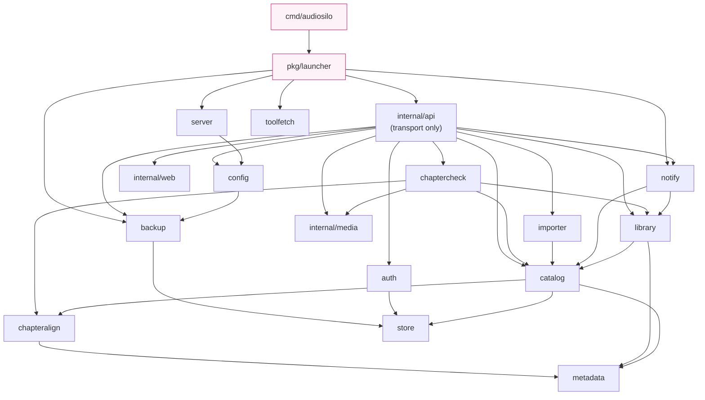

`audiosilo-server` is a self-hosted **audiobook server** written in Go: a JSON API
plus a baked-in admin/connect web UI, with the separately-built player frontend
served at `/web`. It is designed to be **safe for inexperienced users to expose to
the internet**: secure defaults, no default passwords, app-layer hardening, and
configurable TLS.

Module path: `github.com/kodestar/audiosilo-server`.

## Design priorities (in order)

When two concerns conflict, the earlier one wins:

1. **Safe to expose to the internet.** Hashed secrets, rate limiting, strict CSP,
   path-traversal defenses - see [Auth & security](auth-and-security.md).
2. **Fast regardless of library size.** FTS5 full-text search and keyset
   pagination keep queries O(1)-ish however deep the catalog grows - see
   [Data model](data-model.md).
3. **No-wait first connection.** The filesystem view (`GET /libraries/{id}/fs`)
   needs no prior indexing, so a freshly connected client browses immediately
   while the scanner works in the background - see [Scanner](scanner.md).
4. **Portable.** The filesystem is the source of truth for content; the SQLite
   database is a **rebuildable** index/cache. Content is never stored only in the
   DB, and durable user state survives a full index rebuild.

Priority 4 underpins the workspace-wide invariant that **the path is the
identity**: content is addressed by `(library_id, rel_path)`, never by a database
id (see [Architecture invariants](../architecture/invariants.md)).

## Package layout

```text
cmd/audiosilo/        entrypoint (flag wiring)
pkg/launcher/         PUBLIC run loop
pkg/match/            PUBLIC fuzzy book matcher
internal/config/      YAML + env config
internal/store/       SQLite open + migrations
internal/auth/        users, tokens, auth codes
internal/catalog/     the data layer
internal/library/     fs view + scanner
internal/metadata/    tag/ffprobe extraction
internal/media/       streaming + covers
internal/chapteralign/ fits community chapter lists onto a book's audio
internal/chaptercheck/ background community chapter checks
internal/toolfetch/   ffmpeg/ffprobe download
internal/metamirror/  metadata mirror mode's local copy
internal/diskspace/   free disk space per OS
internal/api/         HTTP transport
internal/server/      HTTP(S) server + TLS
internal/updates/     the update check (GitHub Releases)
internal/logring/     in-memory log ring for the console
internal/backup/      database backups + restore at start
internal/notify/      event feed + webhook/ntfy/Discord
internal/importer/    listening imports from Audiobookshelf
internal/web/         baked-in web UI
testdata/library/     M4B test fixtures
```

### `cmd/audiosilo`

The binary entrypoint. It only parses flags (`--data`, `--ffprobe`, `--ffmpeg`,
`--setup`) and delegates everything to `pkg/launcher.Run`. Keep it thin - any
logic added here would be invisible to the desktop manager, which does not go
through `main`.

### `pkg/launcher` (public)

The shared run loop: load config → open the store → wire services → first-run
bootstrap (auto-admin banner, or the token-guarded `/setup` wizard in setup mode)
→ sync config-declared libraries → kick off the initial background scan → serve
until the context is cancelled. It is public (under `pkg/`) **precisely so the
audiosilo-manager desktop app can run the server in-process** via
`launcher.Run`/`launcher.Options` - see
[Manager server integration](../manager/server-integration.md). `Options` carries
embedding-friendly overrides (`Bind`, `TLSMode`, `PublicURL`, `Libraries`,
`OnURL`) that are re-validated after being layered onto the loaded config.
Before the database opens, `Run` applies a restore an admin asked for
(`backup.ApplyPendingRestore`); it then starts the backup schedule, the
notification workers and the daily retention (sessions, audit log, event
feed).
`resolveTools` here picks the ffmpeg/ffprobe binaries: an explicit path, a copy
next to the executable, `$PATH`, and only then a download via
`internal/toolfetch`.

### `pkg/match` (public)

A fuzzy **same-book matcher** (`Best`, `CleanTitle`, `SeqFromTitle`,
`Normalize`, `NormalizeSeries`, `Fold`) that identifies the same book across
messy, inconsistently-tagged titles. Public because the manager uses it to match
an Audible library against a server's index (which then feeds
`book_enrichment` - see [Data model](data-model.md)); the server uses it too,
for the admin catalog's author/narrator merge keys and the community match
search's title cleaning and comparison, and the listening import's title
tier (`internal/importer`). `Fold` is the Unicode-aware sibling of
`Normalize` (lowercase, keep every script's letters and digits, drop spacing and
punctuation); `Normalize` keeps ASCII only and is unchanged.

### `internal/config`

YAML config (`config.yaml` in the data dir) plus `AUDIOSILO_*` environment
overrides, validation, and secure defaults. Owns the `TLSMode` enum
(`off`/`selfsigned`/`autocert`), the `Demo` config, `AppLinkConfig` for the
native deep-link association files, and `WebDir`. See
[Configuration](configuration.md).

### `internal/store`

Opens SQLite via `modernc.org/sqlite` (pure Go - the binary is CGO-free and
cross-compiles anywhere) and applies the embedded, append-only migrations in
`internal/store/migrations/`. `store.DB` routes reads and writes to separate
pools (single-connection writer, read-only reader pool over WAL) and provides
`WithTx` with slow-transaction logging. See [Data model](data-model.md) for the
schema and the SQLite rationale.

### `internal/auth`

Accounts and credentials: argon2id password hashing (`hash.go`), opaque
SHA-256-hashed bearer tokens (session, pairing, and API-key kinds), and redeemable auth
codes (invite + recovery kinds) with atomic redemption. Also owns the admin
safety guards (`ErrLastAdmin`, `ErrAdminNeedsPassword`) and the demo-account
reaper queries. See [Auth & security](auth-and-security.md).

### `internal/catalog`

The data layer over the store: libraries, books/files/chapters, FTS search,
keyset-paginated listings, per-user listening state
(progress/bookmarks/notes/history/favourites), filesystem-based shares and the
`Scope` authorization model, folder-detection overrides, path-keyed enrichment,
admin metadata overrides layered onto the index as effective values
(`overrides.go`, `refreshEffective`), custom covers, the admin catalog queries
(`adminbooks.go`, `bookdetail.go`), listening sessions derived from progress
saves and their retention (`sessions.go`), the admin Activity stats
(`activity.go`) and progress edits (`progress_admin.go`), the admin audit log
(`audit.go`), notification destinations and the event feed (`notify.go`), the
rows of listening imports and their one-transaction apply and undo
(`imports.go`), and `MoveDurableState` (move-tracking).
Handlers call into this package; it is where catalog business logic belongs.

### `internal/library`

Two filesystem subsystems: `fsview.go` (instant, index-free directory browsing
via `BrowseFS`, plus `SafeJoin` - the path-traversal gate every user-derived
filesystem access must pass) and `scanner.go` (the background scanner that
builds the index: discovery, book detection, metadata enrichment, chapter
normalization, move detection, pruning). See [Scanner](scanner.md).

### `internal/metadata`

Metadata extraction: embedded tags in-process via `dhowden/tag`, durations /
chapters / codec via ffprobe when available (`probe.go`), the release
date (`ReleaseDate`, a date tag as `YYYY[-MM[-DD]]`), and
`DeriveFromPath` - the structural path heuristic
(`Author/Series/01 - Title.m4b`; a lone folder above the book is its author,
`Author/Title.m4b`) that fills gaps for untagged files. `layout.go`
reads a path's author/series/book LAYOUT (`ReadPathLayout`, the community
match's path facts) and turns it into a path-first library's values
(`FromPathLayout`). Defines the
normalized `metadata.Chapter` shape (with `file_path` and `book_offset`) that
makes single-file and multi-file books look identical to clients. All ffprobe
paths degrade gracefully when the tool is absent.

### `internal/names`

Reads the people in a single Author/Narrator credit: `Split` (the deliberately
shy co-credit rule: `;`, ` & ` and ` and ` always split, a comma only when every
part is a full name, so "Alexandre Dumas, pere" stays one), `Reversed` ("Surname,
Given", particles included: "Le Guin, Ursula K.") and `SortKey` (surname first,
for the admin list's `surname` sort; `internal/catalog` registers it, memoized,
as the SQL function `name_sort`, never used in a migration, index or view). Used
by the export, the merge suggestions and the sort.

### `internal/media`

Serves audiobook bytes: `ServeFile` (HTTP Range support via
`http.ServeContent`, with byte-sniffed audio `Content-Type` so strict players
like iOS AVPlayer accept the stream), `Transcode` (on-the-fly ffmpeg pipe to
MP3 for codecs browsers can't decode), `DirectPlayable` (the codec allow-list
clients use to decide whether to request `?transcode=1`), and `EmbeddedCover`
extraction. See [Media & streaming](media.md).

### `internal/covercolors`

The background cover colour pass: a `Runner` that reads the colour of every book
whose cover may have art and holds none for it (`catalog.CoverColorsDue`), one at
a time, once the start or a burst of book changes has been quiet for 30 s, and
hourly. It does no image work
itself: `api.colorCover`, the cover endpoints' own reading, is handed in as its
`Colorer`. See [The background colour pass](media.md#the-background-colour-pass).

### `internal/chapteralign` and `internal/chaptercheck`

[Community chapters](community-chapters.md). `chapteralign` is the pure fit of a
community recording's chapter list onto a book's own files and chapters
(anchors by title and time, proportional placement, snapping to pauses), with
no I/O of its own. `chaptercheck` is its `Runner`: a background pass every 10
minutes (and on a `Kick` after any book change, through `Catalog.OnBookChange`) plus one-book checks on request, which
fetches the list through `internal/meta`, finds pauses with ffmpeg
(`media.DetectSilences`) and records the outcome through `catalog`.

### `internal/metamirror`

Mirror mode's runner (`metadata.mode: mirror`): it keeps a local copy of the
community metadata database in `<data>/meta-mirror/`, downloaded from
audiosilo-meta's data releases on GitHub (through audiosilo-meta's public
`pkg/release`) once a day, and serves metaserve's own JSON API handler
(`pkg/query`) over it. `internal/meta` puts it in front of the remote service
(`meta.Service.SetMirror`), which still answers whatever the copy can't. The
launcher builds it only in mirror mode (`pkg/launcher/metamirror.go`) and hands
it to the API with `API.SetMetaMirror` right after `api.New`; `Run` opens the
copy in the background, then checks on its schedule. A server started in remote
mode deletes the folder. `internal/mirrortest` is its test support (data
releases on audiosilo-meta's public `pkg/release/releasetest` fake GitHub, a
counting remote service), tests only.
`internal/diskspace` is the free-space reading its disk guard shares with the
library disks on Health > System. Behaviour, schedule and fallback:
[Mirror mode](configuration.md#mirror-mode-metadatamode-mirror).

### `internal/toolfetch`

On-demand download of a cached static ffmpeg/ffprobe build into
`<data>/tools` when no local copy is found (HTTPS, self-checked by running
`-version`). Degrades gracefully offline and retries on the next start. Only
consulted by `pkg/launcher.resolveTools` after all local resolution fails.

### `internal/api`

HTTP transport **only**: routing (`api.go` is the full route table), middleware
(auth, CORS, security headers, real-IP, timeouts), rate limiting
(`ratelimit.go`), and the `handlers_*.go` files. See the
[API introduction](api/index.md) and [reference](api/reference.md).

### `internal/server`

The HTTP(S) server itself: TLS modes (`off` for reverse proxies, `selfsigned`,
`autocert`/Let's Encrypt) and graceful shutdown. `Certificates` reads the
served certificates back from their files for Health > System.

### `internal/updates`

The update check behind the console's Server > About: `Checker` asks GitHub
Releases for the latest release once a day while `update_check` is on (and on
"Check now", at most once a minute), conditional on the last `ETag`, and
compares versions. Started by `pkg/launcher`; see
[Update check](configuration.md#update-check).

### `internal/logring`

A `slog.Handler` that `pkg/launcher` wraps around the server's logger: every
record still goes where it went, and those at info and above are also copied
as plain text into a `Ring` of the newest 2000 (attributes whose key names a
secret are redacted, long values cut). `GET /admin/logs` queries it for the
console's Server > Logs. Nothing is written to disk.

### `internal/backup`

Database backups for Settings > Backups: `VACUUM INTO` copies into the backups
folder on a daily or weekly schedule and on request, retention of scheduled
backups, and a restore that is checked, left as a marker and applied by
`ApplyPendingRestore` at the next start after a safety copy. See
[Backups, audit log and notifications](backups-and-notifications.md).

### `internal/notify`

Records server events (new books, a failed scan, an offline library, a
sign-in, a used invite, an update, a failed backup) in the feed the console's
bell reads, and delivers them to webhook, ntfy and Discord destinations in the
background (signed webhooks, retries, no redirects, nothing secret in a
message). See [Notifications](backups-and-notifications.md#notifications-internalnotify).

### `internal/importer`

Listening imports from Audiobookshelf (admin only in v1), so someone moving to
AudioSilo keeps their history: the read-only ABS client (`abs.go`: `/status`
checked before the token is sent, same-host redirects, size-capped responses,
fixed error sentences), the normalised payload kept on the import
(`payload.go`), the path/ASIN/ISBN/title matcher (`match.go`, using
`pkg/match.Best` for the fuzzy tier), the pure planner the review and the apply
share (`plan.go`), and the `Service` that runs the background fetch, the
cutoff change, the apply and the undo (`service.go`). The rows are
`catalog`'s (`imports.go`). The token never leaves the running fetch's memory.
`abstest/` is a fake ABS serving recorded responses, for tests. See
[Listening imports](data-model.md#listening-imports) and the
[routes](api/reference.md#admin-listening-imports).

### `internal/web`

The baked-in admin/connect UI - vanilla HTML/CSS/JS with no build step, embedded
in the binary - plus the mount that serves the **player** (the separate
audiosilo-frontend export) at `/web` from `web_dir`. Owns both CSP policies (the
strict site-wide one and the per-document `htmlCSP` for the player). See
[Web UI](web-ui.md).

## Dependency direction


```mermaid
graph TD
  cmd["cmd/audiosilo"] --> launcher["pkg/launcher"]
  launcher --> api & server & toolfetch & backup & notify
  api["internal/api<br/>(transport only)"] --> auth & catalog & library & media & config & web & backup & notify & importer & chaptercheck
  chaptercheck --> catalog & library & media & chapteralign
  catalog --> chapteralign
  chapteralign --> metadata
  importer --> catalog
  server --> config
  config --> backup
  backup --> store
  notify --> catalog & library
  library --> catalog & metadata
  auth --> store
  catalog --> store
  catalog --> metadata
  web["internal/web"]
  media["internal/media"]

  classDef pub fill:#fdf2f8,stroke:#db2777;
  class launcher,cmd pub;
```

Rules of thumb:

- Everything DB-backed goes through `internal/store`; nothing else touches SQL
  connections directly.
- `internal/media` and `internal/web` are leaf packages - they know nothing
  about the catalog or auth.
- `pkg/match` is deliberately dependency-free of the rest of the server.

## `api` is transport-only

The single most important layering rule: **keep business logic out of
handlers**. `internal/api` decodes requests, enforces auth/scope, calls into
`auth`/`catalog`/`library`/`media`, and encodes responses - nothing more. Logic
placed in the non-`api` packages stays unit-testable without an HTTP harness,
and the same logic is reachable by future non-HTTP surfaces (the planned
WebSocket layer must reuse `catalog.SaveProgress`'s last-write-wins merge, for
example).

If you find yourself writing a loop, a merge rule, or an SQL query inside a
`handlers_*.go` file, it belongs in `catalog` (or `auth`, `library`, `media`)
instead.

## Test landscape

Every feature ships with a test (see
[Gates & CI](../contributing/gates-and-ci.md) for the full gate):

- **Handler/integration tests** use the `newTestEnv` harness in
  `internal/api/api_test.go`: an in-memory SQLite store (`store.Open(ctx,
  ":memory:")`), a seeded admin + auth code, and the real `testdata/library`
  fixtures (tiny generated M4B files under author/series folders).
  `newTestEnvWith` accepts a config mutator for routes registered at build time
  (e.g. the demo root redirect).
- **Pure-logic tests** sit next to the code: `internal/api/middleware_test.go`,
  `internal/catalog/shares_test.go` and `catalog_test.go` (with its own
  `newTestCatalog`), `internal/web/web_test.go`, and so on.
- A few scanner tests need `ffprobe` on the machine; without it they `t.Skip`
  (CI installs ffmpeg).
- **Security-critical code requires both an allowed and a denied regression
  test** - the enumerated list is in
  [Auth & security](auth-and-security.md#the-allowed--denied-test-rule).

Full gate, run from the repo root before calling any change done:

```sh
scripts/build-admin.sh   # admin console: npm ci + check + build (when admin-ui/ changed)
go build ./... && go vet ./... && go test -race ./... && golangci-lint run
```
