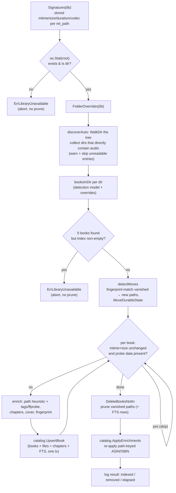

`internal/library` contains two complementary subsystems:

- **`fsview.go`** - the instant filesystem view. `BrowseFS` lists a real
  directory with **no prior indexing**, which is what makes the first
  connection wait-free (design priority #3).
- **`scanner.go`** - the background `Scanner` that builds and maintains the
  index (`books`/`book_files`/`chapters`/`books_fts`) the computed views,
  search, and rich metadata come from.

The two meet in the API layer: browsing works immediately from the raw tree,
and entries get index metadata overlaid as the scan (or on-demand indexing)
catches up.

## The filesystem view (`BrowseFS`)

`library.BrowseFS(root, relPath, offset, limit, allow)` lists one directory:

- The path goes through `SafeJoin` first (the traversal/symlink gate - see
  [Auth & security](auth-and-security.md#path-traversal-librarysafejoin)).
- **Dotfiles are hidden**, and **non-audio files are filtered out** (only
  directories and `metadata.IsAudio` files survive) - so anything a client can
  click is either navigable or playable; `.jpg`/`.nfo` clutter never reaches
  the UI.
- The optional `allow` callback filters entries **before pagination** (so pages
  stay full); the API passes `Scope.VisibleInBrowse` here for non-admin
  callers, scoping the tree to their shares.
- Directories sort before files, both case-insensitively by name; pagination is
  simple offset-based (default 200, cap 500) - fine here because a single
  directory is small, unlike the catalog-wide listings which must use keyset
  cursors.
- Only files get a per-entry `stat` (for `size`/`mod_time`); directories skip
  it - one saved round-trip per entry is the difference between a snappy and a
  multi-second author listing on a network mount.

The handler (`handleBrowseFS` → `annotateWithBooks`) then overlays the
**hybrid view**: paths that match indexed books (via `catalog.BooksByPaths`)
get `is_book: true` plus title/author/series/series-index/duration, and each
entry carries its effective folder-detection `override` so the admin console's
Detection browser can show and toggle it.

## When scans run

There is **no periodic rescan**. A scan of a library runs when:

| Trigger | Where |
|---|---|
| Server startup (every library, once) | `launcher.initialScan`, in a background goroutine |
| Admin "Rescan" | `POST /admin/libraries/{id}/scan` → `backgroundScan` (returns 202 immediately) |
| Library created or edited | `handleCreateLibrary` / `handleUpdateLibrary` (a changed root invalidates the index) |
| Folder override set or cleared | `handleSetFolderOverride` / `handleDeleteFolderOverride` |
| A single path, on demand | `Scanner.IndexPath` from any content handler (see below) |

`backgroundScan` detaches the scan from the request but binds it to the server
lifecycle (`a.baseCtx`, with a 1-hour timeout), so shutdown cancels an
in-flight scan rather than leaving it orphaned. Concurrent `Scan` calls for the
**same** library coalesce (the second returns immediately); different libraries
scan concurrently. Progress is observable: the scanner tracks a per-library
`ScanProgress{Running, Total, Done, Indexed}` served by
`GET /admin/libraries/{id}/scan`, and logs a heartbeat every 15 s so a long
pass over a network share doesn't look hung.

## Anatomy of a scan pass

The **unchanged-skip** condition is worth reading precisely: a book is skipped
when its stored mtime and size match **and** either ffprobe is disabled or a
prior probe already stored both a duration and a codec. That last clause is a
backfill mechanism - books indexed before the `codec` column existed (migration
`0008`) get re-probed once even though their files haven't changed.

## Book detection (`booksInDir`)

There is no per-library layout setting. The model matches the dominant
"folder per book" convention (and Audiobookshelf):

- **A directory that directly contains audio is ONE book**, with all those
  files as its ordered tracks - whether it holds a single `.m4b` or fifty
  distinctly-named `.mp3` chapters. Do **not** split a folder's files into
  separate books by filename; that heuristic produced one phantom book per
  chapter file.
- The single exception is the **library root**: loose audio files sitting
  directly in the root have no enclosing book folder, so each is its own
  single-file book.
- A folder of loose single-file books is expressed with a **per-folder
  override**: `folder_overrides.mode = 'collection'` forces one book per file;
  `'book'` forces folder-is-one-book (e.g. at the root). Overrides are durable,
  path-keyed config consulted before the heuristic - set via
  `PUT/DELETE /admin/libraries/{id}/folder-override?path=` (which rescans), and
  driven by the admin console's Detection browser.

`folderBook` orders parts by name (`os.ReadDir`'s stable ordering), sums sizes,
takes the max mtime, and takes the **earliest** file's `added_at`. `addedAt` is
the file's birth (creation) time where the OS records it
(`birthtime_darwin.go`/`birthtime_linux.go`), otherwise mtime - a stable
chronological key for "recently added" that survives re-indexing.

## Metadata extraction

`Scanner.enrich` fills a discovered book in layers, cheapest first, with
embedded data winning where it is trustworthy:

1. **Structural path parsing** (`metadata.DeriveFromPath`) is the baseline. The
   book's own name (filename minus extension, or folder name) yields the title
   and a leading series index (`splitSeriesIndex` parses `01 - Unsouled`,
   `Book 3 - …`, `C02 …`); the nearest ancestor directory is the series and the
   one above it the author (`Author/Series/01 - Title.m4b`). A book at the
   library root simply has no ancestors - the old "flat" layout falls out for
   free.
2. **Embedded tags + probe** (`metadata.Extract` on the primary file - the
   first part for folder books) overlay the baseline: tags via `dhowden/tag`
   in-process (album ≻ title for the book title, album-artist ≻ artist for the
   author, composer as narrator, plus raw-tag lookups for series/narrator
   atoms), then ffprobe (when configured) for duration, chapters, the audio
   `codec` (`codec_name` of the first audio stream - this is what feeds the
   `direct_playable` API flag), and richer container tags.
3. **Generic-title guard**: `chooseTitle` keeps the path-derived title when the
   embedded one is missing or generic - `metadata.IsGenericTitle` flags bare
   numbers and "Track 01"/"Disc 2"/"CD1"-style labels (token-based, so a real
   title like "Part of Your World" is not flagged).

**ffprobe is optional** and every path degrades gracefully without it:
path-derived metadata still works, durations fall back to chapter ends or
remain 0, and `codec` stays empty - which the API treats as directly playable
(the client falls back to `?transcode=1` if playback fails). See
[Media & streaming](media.md).

## Chapter normalization

Chapters are normalized (`metadata.Chapter`) so single-file and multi-file
books present identically: every chapter carries `file_path` (the
library-relative audio file to stream), in-file `start`/`end`, and
`book_offset` (its start on the whole-book timeline).

- **Single-file books** (`singleFileChapters`): embedded chapters are marked as
  living in file 0 with `book_offset = start`. If the container reports no
  format duration (some m4b), the book duration falls back to the last
  chapter's end.
- **Folder books** (`buildMultiFileChapters`): each part is probed and,
  crucially, **if a part has its own embedded chapters** (a single chaptered
  m4b living in its own book folder) **those are expanded** into the book's
  chapter list; otherwise the whole part becomes one chapter titled from its
  filename (`partTitle` strips the extension and any leading track number).
  Book offsets accumulate across parts and the book's duration is the sum, so
  a chaptered m4b and a folder of split mp3s render identically in a player.

## Covers

Cover resolution has two stages - an indexed **sidecar** path, and an
**embedded-art** fallback at request time:

- During enrichment, `findCover` looks for a conventionally-named sibling image
  (`cover.jpg`, `cover.jpeg`, `cover.png`, `folder.jpg`, `folder.png`). For a
  **folder book** it searches *inside* the book folder and - only there - will
  fall back to any image file (`.jpg/.jpeg/.png/.webp/.gif`), preferring one
  with "cover" in its name over an arbitrary first-alphabetical thumbnail. A
  multi-CD disc subfolder (`CD1`, `Disc 2` - `isDiscFolder`) falls back to its
  *parent* folder, where the art usually lives. For a **loose single-file
  book** only the conventional names in its directory count (a stray image
  there is probably not its cover). The result is stored in `books.cover_path`.
- At request time, `handleCover` serves the sidecar via `media.ServeFile` when
  `cover_path` is set; otherwise it extracts **embedded art** from the book's
  primary audio file (`media.EmbeddedCover`, via `dhowden/tag`), and 404s if
  neither exists.

## Move detection

Re-tagging keeps durable state via the path key; **moving** a file keeps it via
the fingerprint:

- `fingerprintFile` computes SHA-256 of (size, first 64 KiB, last 64 KiB) -
  cheap on huge audiobooks, and stored in `books.content_hash`. It is
  explicitly *not* an identity, only a move detector.
- `Scanner.detectMoves` runs early in each scan, and only does work when
  something both **disappeared** (in the stored signatures, not discovered) and
  **appeared** (discovered, not stored) - keeping fingerprinting off the hot
  path of normal scans. It fingerprints each new book's primary file (caching
  it on the book so `enrich` doesn't re-read) and matches against the stored
  fingerprints of the vanished paths (`catalog.FingerprintsForPaths`).
- A match calls `catalog.MoveDurableState(lib, oldPath, newPath)`, which
  migrates **all six** path-keyed tables - `progress`, `bookmarks`, `notes`,
  `listening_history`, `favourites`, and `book_enrichment` - in one
  transaction, so a rename/move never orphans a user's position or a book's
  attached ASIN.

## On-demand indexing (`IndexPath`)

Content handlers resolve `(library, path)` via `bookForPath`: try
`catalog.GetBookByPath`, and on a miss call `Scanner.IndexPath` - so a client
can open a book it found in the filesystem view **before the background scan
has reached it**.

`IndexPath`:

1. Gates the path through `SafeJoin`, but then derives the working path from
   the **unresolved** join - `SafeJoin` returns a symlink-resolved path, and
   using it would produce `rel_path` keys that disagree with the full scan
   (which walks the root unresolved) whenever any component of the root is a
   symlink (macOS `/tmp → /private/tmp`, NAS mounts).
2. Classifies the containing directory **exactly as a full scan would**
   (`booksInDir`, including overrides and the root case), then `pickBook`
   selects the book the requested path resolves to - the book itself, or the
   folder book a clicked *part* belongs to (both resolve to the same book).
3. Enriches, upserts, and re-applies enrichment **for that one path only**
   (`catalog.ApplyEnrichment` - this is a hot per-request path, so no
   whole-library sweep), then returns the full book with chapters.

A path that is not a book - a directory with no direct audio, or one the
detector treats as a collection - returns `ErrNotIndexable`, which handlers map
to 404.

## The unavailable-root guard

`ErrLibraryUnavailable` protects the index when a network share (SMB/NFS)
drops. The scanner **aborts without pruning** when either:

1. the library root is missing or not a readable directory (`os.Stat` before
   discovery), or
2. discovery returns **zero** audio files while the index still has books - an
   existing-but-empty mount point looks exactly like this, and letting the
   prune step run would wipe every indexed book.

Related but distinct: a *per-entry* read error during the walk (commonly a
permission-denied subtree on a partially-readable mount) is warned and
**skipped**, not fatal - aborting the whole scan would be worse, but silently
dropping those books would let the prune step remove them.

:::note
Library roots must be **local paths** (mount remote shares first). The guard is
the safety net, not the design.
:::
