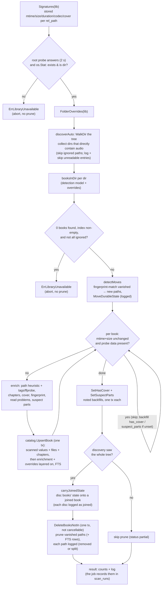

`internal/library` contains two complementary subsystems:

- **`fsview.go`** - the instant filesystem view. `BrowseFS` lists a real
  directory with **no prior indexing**, which is what makes the first
  connection wait-free (design priority #3).
- **`scanner.go`** - the background `Scanner` that builds and maintains the
  index (`books`/`book_files`/`chapters`/`books_fts`) the computed views,
  search, and rich metadata come from. Around it: the scan job queue and the
  scheduler (`jobs.go`, `schedule.go`), per-library ignore rules (`ignore.go`)
  and what a scan notices for the console's Health page (`problems.go`).

The two meet in the API layer: browsing works immediately from the raw tree,
and entries get index metadata overlaid as the scan (or on-demand indexing)
catches up.

## The filesystem view (`BrowseFS`)

`library.BrowseFS(root, relPath, offset, limit, allow, ignore)` lists one directory:

- The path goes through `SafeJoin` first (the traversal/symlink gate - see
  [Auth & security](auth-and-security.md#path-traversal-librarysafejoin)).
- **Dotfiles are hidden**, and **non-audio files are filtered out** (only
  directories and `metadata.IsAudio` files survive) - so anything a client can
  click is either navigable or playable; `.jpg`/`.nfo` clutter never reaches
  the UI.
- The optional `allow` callback filters entries **before pagination** (so pages
  stay full); the API passes `Scope.VisibleInBrowse` here for non-admin
  callers, scoping the tree to their shares.
- Entries the library's [ignore rules](#ignore-rules) cover are left out too
  (`Ignore.Covers`, also before pagination), so the browse view never shows
  what the scanner skips.
- Directories sort before files, both case-insensitively by name; pagination is
  simple offset-based (default 200, cap 500) - fine here because a single
  directory is small, unlike the catalog-wide listings which must use keyset
  cursors.
- Only files get a per-entry `stat` (for `size`/`mod_time`); directories skip
  it - one saved round-trip per entry is the difference between a snappy and a
  multi-second author listing on a network mount.

The handler (`handleBrowseFS` → `annotateWithBooks`) then overlays the
**hybrid view**: paths that match indexed books (via `catalog.BooksByPaths`)
get `is_book: true` plus title/author/series/series-index/duration, and each
entry carries its effective folder-detection `override` so the admin console's
folder detection dialog can show and change it. For an **admin** caller only, a
folder whose indexed books are the discs of a [disc set](#joined-books-disc-sets)
not yet joined is marked `split_discs: true` (`catalog.SplitFolders`, from
`books.split_parent`; `omitempty`), which is where the console offers the join.
A member's listing never carries the key, so the player's wire is unchanged.

## When scans run

Every full scan goes through **one job queue** (`internal/library/jobs.go`).
A scan of a library runs when:

| Trigger | `trigger` value | Where |
|---|---|---|
| Server startup (every library, once) | `startup` | `Scanner.EnqueueAll` from `launcher.Run`, after `Scanner.Start` |
| The library's scan schedule says it's due | `schedule` | the scheduler goroutine (see [Scheduled scans](#scheduled-scans)) |
| Admin "Rescan" (and the setup wizard's first scan, and a newly created library) | `manual` | `POST /admin/libraries/{id}/scan`, `POST /admin/libraries`, `POST /setup` |
| Admin "rescan every library" | `manual` | `POST /admin/scan` (`Scanner.EnqueueAll`) |
| A library's root or ignore rules changed | `change` | `handleUpdateLibrary` |
| A folder override set or cleared | `change` | `handleSetFolderOverride` / `handleDeleteFolderOverride` |
| A single path, on demand | - (not queued) | `Scanner.IndexPath` from any content handler, and `POST /admin/libraries/{id}/book/rescan` (see below) |

Only a change to the **root** or the **ignore rules** queues a scan on a
library edit. A rename, a new default view or a new schedule doesn't touch the
index, so `PATCH /admin/libraries/{id}` no longer rescans for those (before
Phase 3 every edit did).

### The job queue

`Scanner.Enqueue(lib, trigger, startedBy)` adds a job and returns it; one
worker goroutine (`Scanner.work`, started by `Scanner.Start`) runs queued jobs
**one at a time, first in first out**, so scans never compete for the disk or
for SQLite's single writer connection. Different libraries no longer scan in
parallel.

- **Coalescing.** Asking for a library that already waits returns the waiting
  job. Asking for a library that is **running** queues it to run once more
  after the current scan (a setting changed mid-scan, so the running scan may
  have read the old one) - unless the ask is a `schedule` or `startup` scan,
  which has nothing new for a second pass to see; those return the running job.
- **Queued state.** A library's `ScanProgress.Queued` is read from the queue
  itself, so it is true as soon as `Enqueue` returns: a status poll made right
  after the request sees the scan even if it has to wait. When the worker starts
  the job, the library reads as `running` (and still `queued` when another pass
  is lined up), and it stays `running` until the run's `scan_runs` row is
  written, so a poll that sees the scan finished finds its history finished
  too.
- **Each job runs the library as it is now**: the worker re-reads the library
  row, so a rename or new root since the job was queued is honoured, and a
  library deleted meanwhile is skipped.
- **Cap.** A scan someone or something asked for runs under a one-hour timeout
  (`scanTimeout`); a scan that hits it is recorded as `failed`. The **startup**
  scan has no time limit (`jobContext`): it is a library's full index after a
  restart, and it runs to the end as it always has. Every scan ends with the
  server.
- **Cancel.** `Scanner.Cancel(id)` drops a queued job, or cancels the running
  one's context. A cancelled scan stops during the folder walk or at its next
  book, and **never inside the prune**: it checks for a cancel just before
  pruning, and once begun the prune runs to the end as one transaction (on a
  context that ignores the cancel). So a stopped scan has removed nothing, and
  one that pruned records what it removed. It is recorded as `cancelled`.
  Dropping a queued **scheduled** scan skips that slot (see
  [Scheduled scans](#scheduled-scans)).
- **Deleting a library** cancels its scans (`Scanner.CancelLibrary`): its queued
  jobs are dropped and a running one is stopped, so they don't hold the queue.
- **Hung roots don't block the queue.** Before discovery, the scan asks the
  bounded root probe (the 2-second check behind `available`, see
  [Reporting it to the console](#reporting-it-to-the-console)). A root that
  doesn't answer (a hard-mounted NFS share whose server is gone, where a plain
  `stat` can block for minutes) stops the scan at the
  [unavailable-root guard](#the-unavailable-root-guard), recorded as
  `unavailable`, and the next job runs.
- **One at a time, by construction.** `Scan` itself no longer coalesces
  concurrent calls for the same library; the queue is what guarantees a library
  is never scanned twice at once.
- **Memory only.** The queue is not persisted. A job still waiting when the
  server stops is lost; the startup scans and schedules cover that.

`GET /admin/jobs` returns the running job (with its library's progress), the
queue and every scheduled library's next scan; `DELETE /admin/jobs/{id}`
cancels (see the [API reference](api/reference.md#get-apiv1adminjobs)).

### Scan history (`scan_runs`)

The worker records every job it runs in `scan_runs` (`catalog/scanruns.go`):
`StartScanRun` before the scan, `FinishScanRun` after, using a context that
outlives the server's so a run is closed even during shutdown. A row holds the
trigger, who started it (`started_by`, `NULL` for a schedule or startup), start
and finish times, a status, counts and a log.

| Status | Meaning |
|---|---|
| `running` | the scan has not finished |
| `ok` | finished, including the prune step |
| `partial` | finished, but part of the tree couldn't be read, so pruning was skipped |
| `unavailable` | stopped at the [unavailable-root guard](#the-unavailable-root-guard); nothing pruned |
| `failed` | an error (including the one-hour cap); nothing pruned |
| `cancelled` | an admin stopped it; nothing pruned |
| `interrupted` | the server stopped mid-scan. `Scanner.Start` marks every run still open at startup this way (`InterruptScanRuns`) |

The counts are `books` (books discovered on disk), `added`, `updated`, `moved`,
`removed` and `errors` (books whose files had a [read problem](#read-problems),
plus index writes that failed). A moved or renamed book counts **once**, as
`moved`: not also as added at its new path or removed at its old one. A
[joined book](#joined-books-disc-sets) and the discs it splits back into are
reshapes of books the library had, so neither counts as `added` (and no "books
added" notification follows), and neither the joined discs nor the split-up
book count as `removed`. The same counters, live, are on
`ScanProgress` (`added`, `updated`, `moved`, `removed`; `indexed` is now
`added + updated`).

The **log** is a JSON array of `catalog.RunEvent` (`at`, `level` =
`info`/`warn`/`error`, `kind`, and `path`/`to`/`code`/`detail`/`count` as the
kind needs). Kinds: `started`, `discovered`, `unreadable` (a path discovery
couldn't read), `moved` (from `path` to `to`), `joined` (a disc book at `path`
whose state was carried into the joined book at `to`; code `length_unknown` when
its listening state stayed on its own path, below), `split` (a joined book at
`path` read as its discs again), `problem` (a read problem, with
its `code`), `error`, `removed` (each pruned path), `partial` and `truncated`,
then one closing event the job adds from the run's status (`closingEvent`):
`finished`, `unavailable`, `failed`, `cancelled` or `interrupted`. The console
words each kind itself; `detail` is the tool's or the OS's own message, shown
as is.

Two bounds keep the table small: a log holds at most **300 events**
(`maxRunEvents`; past that, events are counted and one `truncated` line before
the closing event says how many were dropped). Problems (`unreadable`,
`problem`, `error`) may take at most half of it (`maxProblemEvents`), so a
library full of unreadable files can't crowd out the moves and removed paths
logged after them: the problems are on the books too, the removed paths
nowhere else, and only the newest
**100 runs per library** are kept (`maxScanRunsPerLibrary`, trimmed by
`FinishScanRun`). Runs belong to their library and cascade with it.

### Scheduled scans

A library's `scan_schedule` (`library/schedule.go`, `ParseSchedule`) is one of:

| Value | Meaning |
|---|---|
| `""` | no scheduled scans (the default) |
| `every:<N>h` | N hours after the library's last scan **started**; N is one of 1, 3, 6, 12, 24 |
| `daily:HH:MM` | every day at that time, in the **server's** time zone |

"The last scan" is the library's newest `scan_runs` row, whatever started it
(`LastScanStarts`), so a manual rescan pushes an interval schedule back, and a
server that was off when a daily scan was due runs it as soon as it is back. A
library never scanned counts from when the scheduler started. A scheduled scan
that is dropped without a run of its own - cancelled while it waited, or folded
into a scan of the library already running - counts as a scan start too
(`jobQueue.skipped`), so the scheduler skips that slot instead of queuing it
again a minute later.
`Scanner.NextScans` computes every scheduled library's next due time (it
backs `next_scan_at` on `GET /admin/libraries` and the `schedules` list of
`GET /admin/jobs`); the scheduler checks once a minute (`scheduleTick`) and
enqueues the due ones with trigger `schedule`. Anything else is refused with
`400` `code: "invalid_schedule"` when a library is saved. A valid schedule is
stored in canonical form (`Schedule.String`): `every:06h` is saved as
`every:6h`, which is what the console reads.

## Anatomy of a scan pass

```mermaid
flowchart TD
    A["Signatures(lib)<br/>stored mtime/size/duration/codec/cover per rel_path"] --> B{"root probe answers (2 s)<br/>and os.Stat: exists & is dir?"}
    B -- no --> U1["ErrLibraryUnavailable<br/>(abort, no prune)"]
    B -- yes --> C["FolderOverrides(lib)"]
    C --> D["discoverAuto: WalkDir the tree<br/>collect dirs that directly contain audio<br/>(skip ignored paths; log + skip unreadable entries)"]
    D --> E["booksInDir per dir<br/>(detection model + overrides)"]
    E --> F{"0 books found, index non-empty,<br/>and not all ignored?"}
    F -- yes --> U2["ErrLibraryUnavailable<br/>(abort, no prune)"]
    F -- no --> G["detectMoves<br/>fingerprint-match vanished → new paths,<br/>MoveDurableState (logged)"]
    G --> H{"per book:<br/>mtime+size unchanged<br/>and probe data present?"}
    H -- "yes (skip; backfill has_cover /<br/>suspect_parts if unset)" --> H
    H -- no --> I["enrich: path heuristic + tags/ffprobe,<br/>chapters, cover, fingerprint,<br/>read problems, suspect parts"]
    I --> J["catalog.UpsertBook (one tx):<br/>scanned values + files + chapters,<br/>then enrichment + overrides layered on, FTS"]
    J --> H
    H -- done --> HC["SetHasCover + SetSuspectParts<br/>noted backfills, one tx each"]
    HC --> P{"discovery saw<br/>the whole tree?"}
    P -- no --> PP["skip prune (status partial)"]
    P -- yes --> JC["carryJoinedState<br/>disc books' state onto a joined book<br/>(each disc logged as joined)"]
    JC --> K["DeleteBooksNotIn (one tx, not cancellable)<br/>prune vanished paths (+ FTS rows),<br/>each path logged (removed or split)"]
    K --> M["result: counts + log<br/>(the job records them in scan_runs)"]
    PP --> M
```

The **unchanged-skip** condition is worth reading precisely: a book is skipped
when its stored mtime and size match **and** either ffprobe is disabled or a
prior probe already stored both a duration and a codec. That last clause is a
backfill mechanism - books indexed before the `codec` column existed (migration
`0008`) get re-probed once even though their files haven't changed.

A skipped book can still get one cheap backfill: when its `has_cover` is unset
(a row indexed before migration `0016`), the scan checks its primary file for
embedded art with a tag read (`media.EmbeddedCover`, no ffprobe) and notes the
answer without re-indexing the book. Only books that are really skipped are
checked - one re-indexed anyway gets its flag from the upsert - and a file that
can't be opened right now (a flaky mount) is skipped, leaving the flag unset for
the next scan rather than recording "no cover". The noted flags
are written in **one transaction** after the loop
(`catalog.SetHasCover(ctx, libID, map[path]bool)`, which also counts a sibling
`cover_path` as art), so the first scan after the upgrade stays cheap on a large
library. A skipped folder book indexed before migration `0017` gets the same
kind of tag-only check for [several books in one folder](#folders-that-may-hold-several-books)
(`suspectFromTags`, written by `catalog.SetSuspectParts`).

### Prune: what a removed book leaves behind

When discovery saw the whole tree, `catalog.DeleteBooksNotIn` drops every book
row whose path wasn't found (with its files, chapters and FTS row) in **one
transaction** and returns the paths (minus the ones a detected move carried
away, which are logged as moves), which the scan writes to its log as `removed` events. That log line
is **all** that remains in the index: there is no "missing" flag and no ghost
row kept for the book. The reasons:

- The index is a rebuildable cache of the disk (see
  [Data model](data-model.md#the-two-halves-rebuildable-index-vs-durable-state)),
  so a book that isn't on disk isn't in it.
- Nothing worth keeping is lost. Everyone's progress, bookmarks and notes, and
  the admin's edits, cover, enrichment and ignored issues are path-keyed rows
  with no foreign key to `books`; pruning a book doesn't touch them. If the
  files come back at the same path, the next scan indexes the book and all of
  it reappears. A book that moved is carried to its new path before the prune
  (`detectMoves`, above).
- The log answers "where did that book go?" for the 100 newest scans of each
  library, without the player APIs ever showing a book that can't be played.

Pruning is skipped entirely when the scan can't trust what it saw: an
unreadable subtree (`partial`), the unavailable-root guard, an error, or a
cancel (see [Scan history](#scan-history-scan_runs)).

### Enrichment and admin edits survive every upsert

There is no separate "re-apply" step after a scan. `catalog.UpsertBook` writes
the values the scan found (and records them in `books.scanned`, field → value),
replaces the
files and chapters, then - in the **same transaction** - layers any path-keyed
`book_enrichment` (ASIN/ISBN) and any admin metadata or chapter-title overrides
on top and refreshes the FTS row (`catalog.refreshEffective`). So an attached
ASIN survives a rebuild, and an edited field is a lock: the rescan re-reads the
file, but the edit is re-applied before the transaction commits. Files on disk
are never written. See
[Data model](data-model.md#metadata-overrides-and-effective-values).

## Book detection (`booksInDir`)

There is no per-library layout setting. The model matches the dominant
"folder per book" convention (and Audiobookshelf):

- **A directory that directly contains audio is ONE book**, with all those
  files as its ordered tracks - whether it holds a single `.m4b` or fifty
  distinctly-named `.mp3` chapters. Do **not** split a folder's files into
  separate books by filename; that heuristic produced one phantom book per
  chapter file.
- The single exception is the **library root**: loose audio files sitting
  directly in the root have no enclosing book folder, so each is its own
  single-file book.
- A folder of loose single-file books is expressed with a **per-folder
  override**: `folder_overrides.mode = 'collection'` forces one book per file;
  `'book'` forces folder-is-one-book (e.g. at the root). Overrides are durable,
  path-keyed config consulted before the heuristic - set via
  `PUT/DELETE /admin/libraries/{id}/folder-override?path=` (which rescans), and
  driven by the admin console's folder detection dialog.

`folderBook` orders parts by name (`os.ReadDir`'s stable ordering), sums sizes,
takes the max mtime, and takes the **earliest** file's `added_at`. `addedAt` is
the file's birth (creation) time where the OS records it
(`birthtime_darwin.go`/`birthtime_linux.go`), otherwise mtime - a stable
chronological key for "recently added" that survives re-indexing.

Discovery (`discoverAuto`) walks the tree once (`audioDirs`, which reads each
folder's audio files in the same walk) and hands the folders to `booksOf`,
which calls `booksInDir` per folder, except for the disc folders of a joined
book (below).

### Joined books (disc sets)

A CD rip (`Book/CD1`, `Book/CD2`, the tracks in each, none in `Book`) reads as
one book per disc under the folder-per-book rule. A `book` override on the
folder holding them joins them (`library/joined.go`), but **only** when that
folder is a **disc set** (`discSets`): a folder below the root with no audio of
its own, whose every folder holding audio beneath it is a disc folder
(`isDiscFolder`: `cd`/`disc`/`disk` plus a number, spaces, hyphens, dots and
underscores ignored) **directly** in it, at least two of them (`minDiscs`; one
disc already reads as one book). Discovery and `IndexPath` decide a join in one
place, `joinRoot` (the folder or the one holding it, with `book` and a disc set).

- Any other folder keeps `book`'s old meaning: its own files are the book, and
  without any it is a no-op. Overrides the old detection dialog set on author or
  series folders must never merge a series (or its listeners' progress) on
  upgrade, and nothing is joined automatically: re-shaping existing books
  would orphan their progress.
- The joined book (`joinedBook`) is a folder book at the folder's path with the
  discs' audio as its files (hidden files and the ignore rules apply as usual):
  the disc folders in natural order (`discOrder`: `CD2` before `CD10`, `CD 1`
  equal to `CD1`, ties by path), each disc's files in exactly the order a book
  of that disc alone has them (byte-wise name order, not natural), since the
  state carry-over maps a disc position as offset plus position. Files and
  chapters keep their real paths in the disc folders (`file_path`); a part with
  no chapters of its own is titled with its disc first (`joinedPartTitle`:
  `CD2 - 01`). The cover is the folder's own image, then the first disc's.
- `IndexPath` resolves the folder, a disc folder or a file in one to the joined
  book; so does `bookForPath` from the index (see
  [On-demand indexing](#on-demand-indexing-indexpath)).

**Carrying state.** The scan where a join takes effect runs `carryJoinedState`
before the prune: for each folder with a `book` override whose joined book
reads files from its subfolders (`isJoined`), the disc books that vanished go to
`catalog.JoinDurableState`, placed on the joined timeline by `joinParts`:

- Listening state **moves**, through `carryListeningState` (the one list of
  per-user tables, shared with moves): progress with the furthest position per
  listener winning (`mergeFurthest`; a finished disc counts as its end, and the
  joined book is finished only when the last disc is), bookmarks, notes,
  history and sessions offset by the disc's start, daily roll-ups re-keyed, a
  favourite landing once, and queue entries, collection entries and ratings
  moved to the joined book (where it already has one, the queue and collection
  keep that entry and its position, and the newer rating wins).
- The disc books' own config is **copied**, not moved: `book_overrides`,
  `book_covers` and `book_enrichment` (ASIN and ISBN each filled only where the
  joined book has none) field by field with the earliest disc winning, chapter
  renames re-keyed to the file under the joined folder. Ignored Health issues
  stay with the discs. The joined book's effective metadata is refreshed in the
  same transaction.
- A disc's offset is the length of the discs before it, from their files'
  lengths, else the disc's indexed length. It is **known** only when every
  earlier length is (the first disc's, 0, always is). With ffprobe off or
  failing, a later disc is `Unplaced`: its listening state stays on its own path
  (path-keyed, and there again if the join is undone) rather than landing in
  disc 1, its config is still copied, and its `joined` event carries code
  `length_unknown`.
- If carrying fails, the discs are kept from the prune and the next scan tries
  again; nothing is lost either way.

Each disc is logged `joined`, not `removed`, and the joined book is not counted
as added (`joinsIndexed`). **Removing the override** splits the discs out again
(`Scanner.splitFrom`, the `joinsIndexed` counterpart): the discs aren't counted
as added, the joined book is logged `split` rather than `removed`, and its state
stays on the folder's path for a later re-join (a disc's own position can't be
told from the joined book's). A folder book with audio of its own that goes is
still `removed`. `detectMoves` doesn't pair a joined book renamed away from its
override with its first disc (`reclassified`).

**Marking split books.** During discovery `markSplitDiscs` sets
`Book.SplitParent` (`books.split_parent`, migration `0022`) on each folder book
whose folder is a disc set not joined: the same `discSets` predicate the join
uses, so the [`split_discs` issue](#issues)'s fix always joins. `IndexPath`
works it out the same way from the folder's subtree (`splitParentOf`).
`UpsertBook` stores it, and an unchanged book whose value differs (a sibling
disc came or went, a row from before `0022`) gets it through
`catalog.SetSplitParent` without a re-index.

## Ignore rules

Each library can list files and folders the scanner skips - sample clips, an
`Extras` folder, a podcast feed someone dropped in (`library/ignore.go`). The
rules live in the database (`libraries.ignore_patterns`, one pattern per line),
**not** in a file inside the library: the server never writes to the library
folder, which may be mounted read-only.

The syntax is a small subset of `.gitignore`:

- One pattern per line; blank lines are dropped and lines starting with `#`
  are comments (kept, so an admin's notes survive a save).
- A pattern **without** a `/` matches a file or folder **name at any depth**
  (`*.sample.mp3`, `Extras`).
- A pattern with a `/` **anywhere but at the end** is matched against the whole
  path from the library root (`Podcasts/*`). A leading `/` counts, so `/Extras`
  is only the root's `Extras`.
- A **trailing** `/` limits the pattern to folders (`Extras/`). It doesn't
  anchor it: `Extras/` matches a folder named `Extras` anywhere.
- Wildcards are `path.Match`'s (`*`, `?`, `[...]`), and matching **ignores
  case**. An ignored folder is skipped with everything under it.
- At most **100** patterns of at most **200** bytes each.

`NormalizeIgnore` validates a list when a library is saved. Entries are split
on line breaks first (the column stores one pattern per line), so an entry
holding several lines is several patterns, each validated. It refuses too many
patterns,
one too long, one that matches nothing such as `/`, or a malformed wildcard is
`400` with `code: "invalid_pattern"`, naming the line); `ParseIgnore` builds the
matcher and silently skips any stored line it couldn't use, so a bad row can
never stop a scan. The same rules apply in three places:

1. **The scan**: `discoverAuto` doesn't descend into an ignored folder and
   skips ignored files, and `audioEntries` leaves ignored files out of a
   folder book's parts.
2. **The browse view**: `BrowseFS` hides covered entries (see
   [above](#the-filesystem-view-browsefs)).
3. **On-demand indexing**: `IndexPath` refuses a covered path with
   `ErrNotIndexable` (`Ignore.Covers` checks the path and every folder above
   it).

Changing a library's ignore rules queues a rescan (trigger `change`), which
prunes the books the new rules now skip and indexes the ones they no longer do.
If the rules now cover **every** indexed book, the scan discovers nothing; the
[unavailable-root guard](#the-unavailable-root-guard) would read that as an
unmounted share, so it makes an exception (`ignoresAll`) and the scan prunes
them as the admin asked.

## Metadata extraction

`Scanner.enrich` fills a discovered book in layers, cheapest first, with
embedded data winning where it is trustworthy:

1. **Structural path parsing** (`metadata.DeriveFromPath`) is the baseline. The
   book's own name (filename minus extension, or folder name) yields the title
   and a leading series index (`splitSeriesIndex` parses `01 - Unsouled`,
   `Book 3 - …`, `C02 …`, but not a number running straight into a letter, a
   comma or an apostrophe: `3rd Rock`, `20,000 Leagues Under the Sea` and
   `1's and 0's` keep their whole name as the title); the nearest ancestor directory is the series and the
   one above it the author (`Author/Series/01 - Title.m4b`). A book at the
   library root simply has no ancestors - the old "flat" layout falls out for
   free.
2. **Embedded tags + probe** (`metadata.Extract` on the primary file - the
   first part for folder books) overlay the baseline: tags via `dhowden/tag`
   in-process (album ≻ title for the book title - except when the title tag
   extends the album with a real subtitle, the Audible shape where album holds
   the *series* and only the title tag carries the actual book title; album-artist
   ≻ artist for the author, composer as narrator, plus raw-tag lookups for
   series/narrator atoms and the release date - MP4 `©day`, ID3 `TDRC`/`TYER`,
   Vorbis `date`, read by `metadata.ReleaseDate` into `books.released`, never
   `published`), then ffprobe (when configured) for duration, chapters, the audio
   `codec` (`codec_name` of the first audio stream - this is what feeds the
   `direct_playable` API flag), and richer container tags.
3. **Generic-title guard**: `chooseTitle` keeps the path-derived title when the
   embedded one is missing or generic - `metadata.IsGenericTitle` flags bare
   numbers and "Track 01"/"Disc 2"/"CD1"-style labels (token-based, so a real
   title like "Part of Your World" is not flagged).

The scanner does not record where each value came from. The admin console's
per-field provenance works it out when the book is read
(`bookLayers.resolve`): a scanned value equal to what `DeriveFromPath` yields
for the book's path is `path`, anything else `tag` - one rule for every row, old
or new (see [Data model](data-model.md#metadata-overrides-and-effective-values)).
A library whose `metadata_source` is `path` takes the folder layout over the
tags (`metadata.FromPathLayout`: the top folder is the author and the folder
holding the book the series, so a book one folder deep gets an author and no
series, where `DeriveFromPath` reads that folder as its series); that too is applied when the book is resolved,
not by the scanner, so the stored snapshot is the same in either mode and
switching re-resolves the books without a rescan.
The scanner does record each folder-book part's own codec (`book_files.codec`)
and whether the primary file carries embedded art (`books.has_cover`; the upsert
also sets it whenever a sibling cover was found).

**ffprobe is optional** and every path degrades gracefully without it:
path-derived metadata still works, durations fall back to chapter ends or
remain 0, and `codec` stays empty - which the API treats as directly playable
(`direct_playable: true`, so the web player streams the file as it is rather than
through the transcoder). See
[Media & streaming](media.md).

## Chapter normalization

Chapters are normalized (`metadata.Chapter`) so single-file and multi-file
books present identically: every chapter carries `file_path` (the
library-relative audio file to stream), in-file `start`/`end`, and
`book_offset` (its start on the whole-book timeline).

- **Single-file books** (`singleFileChapters`): embedded chapters are marked as
  living in file 0 with `book_offset = start`. If the container reports no
  format duration (some m4b), the book duration falls back to the last
  chapter's end.
- **Folder books** (`buildMultiFileChapters`): each part is probed and,
  crucially, **if a part has its own embedded chapters** (a single chaptered
  m4b living in its own book folder) **those are expanded** into the book's
  chapter list; otherwise the whole part becomes one chapter titled from its
  filename (`partTitle` strips the extension and any leading track number).
  Book offsets accumulate across parts and the book's duration is the sum, so
  a chaptered m4b and a folder of split mp3s render identically in a player.

These are the scan's own chapters. A matched book can have a community
recording's chapter list fitted onto its audio in their place, outside the scan
(see [Community chapters](community-chapters.md)); `UpsertBook` always writes
the scan's chapters and `refreshEffective` puts the community's back over them
in the same transaction when they should stand.

## Covers

Cover resolution has two stages - an indexed **sidecar** path, and an
**embedded-art** fallback at request time:

- During enrichment, `findCover` looks for a conventionally-named sibling image
  (`cover.jpg`, `cover.jpeg`, `cover.png`, `folder.jpg`, `folder.png`). For a
  **folder book** it searches *inside* the book folder and - only there - will
  fall back to any image file (`.jpg/.jpeg/.png/.webp/.gif`), preferring one
  with "cover" in its name over an arbitrary first-alphabetical thumbnail. A
  multi-CD disc subfolder (`CD1`, `Disc 2` - `isDiscFolder`) falls back to its
  *parent* folder, where the art usually lives, and a
  [joined book](#joined-books-disc-sets) with no image of its own falls back to
  its first disc's folder. For a **loose single-file
  book** only the conventional names in its directory count (a stray image
  there is probably not its cover). The result is stored in `books.cover_path`.
- At request time, `handleCover` first serves a **custom cover** an admin
  uploaded (stored in the database, `book_covers`); otherwise the sidecar via
  `media.ServeFile` when `cover_path` is set; otherwise it extracts **embedded
  art** from the book's primary audio file (`media.EmbeddedCover`, via
  `dhowden/tag`), and 404s if none exists.
- The scanner records `books.has_cover` (sidecar found, or the tags carry a
  picture) so the admin catalog can filter on it without opening files; the
  catalog's "has a cover" is `has_cover` or a custom cover.

## What a scan notices for the Health page

The console's Health page reads two things the scanner records on each book,
besides what it already stores (cover, chapters, codec).

### Read problems

`noteProblem` (`library/problems.go`) records the **first** problem met while
reading a book's files, in three columns:

| `books.scan_error` | When |
|---|---|
| `unreadable` | a file couldn't be opened (`metadata.Metadata.OpenErr`) |
| `empty_file` | a file is 0 bytes |
| `probe_failed` | ffprobe is configured and couldn't read a file (`ProbeErr`) |

`scan_error_file` is the library-relative file and `scan_error_detail` the OS's
or ffprobe's own message, without the absolute path (the console shows the file
beside it). To keep that message, ffprobe now runs with `-v error` instead of
`-v quiet`: on failure, every distinct line it wrote to stderr, each without the
input path, is joined with `"; "` and trimmed to 300 bytes (for example
`[mov,mp4,m4a,3gp,3g2,mj2 @ 0x…] moov atom not found; Invalid data found when
processing input` - the specific cause usually comes before the generic last
line). Every re-index clears and re-checks the columns. A fixed permission or a
share that came back changes neither the file's mtime nor its size, so the
unchanged-skip would keep the stale problem; instead each scan re-reads just the
recorded file of an `unreadable` or `probe_failed` book (`problemCleared`) and
re-indexes the book when it now reads. `POST /admin/libraries/{id}/book/rescan`
re-checks at once. Extraction stays
best-effort: a problem never stops a scan, and the book is still indexed with
what could be read. Each book with a problem adds a `problem` line to the
scan's log and counts in its `errors`.

### Folders that may hold several books

A folder with audio is one book, which is right for almost every library. The
exception worth flagging is a folder that collects whole books
(`Series/Book 1.m4b`, `Series/Book 2.m4b`). `suspectParts` decides it while
`buildMultiFileChapters` reads the parts, and stores the answer in
`books.suspect_parts`. A folder is suspect when:

- it has **at least two** parts,
- **every** part is at least **one hour** long (`minSuspectPart`; a part of
  unknown length, without ffprobe, can't pass), and
- the parts claim **at least two different titles**. A part's title is its
  album/title tag, unless that is missing or generic, else its file name
  without a leading track number. Titles are compared lower-cased, letters and
  digits only, with numbers and part words (`part`, `pt`, `of`, `cd`, `disc`,
  `disk`, `track`, also with a number attached: `Part1`, `CD2`) removed, so
  `Part 1` and `Part 2` of one book never differ.

`suspect_parts` is the number of distinct titles (0 = one book; single-file
books are always 0). Migration `0017` set it to 0 for every existing row that
can't be suspect and left `NULL` only for folder books whose parts are all an
hour or longer; the next scan checks those with a tag read
(`suspectFromTags`, taking the lengths as passing) without re-indexing them.
The fix is a [folder override](#book-detection-booksindir), which the
console's "Choose detection" opens: `collection` splits the folder, and `book`
(the admin saying "it is one book") settles it - the `suspect` issue leaves out
folders with a `book` override.

### Issues

`catalog/issues.go` turns the index into the Health page's categories on
request; nothing but an admin's "ignore" is stored. Each book kind is one SQL
predicate over `books b`, shared by the counts (`IssueCounts`) and the lists
(`GET /admin/books?issue=`), so the two can't disagree:

| Kind | A book is listed when |
|---|---|
| `scan_error` | `scan_error` is set |
| `suspect` | `suspect_parts >= 2`, and the folder has no `book` override |
| `split_discs` | it is the **first** disc (by `rel_path`) of a book split across disc folders: `split_parent` is set and that folder has no override of either mode (one settles how it reads). Its fix sets `book` on `split_parent`, which joins the discs |
| `no_cover` | a scan has checked it (`has_cover` not `NULL`) and it has no sidecar image, no embedded art and no custom cover |
| `unmatched` | it has no ASIN and no ISBN. Only offered while community metadata is on |
| `no_chapters` | it is longer than **2 hours** and has at most one chapter. The console shows why community chapters weren't used from the row's `chapters_check` (a failed [community chapter check](community-chapters.md)) |
| `detailed_chapters` | its last community chapter check is `refine` (the community's finer chapters fit) and it has no `chapter_source` choice; picking either source settles it |
| `transcode` | its codec doesn't play in browsers (`media.DirectPlayable`) |
| `duplicate` | it is one of a group of copies (below) |

**Duplicates** are groups, found in Go (`DuplicateGroups`, a union-find over
every book) and only **within one library** - a copy in another library is
deliberate (a kids' library holding a book that is also in the main one), and
players already show such copies once. Two books join a group when they have:

- the same audio fingerprint (`content_hash`) and the same total size
  (reason `same_files`), or
- the same ASIN or the same ISBN, or
- the same author, title and narrator (normalized) **and** lengths within a
  minute or 2%, whichever is more, so an abridged edition isn't called a copy
  (reason `same_book`). An unknown length (0, no ffprobe) only matches another
  unknown one, so a failed probe can't join an abridged edition to an
  unabridged one through itself.

The discs of a book split across disc folders (the `split_discs` predicate)
never group: they look alike (one title, similar lengths) but have their own
issue, whose fix joins them.

Within a group the copy worth keeping comes first: the better format tier,
then a single file, then the higher bitrate, then the one with more
listeners. A request asks for the open groups or (`?ignored=true`) only the
ignored ones, filtered before the cap of 500 groups.

An admin can **ignore** a book under a kind (`issue_ignores`, path-keyed
durable state that moves with the book and survives rebuilds). A duplicate
group is hidden once every member is ignored, and comes back when a new copy
joins it. Libraries whose root is offline are reported beside the categories
(`GET /admin/issues` `offline`), from the same availability probe as the
library list.

## Move detection

Re-tagging keeps durable state via the path key; **moving** a file keeps it via
the fingerprint:

- `fingerprintFile` computes SHA-256 of (size, first 64 KiB, last 64 KiB) -
  cheap on huge audiobooks, and stored in `books.content_hash`. It is
  explicitly *not* an identity, only a move detector.
- `Scanner.detectMoves` runs early in each scan, and only does work when
  something both **disappeared** (in the stored signatures, not discovered) and
  **appeared** (discovered, not stored) - keeping fingerprinting off the hot
  path of normal scans. It fingerprints each new book's primary file (caching
  it on the book so `enrich` doesn't re-read) and matches against the stored
  fingerprints of the vanished paths (`catalog.FingerprintsForPaths`).
- A match is not a move when it is one folder seen two ways: turning a folder
  book into a collection (or back) leaves a book at a path nested in the other,
  fingerprinted by the folder's first part, but it is a different book.
  `reclassified` skips such a pair (nested paths with different sizes; an equal
  size, a single-part folder, is still the same book).
- A real match calls `catalog.MoveDurableState(lib, oldPath, newPath)`, which
  migrates **all fifteen** path-keyed book tables - `progress`, `bookmarks`,
  `notes`, `listening_history`, `listening_sessions`, `listening_daily`,
  `favourites`, `up_next`, `collection_items`, `ratings`, `book_enrichment`,
  `issue_ignores`, `book_overrides`, `chapter_overrides` and `book_covers` - so
  a rename/move never orphans a user's position, queue entry, collection entry
  or rating, a book's attached ASIN, an
  issue an admin ignored, or an admin's edits and custom cover. A same-path call is a no-op. It runs **two transactions**,
  each all or nothing:
  1. **The book's own state** (`moveBookState`): `book_enrichment` and
     `issue_ignores` move with `UPDATE OR REPLACE`. Then, if the moved book has any metadata override,
     chapter override or custom cover, the destination's rows in **all three**
     of those tables are deleted first and the moved book's set takes their
     place - edits and cover follow the book as one set, so a stale lock or
     cover left at the new path by an earlier book can't merge in. A moved book
     with none keeps the new path's own rows, as any book appearing there would.
  2. **The per-user state** (`progress`, `bookmarks`, `notes`,
     `listening_history`, `listening_sessions`, `listening_daily`,
     `favourites`, `up_next`, `collection_items`, `ratings`), through
     `carryListeningState` (`catalog/listening.go`),
     the one list of per-user path-keyed tables, which a
     [join](#joined-books-disc-sets) uses too. A move is a join of one part at
     offset 0 that ends the book, except for a collision: where a listener
     already has progress at the new path (a row a removed book left there),
     the **newer save wins whole** (`mergeNewest`: `updated_at`, then
     `version`), never the further position, since that row says nothing about
     the moved book. The result takes a version above both rows. A favourite
     lands once; a queue or collection entry already at the new path keeps its
     own position and the moved one is dropped; of two ratings the newer
     `updated_at` wins the whole row (a tie keeps the one already there). So a
     collision no longer fails the move.

  They are separate so that a failure carrying the per-user state can't also
  strand the admin's edits and cover at a path the scan is about to prune. The
  book is then indexed at its new path, and that upsert layers the moved edits
  back on.
- **Folder favourites follow a folder rename.** A favourite can sit on a
  navigation folder (an author or a series), which has no book of its own to
  move. After the book moves, `renamedFolders` works out which folders they say
  were renamed: the folders holding each moved book's old and new path, then on
  up while the folder names match (`Author/Series A/Book` ->
  `Author/Series B/Book` pairs `Author/Series A` with `Author/Series B`).
  `catalog.MoveFolderFavourites` re-keys each pair's favourites (landing once,
  like a book's). A pair counts only when:
  - every move out of the folder agrees on where it went, and
  - the old folder is gone from disk **by exact name**. `dirPresent` checks each
    name along the path against its parent's listing, because a
    case-insensitive filesystem (macOS, most SMB shares) still answers to a
    folder renamed only in case (`WIth` -> `With`). A folder it can't read
    counts as present, so its favourites stay.

  A book moved out of a folder that is still there says nothing about that
  folder. Folder overrides and share paths are not carried.

## On-demand indexing (`IndexPath`)

Content handlers (`item`, `chapters`, `cover`, `meta`) resolve
`(library, path)` in one place, `bookForPath`: `catalog.GetBookByPath`, then the
indexed folder book **holding** the path (`catalog.GetBookHolding`: a part of a
folder book, or a disc folder of a joined book, or a file in one; the innermost
wins), then `Scanner.IndexPathWithin` - so a client can open a book it found in
the filesystem view **before the background scan has reached it**, and the disc
paths shipped clients still hold after a join are answered from the index
instead of re-walking and re-probing every disc on each request.

A book found **above** the requested path must be in the caller's scope too
(`Scope.Allows(book.RelPath)`): a share granting only a disc folder or one file
of a book doesn't reach the book. `IndexPathWithin` checks the same through its
`allow` callback before it probes or indexes anything. Either way it is
`library.ErrNotAllowed`, which handlers answer with the same out-of-scope `403`
(`no access to this path`) as a path outside the share, so the answer says
nothing about what is there. `stream` is scoped on the file path itself, so the
granted files still stream.

`IndexPath`:

1. Gates the path through `SafeJoin`, but then derives the working path from
   the **unresolved** join - `SafeJoin` returns a symlink-resolved path, and
   using it would produce `rel_path` keys that disagree with the full scan
   (which walks the root unresolved) whenever any component of the root is a
   symlink (macOS `/tmp → /private/tmp`, NAS mounts).
2. Classifies the containing directory **exactly as a full scan would**
   (`booksInDir`, including overrides and the root case; `joinRoot` and
   `joinedBook` when the path is in a joined folder, walking the folder's
   subtree only then), then `pickBook`
   selects the book the requested path resolves to - the book itself, the
   folder book a clicked *part* belongs to, or the joined book a disc folder
   belongs to (all resolve to the same book).
3. Enriches and upserts that one book - `UpsertBook` layers its enrichment and
   any admin edits on in the same transaction, so a book indexed on demand
   shows its edited values at once - then returns the full book with chapters.

A path that is not a book - a directory with no direct audio, one the
detector treats as a collection, or one the library's
[ignore rules](#ignore-rules) cover - returns `ErrNotIndexable`, which handlers
map to 404.

`POST /admin/libraries/{id}/book/rescan?path=` (the console's "Read the files
again" and Health's "Read again") calls `IndexPath` for an already-indexed book
too: it re-reads that one book's files now (tags, ffprobe, cover, read
problems) **outside** the job queue, since one book shouldn't wait behind a
library scan, and answers with the book page. The re-read runs on a context
detached from the request (the server's lifetime, capped at 10 minutes,
`rescanBookTimeout`): probing every part on a slow share can outlast the
request timeout, and the result is still saved then. A path with no book any
more is `404` with `code: "not_indexable"`.

## The unavailable-root guard

`ErrLibraryUnavailable` protects the index when a network share (SMB/NFS)
drops. The scanner **aborts without pruning** when:

1. the root doesn't answer the bounded root probe within 2 seconds (a hung
   hard mount, which would otherwise hold the one scan worker and every scan
   queued behind it),
2. the library root is missing or not a readable directory (`os.Stat` before
   discovery), or
3. discovery returns **zero** audio files while the index still has books - an
   existing-but-empty mount point looks exactly like this, and letting the
   prune step run would wipe every indexed book. The one exception: when the
   library's [ignore rules](#ignore-rules) cover every indexed book, an empty
   discovery is what the rules asked for, and the scan prunes.

Related but distinct: a *per-entry* read error during the walk (commonly a
permission-denied subtree on a partially-readable mount) is warned and
**skipped**, not fatal - aborting the whole scan would be worse, but silently
dropping those books would let the prune step remove them.

### Reporting it to the console

The admin console shows a library whose root is unreachable as "Folder
unavailable", from two signals:

- **The last scan's outcome.** When a scan ends in `ErrLibraryUnavailable`,
  `Scan` sets `ScanProgress.Unavailable`, which
  [`GET /admin/libraries/{id}/scan`](api/reference.md#get-apiv1adminlibrariesidscan)
  reports as `unavailable: true` until a later scan finishes without it.
- **A live probe.** `Scanner.RootAvailable(lib, indexed)` backs the `available`
  field of [`GET /admin/libraries`](api/reference.md#get-apiv1adminlibraries).
  It is false when the last scan stopped at the guard, or when the root is
  missing, unreadable, not answering, or empty while `indexed > 0` books are
  still indexed under it. The probe (`rootProber`, `internal/library/roots.go`)
  opens the root and reads at most one entry; a hard-mounted dead share can
  block that for minutes, so a check never waits longer than
  `rootProbeTimeout` (2 s - an unanswered probe counts as unavailable), at most
  one probe per root runs at a time, and its answer is cached for
  `rootProbeTTL` (15 s). A probe already stuck past the timeout answers "not
  responding" immediately for every later check while it stays stuck, so a
  dead mount costs one timeout, not one per request. Every finished scan drops
  the cached answer so the next check looks again. `Scanner.RootsAvailable`
  fans the probes out in parallel for the list handler, so a dead share costs
  the whole list at most one timeout. The same list also carries each
  library's `ScanProgress` as `scan`, which is what the console polls.

Every admin request that starts a scan (`POST …/scan`, `POST /admin/scan`, creating a library,
an edit that changes the root or the ignore rules, setting or clearing a folder
override, the setup wizard) goes through the API's `startScan`, which calls
`Scanner.Enqueue` with the requesting admin as `started_by`. The library reads
as queued (or running) before the request returns, so the first status poll
sees the scan even when a small library would otherwise finish between the two
requests. The old `ScanInBackground` (one detached goroutine per request, with
different libraries scanning in parallel) is gone.

:::note
Library roots must be **local paths** (mount remote shares first). The guard is
the safety net, not the design.
:::
