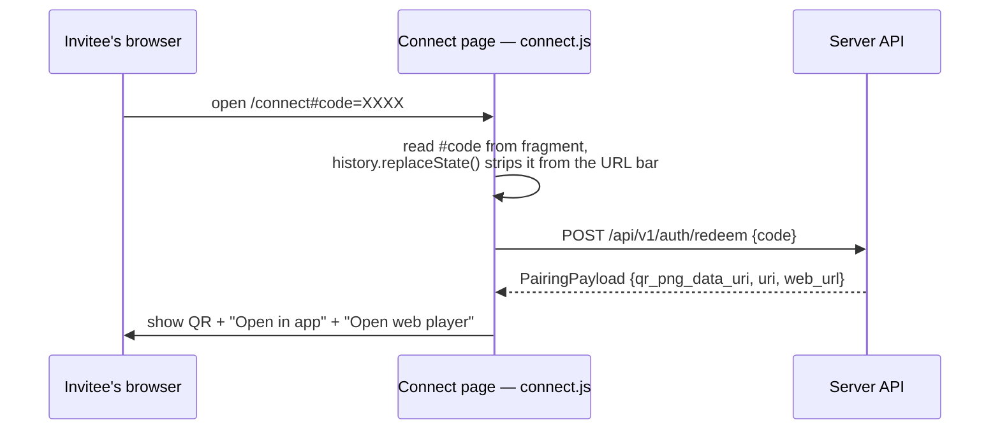

The server ships two very different web surfaces from one package
(`internal/web`):

- The **admin/connect UI** — small, dependency-free vanilla HTML/CSS/JS pages
  **embedded in the binary** (`//go:embed assets`). No build step, no
  framework, and a strict same-origin CSP that the assets are written to
  satisfy.
- The **web player** at `/web` — the audiosilo-frontend Expo export. It is
  **not vendored** in this repo: it is served at runtime from `web_dir`
  (env `AUDIOSILO_WEB_DIR`), or baked into the binary by the `embedplayer`
  build tag for native releases.

Both are static clients over the JSON API — the HTML itself is unprivileged;
authorization always happens at the API (see
[Auth & security](auth-and-security.md)).

## Route map

`web.Register(mux, webDir)` mounts everything; API routes registered on the
same `http.ServeMux` win automatically because `ServeMux` prefers more
specific patterns.

| Route | Serves | CSP |
|---|---|---|
| `GET /` (exact), `GET /connect[/]` | `index.html` — the connect page | strict site-wide |
| `GET /admin[/]` | `admin.html` — the admin console | strict site-wide |
| `GET /assets/…` | embedded CSS/JS/fonts/icons (+ `nosniff`) | strict site-wide |
| `GET /favicon.ico` | 301 → `/assets/favicon.svg` | — |
| `GET /sw.js`, `GET /manifest.webmanifest` | admin-console PWA worker + manifest, served from the **site root** so the worker's scope covers `/admin` (`sw.js` is `Cache-Control: no-cache` so updates land promptly) | strict site-wide |
| `GET /web/…` | the web player (only mounted when a build with an `index.html` is available) | per-document `htmlCSP` |

Two related routes live in `internal/api`, not `internal/web`: the setup
wizard (`GET`/`POST /setup`, below) and — in demo mode with a player present —
a `GET /{$}` redirect that sends the exact site root to `/web/demo`
(`webDemoPath` in `api.go`) so a demo instance lands visitors straight on the
instant-demo flow.

## The strict same-origin CSP

The admin/connect pages are served with one constant policy
(`contentSecurityPolicy`, exported as `web.ContentSecurityPolicy` so the setup
page in `internal/api` applies the identical one):

```
default-src 'self'; img-src 'self' data:; style-src 'self'; script-src 'self';
connect-src 'self'; manifest-src 'self'; worker-src 'self';
base-uri 'none'; frame-ancestors 'none'
```

- `img-src data:` exists solely so the QR pairing PNG (a data URI in the
  redeem response) renders.
- `manifest-src`/`worker-src 'self'` let the admin console install as a PWA.
- There is **no** `'unsafe-inline'` anywhere: the pages contain no inline
  `<style>`, no `style=` attributes and no inline `<script>` — all styling
  lives in `assets/style.css` and all behaviour in external JS files using
  `addEventListener`. Keep it that way: an inline handler added to
  `admin.html` will silently do nothing under this CSP.

:::warning
`web.htmlCSP` and this policy are on the security-critical list — changes
require both an allowed **and** a denied regression test (see
`internal/web/web_test.go` and [Gates & CI](../contributing/gates-and-ci.md)).
:::

## The connect page flow

The connect page is the target of the admin console's **Copy invite** button,
which shares `<base>/connect#code=…`. The auth code rides in the URL
**fragment**, so it never reaches the server or its access logs.



`connect.js` auto-fills and submits when a fragment code is present (a code
can also be typed into the form — invite and recovery codes redeem through
the same field). The redeem response (`PairingPayload`, built by
`buildPairing` in `internal/api/qr.go`) carries the single-use pairing token
in two carriers:

- **`web_url`** = `<base>/web/connect?token=…` — what the **QR encodes**.
  Scanning it opens the native app when the app claims the domain (Universal
  / App Link), otherwise the embedded web player's connect route, which
  exchanges the token.
- **`uri`** = `audiosilo://connect?server=…&token=…` — the custom-scheme
  "Open in app" button; custom schemes are not domain-bound, so this launches
  an installed app on any self-hosted domain.

## The web player at `/web`

### Where the build comes from

`playerFS(webDir)` picks the source: a player **embedded in the binary**
takes precedence; otherwise `os.DirFS(webDir)` (config `web_dir` / env
`AUDIOSILO_WEB_DIR`, which the Docker image bakes in at `/app/web`). `/web/`
is only mounted when the chosen source actually contains an `index.html` —
`web.HasPlayer` gates both the mount and the `web_player` capability flag in
`GET /server`. Empty `web_dir` and no embedded player simply means no `/web`.

The export must be built with the frontend's `baseUrl=/web` so its asset URLs
resolve under the subpath (see the
[release pipeline](../architecture/release-pipeline.md)).

### Request resolution (SPA fallback vs. 404)

`playerHandler` maps `/web/<rel>` to a file via `resolvePlayerFile`, trying
in order: the exact path, `<path>.html`, `<path>/index.html` (Expo emits
per-route HTML). When nothing matches:

- Paths that look like **assets** 404: anything under `_expo/` or `assets/`,
  or with a non-`.html` extension (`isAsset`). A missing fingerprinted bundle
  must fail loudly, not return HTML.
- Anything else is treated as a **client-routed deep link** and falls back to
  `index.html` so the SPA boots — this is what makes
  `/web/connect?token=…` work.

Caching: HTML is `Cache-Control: no-cache`; `_expo/`/`assets/` files are
`public, max-age=31536000, immutable` (they are content-fingerprinted).
Everything gets `X-Content-Type-Options: nosniff`.

### Per-document CSP: `htmlCSP`

The Expo export ships HTML with inline bootstrap `<script>`s, which the strict
site-wide CSP would block. Instead of granting `'unsafe-inline'`, each HTML
response gets a **scoped policy computed from the served bytes**: `htmlCSP`
finds every inline `<script>` in that document (skipping ones with a `src=`
attribute — those are covered by `'self'`), hashes each body with SHA-256,
and emits:

```
default-src 'self'; img-src 'self' data: blob:; media-src 'self' blob:;
font-src 'self' data:; style-src 'self' 'unsafe-inline';
script-src 'self' 'sha256-…' […]; connect-src 'self';
base-uri 'none'; frame-ancestors 'none'
```

- **`script-src` stays strict** — only the exact inline scripts present in
  that document run; no `'unsafe-inline'`.
- **`style-src` allows `'unsafe-inline'`** deliberately: react-native-web and
  NativeWind inject style rules at runtime, which cannot be hashed ahead of
  time. This is the single relaxation, confined to the player.
- Because the hashes are computed from the bytes being served, the policy
  stays correct after the player build is swapped (a new Docker image, a
  refreshed `web_dir`) with no server change.

`media-src blob:` and `img-src blob:` support the player's offline
(service-worker / object-URL) playback paths.

### The `embedplayer` build tag

Native single-binary releases bake the player in so `/web` works with no
`web_dir` on disk:

- `internal/web/player_embed.go` (built with `-tags embedplayer`) embeds
  `internal/web/player/` (`//go:embed all:player`). That directory is
  **gitignored** — only a `.gitkeep` is committed — and the release pipeline
  populates it from the pinned web image via `scripts/fetch-web-player.sh`
  before building.
- `internal/web/player_disk.go` (the default, `!embedplayer`) reports no
  embedded player, so serving falls through to `web_dir`.
- A `-tags embedplayer` build **without** the population step still compiles
  (the `.gitkeep` satisfies the embed) but exposes no player: there is no
  `index.html`, so `HasPlayer` is false — exactly like an empty `web_dir`.

## First-run setup wizard (`/setup`)

The wizard is the `--setup` alternative to the headless first-run banner: a
browser page where a non-technical user sets the admin credentials and picks
the books folder. The page (`assets/setup.html` + `setup.js`) lives in
`internal/web`'s embedded assets, but the handlers live in
`internal/api/handlers_setup.go` because the flow creates the admin account.

It is locked down three ways, so it is safe even on an exposed port:

1. **Off unless enabled**: the wizard only responds when the launcher called
   `API.EnableSetup(token)` with a freshly minted one-time token (18 random
   bytes, `pkg/launcher`). Never enabled → `GET /setup` is a plain 404, so a
   normal deployment exposes no setup surface at all.
2. **Self-closes the moment an admin exists** (`setupAvailable`): with a
   token set but an admin already present, `GET /setup` redirects to
   `/admin` and `POST /setup` answers `409`. Any error resolving admin state
   also closes the wizard.
3. **Constant-time token check**: the token rides in the URL **fragment**
   (`/setup#token=…`), so it never appears in server or proxy logs;
   `setup.js` reads it client-side and includes it in the POST body, where
   the handler compares it with `crypto/subtle.ConstantTimeCompare`.

A successful `POST /setup` creates the admin (username defaults to `admin`;
`auth.CreateUser` enforces that admins have a password), validates that the
library folder exists on the server, creates the library, and kicks off a
background scan. If library creation fails after the admin was created, the
wizard still closes (an admin now exists) and the admin finishes in the
console — intentionally fail-safe.

The launcher prints the token-carrying URL in a startup banner and also
reports it through `Options.OnURL`, which is how the desktop manager (running
the server in-process) knows what to open in a browser — see
[Configuration](configuration.md) and
[Manager server integration](../manager/server-integration.md).

## Well-known app-association files

`GET /.well-known/apple-app-site-association` and
`GET /.well-known/assetlinks.json` (handlers in `internal/api/wellknown.go`)
let a domain pointed at this server deep-link straight into the installed
mobile app (iOS Universal Links / Android App Links):

- They are **config-driven** from `app_links` in `config.yaml`
  (`config.AppLinkConfig`): Apple needs `apple_app_ids`
  (`<TEAMID>.<bundleId>` entries); Android needs `android_package` **and**
  at least one `android_sha256` signing-cert fingerprint.
- When the relevant identifiers are unset, each endpoint returns **404** and
  clients fall back to the embedded web player plus the custom-scheme
  "Open in app" button.
- The advertised paths are `appLinkPaths` = `/web/connect*` and `/connect*` —
  the pairing handoff and the copy-invite target.

:::note
Serving these files is necessary but not sufficient: the shipped app build
must also claim the domain in its own entitlements/manifest. Arbitrary
self-hosted domains therefore never get auto-app-launch from a QR scan — by
design they get the web player, and the custom-scheme button covers the
installed-app case.
:::
