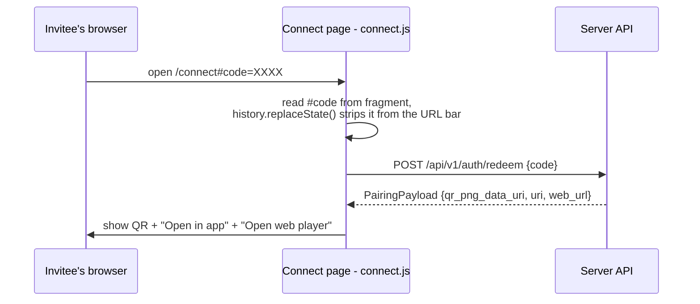

The server ships three web surfaces from `internal/web`:

- The **connect and setup pages** - small, dependency-free vanilla HTML/CSS/JS
  pages **embedded in the binary** (`//go:embed assets`). No build step, no
  framework, and a strict same-origin CSP that the assets are written to
  satisfy.
- The **admin console** at `/admin` (`admin-ui/`, a React + Vite app in the
  **Shelf** design, embedded by `internal/web/adminui`). See
  [The admin console](#the-admin-console-admin-ui).
- The **web player** at `/web` - the audiosilo-frontend Expo export. It is
  **not vendored** in this repo: it is served at runtime from `web_dir`
  (env `AUDIOSILO_WEB_DIR`), or baked into the binary by the `embedplayer`
  build tag for native releases.

The console and the player are both single-page apps served by one handler,
`internal/web/spa` (see [Serving the SPAs](#serving-the-spas-internalwebspa)).
All three are static clients over the JSON API - the HTML itself is
unprivileged; authorization always happens at the API (see
[Auth & security](auth-and-security.md)).

## Route map

`web.Register(mux, webDir)` mounts everything; API routes registered on the
same `http.ServeMux` win automatically because `ServeMux` prefers more specific
patterns.

| Route | Serves | CSP |
|---|---|---|
| `GET /` (exact), `GET /connect[/]` | `index.html` - the connect page | strict site-wide |
| `GET /admin[/…]` | the admin console (`adminui.Handler` over `spa.Handler`), or a **503** "console not built" page when the binary was compiled without it | strict site-wide |
| `GET /assets/…` | the connect and setup pages' embedded CSS/JS/fonts/icons (+ `nosniff`) | strict site-wide |
| `GET /favicon.ico` | 301 → `/assets/favicon.svg` | - |
| `GET /sw.js`, `GET /manifest.webmanifest` | the console's PWA worker + manifest, served from the **site root** so the worker's scope covers `/admin` (`sw.js` is `Cache-Control: no-cache` so updates land promptly) | strict site-wide |
| `GET /web/…` | the web player (`spa.Handler`; only mounted when a build with an `index.html` is available) | per-document `htmlCSP` |

There is no classic console any more: `/admin/classic` is just another client
route, which the console answers with its "There's nothing here" page.

Two related routes live in `internal/api`, not `internal/web`: the setup
wizard (`GET`/`POST /setup`, below) and - in demo mode with a player present -
a `GET /{$}` redirect that sends the exact site root to `/web/demo`
(`webDemoPath` in `api.go`) so a demo instance lands visitors straight on the
instant-demo flow.

## The strict same-origin CSP

The console, the connect page and the setup page are served with one constant
policy (`contentSecurityPolicy`, exported as `web.ContentSecurityPolicy` so the
setup page in `internal/api` applies the identical one):

```
default-src 'self'; img-src 'self' data:; style-src 'self'; script-src 'self';
connect-src 'self'; manifest-src 'self'; worker-src 'self';
base-uri 'none'; frame-ancestors 'none'
```

- `img-src data:` lets the connect page's QR pairing PNG (a data URI in the
  redeem response) and the console's covers (`data:` URLs, see
  [Covers](#covers)) display.
- `manifest-src`/`worker-src 'self'` let the admin console install as a PWA.
- There is **no** `'unsafe-inline'` anywhere: the pages contain no inline
  `<style>`, no `style=` attributes and no inline `<script>`. The connect and
  setup pages keep all styling in `assets/style.css` and all behaviour in
  external JS files using `addEventListener` - an inline handler added to one
  of them will silently do nothing under this CSP. The console's rules are
  under [The CSP does not change](#the-csp-does-not-change).

:::warning
`web.htmlCSP` and this policy are on the security-critical list - changes
require both an allowed **and** a denied regression test (see
`internal/web/web_test.go` and [Gates & CI](../contributing/gates-and-ci.md)).
:::

## Serving the SPAs (`internal/web/spa`)

`spa.Handler(spa.Config{…})` serves a static single-page app from an `fs.FS`
under a URL prefix. Both apps use it, so caching, MIME types, deep links and
missing files follow **one set of rules** instead of two that drift apart:

| | Console | Player |
|---|---|---|
| `Prefix` | `/admin` | `/web` |
| `FS` | the embedded build (`adminui.FS()`) | the embedded player (`-tags embedplayer`) or `os.DirFS(web_dir)` |
| `AssetDirs` | `assets` | `_expo`, `assets` |
| `DocumentCSP` (HTML) | the strict site-wide policy | `htmlCSP` - hashed per document (below) |
| `FileCSP` (everything else) | the strict site-wide policy | none |

Routing, for the request path relative to the prefix:

| Request | Response |
|---|---|
| an existing file | the file; `<p>.html` and `<p>/index.html` are tried too (Expo exports one HTML file per route) |
| missing, under one of `AssetDirs` | **404** - a fingerprinted bundle that isn't there must fail loudly, not return HTML |
| missing, a **top-level** name with an extension other than `.html` (`/web/favicon.ico`) | **404** |
| anything else (`/admin`, `/admin/people/user/4`, `/web/connect?token=…`) | `index.html`, so client-side routes deep-link (a deeper dotted segment such as `/library/v1.2` is a route, not a file) |

Caching: files under `AssetDirs` are fingerprinted and get
`Cache-Control: public, max-age=31536000, immutable`; HTML and every other file
(`/admin/theme-init.js`) are `no-cache`, so a new release is picked up at once.
Every static response (console, web player, connect page, `/assets/`, `sw.js`,
the manifest) is served by `spa.Files`: a strong `ETag` (the first 16 bytes of
the file's SHA-256, `-gz` appended for the gzip form) answered with `304` on
`If-None-Match`, so a `no-cache` document revalidates without its body; and gzip
for text types (html, js, css, json, svg, webmanifest, map, txt, wasm) when the
client accepts it, with `Vary: Accept-Encoding`, kept only when smaller.
Embedded files are hashed and compressed once per process; files from
`web_dir` are cached by path and redone when their size or modification time
changes. A `Range` request always gets the plain bytes (`http.ServeContent`).
Nothing under `/api/` (media, covers) goes through it.
Every response carries `X-Content-Type-Options: nosniff`; HTML gets
`DocumentCSP` (computed from the document's bytes) and other files `FileCSP`.
Content types come from an explicit table pinned in `spa`'s `init` (Go's MIME
lookup falls back to the OS registry, which on some Windows hosts maps `.js` to
`text/plain`, and a module script served that way never runs). Paths that
aren't valid `fs` paths (`..` segments) never resolve to a file. `HEAD`, `Range`
and `If-Modified-Since` go through `http.ServeContent`.

:::note Behaviour change for `/web`
Before the shared handler, the player 404'd **any** missing path with a
non-`.html` extension. Now only a missing **top-level** file with an extension,
or a missing file under `_expo/` or `assets/`, 404s; a deeper missing path
outside the asset dirs (`/web/library/v1.2`) boots the SPA like any other
client route.
:::

## The admin console (`admin-ui`)


The admin console is a single-page app in the **Shelf** design, rebuilt phase
by phase (the plan lives in the workspace's `ADMIN-CONSOLE-PLAN.md`; the design
system in `admin-ui/STYLEGUIDE.md`, which is authoritative for the build). It
is a static client over the JSON API; the API enforces the admin role. Phase 1b
made it **the** console: the classic `admin.html`/`admin.js`, its i18n keys
and CSS, and the `AUDIOSILO_ADMIN_NEXT` switch are gone.

**Stack:** React 19, Vite, TypeScript (strict), shadcn/ui on **Base UI**,
Tailwind v4, TanStack Query, Router, Table and Virtual (the books table and
the virtualized cover grid), cmdk for the ⌘K palette, Recharts (the Activity
charts, through shadcn's chart component; see [Charts](#charts)),
react-hook-form + zod (forms and validation), dnd-kit (library reordering,
keyboard accessible), uqr (invite QR codes, drawn as SVG in the browser),
i18next, lucide-react, fontsource (self-hosted Bricolage Grotesque, Figtree,
JetBrains Mono). Each screen is a lazy-loaded chunk (`React.lazy` in
`features/section-page.tsx`, `lazyRouteComponent` for a person's page and the
book page), so the first paint carries only the shell and the overview.
Interface strings work the same way: English is bundled in the entry (it is
also the fallback for any missing key), and each other language is its own
chunk (`import.meta.glob` in `src/i18n/index.ts`), loaded when it is chosen.

### Build and embed

- `npm --prefix admin-ui run build` writes into `internal/web/adminui/dist`,
  which `internal/web/adminui` embeds with `//go:embed all:dist`. Only
  `dist/.gitkeep` is committed (the rest is gitignored), so a plain
  `go build` without Node still compiles - and `/admin` then answers **503**
  with a short "console not built" page that says how to build it.
- `scripts/build-admin.sh` is the one recipe (`npm ci`, `npm run check`, `npm
  run build`; `--build-only` skips the check). **CI** (`ci.yml`) runs it
  **before** the Go steps, so `TestEmbeddedBuild` checks the
  real embedded `index.html` (it skips locally when nothing is built). The
  **Dockerfile** has a `node:24-alpine` stage that builds the console and
  copies `dist` in before `go build`; **GoReleaser** runs the script as a
  before-hook. The build fails on any CSP violation (a Vite plugin).
- The **desktop manager** embeds the server, so its `desktop.yml` runs the
  script from the sibling checkout before `wails build` (see
  [Manager server integration](../manager/server-integration.md)).
- `go.mod` carries `ignore ./admin-ui/node_modules`: some npm packages ship
  Go source, which `./...` would otherwise build, vet, test and lint.

### Serving

`adminui.Handler(fsys, csp)` mounts the build on `spa.Handler` with prefix
`/admin`, asset dir `assets` and the strict site-wide CSP for every response
(see [Serving the SPAs](#serving-the-spas-internalwebspa)): `/admin/assets/…`
are immutable (404 when missing), other top-level files such as `theme-init.js`
revalidate, and every other path is `index.html` so client routes deep-link.
When the embedded FS holds no `index.html` the handler answers every request
with the 503 "console not built" page instead.

The PWA service worker (`/sw.js`) caches the console's shell: every online
`/admin` navigation refreshes the cached `index.html` (network-first, offline
fallback), and `theme-init.js`, the icons and the manifest are precached. The
console's **unhashed** files under `/admin/` (`theme-init.js`) change in place
with a release, so they are fetched **network-first** too (the cached copy only
when offline) - running a stale copy once after an upgrade would pair old code
with a new page. The hashed `/admin/assets/*` files, icons and manifest are
stale-while-revalidate (cached on first use), so the console works offline after
one online visit. It never intercepts `/api/` or `/web/`. The web manifest
(`manifest.webmanifest`, scope `/admin`) uses the Shelf colours.

### The CSP does not change

The console runs under the same `script-src 'self'; style-src 'self'` policy
(no nonce) as the connect page, so it is built to need nothing inline:

- `index.html` loads only files: `/admin/theme-init.js` (applies the stored
  light/dark/system theme before first paint) and the Vite bundle.
  `admin-ui/scripts/check-csp.mjs` (a Vite plugin) fails the build on any inline
  `<script>`, `<style>`, `style=""` or `on*=""` attribute, and the Go test
  applies the same check to the embedded build.
- Base UI renders under `<CSPProvider disableStyleElements>`; the one rule it
  would inject lives in `globals.css`. Libraries that inject styles or scripts
  (Radix, sonner, vaul, next-themes, ECharts, cmdk's `Command.Dialog`,
  shadcn's `ChartStyle`) are banned by ESLint, and a test asserts no `<style>`
  element appears while the palette, a menu and a toast are open.
- Dynamic styling uses React's `style` prop, which writes through CSSOM and is
  allowed. Build assets are never inlined as `data:` URIs.
- **Covers never carry the session token in a URL.** The media routes accept
  `?token=` for the player's ``/`<audio>`, but the console's session is a
  full-privilege admin credential and a URL can leak into proxy access logs and
  history. The console fetches covers itself, with the `Authorization` header,
  and renders them as `data:` URLs (`img-src` allows `data:`, not `blob:`).
  See [Covers](#covers).
- **zod is imported from `@/lib/zod`, never from `zod`.** zod probes once for
  `new Function` to compile its object schemas; under a CSP without
  `'unsafe-eval'` the probe throws (zod catches it) but the browser still
  reports a `script-src` violation. `@/lib/zod` sets `z.config({ jitless: true
  })`, which skips the probe and the compiler; an ESLint rule bans importing
  `zod` anywhere else.
- **Invite QR codes are drawn in the browser** (uqr, rendered as inline SVG
  elements), so a fresh invite code never travels back to the server inside an
  image request.

### Covers

Grids and shelves show hundreds of covers, so the console asks for them in
batches. `useCover(libraryId, path, size)` (`admin-ui/src/api/hooks.ts`) queues
each cover it needs, and `src/api/cover-batch.ts` (on the shared batcher,
`src/api/batcher.ts`) sends everything asked for in the same moment as one
[`POST /api/v1/admin/covers`](api/reference.md#post-apiv1admincovers) request
of up to 60 books. The server answers with small JPEG thumbnails, already
`data:` URLs, so a grid costs a handful of requests and about 20 KB a cover
(server side: [Thumbnails for the admin console](media.md#thumbnails-for-the-admin-console-post-admincovers)).
Covers are cached for an hour and refetched everywhere after an upload or
removal.

Only the book page's hero loads the full art (`size="full"`: `GET
/libraries/{id}/cover` with the `Authorization` header, converted to a `data:`
URL); its background tint is computed from that image in the browser
(`use-hero-tint.ts`, a same-origin canvas). A book with no art gets a generated
cover (`src/components/generated-cover.tsx`, a React SVG component, colours
from `src/lib/cover-model.ts`), never an `innerHTML` string.

Covers are square frames. Art that isn't square (`CoverArt` in
`src/components/book-cover.tsx` measures it on load) is drawn whole with
`object-fit: contain` over a blurred copy of itself; square art, most of it,
gets no second layer, since each blur is its own compositing pass.

Book pages are addressed by identity, `/admin/library/book?library=<id>&path=<path>`
(`src/lib/book-route.ts`), never by an internal book id. Names and series link to
the Books list through `BooksLink` (`src/components/books-link.tsx`, built on
`booksRoute`), which filters on the exact value and keeps the page's `library`
and the list's `view`. It memoizes the route per value, because TanStack's
`<Link>` rebuilds its href whenever `search` changes identity and `booksRoute`'s
`search` is a function.

### Downloading a file from an authenticated endpoint

**Export book list** in a library's menu downloads the library's book list from
[`GET /api/v1/admin/libraries/{id}/export`](api/reference.md#get-apiv1adminlibrariesidexport)
- the file a user imports on meta.audiosilo.app's Watching page.

The console authenticates with a bearer token held in `localStorage`, so this
cannot be a plain `<a href>` download: the request has to carry the
`Authorization` header. `downloadLibraryExport` (`admin-ui/src/api/client.ts`)
therefore `fetch`es the endpoint (`downloadBackup` does the same for a backup
from [`GET /admin/backups/{name}`](api/reference.md#get-apiv1adminbackupsname)), reads the file name out of the response's
`Content-Disposition` header, wraps the body in a blob object URL and clicks a
temporary `<a download>` (revoking the URL a few seconds later).

This needs **no CSP change**. An object URL the page creates for itself is not
a fetched resource, and a download triggered by `a.download` is not a resource
load either, so nothing in the strict policy applies to it.

### Session

The session token lives in `localStorage` under `audiosilo_token` (the key the
classic console used, so an admin signed in before the cutover stays signed
in); the language choice shares the connect page's storage key. A 401 drops the
session ("Your session ended"). A 403 from an admin endpoint re-checks
`GET /me`, and if the account is no longer an admin (another admin demoted it
mid-session) signs out with "This account is not an administrator."

Every API call also names the console to the server with
`X-AudioSilo-Client: AudioSilo Admin (web)` (`CLIENT_IDENTITY` in
`admin-ui/src/api/client.ts`), so the server's devices and sessions can tell a
console session from a player. It carries no version (the console ships inside
the server), and the console is always same-origin, so the header never costs a
CORS preflight. See
[Client identification](api/index.md#client-identification-x-audiosilo-client).

### Dev loop

```sh
# the server, plain HTTP
AUDIOSILO_TLS_MODE=off go run ./cmd/audiosilo --data ./data
# hot-reloading console on http://localhost:5173/admin/
npm --prefix admin-ui run dev
```

The Vite dev server proxies `/api`, `/assets`, `/sw.js`, `/manifest.webmanifest`
and `/web` to the Go server (`AUDIOSILO_DEV_SERVER` overrides
`http://127.0.0.1:8080`). It is **not** under the production CSP, so check
CSP-sensitive work against a real build served by Go. The console's own gate is
`npm --prefix admin-ui run check` (typecheck, ESLint, Prettier, Vitest); see
[Gates & CI](../contributing/gates-and-ci.md).

### What the console has today

- **Shell** - sign-in (admins only; a non-admin's fresh session is revoked at
  once), a top bar with the server's name (`GET /server`'s `name`; the page's
  host while it is the default "AudioSilo"), the five destinations (Library,
  People, Activity, Health, Server), a health line (version, offline
  libraries, server unreachable), ⌘K search, the notifications bell (see
  below), theme and account menus (the account menu ends with a "Support
  AudioSilo" link to GitHub Sponsors, `SPONSOR_URL` in `lib/support.ts`); a
  per-destination section bar; a bottom
  tab bar on phones. Every section has a screen (`PAGES` in
  `features/section-page.tsx`); an unknown section is a 404.
  Interface text is in all six languages.
- **⌘K palette** - navigation, sections, settings (one entry per Settings
  topic, each with search keywords such as "https", "proxy" or "ffmpeg"; scan
  schedules and skipped files; theme; language) and actions (invite someone,
  add a library, rescan a library, rescan every library when there is more
  than one, open the web player, sign out). From two typed characters it also searches content
  (`components/shell/palette-search.tsx`): books through the server's full-text
  search (`GET /admin/books?q=`, after a 200 ms pause in typing), and people,
  authors, series, narrators and shares matched in the browser from their
  lists; a final "Search all books for ..." entry opens Library > Books with
  the query.
- **Overview** - built on `GET /admin/stats`, `GET /admin/sessions/live`
  ("Listening now": one card per live session, playing first, each linking to
  Activity > Live now; a failed live list reads as nobody live rather than
  holding the page back), `GET /admin/settings`, `GET /admin/update` (the
  Server card's "*version* available" link to About, cached ten minutes),
  `GET /admin/libraries`
  (offline-library notices), `GET /server` and `GET /admin/issues` (the "Needs
  attention" card: up to six categories with something to fix, each linking to
  its Health queue). "Recent listening" is the stats' progress feed minus the
  user/book pairs that are live (`splitListening` in
  `features/overview/overview-model.ts`). The side column ends with the
  [support card](#the-support-card) when `GET /admin/support` says it shows.
- **Library > Books** - the cover grid (virtualized) or table over
  `GET /admin/books` (keyset pages loaded as you scroll), the "Recently added"
  and "Continue curating" shelves, the library filter, search, sort and a
  Filters sheet over `GET /admin/books/facets`, with every filter in the URL so
  each view deep-links; selection with a floating bulk bar (bulk field edits
  through `POST /admin/books/bulk`, adding books to a share).
- **Library > Authors / Narrators / Series** - `GET /admin/authors`,
  `/admin/narrators` (merge suggestions applied as a bulk edit, with Undo) and
  `/admin/series` (community series gaps from each series' matched book's
  `GET /libraries/{id}/meta`, hidden when metadata is off). Each card then
  resolves its matched books to community work ids through
  `POST /admin/books/works` (`useBookWorks`; `src/api/work-batch.ts` batches every
  card's books asked for in the same moment, up to 100, on the same
  `createBatcher` as the covers) and places each book on the rail entry of its
  work, falling back to `series_index` for a book that doesn't resolve; a book
  known to be another work is drawn after the rail and fills no gap
  (`placeBooks` in `features/library/series/series-model.ts`). Gaps wait for the
  works to answer (the card shows its plain "N books" line until then); a resolved
  or cleanly unmatched answer is kept for the session, a failed one is asked
  again no sooner than two minutes later.
- **Library > Folders** - a folder tree per library (`/fs`) and the selected
  folder's detection choice (`…/folder-override`, saved through `setFolderMode`
  in `src/api/hooks.ts`, which notes the rescan and refetches the listings).
  `joinChoices` (`features/library/folders/folders-model.ts`) decides which
  choices a folder offers: all three with audio of its own; Automatic and
  Always one book for a folder whose audio is only in disc folders (the admin
  `split_discs` mark on `/fs`) or one already joined, worded as a join ("Here: 3
  disc folders become one book, in disc order."); only clearing an override on
  any other folder without audio. The detection dialog applies the same rule
  from the entry alone (`offersBook`, `offersCollection`).
- **Book page** (`/admin/library/book?library=&path=`) - `GET`/`PATCH
  /admin/libraries/{id}/book` (click-to-edit fields with provenance, revert,
  a save bar with a diff, chapter renames), custom covers (`PUT`/`DELETE
  …/cover`), the match dialog (`GET …/book/match`, which matches the book's tag
  and path facts through metaserve's `works/match`; the ticked fields, ASIN and ISBN
  included, are accepted as one `PATCH …/book` with `source: "community"`;
  candidates' covers are thumbnails the server fetched, `POST /admin/meta/covers`,
  batched by URL in `src/api/cover-batch.ts`, since the CSP loads no other
  host's images; a ticked Cover row, ticked by default only for a book with no
  art whose preview loaded (`defaultCoverTick`), is kept with `PUT
  …/cover/community` after the fields, and a failure with nothing else ticked
  leaves the dialog open),
  listeners, shares
  and the "Files on disk" section with the disabled on-disk rename. The more
  menu's "Read the files again" calls `POST …/book/rescan`. `?match=1` opens the
  match dialog on arrival (Health's "Review match"); closing it drops the param.
  The Chapters card opens with the **Community chapters** panel
  (`features/book/community-chapters.tsx`; its words and its one action come
  from `communityState` in `book-model.ts`, a pure function of the page's
  `community_chapters`, `chapter_source` and `chapter_choice`). It shows for a
  matched book or one with a check: the status line, the notes ("Not in this
  copy: …", the approximate starts while community chapters are in use, the
  merge hint for `crosses_files`), the source switch as one `PATCH …/book
  {chapter_source}` ("Use the community's" / "Use detailed chapters" /
  "Use the file's chapters"; switching a `fill` back from the files sends
  `auto`), "Review titles" for a `titles` check (each title, or all, as one
  `chapters.set` rename, so they are ordinary revertable renames; a title the
  admin already took drops out of the list), and "Check now" / "Check again"
  (`POST …/book/community-chapters`, shown with the `metadata` capability on a
  matched book). While `community_checking` is set the page polls the book
  (`useAdminBook`) and the panel shows a spinner; when the check ends it
  refetches the book lists and the Health issues. With community chapters in
  use, a rename's toast and the revert hint name the community's title instead
  of the file's.
- **Library > Libraries** - library cards (`GET /admin/libraries` with
  `book_count`, `available`, `scan` and the scan settings, polled every second
  while any library scans or waits in the job queue, every minute otherwise),
  add/edit with the server folder picker (`GET /admin/fs/dirs`) and the scan
  settings ("Scan automatically" + a time for a daily schedule, "Skip these
  files and folders" as a textarea; `features/libraries/scan-settings.ts`
  converts between the form and `scan_schedule` / `ignore_patterns`, and an
  `invalid_schedule` / `invalid_pattern` / `invalid_metadata_source` error
  lands on its field), "Book details come from" (`metadata_source`; a change
  refetches the library's books and the Health issues, since the server
  re-resolved them),
  drag-and-drop or keyboard reorder (`PUT /admin/libraries/order`), rescan with
  live progress (the list's `scan`, including `queued`, shown as a "Waiting"
  badge, and `unavailable`), the next scheduled scan from `next_scan_at`, folder
  detection (`/fs` browse + `…/folder-override`), export, delete.
- **People > People / Invites / Shares / Devices** - person cards (the book a
  person is playing comes from `GET /admin/sessions/live`, else their newest
  unfinished progress from `GET /admin/stats`; the devices line from
  `GET /admin/devices`, sessions only), the invite flow (create a password-less
  member, grant access, mint an invite, show the QR, link and code once), a
  person's page (`/admin/people/user/<id>`, tabs in `?tab=`: listening (the
  default, no param), access, devices, invites, sign-in, account), the
  cross-account invite list (`GET /admin/invites`) with rotate and revoke,
  shares (list + detail, with `member_ids`; `whole_library_id` sets
  whole-library grants apart) and the devices list
  (`features/people/devices-page.tsx`: `GET /admin/devices`, Sign out / Revoke
  through `DELETE /admin/devices/{id}` after a confirm; the row marked
  `current` is disabled, and a `409 current_device` would read as "That's the
  device you're using"). Error messages that name a fix branch on the API's
  error `code`.
- **A person's Listening tab** (`features/people/user-listening.tsx`) - their
  listening year (hours and best streak from their days of the server's
  current year, `GET /admin/listening?range=year&user_id=`; books finished
  from their progress' `finished_at`, counted in the server's year with the
  answer's `utc_offset`; hours per month as a small bar chart),
  In progress and Finished from `GET /admin/users/{id}/progress`, and their
  first page of `GET /admin/sessions?user_id=` with a link to Activity >
  Sessions. The Devices tab reuses the devices list for `?user_id=`: the
  sessions first (the tab's count, as on the person card), then the person's
  API keys under their own heading.
- **Progress menu** (`features/people/progress-actions.tsx`) - on each row of
  the Listening tab and each listener on the book page: Mark as finished (with
  an Undo that sends `finished: false` and the old `position`), Mark as not
  finished, Edit dates (`progress-dates-dialog.tsx`: date inputs sent as
  `YYYY-MM-DD`, only the changed ones, `null` to clear; the server reads a
  day-only finish as the end of that day, so a same-day start and finish fit;
  the dialog refuses future dates and a finish before the start before the
  server does), and See
  listening sessions. All go through
  [`PATCH /admin/libraries/{id}/progress`](api/reference.md#patch-apiv1adminlibrariesidprogress),
  then refetch the person's progress, the book page, the stats and the
  Activity data (`invalidateProgress`). The codes `no_access` and
  `book_not_found` map to their own messages.
- **Health > Issues** (`features/health/issues-page.tsx`) - over
  `GET /admin/issues`: notices for offline libraries (what was kept, with
  Retry), one card per category with its count and up to three fanned covers,
  and the open category's triage list (`issue-books.tsx`, a
  `GET /admin/books?issue=` list with keyset paging). Each row has Ignore (with
  Undo in the toast, `POST`/`DELETE /admin/issues/ignore`) and its category's
  fix (`issues-model.ts` `FIXES`): "Upload a cover" opens the book page, "Review
  match" opens it with `?match=1`, "Choose detection" opens Library > Folders on
  the book's folder, "Read again" calls `POST …/book/rescan` and toasts whether
  the problem is gone, "Join into one book" (`split_discs`, listed by its
  first disc) sets `book` on the folder holding the discs (`setFolderMode`), and
  "Use detailed chapters" (`detailed_chapters`) is a `POST /admin/books/bulk`
  with `chapter_source: "community"` (`useIssueActions().takeDetailed`, which the
  bulk bar uses too, in batches of 1000). A `no_chapters` row whose
  `chapters_check` is a failed check (`length_mismatch`, `structure_mismatch`,
  `crosses_files`, `no_match`, `unavailable`) adds a line saying why community
  chapters weren't used (`chaptersCheckNote`). A
  row's re-read or join runs once at a time: its fix button is disabled while
  it is in flight (`useIssueActions().fixing`). Rows select into a floating bulk bar, which acts only on
  the selected books still listed (one fixed or ignored on its own row has
  left); its bulk "Read again" (`useIssueActions().rescanMany`) re-reads two
  books at a time, since each is a synchronous re-read and firing them all at
  once would trip the server's per-client rate limit. "Show ignored" lists the
  ignored books (`?issue_ignored=true`). Duplicates
  (`duplicates.tsx`) render each group side by side from
  `GET /admin/issues/duplicates`, the copy worth keeping first, with "They're
  different books" (ignore every copy). The category and the ignored view live
  in the URL (`?issue=<kind>&ignored=1`). Without `?issue=` the page opens the
  first category needing attention and keeps it open, so clearing it shows "All
  clear" instead of jumping to the next. "Check again" queues a scan of every
  library (`POST /admin/scan`). Above the "Not matched" list, **Match
  automatically** (`bulk-match.tsx`, rules in `bulk-match-model.ts`) follows the
  newest [match run](api/reference.md#bulk-community-matching)
  (`GET /admin/match-runs`, polled each second while one works): Find matches
  (and, with a preferred marketplace set, "Use *country* ASINs", a repick), its
  progress with Stop, then the counts and "Review and apply". The review dialog
  pages each outcome's items (`GET …/items?outcome=`), ticks the confident ones,
  shows what the chosen scope writes from each item's server-computed `changes`,
  and posts the admin's picks as `exclude`/`include` ids. When the newest run's
  status changes to one that isn't working, the book lists, issues, book pages
  and covers are refetched (`invalidateMatches`; a small apply can finish
  between two polls).
  Marketplace names come from `lib/regions.ts` (`Intl.DisplayNames`, with each
  store's domain), shared with the Settings select.
- **Health > Jobs** (`features/health/jobs-page.tsx`) - over `GET /admin/jobs`
  (polled every second while a job runs or waits, every 15 seconds otherwise):
  the running scan with its progress and counters and Stop, the queue with
  Cancel (both `DELETE /admin/jobs/{id}`), a Schedules card, a "Run a job"
  menu (rescan one library or all), and the history from `GET /admin/scan-runs`
  (paged with `before`, filtered by library) whose rows expand to their log
  (`GET /admin/scan-runs/{id}`, fetched when opened). `jobs-model.ts` words
  statuses, counts and log events (a `joined` event with code `length_unknown`
  says the disc's progress stayed with it).
- **Activity > Overview** (`features/activity/activity-page.tsx`) - over
  [`GET /admin/stats?range=`](api/reference.md#range-listening-activity), the
  period in `?range=` (absent = `30d`), each period cached for a minute and the
  previous one kept on screen while the next loads: stat tiles with a hand-drawn
  SVG sparkline and the change against `previous`, the hours chart (a bar a day,
  a bar a week past 92 days; the four biggest listeners stacked, the rest as
  "Everyone else"), the year calendar (always the last year, whatever the
  period; unless the page already shows 1 year, its days come from
  [`GET /admin/listening?range=1y`](api/reference.md#get-apiv1adminlistening)
  rather than a second full Activity computation), the hour x weekday grid, top books/people/authors/narrators, the
  inactive-people notice, the funnel with drop-offs (linking to Health's read
  problems when `scan_error`), the playback donut, apps in use (a build older
  than another of the same app and platform is flagged; `compareVersions` in
  `activity-model.ts`), library growth, and storage with coverage rings. The
  pure logic (bucketing, ticks, streaks, the calendar grid) lives in
  `activity-model.ts`, which is unit-tested.
- **Activity > Live now** (`live-page.tsx`) - `GET /admin/sessions/live`,
  polled every 10 seconds (`useLiveSessions`, also used by the overview and
  the people cards), playing first.
- **Activity > Sessions** (`sessions-page.tsx`) - `GET /admin/sessions` as an
  infinite query (50 a page, "Show older sessions" passes `next_before`),
  filtered by `?person=`, `?library=` and `?path=` (a book needs its library).
  Its `SessionTable` is reused on the person page.
- **Activity > Year in listening** (`year-page.tsx`) - `GET /admin/stats?range=<year>`
  for the year in `?year=`; absent, `range=year`, the server's current year,
  whose answer names it (the browser's clock can be on the other side of New
  Year). The picker offers that year and the four before. Told as a story (headline, book of the year, facts, the
  year's calendar, most played covers, who listened).
- **Health > System** (`features/health/system-page.tsx`) - over
  [`GET /admin/system`](api/reference.md#get-apiv1adminsystem), polled every
  30 seconds while this page is open (`useSystem({poll: true})`; Settings and
  About read the same query without polling, fresh for a minute): one list of rows (ffmpeg, ffprobe, community metadata, HTTPS
  certificate, database, backups, each library's folder with its disk space,
  web player, AudioSilo version), each with a status (Healthy, Needs
  attention, Missing, Off, Waiting, Update available, Failed). The Backups row
  reads the answer's `backups` block: Failed (with the reason) when the last
  attempt failed, Off when nothing is scheduled (a warning when there is no
  backup at all), else Healthy with the latest backup and the next one. The rules live in the pure
  `system-model.ts` (`systemRows`; a disk under 10% free and a certificate
  under 14 days are warnings; `certificateLook` is shared with Settings).
  Notices above the list for unreachable library folders and a metadata
  service that doesn't answer (with a link to its settings).
- **Server > Settings** (`features/settings/`) - over
  [`GET`/`PATCH /admin/settings`](api/reference.md#admin-settings): an in-page
  topic list in `?topic=` (`general` is the default and has no param;
  `network`, `players`, `metadata`, `transcoding`, `demo`, `backups`,
  `notifications`; `settings-model.ts` `SETTINGS_PAGES`). Each card is a `SettingsForm`
  (`settings-form.tsx`): a draft of its fields, Reset and Save changes, only
  the changed fields sent (`sectionPatch`); list settings are edited as one
  entry per line. A refusal's `field` puts the server's message under that
  field. `SettingBadges` reads the envelope: "Set by `AUDIOSILO_…`" or
  "Managed by the desktop app" from `locked` (the field is disabled), "Restart
  to apply" from `restart_settings`, "Waiting for a restart" from
  `restart_pending`, which also drives the notice at the top of every topic.
  The Network & HTTPS cards pass `confirmRestart`, so saving a restart setting
  there asks first. General has a Listening history card (`session_days`, a
  number field). The two switches (update check, community metadata) are
  `InstantSwitch`es that save at once with an optimistic cache write.
  `useSaveSettings` puts the answer in the cache and refetches `GET /server`,
  the system status and the update status. Network's certificate row,
  Metadata's status row and the read-only Transcoding topic read
  `GET /admin/system`. Metadata ends with a Danger zone (`clear-matches.tsx`,
  the shared `components/danger-zone.tsx`): Clear community matches picks a
  library or all (`components/library-select.tsx`, shared with Match
  automatically), asks for a typed word (`ConfirmDialog`), calls
  [`DELETE /admin/community-matches`](api/reference.md#delete-apiv1admincommunity-matches)
  and refetches what a match apply does (`invalidateMatches`, shared with Match
  automatically) plus the match runs.
- **Server > Logs** (`features/logs/logs-page.tsx`) - over
  [`GET /admin/logs`](api/reference.md#get-apiv1adminlogs): a level filter
  (All / Warnings / Errors), a search box (debounced 300 ms) and a Live tail
  switch. The tail polls every 2 s with `after=<last_seq>` and appends
  (`logs-model.ts` `appendPage`: 500 lines on the first page, at most 1000
  held, a gap marker when the answer says `truncated`); a filter change starts
  a fresh tail. The panel is a `role="log"` deep-ink block (`.log` in
  `globals.css`, the same in both themes) that follows new lines while
  scrolled to the bottom.
- **Server > About** (`features/about/about-page.tsx`) - from
  `GET /admin/system`: the update card (off, update available with the release
  notes link and an `install`-specific how-to, check failed, development
  build, up to date, not checked yet; "Check now" calls
  [`POST /admin/update/check`](api/reference.md#post-apiv1adminupdatecheck)
  and writes the answer into the system and update caches; the
  update-available notice ends with the one sponsor line, "AudioSilo is free;
  sponsors keep it going. Sponsor on GitHub") and an "About *name*" facts card
  with links to the docs, source, issues and Support AudioSilo (GitHub
  Sponsors).

- **Settings > Backups** (`features/settings/backups-topic.tsx`) - over
  [`GET /admin/backups`](api/reference.md#get-apiv1adminbackups) (`useBackups`,
  polled every second while `status.running`): a notice saying what a backup
  holds, the restore notices (a restore waiting for a restart, with Cancel
  restore; the last restore's outcome for 14 days), the Schedule card (a
  `SettingsForm` over the `backups` section: `schedule-input.tsx` edits
  `backups.schedule` as Off / Every day / Every week, a day and a time, and
  `backups-model.ts` converts both ways; `keep` is a number field; the folder
  is read-only), and the list: Back up now (`POST /admin/backups`; the page
  toasts the outcome when `running` turns false; the 202 answer already reads
  `running: true`, so polling starts at once), each backup's Download
  (`downloadBackup`, see above), Restore... (a type-to-confirm dialog with the
  word "restore" listing what a restore means, signed-out devices and revoked
  API keys working again included, then `POST …/restore`) and Delete.
- **Settings > Notifications** (`notifications-topic.tsx`, `target-dialog.tsx`)
  - over [`GET /admin/notifications`](api/reference.md#get-apiv1adminnotifications):
  one row per destination (redacted address, last delivery from
  `notify-model.ts` `deliveryLook`, Send test, an on/off switch, Edit and
  Delete), the "What to send" matrix (a checkbox per event and destination,
  saved as it is ticked with an optimistic cache write and a rollback on
  failure) and the privacy notice. The add/edit dialog picks the kind (webhook,
  ntfy, Discord) on add only, never shows the saved address or secret (an
  empty field keeps it; "Remove the saved secret" sends `""`; when the typed
  address is on another server than the saved one, `movesServer`, the secret
  field says to enter the secret again or remove it, which is what the server
  requires), offers the events the server knows (`knownEvents`), preselects the
  problem events (`DEFAULT_EVENTS`: scan failed, library offline, update,
  backup failed), and puts an `invalid_target` refusal under its `field`,
  worded from its `reason` (`lib/errors.ts` `errorMessage` words any coded error
  with a `reason` as `errors.<code>.<reason>`, here `errors.invalid_target.*`,
  falling back to the server's English `error`). An
  edit puts the server's answer into the cache (`withTarget`).
- **The bell** (`components/shell/notifications-bell.tsx`) - `GET /admin/events`
  (`useServerEvents`: the newest 20, every minute), eight listed in a popover,
  each worded by `lib/server-events.ts` `describeEvent` and linking to where it
  can be dealt with (Library, Health > Jobs, People > Devices or Invites,
  Server > About, Settings > Backups). The dot and the "N new" label count
  events newer than a per-browser cursor in `localStorage`
  (`audiosilo_events_seen`), moved to the newest event when the bell opens.
  **See all** opens Server > Events. Each row is `components/server-event-item.tsx`
  `ServerEventItem`, shared with that page.
- **Server > Events** (`features/events/events-page.tsx`) - over
  [`GET /admin/events`](api/reference.md#get-apiv1adminevents) as an infinite
  query (`useServerEventList`: 50 a page, Show older, refreshed every minute),
  filtered by kind (`?kind=`, the kinds in `EVENT_KINDS`), each event with its
  date and time instead of the bell's "3 hours ago".
- **Server > Audit log** (`features/audit/audit-page.tsx`) - over
  [`GET /admin/audit`](api/reference.md#get-apiv1adminaudit) as an infinite
  query (50 a page, Show older), filtered by area, person (the admins from
  `GET /admin/users`) and a debounced search. `audit-model.ts` words each
  action (`audit.action.<code>`, or "Other change (code)" for one it doesn't
  know) and its details (a settings save as one "from → to" line per setting,
  a backup schedule in words, an ignored issue's kind by its Health name, a
  book edit per field, a share's paths as the first few and a count).

### The support card

`features/overview/support-card.tsx` is a quiet card at the foot of the
Overview's side column: AudioSilo is free, and GitHub Sponsors is where to
support it. The server decides when it shows
([`GET /admin/support`](api/reference.md#get-apiv1adminsupport), `{show}`;
the rule is `catalog.SupportCardDue`):

- never after an "I've donated", and not while a "Not now" lasts;
- otherwise once the server's age is at least 30 days
  (`catalog.SupportAfterDays`), or at least 7 (`SupportMinDays`) with at least
  10 books finished on it (`SupportAfterFinished`).

The server's age runs from the earliest non-demo `users.created_at`, so a
server restored from a backup keeps its age and one whose setup isn't finished
has none. Only finishes dated on or after that first account, by non-demo
accounts, count: an Audiobookshelf import can bring a household's finished
books on day one, which is also why the 7-day floor exists.

Its buttons: **Sponsor on GitHub** (a link, `SPONSOR_URL`; it hides nothing),
**I've donated** and **Not now** (both
[`POST /admin/support`](api/reference.md#post-apiv1adminsupport) with
`"donated"` or `"snoozed"`). The answer goes into the support query's cache
(`keys.support`), so the card disappears at once, and the toast is worded from
the answer, not the button: with `until` it says "Hidden until *date*",
without it "Thank you" (a "Not now" after another admin's donation stores
nothing and comes back without `until`). The answer is server-wide, for every
admin, and taken on trust: nothing is checked, nothing is sent anywhere, and
it unlocks nothing (a donation stays a gift). The card is console-only: the
player never asks, and there is no capability flag. Its strings are the
`support.*` i18n group (also the account menu's item, About's link and the
update notice's line); `settings.support` audit events read "Answered the
support card", with `choice` worded as the button.

The same sponsor line closes every GitHub Release's notes (the GoReleaser
`release.footer`; see [Releasing](../contributing/releasing.md)).

### Charts

The Activity charts use **Recharts** through `src/components/ui/chart.tsx`,
which is shadcn's chart component **minus `ChartStyle`**: shadcn injects each
chart's colours as a `<style>` element, which the strict CSP blocks (and
ESLint bans). Instead series colours are CSS variables handed straight to
Recharts (`fill="var(--chart-1)"`), and the chart look (dashed recessive grid,
muted tabular axis text, the hover cursor, the tooltip pill `.chart-tip`)
lives in `globals.css` under `.chart`. Recharts itself writes styles only
through the CSSOM (the `style` prop), which the CSP allows. `ChartContainer`
wraps `ResponsiveContainer` with a fixed height and an `initialDimension`, so
it renders before its first measure and in tests; it carries `role="img"` and
an `aria-label`, and every chart also says its numbers in text nearby (a
tooltip, a legend or a total). Recharts (with its `react-is` peer) is not in
the entry bundle: it loads in a shared lazy chunk with the screens that draw a
chart (Activity and a person's page).

The heatmaps (the year calendar and the hour x weekday grid,
`features/activity/heatmaps.tsx`) are **hand-built** CSS grids, not Recharts:
each cell is an element with one of six shades of a one-hue scale
(`bg-seq-0..5`), the calendar names the hovered day in a live text readout and
the week grid names its busiest hour. The sparkline and the coverage rings
are small hand-written SVGs. Colours follow `admin-ui/STYLEGUIDE.md`
("Charts").

The Library screens and the book page run on the
[admin catalog API](api/reference.md#admin-catalog). Edits are path-keyed
overrides in the database; no file on disk is modified.


When a scan finishes (a library that was running or queued is neither any
more), the console refetches what a scan changes: the library list and book
pages, every admin book list and aggregate, the Health issues and the scan
history.


## The connect page flow

The connect page is the target of the invite link the admin console shows
when it creates or rotates an invite (and encodes in the invite's QR code):
`<base>/connect#code=…`. The auth code rides in the URL
**fragment**, so it never reaches the server or its access logs.


```mermaid
sequenceDiagram
    participant U as Invitee's browser
    participant W as Connect page - connect.js
    participant S as Server API

    U->>W: open /connect#35;code=XXXX
    W->>W: read #35;code from fragment,<br/>history.replaceState() strips it from the URL bar
    W->>S: POST /api/v1/auth/redeem {code}
    S-->>W: PairingPayload {qr_png_data_uri, uri, web_url}
    W->>U: show QR + "Open in app" + "Open web player"
```

`connect.js` auto-fills and submits when a fragment code is present (a code
can also be typed into the form - invite and recovery codes redeem through
the same field). Redeeming consumes nothing: the pairing token in the
response is linked to the code and honors its uses/expiry, so the page tells
the user each device can scan the QR (and, for a bounded invite, how many
devices it can still pair, from `uses_remaining`). The redeem response
(`PairingPayload`, built by `buildPairing` in `internal/api/qr.go`) carries
the pairing token in two carriers:

- **`web_url`** = `<base>/web/connect?token=…` - what the **QR encodes**.
  Scanning it opens the native app when the app claims the domain (Universal
  / App Link), otherwise the embedded web player's connect route, which
  exchanges the token.
- **`uri`** = `audiosilo://connect?server=…&token=…` - the custom-scheme
  "Open in app" button; custom schemes are not domain-bound, so this launches
  an installed app on any self-hosted domain.

## The web player at `/web`

### Where the build comes from

`playerFS(webDir)` picks the source: a player **embedded in the binary**
takes precedence; otherwise `os.DirFS(webDir)` (config `web_dir` / env
`AUDIOSILO_WEB_DIR`, which the Docker image bakes in at `/app/web`). `/web/`
is only mounted when the chosen source actually contains an `index.html` -
`web.HasPlayer` gates both the mount and the `web_player` capability flag in
`GET /server`. Empty `web_dir` and no embedded player simply means no `/web`.

The export must be built with the frontend's `baseUrl=/web` so its asset URLs
resolve under the subpath (see the
[release pipeline](../architecture/release-pipeline.md)).

### Request resolution (SPA fallback vs. 404)

The player is mounted with `spa.Handler` (prefix `/web`, asset dirs `_expo`
and `assets`), so it follows the shared rules in
[Serving the SPAs](#serving-the-spas-internalwebspa): the exact path, then
`<path>.html`, then `<path>/index.html` (Expo emits per-route HTML); a missing
file under `_expo/` or `assets/`, or a missing top-level file with a
non-`.html` extension, is a **404** (a missing fingerprinted bundle must fail
loudly, not return HTML); anything else is treated as a **client-routed deep
link** and falls back to `index.html` so the SPA boots - this is what makes
`/web/connect?token=…` work.

Caching: HTML and other non-asset files are `Cache-Control: no-cache`;
`_expo/`/`assets/` files are `public, max-age=31536000, immutable` (they are
content-fingerprinted). Everything gets `X-Content-Type-Options: nosniff`. Only
HTML carries a CSP (the per-document one below).

### Per-document CSP: `htmlCSP`

The Expo export ships HTML with inline bootstrap `<script>`s, which the strict
site-wide CSP would block. Instead of granting `'unsafe-inline'`, each HTML
response gets a **scoped policy computed from the served bytes**: `htmlCSP`
finds every inline `<script>` in that document (skipping ones with a `src=`
attribute - those are covered by `'self'`), hashes each body with SHA-256,
and emits:

```
default-src 'self'; img-src 'self' data: blob:; media-src 'self' blob:;
font-src 'self' data:; style-src 'self' 'unsafe-inline';
script-src 'self' 'sha256-…' […]; connect-src 'self';
base-uri 'none'; frame-ancestors 'none'
```

- **`script-src` stays strict** - only the exact inline scripts present in
  that document run; no `'unsafe-inline'`.
- **`style-src` allows `'unsafe-inline'`** deliberately: react-native-web and
  Uniwind inject style rules at runtime, which cannot be hashed ahead of
  time. This is the single relaxation, confined to the player.
- Because the hashes are computed from the bytes being served, the policy
  stays correct after the player build is swapped (a new Docker image, a
  refreshed `web_dir`) with no server change.

`media-src blob:` and `img-src blob:` support the player's offline
(service-worker / object-URL) playback paths.

### The `embedplayer` build tag

Native single-binary releases bake the player in so `/web` works with no
`web_dir` on disk:

- `internal/web/player_embed.go` (built with `-tags embedplayer`) embeds
  `internal/web/player/` (`//go:embed all:player`). That directory is
  **gitignored** - only a `.gitkeep` is committed - and the release pipeline
  populates it from the pinned web image via `scripts/fetch-web-player.sh`
  before building.
- `internal/web/player_disk.go` (the default, `!embedplayer`) reports no
  embedded player, so serving falls through to `web_dir`.
- A `-tags embedplayer` build **without** the population step still compiles
  (the `.gitkeep` satisfies the embed) but exposes no player: there is no
  `index.html`, so `HasPlayer` is false - exactly like an empty `web_dir`.

## First-run setup wizard (`/setup`)

The wizard is the `--setup` alternative to the headless first-run banner: a
browser page where a non-technical user sets the admin credentials and picks
the books folder. The page (`assets/setup.html` + `setup.js`) lives in
`internal/web`'s embedded assets, but the handlers live in
`internal/api/handlers_setup.go` because the flow creates the admin account.

It is locked down three ways, so it is safe even on an exposed port:

1. **Off unless enabled**: the wizard only responds when the launcher called
   `API.EnableSetup(token)` with a freshly minted one-time token (18 random
   bytes, `pkg/launcher`). Never enabled → `GET /setup` is a plain 404, so a
   normal deployment exposes no setup surface at all.
2. **Self-closes the moment an admin exists** (`setupAvailable`): with a
   token set but an admin already present, `GET /setup` redirects to
   `/admin` and `POST /setup` answers `409`. Any error resolving admin state
   also closes the wizard.
3. **Constant-time token check**: the token rides in the URL **fragment**
   (`/setup#token=…`), so it never appears in server or proxy logs;
   `setup.js` reads it client-side and includes it in the POST body, where
   the handler compares it with `crypto/subtle.ConstantTimeCompare`.

A successful `POST /setup` creates the admin (username defaults to `admin`;
`auth.CreateUser` enforces that admins have a password), validates that the
library folder exists on the server, creates the library, and kicks off a
background scan. If library creation fails after the admin was created, the
wizard still closes (an admin now exists) and the admin finishes in the
console - intentionally fail-safe.

The launcher prints the token-carrying URL in a startup banner and also
reports it through `Options.OnURL`, which is how the desktop manager (running
the server in-process) knows what to open in a browser - see
[Configuration](configuration.md) and
[Manager server integration](../manager/server-integration.md).

## Well-known app-association files

`GET /.well-known/apple-app-site-association` and
`GET /.well-known/assetlinks.json` (handlers in `internal/api/wellknown.go`)
let a domain pointed at this server deep-link straight into the installed
mobile app (iOS Universal Links / Android App Links):

- They are **config-driven** from `app_links` in `config.yaml`
  (`config.AppLinkConfig`): Apple needs `apple_app_ids`
  (`<TEAMID>.<bundleId>` entries); Android needs `android_package` **and**
  at least one `android_sha256` signing-cert fingerprint.
- When the relevant identifiers are unset, each endpoint returns **404** and
  clients fall back to the embedded web player plus the custom-scheme
  "Open in app" button.
- The advertised paths are `appLinkPaths` = `/web/connect*` and `/connect*` -
  the pairing handoff and the copy-invite target.

:::note
Serving these files is necessary but not sufficient: the shipped app build
must also claim the domain in its own entitlements/manifest. Arbitrary
self-hosted domains therefore never get auto-app-launch from a QR scan - by
design they get the web player, and the custom-scheme button covers the
installed-app case.
:::
